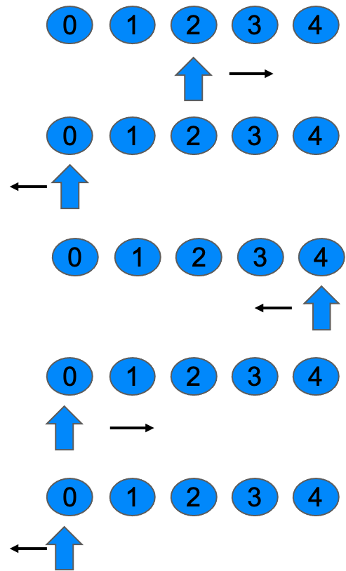

@import "../css/font-awesome-4.7.0/css/font-awesome.css"
@import "../css/theme/solarized.css"
@import "../css/logo.css"
@import "../css/font.css"
@import "../css/color.css"
@import "../css/margin.css"
@import "../css/table.css"
@import "../css/main.css"
@import "../plugin/zoom/zoom.js"
@import "../plugin/customcontrols/plugin.js"
@import "../plugin/customcontrols/style.css"
@import "../plugin/chalkboard/plugin.js"
@import "../plugin/chalkboard/style.css"
@import "../plugin/menu/menu.js"
@import "../js/anychart/anychart-core.min.js"
@import "../js/anychart/anychart-venn.min.js"
@import "../js/anychart/pastel.min.js"
@import "../js/anychart/venn-ml.js"

<!-- slide data-notes="" -->

<div class="bottom20"></div>

# 程序设计基础

<hr class="width50 center">

## 上机实验 第四次

<div class="bottom8"></div>

### 计算机系 &nbsp;&nbsp; 杨已彪

#### yangyibiao@nju.edu.cn

<!-- slide vertical=true data-notes="" -->

##### 提纲

---

第三次OJ习题讲解

- 第一关: 丑数

- 第二关: 数位乘积

- 第三关: 整数翻转

- 第四关: 环

- 第五关: 双环

<!-- slide vertical=true data-notes="" -->

##### 第一关: 丑数

---


任务描述:  
丑数是只包含质因数2、3和5的正整数. 即能表示为$2^{x}3^{y}5^{z}$(x,y,z可能为0)形式的数字. 给定一个正整数n, 你能帮忙判断这个数是否为丑数么. 如果是输出"Yes", 否则输出"No".

考察要点:  循环

输入:  一个正整数n （2 <= n <= 10000）
输出:  如果n为丑数输出"Yes", 否则输出"No"

---


<!-- slide vertical=true data-notes="" -->

##### 第一关: 丑数

---

样例
input1:  <u>6</u>
output1:  `Yes`

解释: 6=2×3只包含了质因数2、3.

input2:  <u>14</u>
output2:  `No`

解释: 14包含了质因数7, 所以不是丑数.

---


<!-- slide vertical=true data-notes="" -->

##### 第一关: 丑数

---

- 一直除2, 直到不能整除
- 一直除3, 直到不能整除
- 一直除5, 直到不能整除

最后，看结果是不是1

---


<!-- slide vertical=true data-notes="" -->

##### 第一关: 丑数

---

```C
#include <stdio.h>

int main()
{
    int n;
    scanf("%d",&n);

    while (n % 2 == 0) { n /= 2; }

    while (n % 3 == 0) { n /= 3; }

    while (n % 5 == 0) { n /= 5; }

    if (n == 1) {
        printf("Yes");
    } else {
        printf("No");
    }

    return 0;
}
```

---


<!-- slide vertical=true data-notes="" -->

##### 第二关: 数位乘积

---

任务描述:  输入一个正整数m, `重复`以下操作: 

如果m < 10, 输出m, 结束程序;
否则, 令m等于m中各位非零数字的乘积.
请在main函数中进行上述操作, 并输出m.

考查要点:  嵌套循环

输入:  一个数字m (1 <= m <= 10000)

输出:  输出m最后的值

---


<!-- slide vertical=true data-notes="" -->

##### 第二关: 数位乘积

---

样例
input:  12045
output:  4

解释: 
首先 m = 12405, m >= 10成立, 进行第2步操作, m = 1 * 2 * 4 * 5 = 40;
之后 m = 40, m >= 10, 再次进行第2步操作, m = 4;
最后 m = 4 < 10, 进行第1步操作, 输出m.  

---


<!-- slide vertical=true data-notes="" -->

##### 第二关: 数位乘积

---

==循环== 输入一个正整数m, 重复以下操作: 

- 判断是否小于0, 是则输出且退出
- 如果m < 10, 输出m, 结束程序；
- 用%10, %100, …找出每一位的值
- 否则, 令m等于m中各位非零数字的乘积.  

---


<!-- slide vertical=true data-notes="" -->

##### 第二关: 数位乘积

---

```C
#include <stdio.h>

int main()
{
    int m;
    scanf("%d", &m);

    while (m >= 10) {
        int ji = 1;
        while (m != 0) {
            if (m%10 != 0)
                ji *= m % 10;
            m /= 10;
        }
        m = ji;
    }

    printf("%d", m);
    return 0;
}
```

---


<!-- slide vertical=true data-notes="" -->

##### 第三关: 整数翻转

---

任务描述

输入一个32位有符号整数x, 请你设计一个程序输出将x中数字部分翻转后的整数. 
题目保证翻转后的数字不会超出32位有符号整数的范围. 

输入
共1行, 为32位有符号整数x. 

输出
共1行, 为翻转x后的数字. 

---


<!-- slide vertical=true data-notes="" -->

##### 第三关: 整数翻转

---

样例1
输入: 123  
输出: 321

样例2
输入: -123  
输出: -321

样例3
输入: -450  
输出: -54

---


<!-- slide vertical=true data-notes="" -->

##### 第三关: 整数翻转

---

==题解==

(作为一个数字输出)

如果x小于0, 记录小于0, x取绝对值

整数反转: 

- 12345 => 5
- 1234 => 5*10+4
- 123 => 54*10+3
- 12 => 543*10+2
- 1 => 5432*10+1
- 54321

---


<!-- slide vertical=true data-notes="" -->

##### 第三关: 整数翻转

---

```C
#include <stdio.h>

int main()
{
    int m;
    scanf("%d",&m);

    int r = 0;
    int flag = 0;
    if (m < 0) {
        m = -m;
        flag = 1;
    }

    while (m > 0) {
        r = (r * 10) + (m % 10);
        m /= 10;
    }

    if (flag) {
        r = -r;
    }

    printf("%d", r);
    return 0;
}
```

---


<!-- slide vertical=true data-notes="" -->

##### 第三关: 整数翻转

---

==题解==

(作为一串字符输出)

- 先判断正负
- 负数输出负号
- 由于只有末尾的0才不输出, 先把末尾的0处理掉
- 再按10取模之后依次输出

---


<!-- slide vertical=true data-notes="" -->

##### 第三关: 整数翻转

---

```C
#include<stdio.h>

int main() 
{
  int n, a;
  scanf("%d", &n);

  if (n < 0) {
    printf("-");
    n = -n;
  } else if (n == 0) {
    printf("0");
  }
  
  if (n > 0) {
    do {
      a = n % 10;
      n = n / 10;
    } while (a == 0); // 先处理末尾的0

    printf("%d", a); // 输出第一个不是零的数字
    while (n != 0) { // 输出剩下的数字
      a = n % 10;
      n = n / 10;
      printf("%d", a);
    }
  }
  return 0;
}
```

---


<!-- slide vertical=true data-notes="" -->


##### 第四关: 环

---

任务描述
小蓝鲸最近沉迷一种叫《环》的游戏. 这个游戏的地图是一个圆环, 上面有n个格子. 规则如下: 
- 当你站在第i格(0<=i<n-1)时, 你往前走一步就会到达第i+1格
- 当你站在第n-1格时, 你往前走一步就会到达第0个格子
- 当你站在第i格(0<i<=n-1)时, 你往后走一步就会到达第i-1格
- 当你站在第0格时, 你往后走一步就会到达第n-1格
- 每次你走到第0格时（起点为第0格除外）, 你都要转换走的方向, 即接下来按反方向走

---


<!-- slide vertical=true data-notes="" -->

##### 第四关: 环

---

现在, 小蓝鲸想请你帮他算一算, 从某个格子出发, 走m步后他会到达哪一个格子. 

输入
共1行, 3个数n, k, m. 其中n为环上格子数量, k为起始的格子编号, m为要走的步数, 注意, 你在起点是向前走的.  
数据范围: 4<=n<=100, 0<=k<=n-1, 0<=m<=10000. 

输出: 
共1行, 1个数k’. 其中k’为从k出发, 走m步到达的格子. 

---


<!-- slide vertical=true data-notes="" -->

##### 第四关: 环

---

<div class="top-2">
    
</div>

<!-- slide vertical=true data-notes="" -->

##### 第四关: 环

---

```C
#include <stdio.h>

int main() 
{
  int n, k, m;
  scanf("%d%d%d", &n, &k, &m);
  int d = (k + m) / n;
  int r = (k + m) % n;
  int res = d % 2 == 0 ? r :  n - r;
  //不会在第n格
  return 0;
}
```

---


<!-- slide vertical=true data-notes="" -->

##### 第四关: 环

---

```C
#include <stdio.h>

int main() 
{
  int n, k, m;
  scanf("%d %d %d", &n, &k, &m);
  int d = (k + m) / n;
  int r = (k + m) % n;
  if (r == 0)
    printf("%d", 0);
  else
    printf("%d", d % 2 == 0 ? r :  n - r);
  return 0;
}
```

---


<!-- slide vertical=true data-notes="" -->

##### 第四关: 环

---

用循环模拟完整的流程
先依据当前方向向前/后走一步
再按照在第i格的规则处理
当你站在第i格(0<=i<n-1)时, 你往前走一步就会到达第i+1格
当你站在第n-1格时, 你往前走一步就会到达第0个格子
当你站在第i格(0<i<=n-1)时, 你往后走一步就会到达第i-1格
当你站在第0格时, 你往后走一步就会到达第n-1格
每次你走到第0格时（起点为第0格除外）, 你都要转换走的方向, 即接下来按反方向走

---


<!-- slide vertical=true data-notes="" -->

##### 第四关: 环

---

```C
#include <stdio.h>

int main()
{
    int n, k, m;
    scanf("%d%d%d", &n, &k, &m);

    int flag = 1; // flag = 1 向前走, flag = 0 向后走

    while(m > 0) {
        if (flag == 1) { // 向前走，判断尤其要注意！！！
            if (k == n-1) {
                k = 0;
                flag = 0;
            } else {
                k = k + 1;
            }
        } else {
            if (k == 0) { // 向后走
                k = n - 1;
            } else if (k==1) {
                k = 0;
                flag = 1;
            } else {
                k = k - 1;
            }
        }
        m--;
    }

    printf("%d", k);
    return 0;
}
```

---


<!-- slide vertical=true data-notes="" -->

##### 第五关: 双环

---

任务描述

听说《环》出续作了, 小蓝鲸立马购买了一份开始玩. 在续作中, 地图变成了左右两个环, 分别有n1和n2个格子, 其中编号为0的格子很特殊, 它是两个环共用的. 新的规则如下:  

- 当你站在第0格的左边时, 你向前走一步会走到右环的第1格
- 当你站在第0格的右边时, 你向前走一步会走到左环的第1格
- 当你站在左环的第n1-1格时, 你向前走一步会到达第0格的左边
- 当你站在右环的第n2-1格时, 你向前走一步会到达第0格的右边
- 当你站在左环的第i格(0<i<n1-1)时, 你向前走一步会到左环的第i+1格
- 当你站在右环的第i格(0<i<n2-1)时, 你向前走一步会到右环的第i+1格
- 你不用再转换走的方向了, 也就是说, 你只能向前走. 
- 小蓝鲸觉得太复杂了, 于是他再次向你投去求助的目光. 

我们约定, 格的位置由(k,p)表示, 其中k表示格的编号, p=0表示格子在左环, p=1表示格子在右环. 

---


<!-- slide vertical=true data-notes="" -->

##### 第五关: 双环

---

输入: 
共1行, 5个数 n1, n2, k, p, m. 其中n1代表地图左环格子数量, n2代表右环格子数量, k,p代表起始位置(k,p), m代表走的步数. 数据范围: 4<=n1<=100, 4<=n2<=1000, 0<=k<=n1-1 (当p=0), 0<=k<=n2-1 (当p=1), 0<=m<=10000. 

输出: 
共1行, 2个数k’, p’. 其中k’,p’代表从(k, p)出发, 向前走m步到达的格子(k’, p’). 

---


<!-- slide vertical=true data-notes="" -->

##### 第五关: 双环

---

<div class="top-2">
    
</div>

---


<!-- slide vertical=true data-notes="" -->

##### 第五关: 双环

---

```C
#include <stdio.h>

int main() 
{
  int n1, n2, k, p, m;
  scanf("%d %d %d %d %d", &n1, &n2, &k, &p, &m);
  int n = n1 + n2;
  int r = (k + m) % n;
  if ((p == 0 && k != 0) || (p == 1 && k == 0)) {//如果在左环
    if (r < n1) //输出k的位置
      printf("%d", r);
    else
      printf("%d", r - n1);
    if (r == 0 || r > n1) //输出p的位置
      printf(" %d", 1);
    else
      printf(" %d", 0);
  } else { //如果在右环
    if (r < n2) //输出k的位置
      printf("%d", r);
    else
      printf("%d", r - n2);
    if (r == 0 || r > n2) //输出p的位置
      printf(" %d", 0);
    else
      printf(" %d", 1);
  }
  return 0;
}
```

---


<!-- slide vertical=true data-notes="" -->

##### 双环

---

```C
#include <stdio.h>

int main() {
  int n1, n2, k, p, m;
  scanf("%d %d %d %d %d", &n1, &n2, &k, &p, &m);
  int n = n1 + n2;
  int r = (k + m) % n;
  if ((p == 0 && k != 0) || (p == 1 && k == 0)) {
    //如果在左环
    if (r < n1) //输出k的位置
      printf("%d", r);
    else
      printf("%d", r - n1);
    if (r == 0 || r > n1) //输出p的位置
      printf(" %d", 1);
    else
      printf(" %d", 0);
  }
  else { //如果在右环
    if (r < n2) //输出k的位置
      printf("%d", r);
    else
      printf("%d", r - n2);
    if (r == 0 || r > n2) //输出p的位置
      printf(" %d", 0);
    else
      printf(" %d", 1);
  }
  return 0;
}
```

---


<!-- slide vertical=true data-notes="" -->

##### 双环

---

用循环模拟完整的流程

- 当你站在第0格的左边时, 你向前走一步会走到右环的第1格
- 当你站在第0格的右边时, 你向前走一步会走到左环的第1格
- 当你站在左环的第n1-1格时, 你向前走一步会到达第0格的左边
- 当你站在右环的第n2-1格时, 你向前走一步会到达第0格的右边
- 当你站在左环的第i格(0<i<n1-1)时, 你向前走一步会到左环的第i+1格
- 当你站在右环的第i格(0<i<n2-1)时, 你向前走一步会到右环的第i+1格

---


<!-- slide vertical=true data-notes="" -->

##### 双环

---

```C
#include <stdio.h>

int main()
{
    int n1, n2, k, p, m;
    scanf("%d%d%d%d%d", &n1, &n2, &k, &p, &m);

    while (m > 0) {
        if (k == 0) { // 处在第0格
            p = p == 0 ? 1 : 0; // 切换至另外的环
        }

        k = k + 1; // 前进一步

        if (p == 0 && k == n1) // 若处在左环的最后一个格子
            k = 0;

        if (p == 1 && k == n2) // 若处在右环的最后一个格子
            k = 0;

        m = m - 1;
    }
    printf("%d %d", k, p);
    return 0;
}
```

---


