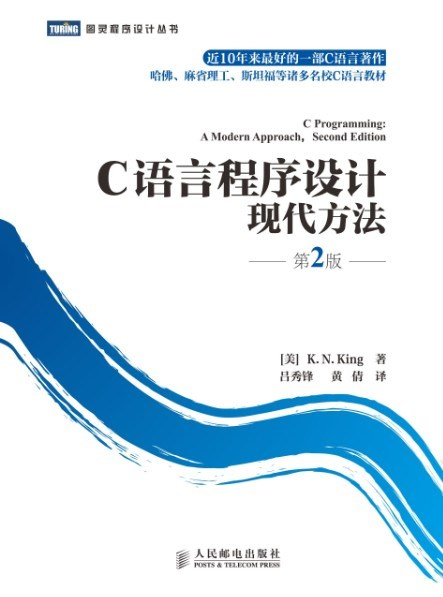
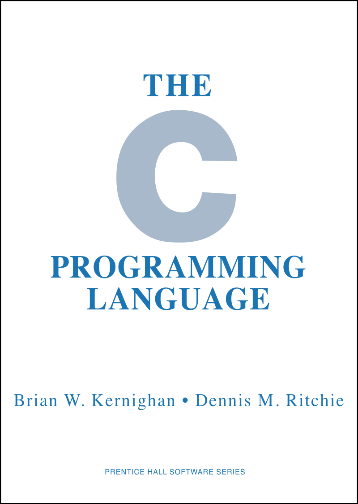

---
presentation:
  margin: 0
  center: false
  transition: "convex"
  enableSpeakerNotes: true
  slideNumber: "c/t"
  navigationMode: "linear"
---

@import "../css/font-awesome-4.7.0/css/font-awesome.css"
@import "../css/theme/solarized.css"
@import "../css/logo.css"
@import "../css/font.css"
@import "../css/color.css"
@import "../css/margin.css"
@import "../css/table.css"
@import "../css/main.css"
@import "../plugin/zoom/zoom.js"
@import "../plugin/customcontrols/plugin.js"
@import "../plugin/customcontrols/style.css"
@import "../plugin/chalkboard/plugin.js"
@import "../plugin/chalkboard/style.css"
@import "../plugin/menu/menu.js"
@import "../js/anychart/anychart-core.min.js"
@import "../js/anychart/anychart-venn.min.js"
@import "../js/anychart/pastel.min.js"
@import "../js/anychart/venn-ml.js"

<!-- slide data-notes="" -->

# C语言程序设计基础

## 课程介绍

### 计算机学院 &nbsp;&nbsp; 杨已彪

#### [yangyibiao@nju.edu.cn](yangyibiao@nju.edu.cn)

<!-- slide vertical=true data-notes="" -->

##### 课程安排

---

授课: [杨已彪](http://cs.nju.edu.cn/yangyibiao), yangyibiao@nju.edu.cn

时间: 

- 理论: 45 学时理论，周五 2-4 节课 (第 3 ~ 17 周)

- 实验: 在线测试(OJ: Online Judge)

:fa-lightbulb-o: =="Talk is cheap. Show me the code."== -- Linus Torvalds
:fa-lightbulb-o: ==纸上得来终觉浅，绝知此事要躬行== -- 陆游

<!-- slide vertical=true data-notes="" -->

##### 课程答疑

---

[https://docs.cpl.icu/#/qa](https://docs.cpl.icu/#/qa)

<!-- slide vertical=true data-notes="" -->

##### 考核方式

---
(技术科学实验班+软件学院)

- 平时编程: 10% (每周1次OJ编程练习, 在线提交评测)

- 阶段机试 (15% + 20%)

- 课程项目: 25%(指选 + 自选题目（待定: 可能为期中项目, 也可能作为期末项目)

- 期末机试: 30% (上机编程考试: 在线、限时、闭卷)

- 教案发布: https://yangyibiao.github.io/cpl/index.html

- 课程网站: http://docs.cpl.icu

- 在线评测: http://oj.cpl.icu/

<!-- slide vertical=true data-notes="" -->

##### 课程说明

---

申请免修不免考直接教务网提交申请.

<!-- 申请免修不免考意味着: 因免修造成的一切后果自负, 而且平时作业、大作业、上机测验和期中/期末等均不免. -->

==强烈建议== 自学课件与教材中的内容; 

==友情提醒== 平时作业、上机测验、大项目等均需按时完成.

<!-- ##### 课程QQ群

---

发布教案、讨论、发布OJ实训作业

- 课程网站: https://cslab-cms.nju.edu.cn/

- 邀请码: H3RPB

- 课程QQ群: 651382342

  
 -->

<!-- slide vertical=true data-notes="" -->

##### 课程教材

---

  

- 书名: C语言程序设计 现代方法 第2版·修订版 (吕秀锋, 黄倩 译)

- 作者: K.N.King

- 出版: 人民邮电出版社

<!-- slide data-notes="" -->

##### 参考书目

---

  

- 书名: C程序设计语言

- 作者: (美)Brian W. Kernighan / (美)Dennis M. Ritchie

- 译者: 徐宝文、李志

- 出版: 机械工业出版社

<!-- slide data-notes="" -->

##### 不必焦虑

---

- 课前预习

- 课后练习

- 多数零基础(75%)