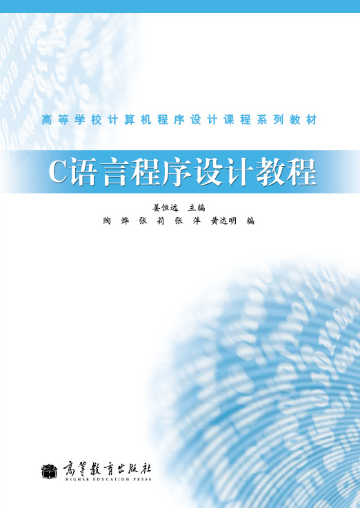
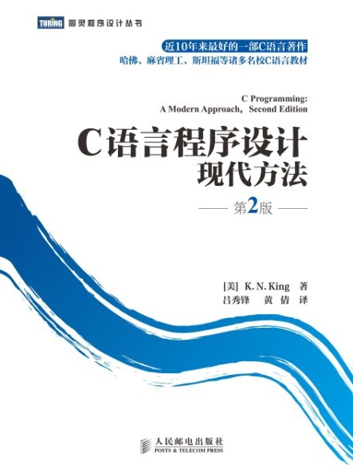

---
presentation:
  width: 1280
  height: 720
  margin: 0
  center: false
  transition: "convex"
  enableSpeakerNotes: true
  slideNumber: "c/t"
  navigationMode: "linear"
---

@import "../../css/font-awesome-4.7.0/css/font-awesome.css"
@import "../../css/theme/solarized.css"
@import "../../css/logo.css"
@import "../../css/font.css"
@import "../../css/color.css"
@import "../../css/margin.css"
@import "../../css/table.css"
@import "../../css/main.css"
@import "../../plugin/zoom/zoom.js"
@import "../../plugin/customcontrols/plugin.js"
@import "../../plugin/customcontrols/style.css"
@import "../../plugin/chalkboard/plugin.js"
@import "../../plugin/chalkboard/style.css"
@import "../../plugin/menu/menu.js"
@import "../../js/anychart/anychart-core.min.js"
@import "../../js/anychart/anychart-venn.min.js"
@import "../../js/anychart/pastel.min.js"
@import "../../js/anychart/venn-ml.js"

<!-- slide data-notes="" -->

# 智能程序设计（C语言）

## 课程介绍

### 计算机学院 &nbsp;&nbsp; 杨已彪

#### [yangyibiao@nju.edu.cn](mailto:yangyibiao@nju.edu.cn)

  

<!-- slide data-notes="" -->

##### 课程安排

---

授课: [杨已彪](http://cs.nju.edu.cn/yangyibiao), yangyibiao@nju.edu.cn

时间: 

- 理论: 64 学时，每周两次 (==周二==、==周三==各 2 节，每节 50 分钟)，第 1 ~ 16 周

- 实验: 在线测试(OJ: Online Judge)

- 放假: 中秋 ==9/25 ~ 9/27==; 国庆 ==10/1 ~ 10/7==

- 调休上课日: ==9/20 (周日)==、==10/10 (周六)== 照常上课

- 课程按==节次顺序==进行, 与日历周无关

- 期末考试周: ==12/28 ~ 1/10== (闭卷机试安排在考试周)

<!-- :fa-lightbulb-o: =="Talk is cheap. Show me the code."== -- Linus Torvalds
:fa-lightbulb-o: ==纸上得来终觉浅，绝知此事要躬行== -- 陆游 -->
:fa-weixin: =="Talk is cheap. Show me the code."== -- Linus Torvalds
:fa-weixin: ==纸上得来终觉浅，绝知此事要躬行== -- 陆游

<!-- slide data-notes="" -->

##### 课前小调查

---

==举手统计==

- 有==程序设计==基础的同学有多少？

- 有 ==C语言== 基础的同学有多少？

- ==一点基础==都没有的同学有多少？

:fa-lightbulb-o: 调查结果用于调整教学节奏

<!-- slide data-notes="" -->

##### 课程答疑

---

- 线上答疑: QQ群内提问或==私聊==线上助教，每班有一位学长主要负责线上答疑

- 线下答疑: ==上机课==时间，每班有一位学长到线下教室答疑

<!-- slide data-notes="" -->

##### 考核方式

---

- 平时成绩: ==20%== (课堂代码实操 + 在线OJ系统闯关)

- 期末项目: ==20%== (跨学科智能应用开发: 代码 + 答辩 + 技术文档)

- 课程考试: ==60%== (闭卷机试: 语法基础、算法设计和智能应用)

- 教案发布: https://yangyibiao.github.io/cpl/index.html

- 课程网址: [https://yangyibiao.github.io/cpl](https://yangyibiao.github.io/cpl)

- 在线评测网址: == http://172.28.223.3/ == (仅校园网内访问)

<!-- slide data-notes="" -->

##### 在线评测系统 (OJ)

---

- 地址: ==http://172.28.223.3/== (本平台位于==校园网内==，须在校内网络访问)

- 注册: 用==学号==注册账号 (便于平时作业统计)

- ==务必记住密码==: 校外无法收到修改密码的邮件

<!-- slide data-notes="" -->

##### OJ 作业流程

---

- 作业入口: 页面顶端 ==「竞赛 & 作业」== 选项卡，找到教师设定的作业，逐题答题

- 答题流程: 
  - 仔细理解题目描述、输入输出和样例
  - 在本机编译器中编程、用样例测试调试
  - 在 OJ 平台选择「提交」或「露一手!」粘贴代码提交，系统自动判题

- 提交记录: 「提交记录」中点击 C/Edit 可修改并再次提交

- 注意作业==截止提交时间==

<!-- slide data-notes="" -->

##### OJ 使用注意

---

- 输入由 OJ 系统自动给出: ==不要==在输入语句中加提示语 (题目要求除外)

- 输出结果要==严格按题目要求==，不一致则无法通过

- 判题结果含义 (如 等待评测、格式错误、答案错误、运行超时) 见平台 ==「常见问答」==

- 日常练习: 页面顶部 ==「题目」== 选项卡

<!-- slide data-notes="" -->

##### 课程说明

---

申请免修不免考：

1. 网上办事大厅提交申请 https://ehall.nju.edu.cn
2. ==务必加入课程QQ群== (作业与通知均通过群发布)

<!-- 申请免修不免考意味着: 因免修造成的一切后果自负, 而且平时作业、大作业、上机测验和期中/期末等均不免. -->

==强烈建议== 自学课件与教材中的内容; 

==友情提醒== 平时作业、上机测验等均需按时完成.

<!-- slide data-notes="" -->

##### 课程教材

---

  

- 书名: ==C语言程序设计教程== (主编: ==姜恒远==)

- 出版社: 高等教育出版社, 2010年8月 第一版

- ISBN: 9787040302769

<!-- slide data-notes="" -->

##### 参考书目

---

  

- 书名: C语言程序设计 现代方法 第2版·修订版 (吕秀锋, 黄倩 译)

- 作者: K.N.King

- 出版: 人民邮电出版社

<!-- slide data-notes="" -->

##### 不必焦虑

---

- 课前预习

- 课后练习

- 多数零基础(75%)

