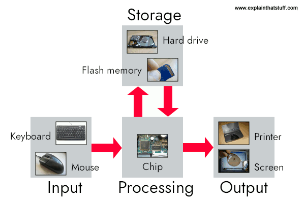

---
presentation:
  width: 1280
  height: 720
  margin: 0
  center: false
  transition: "convex"
  enableSpeakerNotes: true
  slideNumber: "c/t"
  navigationMode: "linear"
---

@import "../../css/font-awesome-4.7.0/css/font-awesome.css"
@import "../../css/theme/solarized.css"
@import "../../css/logo.css"
@import "../../css/font.css"
@import "../../css/color.css"
@import "../../css/margin.css"
@import "../../css/table.css"
@import "../../css/main.css"
@import "../../plugin/zoom/zoom.js"
@import "../../plugin/customcontrols/plugin.js"
@import "../../plugin/customcontrols/style.css"
@import "../../plugin/chalkboard/plugin.js"
@import "../../plugin/chalkboard/style.css"
@import "../../plugin/menu/menu.js"
@import "../../js/anychart/anychart-core.min.js"
@import "../../js/anychart/anychart-venn.min.js"
@import "../../js/anychart/pastel.min.js"
@import "../../js/anychart/venn-ml.js"

<!-- slide data-notes="" -->

# 智能程序设计（C语言）

## 程序设计与C语言入门

### 计算机学院 &nbsp;&nbsp; 杨已彪

#### [yangyibiao@nju.edu.cn](mailto:yangyibiao@nju.edu.cn)

<!-- slide data-notes="" -->

##### 概述

---

- 什么是计算机

- 计算机与编程语言

- 什么是程序设计语言

- 编程思维

- 为什么学习==C语言== (答案在第二节课揭晓)

---

<!-- slide data-notes="" -->

##### 思考: 问题1

---

==问题1==：计算机和==计算器==有什么区别？

---

<!-- slide data-notes="" -->

##### 问题1 的答案: 为什么计算机什么都能做？

---

- 区别1: ==存储==——计算机有内存与外存, 可长期保存海量数据; 计算器只能暂存几个数

- 区别2: ==可编程==——计算器的功能固化在硬件里; 计算机装什么程序, 就能做什么事

- 区别3: ==处理的信息==——文本、图像、声音、视频; 计算器只会数值运算

- 点睛: 打开计算器 App, 计算机就能当计算器用, 计算器却永远变不成计算机

- 彩蛋: 计算器其实也是一种小计算机——区别不在"有没有芯片", 而在"程序能不能换"

==程序是计算机的灵魂==——我们要学的, 就是怎么给这台万能机器写指令

---

<!-- slide data-notes="" -->

##### 什么是计算机

---

程序跑在哪？——计算机。先认识这台机器:

计算机: 由==硬件==和==软件==组成, 用于==接收、处理和存储数据==的电子设备

- 硬件：输入设备、输出设备、存储设备、CPU、内存、主板等物理组件

- 软件：操作系统、应用程序等，执行各种任务

---

<!-- slide data-notes="" -->

##### 计算机如何工作

---

程序在这台机器上跑, 靠的是五个环节:

- ==输入==：键盘、鼠标、摄像头等接收数据和指令

- ==处理==：CPU 执行指令，进行数据处理和计算

- ==存储==：内存临时存储正在处理的数据；存储设备长期保存信息

- ==输出==：显示器、打印机、扬声器等呈现处理结果

- ==控制==：操作系统和应用程序管理硬件资源，协调各组件

==编程==: 使用特定的==编程语言==编写指令, 控制计算机执行上述任务

  

---

<!-- slide data-notes="" -->

##### 为什么需要高级语言

---

怎么指挥这台机器？它只懂 ==0 和 1== 组成的==机器指令==——语言是这样一步步进化来的:

| 语言 | 长这样 | 问题/特点 |
| :-- | :-- | :-- |
| 机器语言 | `10110000 00001100` `00101100 00000101` | 难记、易错、依赖具体机器 |
| 汇编语言 | `MOV AL,12D` `SUB AL,5D` | 助记符好记了, 但仍与机器绑定 |
| 高级语言 | `result = 12 - 5;` | 接近自然语言和数学==与机器无关== |

- 高级语言写的代码==需要翻译==才能执行——这个"翻译官"就是==编译器==

- 好处: 易学易用、易读易调试、==可移植==(换台机器不用重写)

- C 是高级语言中==离硬件最近==的一个: 既好用, 又高效

---
<!-- slide data-notes="" -->

##### 什么是程序设计语言

---

人类交流 → 机器交流

- 人类要交流需要语言（中文、英文）

- 人和计算机交流也需要"语言"——程序设计语言

对比：自然语言 vs 程序语言

- 自然语言灵活但有歧义
  - 如: ==南京市长江大桥==——是"南京市 · 长江大桥", 还是"南京市长 · 江大桥"?

- 程序语言严格、无歧义，让机器可以准确执行

==程序设计语言，就是人类和计算机沟通的工具==

---

<!-- slide data-notes="" -->

##### 程序能做什么

---

==程序是计算机的灵魂==, 那程序能做什么?

1. 排序一组成绩/批改试卷/统计单词个数等

2. 游戏、微信、自动驾驶背后都是程序

---

<!-- slide data-notes="" -->

##### 思考: 问题2

---

程序这么能干, 是怎么"想"出来的？先看一个小问题:

==问题2==：给全班 100 个同学的成绩，怎么让计算机找出最高分？

:fa-lightbulb-o: 提示: 你不能让它"看一眼"，只能一步步指挥它

---

<!-- slide data-notes="" -->

##### 算法: 找最高分

---

- ==问题2 的答案==: 人扫一眼就能找到最高分, 但计算机不能"看"

- 计算机的做法:
  1. ==假设==第一个成绩是最高分
  2. ==逐个比较==剩下的成绩
  3. 遇到更大的就==替换==
  4. 比较完, 剩下的一定是最高分

- 启示: 人觉得简单的事, 计算机需要一个==算法==

- 程序 = ==算法 + 数据==

---

<!-- slide data-notes="" -->

##### 计算机如何工作: 找最高分

---

把刚才的算法放回机器的工作流程, 每一步对应哪个环节?

1. ==输入==: 逐个读入成绩

2. ==处理==: 与当前最高分比较, 更大就替换

3. ==存储==: 记住当前最高分 (内存)

4. ==输出==: 比较完, 打印最高分

---

<!-- slide data-notes="" -->

##### 编程思维

---

回头看"找最高分"的步骤, 写程序需要的东西全在里面:

- ==结构==: 顺序 (一步步执行)、判断 (if: 更大就替换)、循环 (重复比较, 直到比完)

- ==数据==: 存储——记住当前最高分 (变量)

- ==设计==: 分解——大问题拆成小步骤

接下来要学的, 就是把这些要素用 ==C 语言== 写出来!

---

<!-- slide data-notes="" -->

##### 程序需要什么: 本课程地图

---

==编程思维==要落地, 还需要具体工具——从 ==输入 → 处理 → 存储 → 输出== 反推:

| 程序的需求 | 需要的元素 | 什么时候学 |
| :-- | :-- | :-- |
| 记住数据 | 变量、类型 | 第 2 周 |
| 计算 | 表达式、运算符 | 第 3 周 |
| 不同情况做不同事 | 判断 if / switch | 第 4 周 |
| 重复做 | 循环 while / for | 第 5 周 |
| 复用与分解 | 函数 | 第 6-7 周 |
| 一批数据 | 数组 | 第 8-9 周 |
| 字符串与内存 | 指针 | 第 10-11 周 |
| 复杂的数据组织 | 结构体、链表 | 第 12-13 周 |
| 长期保存数据 | 文件 | 第 14 周 |

:fa-lightbulb-o: 每一项都是"==因为需要, 所以才有=="——这就是本学期的路线图

接下来就动手——写第一个 C 程序:

---
