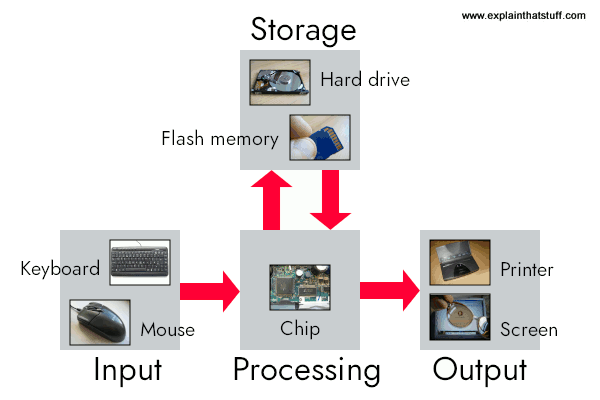

---
presentation:
  margin: 0
  center: false
  transition: "convex"
  enableSpeakerNotes: true
  slideNumber: "c/t"
  navigationMode: "linear"
---

@import "../css/font-awesome-4.7.0/css/font-awesome.css"
@import "../css/theme/solarized.css"
@import "../css/logo.css"
@import "../css/font.css"
@import "../css/color.css"
@import "../css/margin.css"
@import "../css/table.css"
@import "../css/main.css"
@import "../plugin/zoom/zoom.js"
@import "../plugin/customcontrols/plugin.js"
@import "../plugin/customcontrols/style.css"
@import "../plugin/chalkboard/plugin.js"
@import "../plugin/chalkboard/style.css"
@import "../plugin/menu/menu.js"
@import "../js/anychart/anychart-core.min.js"
@import "../js/anychart/anychart-venn.min.js"
@import "../js/anychart/pastel.min.js"
@import "../js/anychart/venn-ml.js"

<!-- slide data-notes="" -->

# C语言程序设计基础

## C语言概述

### 计算机学院 &nbsp;&nbsp; 杨已彪

#### [yangyibiao@nju.edu.cn](yangyibiao@nju.edu.cn)

<!-- slide data-notes="" -->

##### 概述

---

- 计算机与编程语言

- 为什么学习C语言

<!-- slide vertical=true data-notes="" -->

##### 计算机与编程语言

---

什么是计算机?

计算机: 

* 由==硬件==和==软件==组成

* 用于==接收、处理和存储数据==的电子设备

硬件：输入设备、输出设备、存储设备、CPU、内存、主板等物理组件

软件：操作系统、应用程序等，执行各种任务

<!-- slide vertical=true data-notes="" -->

##### 计算机与编程语言

---

计算机的基本功能：

- ==输入==：各种输入设备（如键盘、鼠标、摄像头等）接收数据和指令

- ==处理==：通过中央处理器（CPU）执行指令，进行数据处理和计算。CPU为计算机核心组件，负责执行程序中的逻辑和算术运算。

- ==输出==：通过输出设备（如显示器、打印机、扬声器等）将处理结果呈现给用户。

- 存储：使用内存和存储设备来存储数据和程序。内存：临时存储正在处理的数据；存储设备：长期保存信息。

- 控制：通过操作系统和应用程序管理硬件资源，协调各组件的工作。

<!-- slide vertical=true data-notes="" -->

##### 计算机与编程语言

---

计算机如何工作?

示例: 制作一杯咖啡

步骤分解:

1. 确定所需材料（咖啡粉、水、糖、牛奶等）

2. 煮水

3. 加入咖啡粉

4. 混合均匀

5. 根据需要加入糖或牛奶

将大问题==分解==为具体小步骤，逐步解决每个部分

<!-- slide vertical=true data-notes="" -->

##### 计算机与编程语言

---

计算机如何知道购物的总价? 

1. ==输入==
材料准备：
咖啡粉、热水、牛奶（可选）、糖（可选）

2. ==处理==
步骤：
煮水：将水加热到适合冲泡咖啡的温度。
冲泡咖啡：将热水倒入咖啡粉中，等待几分钟，让咖啡充分浸泡。
加牛奶和糖（可选）：根据个人口味，加入牛奶和糖。

3. ==存储==
等待时间：在冲泡咖啡的过程中，咖啡的状态和时间可以视为存储。咖啡需要在特定时间内浸泡，以确保味道。

4. ==输出==
享用咖啡：完成后，将咖啡倒入杯中，准备饮用。

<!-- slide vertical=true data-notes="" -->

##### 计算机与编程语言

---

计算机如何工作?

示例: 计算机如何计算购物总价

假设你在超市购物, 购买了以下商品: 

- 苹果: 3个, 每个2元

- 香蕉: 5个, 每个1.5元

- 橙子: 2个, 每个3元

<!-- slide vertical=true data-notes="" -->

##### 计算机与编程语言

---

计算机如何知道购物的总价? 

1. ==输入==
计算机接收用户输入的信息: 
苹果数量: 3, 苹果单价: 2元
香蕉数量: 5, 香蕉单价: 1.5元
橙子数量: 2, 橙子单价: 3元

2. ==处理==
计算机执行以下计算: 
苹果总价 = 苹果数量 × 苹果单价 = 3 × 2 = 6元
香蕉总价 = 香蕉数量 × 香蕉单价 = 5 × 1.5 = 7.5元
橙子总价 = 橙子数量 × 橙子单价 = 2 × 3 = 6元

3. ==计算总价== 
总价 = 苹果总价 + 香蕉总价 + 橙子总价 = 6 + 7.5 + 6 = 19.5元

4. ==输出==
计算机将结果输出到屏幕上:
"购物总价为: 19.5元"
 

<!-- slide vertical=true data-notes="" -->

##### 计算机与编程语言

---

制作咖啡的过程，我们可以看到计算机的工作原理：

输入: 材料和配方（用户输入的数据）。
处理: 加热、冲泡和混合（CPU 执行指令）。
存储: 等待时间和状态（内存中的数据）。
输出: 完成的咖啡（计算机的结果展示）。

<!-- slide vertical=true data-notes="" -->

##### 计算机与编程语言

---

编程: 使用特定的==编程语言==编写指令, 控制计算机执行特定任务

- 接收输入

- 处理数据

- 存储数据

- 输出数据

<!-- slide vertical=true data-notes="" -->

##### 计算机与编程语言

---

计算机如何工作的?

<!-- slide vertical=true data-notes="" -->

##### 计算机与编程语言

---

语言是人类沟通、交流的工具，交流思想、传递知识等

- ==符号==系统：语言由一系列符号（如词汇、字、音节）组成，每个符号都有特定的意义

- ==语法==规则：语言遵循特定的语法和结构规则，指导如何将符合组合成有意义的句子或表达

<!-- slide vertical=true data-notes="" -->

##### 计算机与编程语言

---

编程语言是用于与计算机进行交流的正式(formal)语言，提供了一套规则和语法，使程序员能够编写指令，以控制计算机的行为。

- 符合和语法：由特定语法规则和关键词构成，能使用这些规则编写源代码

- 数据结构：提供用于组织和存储数据的方式，如数组、结构体等

- 控制结构：条件语句(如if, swtich)和循环(如for, while), 用于控制程序的执行流程

<!-- - 输入：数据接收：计算机通过输入设备（如键盘、鼠标、扫描仪等）接收数据和指令。用户通过这些设备向计算机提供信息。

- 处理

-- 中央处理器（CPU）：CPU 是计算机的核心组件，负责执行指令和进行数据处理。它从内存中获取指令，并执行运算（如加法、减法）和逻辑判断（如条件判断）。
-- 指令周期：CPU 执行指令的过程通常分为取指（Fetch）、解码（Decode）和执行（Execute）三个阶段。
    
    - 取指：从内存中获取下一条指令。

    - 解码：将指令翻译为CPU可以理解的操作。
    
    - 执行：执行指令，处理数据。 -->

<!-- slide vertical=true data-notes="" -->

##### 计算机与编程语言

---

编程思维

- 逻辑思维
判断一个用户输入的数是否为偶数

- 问题分解：
制作一个简单的计算器（输入运算符

- 算法思维
排序用户输入的一组数字

- 抽象化
交通信号灯，抽象为3种状态

- 算法思维
将一组数字排序，比较相邻元素，如果顺序错误则交换，重复直到没有交换为止

- 条件判断
根据天气决定穿衣，如果下雨，穿雨衣或带雨伞，否则穿短袖

- 循环
打印1到100的数字

<!-- slide data-notes="" -->

##### C语言的起源

---

C语言起源可追溯到1970年代中期

==贝尔实验室==：C语言是在美国贝尔实验室（Bell Labs）由Dennis Ritchie和同事开发

==早期的开发==：C语言最早是在1972年创建，最初用于编写操作系统，特别是UNIX操作系统。Ritchie和团队使用C语言重写了UNIX的核心部分。

<!-- C 是 UNIX 的副产品, 由 Ken Thompson,  等人在贝尔实验室开发.

Thompson 设计了一种名为 B 的小型语言. 

B 基于 BCPL, 一种在 1960 年代中期开发的系统编程语言. -->

<!-- slide data-notes="" -->

##### C语言的起源

---

==标准化==：1978年，Brian Kernighan和Dennis Ritchie合著了《C程序设计语言》，对C语言的推广起到了重要作用。1989年，C语言被正式标准化为ANSI C，这为后来的C语言版本奠定了基础。

==影响力==：C语言以其高效性和灵活性被广泛应用于系统编程、嵌入式系统以及应用程序开发。它的设计理念和语法影响了后续许多编程语言，如C++、Java和C#等。

<!-- 到 1971 年, Ritchie 开始开发 B 的扩展版本.

起初, 他称他的语言为 NB("New B").

随着语言开始与B越来越不同, 他将其名称改为C.

到 1973 年, 该语言已经足够稳定, 可以用 C 重写 UNIX. -->

<!-- slide data-notes="" -->

##### C语言的标准化

---

K&R C

- Kernighan和Ritchie合作编写了《C程序设计语言》(1978)
- 没有正式的C语言标准, 这本书成了事实标准

C89/C90
- ANSI标准X3.159-1989(1988年完成, 1989年12月正式批准)
- 国际标准ISO/IEC 9899:1990

C99
- 国际标准ISO/IEC 9899:1999
- 包含了一些重要的改变

<!-- slide data-notes="" -->

##### 基于C的语言

---

C++包括C的所有特性, 添加了类和其他特性以支持面向对象编程

Java基于C++, 因此继承了许多C特性

C#是从C++和Java派生的新的语言

Perl吸收了C的许多特性

<!-- slide data-notes="" -->

##### C的特点

---

低层语言
- 提供了对机器级概念的访问(字节和地址)

小型语言
- 更有限的特性集合(K&R第2版参考手册仅用49页描述了整个C语言)
- C语言很大程度依赖一个标准函数的库

宽松包容
- 提供了比其他语言更高的自由度, 不强制进行详细的错误检查

<!-- slide data-notes="" -->

##### C的优点

---

- ==效率高==

- ==可移植==

- ==很灵活==: C语言特性使用的限制非常少, 在其他语言中认定为非法操作在C中往往是允许的

- 功能强大: 庞大的数据类型和运算符集合

- 标准库

- 与UNIX集成

<!-- slide data-notes="" -->

##### C的缺点

---

- 程序容易隐藏错误

- 程序可能难以理解

- 程序可能难以维护

<!-- slide data-notes="" -->

##### 有效使用 C

---

- 深入理解以避免C语言的陷阱

- 避免过于复杂的代码

- 使用软件工具(lint, 调试器)使程序更可靠

- 利用现有的代码库

- 采用一套合理的编码规范

- 紧贴标准

<!-- slide vertical=true data-notes="" -->

<!-- slide vertical=true data-notes="" -->

<!-- ##### 计算机与编程语言

---

算法思维：排序问题

将一组数字排序如（5，3，8，1）

算法：相邻元素

##### 计算机与编程语言

---

抽象化: 交通信号灯

抽象：交通信号灯有三种状态（红灯、黄灯、绿灯），每个状态对应不同的行为

不关注具体的设备，而是关注其功能和状态， -->