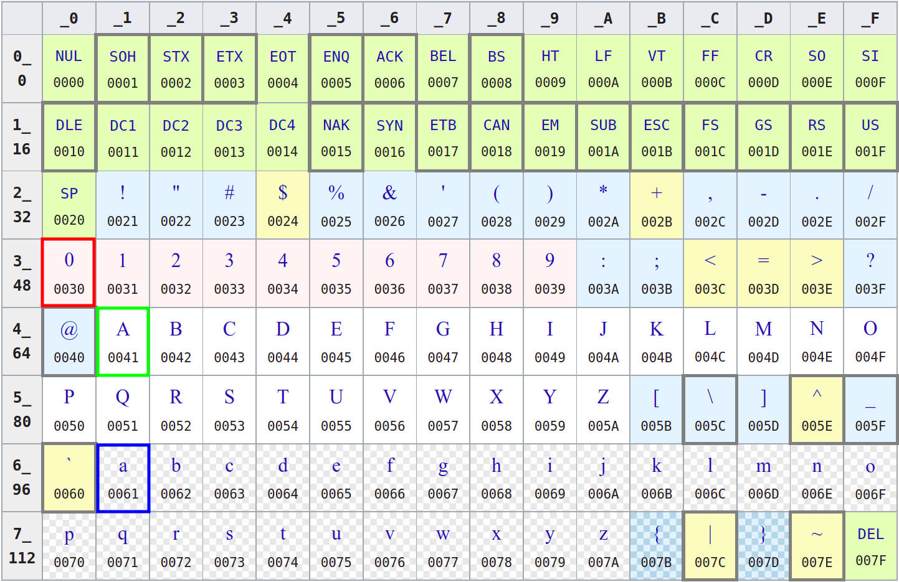

@import "../css/font-awesome-4.7.0/css/font-awesome.css"
@import "../css/theme/solarized.css"
@import "../css/logo.css"
@import "../css/font.css"
@import "../css/color.css"
@import "../css/margin.css"
@import "../css/table.css"
@import "../css/main.css"
@import "../plugin/zoom/zoom.js"
@import "../plugin/customcontrols/plugin.js"
@import "../plugin/customcontrols/style.css"
@import "../plugin/chalkboard/plugin.js"
@import "../plugin/chalkboard/style.css"
@import "../plugin/menu/menu.js"
@import "../js/anychart/anychart-core.min.js"
@import "../js/anychart/anychart-venn.min.js"
@import "../js/anychart/pastel.min.js"
@import "../js/anychart/venn-ml.js"


<!-- slide data-notes="" -->


<div class="bottom20"></div>

# C语言程序设计基础

<hr class="width50 center">

## C语言基础

<div class="bottom8"></div>

### 计算机学院 &nbsp;&nbsp; 杨已彪

#### [yangyibiao@nju.edu.cn](yangyibiao@nju.edu.cn)


<!-- slide data-notes="" -->


##### 提纲

---

- 变量

- 数据类型

- 表达式

- 输入输出


<!-- slide data-notes="" -->


##### Circle.c

---

- ==输入半径 $r$: radius==
- ==输出:==
1. 周长  $L = 2\pi r$
2. 面积  $S = \pi r^2$
3. 球面面积 $A = 4 \pi r^2$
4. 体积 $V = \frac{4}{3} \pi r^3$
- ==要求:==
1. 每个结果占 $1$ 行
2. 小数点后保留 $4$ 位
3. 每个结果至少占 $15$ 字符, 左对齐
  > `_______________ : surface_area`
  > `_______________ : volume`

[演示-circle.c](../code/1-types-io/circle.c)

---


<!-- slide data-notes="" -->


##### mol.c

---

<font size = "7">$6$ 克氧气的分子数是多少?</font>

<br>

$Q = 6 / 32 \times 6.02 \times 10^{23}$

<br>

两种格式输出, 结果均使用<mark>科学计数法</mark>表示

- 第一行结果, 小数点后保留 $3$ 位
- 第二行结果, 保留 $5$ 位有效数字


[演示mol.c](../code/1-types-io/mol.c)

---


<!-- slide data-notes="" -->


##### A naive administration system

---

- ==录入信息==
1. Name (EN)     Gender (F/M)  （姓名、性别）
2. Birthday (mm-dd-yyyy)     Weekday (Xyz.) （出生日期、星期几）
3. C  Music Medicine （三门课程成绩）
4. Mean (.d)     Standard Deviation (.dd)    Ranking ($\%$) （平均成绩、标准差、排名）

- ==录入要求==
1. 每组信息占一行
2. 各项信息使用 `\t` 间隔
3. 各项信息遵循特定格式要求


Xiaojing Nan  F
05-20-1902    Tue.
100           90     80
90            5%

[演示-admin.c](../code/1-types-io/admin.c)


<!-- slide data-notes="" -->

##### char

---


A `char` is actually an `int`.

<!-- slide data-notes="" -->

##### c string

--- 

# <code><font color = red>C string</font></code>
<code><font color = red size = 8>char first_name[] = "Tayu";</code></font>

A C string is a null-terminated (`\0`) sequence of characters.

String literal: 'T', 'a', 'y', 'u', '\0'


<!-- slide data-notes="" -->

##### Conversion Specification

---

<!--fit--> <code><font color = green><font color = red>%</font>[flags][width][.[precision]]<font color = red>specifier</font></font></code>

- <code><font color = red size = 7>%d</font></code>: decimal `int`
- <code><font color = red size = 7>%f</font></code>: `double`
- <code><font color = red size = 7>%e %E</font></code>: `double` ($-d.ddd \;\text{e} \pm dd$)
- <code><font color = red size = 7>%c</font></code>: `char`
- <code><font color = red size = 7>%s</font></code>: `C string`
- <code><font color = red size = 7>%%</font></code>: `%`


<!-- slide data-notes="" -->

<div class="bottom20"></div>

# C语言程序设计基础

<hr class="width50 center">

## 格式化输入/输出

<div class="bottom8"></div>

### 计算机学院 &nbsp;&nbsp; 杨已彪

#### [yangyibiao@nju.edu.cn](yangyibiao@nju.edu.cn)


<!-- slide vertical=true data-notes="" -->


##### printf函数

---

- printf函数

- scanf函数


<!-- slide vertical=true data-notes="" -->


##### printf函数

---

==`printf`== 函数必须提供格式字符串, 后跟打印期间要插入到串中的任何值: 

```C
printf(字符串, 表达式1, 表达式2, ...);
```

格式字符串可以包含普通字符和转换说明, 以 ==`%`== 字符开头

==转换说明== 是一个占位符, 表示要在打印期间填充的值

- ==`%d`== 用于 ==`int`== 值

- ==`%f`== 用于 ==`float`== 值

- ==`%c`== 用于 ==`char`== 值

- ==`%s`== 用于 ==`char []`== 值


<!-- slide data-notes="" -->


##### printf函数

---

格式字符串:
- ==普通字符== 按出现在字符串中的方式打印
- ==转换说明== 则需用待显示的值来替换填充

```C{.line-numbers}
int i, j;
float x, y;
 
i = 10;
j = 20;
x = 43.2892f;
y = 5527.0f;

printf("i = %d, j = %d, x = %f, y = %f\n", i, j, x, y);
```

```
输出: 
i = 10, j = 20, x = 43.289200, y = 5527.000000
```

---


<!-- slide data-notes="" -->


##### printf函数

---

编译器不会检查格式字符串中转换说明数量与输出项数量是否匹配

- 转换说明过多: 

```C
printf("%d %d\n", i); /*** WRONG ***/
```

- 转换说明太少: 

```C
printf("%d\n", i, j); /*** WRONG ***/
```

---


<!-- slide data-notes="" -->


##### printf函数

---

- 编译器不会去检查转换说明是否合适

- 如果程序员使用了不正确的转换说明, 程序将产生无意义的输出

```C{.line-numbers}
int i;
float x;
printf("%f %d\n", i, x); /*** WRONG ***/
```

---


<!-- slide data-notes="" -->


##### 转换说明

---

转换说明可以采用 ==`%m.pX`== 或 ==`%-m.pX`== 形式

- ==`m`== 和 ==`p`== 是整数常量

- ==`X`== 是一个字符

- ==`m`== 和 ==`p`== 都是可选的

- 如果省略 ==`p`==, 则分隔 ==`m`== 和 ==`p`== 的句点也应删除

在转换规约 ==`%10.2f`== 中, ==`m`== 为 ==`10`== , ==`p`== 为 ==`2`==, ==`X`== 为 ==`f`==

在转换规约 ==`%10f`== 中, ==`m`== 为 ==`10`== 且缺少 ==`p`==(连同句点)

在转换规约 ==`%.2f`== 中, ==`p`== 为 ==`2`==  且缺少 ==`m`==


<!-- slide data-notes="" -->


##### 转换说明

---

最小字段宽度 ==m== 指定要打印的最小字符数

- 如果要打印的值需要少于 ==m== 个字符, 则在字段内右对齐

转换说明 ==`%4d`== 会将数字 ==`123`== 显示为 ==`•123`==(==`•`== 表示空格字符)

- 如果要打印的值需要超过 ==m== 个字符, 则字段宽度会自动扩展为所需的大小, 若 ==m== 前面加上减号会导致左对齐

转换说明 ==`%-4d`== 会将数字 ==`123`== 显示为 ==`123•`==


<!-- slide data-notes="" -->


##### 转换说明

---

精度 ==p== 的含义取决于转换说明符 ==X== 的选择

- 结合 ==%d== 说明符使用, ==%m.pX== 中的 ==p== 表示要显示的最小位数(如需要, 将在数字的开头添加额外的零)

- 如果 ==p== 省略, 则默认它的值为 ==1==


<!-- slide data-notes="" -->


##### 转换说明

---

浮点数的转换说明: 

- ==`%e`== — 指数格式: ==p== 表示小数点后应该出现多少位(默认为 ==6==); 如果 ==p== 为 ==0==, 则不显示小数点

- ==`%f`== — *固定十进制*格式:  ==p== 与 ==e== 说明符的含义相同

- ==`%g`== — 指数格式或固定十进制格式, 取决于数字的大小; ==p== 表示要显示的最大有效位数; ==%g== 不会显示尾随零. 如果在小数点后没有数字, 则 ==%g== 不显示小数点


<!-- slide data-notes="" -->


##### 程序: 使用printf格式化数字

---

*tprintf.c*程序使用 ==printf== 以各种格式显示整数和浮点数

```C{.line-numbers}
/* Prints int and float values in various formats */ 
#include <stdio.h>
 
int main(void)
{
  int i;
  float x;
 
  i = 40;
  x = 839.21f;
 
  printf("|%d|%5d|%-5d|%5.3d|\n", i, i, i, i);
  printf("|%10.3f|%10.3e|%-10g|\n", x, x, x);
 
  return 0;
}
```

```
输出:
|40|•••40|40•••|••040|
|•••839.210|•8.392e+02|839.21••••|
```

---


<!-- slide data-notes="" -->


##### 转义序列

---

形如 ==`\n`== 的代码称为 ==转义序列==

==转义序列==: 使字符串包含非打印(控制)字符和具有特殊含义的字符(如 ==`"`==)

转义序列的部分列表: 

<div class="fullborder">

| 警报(铃声) | \\a |
| :--       | :-- |
| 回退符     | \\b |
| 换行符     | \\n |
| 水平制表符  | \\t |

</div>


<!-- slide data-notes="" -->


##### 转义序列

---

- 一个字符串可以包含任意数量的转义序列: 

```C
printf("Item\tUnit\tPurchase\n\tPrice\tDate\n");
```

- 执行此语句会打印一个两行标题: 

```
Item    Unit    Purchase
        Price   Date
```

---


<!-- slide data-notes="" -->

##### 转义序列

---

另一常见的转义序列是 ==`\"`==, 代表 ==`"`== 字符: 

```C
printf("\"Hello!\""); /* prints "Hello!" */
```

要打印单个 ==`\`== 字符, 在字符串中放置两个 ==`\`==: 

```C
printf("\\"); /* prints one \ character */
```

---


<!-- slide data-notes="" -->

##### scanf函数

---

==`scanf`== 根据指定格式读取输入

==`scanf`== 格式字符串可以包含 ==普通字符== 和 ==转换说明==

==`scanf`== 接受的 ==转换说明== 与 ==`printf`== 基本相同


<!-- slide data-notes="" -->


##### scanf函数

---

<span class="yellow">:fa-weixin:</span> 在多数情况下, ==`scanf`== 格式字符串只包含转换说明: 

```C{.line-numbers}
int i, j;
float x, y;

scanf("%d%d%f%f", &i, &j, &x, &y);
```

样本输入: 

`1 -20 .3 -4.0e3`

==`scanf`== 将变量 `i`、`j`、`x`和`y`赋值为 `1`、`–20`、`0.3` 和 `–4000.0`


<!-- slide data-notes="" -->


##### scanf函数

---

使用 ==`scanf`== 时, 程序员须自己检查: 

- ==转换说明== 的数量与 ==输入变量== 的数量是否相同

- 确保各个转换说明 ==适用于== 相应变量

==`&`== 符号通常需要用在 ==`scanf`== 调用中的每个变量之前

==`&`== 通常(但不总是)是必需的, 在读取输入至变量时需记住使用它


<!-- slide data-notes="" -->


##### scanf工作原理

---

- ==`scanf`== 尝试将输入字符组与格式字符串中的转换说明进行匹配

- 对每个转换说明, ==`scanf`== 尝试在输入数据中寻找适当类型数据, 必要时跳过空格

- ==`scanf`== 然后读取该数据, 当它到达不属于该数据类型的字符时停止

- 如果数据被成功读取, ==`scanf`== 将继续处理格式字符串的其余部分

- 如果数据读取不成功, ==`scanf`== 立即返回


<!-- slide data-notes="" -->


##### scanf工作原理

---

- ==`scanf`== 搜索数字时会忽略空白字符(空格、水平和垂直制表符、换页符和换行符)

- 读取四个数字的 ==`scanf`== 调用: 

```C
scanf("%d%d%f%f", &i, &j, &x, &y);
```

- 输入的数字可以在一行上, 也可以分布在多行上: 

```
••1
-20•••.3
•••-4.0e3
```

---

<!-- slide data-notes="" -->


##### scanf工作原理

---

```C
scanf("%d%d%f%f", &i, &j, &x, &y);

样本输入: 
••1
-20•••.3
•••-4.0e3
```

==`scanf`== 看到一个字符流(`¤`代表换行符): 

- `••1¤-20•••.3¤•••-4.0e3¤`

- ssrsrrrsssrrssssrrrrrr(`s` = 跳过;  `r` = 读取)


<!-- slide data-notes="" -->


##### scanf工作原理

---

<span class="blue">:fa-lightbulb-o:</span> ==scanf== ==偷看== 当前的下一个字符, 若不符合要求就不读进它, 留到下次调用scanf时继续读取字符流中数据时检查是否符合要求，如果字符流中没有可用的数据就会等待用户输入


<!-- slide data-notes="" -->


##### scanf工作原理

---

- 当被要求读取整数时, ==`scanf`== 首先从输入搜索一个数字、一个加号或一个减号, 然后继续读取数字, 直到遇到nondigit

- 当被要求读取浮点数时, scanf查找 `+`或`-`(可选), 后跟 数字(可能包含小数点), 后跟指数(可选), 指数由字母`e`(或`E`)、一个`+`或`-`符号(可选) 和 一个或多个数字组成

<span class="yellow">:fa-weixin:</span> ==`%e`==、==`%f`== 和 ==`%g`== 与 ==`scanf`== 一起使用时可互换


<!-- slide data-notes="" -->


##### scanf工作原理

---

<span class="blue">:fa-lightbulb-o:</span> 当 ==`scanf`== 遇到不能成为当前变量一部分的字符时, 会 ==*放回*== 该字符以在扫描下一个 ==输入变量== 或在下一次 ==`scanf`== 调用时再读取


<!-- slide data-notes="" -->


##### scanf工作原理

---

样本输入: 
`1-20.3-4.0e3¤`

==`scanf`== 的调用与之前一致
```C
scanf("%d%d%f%f", &i, &j, &x, &y);
```

对应的 ==`scanf`== 处理该输入的步骤: 
- `%d` 将`1`存储到i中并将`-`字符放回去
- `%d` 将`–20`存储到j中并将`.`字符放回去
- `%f` 将`0.3`存储到x并放回`-`字符
- `%f` 将`–4.0×103`存储到y中并放回换行符


<!-- slide data-notes="" -->


##### 格式字符串中的普通字符

---

- 当在格式字符串中遇到一个或多个空白字符时, ==`scanf`== 从输入中读取空白字符, 直到它遇到一个非空白字符(即*放回*)

- 当它在格式字符串中遇到非空白字符时, ==`scanf`== 将其与下一个输入字符进行比较

- 如果匹配, 则 ==`scanf`== 丢弃输入字符并继续处理格式字符串

- 若不匹配, 则 ==`scanf`== 会将有问题的字符放回输入中, 然后中止


<!-- slide data-notes="" -->

##### 格式字符串中的普通字符

---

例子: 

- 如果格式字符串是 ==`"%d/%d"`== 并且输入是 ==`•5/•96`==, ==`scanf`== 成功

- 如果输入 ==`•5•/•96`==, 则 ==`scanf`== 失败, 因为格式字符串中的 ==`/`== 与输入中的空格不匹配

<span class="yellow">:fa-weixin:</span> 要在第一个数字后允许空格, 需改用格式字符串 ==`"%d /%d"`==


<!-- slide data-notes="" -->

##### printf与scanf混淆

---

==`scanf`== 和 ==`printf`== 的调用看起来相似, 但两者之间存在显著差异

一个常见的错误是在`printf`调用中将`&`放在变量前面: 

```C
printf("%d %d\n", &i, &j);  /*** WRONG ***/
```

---


<!-- slide data-notes="" -->


##### printf与scanf混淆

---

<span class="yellow">:fa-weixin:</span> 错误地假设 ==`scanf`== 格式字符串应该类似于 ==`printf`== 格式字符串是另一个常见错误

考虑以下 ==`scanf`== 调用: 

```C
scanf("%d, %d", &i, &j);
```

- ==`scanf`== 将首先在输入中查找一个整数, 并将其存储在变量 ==`i`== 中
- `scanf`将尝试将 ==`逗号`== 与 `下一个输入字符` 匹配
- 如果下一个输入字符是空格, 而不是逗号, 则scanf将终止而不读取j的值


<!-- slide data-notes="" -->


##### printf与scanf混淆

---

<span class="yellow">:fa-weixin:</span> 多数情况下, 一定不要在 ==`scanf`== 格式化字符串的末尾放置换行符

对于 ==`scanf`==, 格式字符串中的 ==`换行符`== 相当于一个空格: 
- 导致 ==`scanf`== 前进到下一个非空白字符
- 如果格式化字符串是 ==`%d\n`==, ==`scanf`== 将跳过空格, 读取一个整数, 然后跳到下一个非空格字符
- 这种格式字符串会导致交互式程序 ==`挂起`== 直到用户输入下一个非空格字符为止


<!-- slide data-notes="" -->

##### 程序: 分数相加

---

*addfrac.c* 程序提示用户输入两个分数, 然后计算和打印它们的和

示例程序输出: 

Enter first fraction: <u>5/6</u>
Enter second fraction: <u>3/4</u>
The sum is 38/24


<!-- slide data-notes="" -->


##### 程序: 分数相加

---

*addfrac.c*

```C{.line-numbers}
/* Adds two fractions */
 
#include <stdio.h>
 
int main(void)
{
  int num1, denom1, num2, denom2, result_num, result_denom;

  printf("Enter first fraction: ");
  scanf("%d/%d", &num1, &denom1);
 
  printf("Enter second fraction: ");
  scanf("%d/%d", &num2, &denom2);
 
  result_num = num1 * denom2 + num2 *denom1;
  result_denom = denom1 * denom2;
  printf("The sum is %d/%d\n",result_num, result_denom)

  return 0;
}
```


<!-- slide data-notes="" -->


<div class="bottom20"></div>

# C语言程序设计基础

<hr class="width50 center">

## C语言基础

<div class="bottom8"></div>

### 计算机学院 &nbsp;&nbsp; 杨已彪

#### [yangyibiao@nju.edu.cn](yangyibiao@nju.edu.cn)


<!-- slide data-notes="" -->


##### 提纲

---

- 变量

- 数据类型

- 赋值语句


<!-- slide data-notes="" -->


##### 变量与赋值

---

大多数程序在产生输出之前往往需要执行一系列计算, 因此需要在程序执行过程中有一种 ==临时存储数据== 的方法

==变量==: (Variable)程序执行过程中临时存储数据的单元

==类型==: (type)每一个变量都有一个类型, 类型用来说明变量所存储的数据的种类, ==int, float, double, char, char []==

---


<!-- slide data-notes="" -->

##### 变量与赋值 - 类型

---

==C== 有多种类型, 包括int、float、double、char等类型的变量

==int==变量: 

- (整数integer的缩写)存储整数, 如`0`, `1`, `392`或`-2553`

- 整形的取值范围是受限的, 最大的整数通常是$2 147 483 647$($2^{31}-1$), 16位机最大整数是$32 767$

- INT_MAX, INT_MIN

```C
#include <stdio.h>
#include <limits.h>

int main(void) {
  printf("Max: %d, Min: %d", INT_MAX, INT_MIN);
  return 0;
}
```

---


<!-- slide data-notes="" -->


##### 变量与赋值 - 类型

---

==float/double== 变量: 存储浮点数/双精度浮点数, 即可以带小数位, 如`379.125`

- ==float/double== 型变量算术运算通常比int型变量慢

- ==float/double== 在计算机中是近似存储的

<span class="yellow">:fa-weixin:</span> 需要注意: 

- ==float/double== 型变量所存储的数值往往只是实际数值的一个近似值
- ==float/double== 型变量中存储0.1, 可能发现变量值为$0.099 999 999 999 999 87$

---


<!-- slide data-notes="" -->


##### 变量与赋值 - 类型

---

==char== 变量: 存储字符, 如'A'

- 单引号

- 0000000 ～ 1111111, 0 ~ 127的整数

- 字符'a'的值是97, 'A'的值是65, '0'的值是48, ' '的值是32

- %c

```C
#include <stdio.h>
#include <ctype.h>

int main(void) {
  char gender = 'M';
  printf("%c\n", toupper(gender));
  printf("%c\n", gender + 32);
  return 0;
}
```

---


<!-- slide data-notes="" -->


##### 变量与赋值 - 声明

---

==声明==: 变量使用前必须对其进行 ==声明==(为编译器所做的描述)

- 指定变量的类型

- 说明变量的名字

```C
int main(void)
{
  声明
  语句
}
```

<span class="yellow">:fa-weixin:</span> 在C99中, 声明可以不必出现在语句之前

---


<!-- slide data-notes="" -->


##### 变量与赋值 - 声明

---

- 可以一次声明一个变量: 

```C{.line-numbers}
int height;
float profit;
char gender;
char name[20];
```

- 可以同时声明多个变量: 

```C{.line-numbers}
int height, length, width, volume;
float profit, loss;
char gender;
char name[30], nation[20], address[60];
```

---

<!-- slide data-notes="" -->


##### 变量与赋值 - 赋值

---

==赋值==: 通过赋值的方式获得值

```C{.line-numbers}
height = 8;
lenght = 12;
width = 10;
gender = 'M';
```

`8`, `12`, `10`为常量

```C
char name[30] = "Alex";
char nation[20] = "China";
char address[60] = "XianLin Avenue, Qixia District, Nanjing, China 210023";
```

---

<!-- slide data-notes="" -->


##### 变量与赋值 - 赋值

---

变量在赋值或者以其他方式使用之前必须先声明

```C{.line-numbers}
height = 9; /*** WRONG ***/
int height;
```

把包含小数点常量赋值给float型变量时, 最好在常量后加字母f:

```C
float profit = 2150.48f;
```

double类型的变量赋值不要加字母f: 

```C
double pi = 3.14159;
```

---


<!-- slide data-notes="" -->


##### 变量与赋值 - 赋值

---

混合类型赋值: 

- 可以把int型的值赋给double型变量

- 也可以把double型值赋给int型变量, 但不一定安全


<!-- slide data-notes="" -->


##### 变量与赋值 - 赋值

---

- 一旦一个变量被赋值, 它就可以用来帮助计算另一个变量的值: 

```C
height = 8;
length = 12;
width = 10;
volume = height * length * width;
/* volume is now 960 */
```

- 赋值的右侧可以是涉及常量、变量和运算符的公式(或C术语中表达式)


<!-- slide data-notes="" -->


##### 变量与赋值 - 打印变量的值

---

==`printf`== 可用于打印变量的当前值

```C
int height = 2;
char ch = 'a';
float profit = 1500f;
double pi = 3.14159;

printf("Height: %d\n", height);
printf("Character: %c\n", ch);
printf("Profit: %f\n", profit);
printf("Pi: %lf\n", pi);
```

==%d==: int型变量占位符, 用来指明变量`height`的值显示的位置
==%c==: char型变量占位符, 用来指明变量`ch`的值显示的位置
==%f==: float型变量占位符, 用来指明变量`profit`的值显示的位置
==%lf==: double型变量占位符, 用来指明变量`pi`的值显示的位置


<!-- slide data-notes="" -->


##### 变量与赋值 - 打印变量的值

---

浮点数 

- 要显示`float`型变量, 需使用 ==`%f`== 代替 ==`%d`==, ==`%f`== 默认会显示出小数点后6位

- 如果要强制 ==`%f`== 显示小数点后 ==`p`== 位数字, 可以把 ==`.p`== 放置在 ==`%`== 和 ==`f`== 之间, 如: 

```C
printf("profit: %.2f", profit);
```

- ==`printf`== 打印的变量数量没有限制

```C
printf("Height: %d Length: %d", height, lenght);
```

---

<!-- slide data-notes="" -->


##### 变量与赋值 - 初始化

---

当程序开始执行时, 某些变量会自动设零, 而大多数则不会

- 没有默认值并且尚未在程序中赋值的变量是 ==未初始化的==(uninitialized)

- 若试图访问未初始化的变量, 可能会得到不可预知的结果


<!-- slide data-notes="" -->


##### 变量与赋值 - 初始化

---

```C
int height = 8;
```

这里, 数值8是一个`初始化式`.

同一个声明中可以对任意数量的变量进行初始化, 如: 

```C
int height = 8, length = 12, width = 10;
```

或

```C
int height, length, width = 10;
```


---


<!-- slide data-notes="" -->


##### 变量与赋值 - 打印表达式

---

==`printf`== 的功能不局限于显示变量中存储的数, 它还可以显示任意数值表达式的值, 如: 

```C{.line-numbers}
int volume = height * length * width;
printf("%d", volume);
```

可改写成: 

```C
printf("%d", height * length * width);
```

<span class="blue">:fa-lightbulb-o:</span> ==C== 语言的一个通用原则: ==在任何需要数值的地方, 都可使用具有相同类型的表达式==


<!-- slide data-notes="" -->


##### 读取输入

---

==`scanf`== 函数: C语言中对应于 ==`printf`== 的库函数

==`scanf`== 与 ==`printf`== 中的字母 ==`f`== 含义相同, 都表示``格式化``

```C
int i;
scanf("%d", &i); 
/* reads an integer; stores into i */
```

<span class="yellow">:fa-weixin:</span> ==&== 符号通常(但不总是)在使用 ==`scanf`== 时是必需的


<!-- slide data-notes="" -->


##### 读取输入

---

读取浮点值的scanf调用: 

```C
scanf("%f", &x); 
```
- ==`%f`== 告诉 ==`scanf`== 查找浮点格式的输入值(数字可能包含小数点, 但不是必须的)


<!-- slide data-notes="" -->


##### Circle.c

---

- ==输入半径 $r$: radius==
- ==输出:==
1. 周长  $L = 2\pi r$
2. 面积  $S = \pi r^2$
3. 球面面积 $A = 4 \pi r^2$
4. 体积 $V = \frac{4}{3} \pi r^3$
- ==要求:==
1. 每个结果占 $1$ 行
2. 小数点后保留 $4$ 位
3. 每个结果至少占 $15$ 字符, 左对齐
  > `_______________ : surface_area`
  > `_______________ : volume`

[演示](circle.c)

---


<!-- slide data-notes="" -->


##### mol.c

---

<font size = "7">$6$ 克氧气的分子数是多少?</font>

<br>

$Q = 6 / 32 \times 6.02 \times 10^{23}$

<br>

两种格式输出, 结果均使用<mark>科学计数法</mark>表示

- 第一行结果, 小数点后保留 $3$ 位
- 第二行结果, 保留 $5$ 位有效数字


[演示](mol.c)

---


<!-- slide data-notes="" -->


##### A naive administration system

---

- ==录入信息==

1. Name (EN)     Gender (F/M)  （姓名、性别）

2. Birthday (mm-dd-yyyy)     Weekday (Xyz.) （出生日期、星期几）

3. C  Music Medicine （三门课程成绩）

4. Mean (.d)     Standard Deviation (.dd)    Ranking ($\%$) （平均成绩、标准差、排名）

- ==录入要求==

1. 每组信息占一行

2. 各项信息使用 `\t` 间隔

3. 各项信息遵循特定格式要求


Xiaojing Nan  F
05-20-1902    Tue.
100   90   80
90    5%


<!-- slide data-notes="" -->

##### char

---



A `char` is actually an `int`.

<!-- slide data-notes="" -->

##### c string

--- 

# <code><font color = yellow>C string</font></code>
<code><font color = yellow size = 8>char first_name[] = "Tayu";</code></font>

A C string is a null-terminated (`\0`) sequence of characters.

String literal: 'T', 'a', 'y', 'u', '\0'


<!-- slide data-notes="" -->

##### Conversion Specification

---

<!--fit--> <code><font color = yellow><font color = red>%</font>[flags][width][.[precision]]<font color = red>specifier</font></font></code>

- <code><font color = red size = 7>%d</font></code>: decimal `int`
- <code><font color = red size = 7>%f</font></code>: `double`
- <code><font color = red size = 7>%e %E</font></code>: `double` ($-d.ddd \;\text{e} \pm dd$)
- <code><font color = red size = 7>%c</font></code>: `char`
- <code><font color = red size = 7>%s</font></code>: `C string`
- <code><font color = red size = 7>%%</font></code>: `%`


<!-- slide data-notes="" -->

##### 程序: 盒子空间重量

---

*dweight.c*

```C{.line-numbers}
/* Computes the dimensional weight of a 12" x 10" x 8" box */

#include <stdio.h>
 
int main(void)
{
  int height, length, width, volume, weight;
 
  height = 8;
  length = 12;
  width = 10;
  volume = height * length * width;
  weight = (volume + 165) / 166;
 
  printf("Dimensions: %dx%dx%d\n", length, width, height);
  printf("Volume (cubic inches): %d\n", volume);
  printf("Dimensional weight (pounds): %d\n", weight);
 
  return 0;
}
```


---


<!-- slide data-notes="" -->


##### 程序: 盒子空间重量(改进版)

---

*dweight2.c*

```C{.line-numbers}
/* Computes the dimensional weight of a box from input provided by the user */
 
#include <stdio.h>
 
int main(void)
{
  int height, length, width, volume, weight;
 
  printf("Enter height of box: ");
  scanf("%d", &height);
  printf("Enter length of box: ");
  scanf("%d", &length);
  printf("Enter width of box: ");
  scanf("%d", &width);
  volume = height * length * width;
  weight = (volume + 165) / 166;
 
  printf("Volume (cubic inches): %d\n", volume);
  printf("Dimensional weight (pounds): %d\n", weight);
 
  return 0;
}
```


---


<!-- slide data-notes="" -->


##### 定义常量的名字

---

dweight.c和dweight2.c依赖于常量 166, 阅读程序的人可能不清楚其含义.

使用称为宏定义的功能, 可以命名此常量: 

```C
#define INCHES_PER_POUND 166
```

- ==`#define`== 为预处理指令

- 编译程序时, 预处理器将每个宏替换为它所代表的值, 语句: 

```C
weight = (volume + INCHES_PER_POUND - 1) / INCHES_PER_POUND;
```

会变成

```C
weight = (volume + 166 - 1) / 166;
```


---


<!-- slide data-notes="" -->


##### 定义常量的名字

---

- 当宏包含运算符时, 必须用括号把表达式括起来

```C
#define SCALE_FACTOR (5.0f / 9.0f)
```

<span class="yellow">:fa-weixin:</span> 宏的名字只用大写字母是常见的约定


<!-- slide data-notes="" -->


##### 程序: 从华氏温度转为摄氏温度

---

*celsius.c*

```C
/* Converts a Fahrenheit temperature to Celsius */
 
#include <stdio.h>
 
#define FREEZING_PT 32.0f
#define SCALE_FACTOR (5.0f / 9.0f)
 
int main(void)
{
  float fahrenheit, celsius;
 
  printf("Enter Fahrenheit temperature: ");
  scanf("%f", &fahrenheit);
 
  celsius = (fahrenheit - FREEZING_PT) * SCALE_FACTOR;
 
  printf("Celsius equivalent: %.1f\n", celsius);
 
  return 0;
}
```

---


<!-- slide data-notes="" -->


##### 标识符

---

变量、函数、宏和其他实体的名称称为标识符

==标识符==可包含字母、数字和下划线, 但必须以==字母==或==下划线==开头: 

- `times10 get_next_char _done`

标识符区分大小写, 大小写敏感, 例如, 以下标识符均不同: 

- `job  joB  jOb  jOB  Job  JoB  JOb  JOB`

非法标识符示例: 

- `10times get-next-char`

<span class="yellow">:fa-weixin:</span> 避免使用以下划线开头的标识符


<!-- slide data-notes="" -->


##### 标识符

---

许多程序员在标识符(宏除外)中只使用小写字母, 并插入下划线以提高可读性: 

- `symbol_table current_page name_and_address`

其他程序员使用大写字母来开始标识符中的每个单词:

- `symbolTable  currentPage  nameAndAddress`

C对标识符的最大长度没有限制


<!-- slide data-notes="" -->


##### 标识符

---

==关键字== 不能作为标识符

<div class="fullborder">

| auto    | enum    | restrict | unsigned  |
| :--    | :--    | :--     | :--      |
| break   | extern  | return   | void      |
| case    | float   | short    | volatile  |
| char    | for     | signed   | while     |
| const   | goto    | sizeof   | _Bool     |
| continue| if      | static   | _Complex  |
| default | inline  | struct   | _Imaginary|
| do      | int     | switch   | &emsp;    |
| double  | long    | typedef  | &emsp;    |
| else    | register| union    | &emsp;    |

</div>


<!-- slide data-notes="" -->


##### 标识符

---

- 关键字(==`_Bool`==, ==`_Complex`==, ==`_Imaginary`== 除外)必须仅使用小写字母编写

- 库函数的名称(例如 ==`printf`== )也是小写


<!-- slide data-notes="" -->


##### C程序的布局

---

一个C程序由一系列标记组成, 标记包括: 

- 标识符

- 关键字

- 运算符

- 标点

- 常数

- 字符串字面量


<!-- slide data-notes="" -->


##### C程序的布局

---

语句

```C
printf("Height: %d\n", height);
```

由七个标记组成: 

<div class="fullborder">

| printf         | 标识符      |
| :--            | :--        |
| (              | 标点        |
| "Height: %d\n" | 字符串字面量 |
| ,              | 标点        |
| height         | 标识符      |
| )              | 标点        |
| ;              | 标点        |

</div>


<!-- slide data-notes="" -->


##### C程序的布局

---

标记之间的空白通常并不重要, 标记间的空格可以全部去掉, 只要不会导致两个标记合并: 

```C{.line-numbers}
/* Converts a Fahrenheit temperature to Celsius */
#include <stdio.h>
#define FREEZING_PT 32.0f
#define SCALE_FACTOR (5.0f/9.0f)
int main(void){float fahrenheit,celsius;printf(
"Enter Fahrenheit temperature: ");scanf("%f", &fahrenheit);
celsius=(fahrenheit-FREEZING_PT)*SCALE_FACTOR;
printf("Celsius equivalent: %.1f\n", celsius);return 0;}
```

- 整个程序不能放在一行, 因为每个预处理指令都需要单独的一行

- 以这种方式压缩程序不是一个好的风格

<span class="blue">:fa-lightbulb-o:</span> 在程序中 ==添加空格和空行== 可以使其更易于阅读和理解.


<!-- slide data-notes="" -->


##### C程序的布局

---

C允许在标记之间使用任意数量空格符: 空格、制表符和换行符

程序布局: 

- 语句可以分成任意数量的行

- 标记之间的空格(如每个运算符之前和之后, 以及每个逗号之后)更容易阅读

- 缩进可以使嵌套更容易被发现

- 空行可以将程序划分为逻辑单元


<!-- slide data-notes="" -->


##### C程序的布局

---

尽管可以在标记之间添加额外的空格, 但不能在标记内添加空格, 会改变程序含义或导致错误, 写作

```C
fl oat fahrenheit, celsius;  /*** WRONG ***/
```

或者

```C
fl
oat fahrenheit, celsius;     /*** WRONG ***/
```

会产生编译错误


<!-- slide data-notes="" -->


##### C程序的布局

---

可以在字符串中放置一个空格, 不过会改变字符串的含义.

在字符串中放入换行符(将字符串分成两行)是非法的: 

```C{.line-numbers}
printf("Hello, 
World!\n");
  /*** WRONG ***/
```

---


