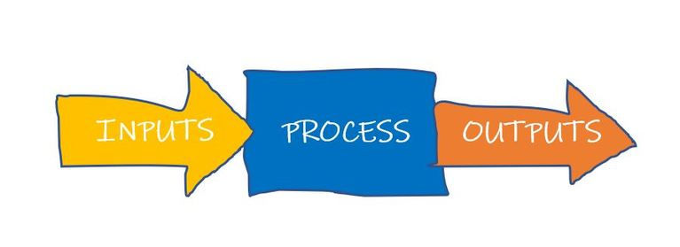
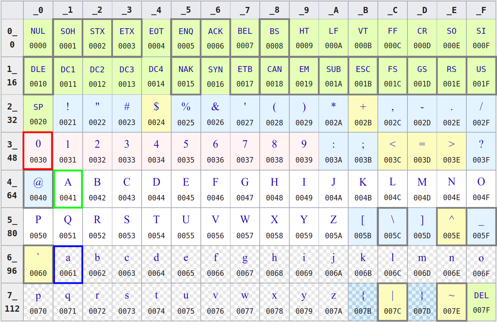

@import "../../css/font-awesome-4.7.0/css/font-awesome.css"
@import "../../css/theme/solarized.css"
@import "../../css/logo.css"
@import "../../css/font.css"
@import "../../css/color.css"
@import "../../css/margin.css"
@import "../../css/table.css"
@import "../../css/main.css"
@import "../../plugin/zoom/zoom.js"
@import "../../plugin/customcontrols/plugin.js"
@import "../../plugin/customcontrols/style.css"
@import "../../plugin/chalkboard/plugin.js"
@import "../../plugin/chalkboard/style.css"
@import "../../plugin/menu/menu.js"
@import "../../js/anychart/anychart-core.min.js"
@import "../../js/anychart/anychart-venn.min.js"
@import "../../js/anychart/pastel.min.js"
@import "../../js/anychart/venn-ml.js"


<!-- slide data-notes="" -->


<div class="bottom20"></div>

# C语言程序设计基础

<hr class="width50 center">

## 变量、数据类型与I/O

<div class="bottom8"></div>

### 计算机学院 &nbsp;&nbsp; 杨已彪

#### [yangyibiao@nju.edu.cn](yangyibiao@nju.edu.cn)


<!-- slide data-notes="" -->


##### 提纲

---

- 变量

- 数据类型

- I/O

---

<!-- slide data-notes="" -->


##### Review

---

**<font color = green size = 8>Program = <font color = purple>Input</font> + <font color = blue>Data </font> + <font color = red>Operations</font> + <font color = purple>Output</font>**</font>

<div class="top-2">
  
</div>

---


<!-- slide data-notes="" -->


##### Overview

---

### <font color = "blue">Variables (变量) &emsp; Data Types (数据类型)</font>

<br>

### <font color = "red">Operators (运算符) &emsp; Expressions (表达式)
### Assignment Statements (赋值语句)</font>

<br>

### <font color = "purple">I/O (Input/Output; 输入输出)</font>

---


<!-- slide data-notes="" -->


##### Circle

---

<font size = "8">Given a **radius** (say $10$) of a circle,
to compute its **circumference** and **area**.</font>

<br>

$L = 2\pi r$ &emsp; $S = \pi r^2$

<br>

- 每个结果各占一行
- 小数点后保留两位

---


<!-- slide data-notes="" -->

##### Declaration/Definition (声明/定义)


---

<code><font color = "yellow" size = "7">int radius = 10;</font></code>

<br>

* <mark>Declare/Define</mark> a *variable* called `radius`.
* The <mark>type</mark> of `radius` is `int` (integer).
* `radius` is <mark>initialized</mark> to $10$.
* You can <mark>assign</mark> other integers to `radius`.
* `radius` refers to a <mark>location</mark> (`&radius`) in memory.

---


<!-- slide data-notes="" -->

##### Identifiers (标识符)

---

<code><font color = "yellow" size = "7">int radius = 10;</font></code>

<br>

`radius` is an *identifier*.

**Warning:** Do *not* start with <code><font color = "yellow">_</font></code>, which are reserved by C.

<br>

#### Always use <mark>meaningful</mark> identifiers in a <mark>uniform</mark> style!!!

---


<!-- slide data-notes="" -->

##### Operators, Expressions, Assignment Statements

---

<br>

<code><font color = "yellow" size = "8">circumference = 2 * PI * radius;</font></code>

---


<!-- slide data-notes="" -->

##### Sphere

---

<font size = "7">Given a <mark>radius</mark> (say $100$) of a sphere,
to compute its <mark>surface area</mark> and <mark>volume</mark>.</font>

$A = 4 \pi r^2\quad V = \frac{4}{3} \pi r^3$

- 每个结果占 $1$ 行
- 小数点后保留 $4$ 位
- 每个结果至少占 $15$ 字符, 左对齐
  - `_______________ : surface_area`
  - `_______________ : volume`

---


<!-- slide data-notes="" -->

##### mol

---
<font size = "7">$6$ 克氧气的分子数是多少?</font>

<br>

$Q = 6 / 32 \times 6.02 \times 10^{23}$

<br>

两种格式输出, 结果均使用<mark>科学计数法</mark>表示

- 第一行结果, 小数点后保留 $3$ 位
- 第二行结果, 保留 $5$ 位有效数字

---


<!-- slide data-notes="" -->

##### 学校信息管理系统

---

- 校名 (EN) / 校址

- 类型(综合型C/艺术类A/工科类T)

- 校庆日 (mm-dd-yyyy)

- 教学质量/研究质量/影响力

- 平均分/标准差/排名


---

<!-- slide data-notes="" -->

##### 格式要求

---

<br>

- 每组信息占一行
- 各项信息使用 `\t` 间隔
- 各项信息遵循特定格式要求

---


<!-- slide data-notes="" -->

##### char and <ctype.h>

---

# <code><font color = yellow>char</font></code> and <code><font color = yellow><ctype.h></font></code>

<div class="top-2">
  
</div>

A `char` is actually an `int`.

---


<!-- slide data-notes="" -->

##### C string

---

# <code><font color = yellow>C string</font></code>
<code><font color = yellow size = 8>char first_name[] = "Tayu";</code></font>

A C string is a null-terminated (`\0`) sequence of characters.

String literal: 'T', 'a', 'y', 'u', '\0'

<br>

* char first_name[5] = "Tayu";
* char first_name[10] = "Tayu";
* <del>char first_name[2] = "Tayu";</del>

---

<!-- slide data-notes="" -->

##### 

---
### <mark>Conversion Specification</mark>
# <!--fit--> <code><font color = yellow><font color = red>%</font>[flags][width][.[precision]]<font color = red>specifier</font></font></code>

- <code><font color = red size = 7>%d</font></code>: decimal `int`
- <code><font color = red size = 7>%f</font></code>: `double`
- <code><font color = red size = 7>%e %E</font></code>: `double` ($-d.ddd \;\text{e} \pm dd$)
- <code><font color = red size = 7>%c</font></code>: `char`
- <code><font color = red size = 7>%s</font></code>: `C string`
- <code><font color = red size = 7>%%</font></code>: `%`

---


<br>

<font size = 8>
It is <ins>up to you</ins> to ensure that the type of the actual argument <ins>matches</ins> the type expected by conversion specifiers.</font>

[Undefined Behavior (UB)](https://en.cppreference.com/w/c/language/behavior)

---
# <!--fit--> <code><font color = yellow>%[<font color = red>flags</font>][width][.[precision]]specifier</font></code>

<br>
<br>
<br>

- $-$: left-justified (otherwise, right-justified)
- $+$: always begin with a plus or minus sign

---
# <!--fit--> <code><font color = yellow>%[flags][<font color = red>width</font>][.[precision]]specifier</font></code>

<br>
<br>

- minimum field width
- padded with spaces if it has fewer characters

---
# <!--fit--> <code><font color = yellow>%[flags][width][<font color = red>.[precision]</font>]specifier</font></code>

<br>
<br>

* `%d`: <mark>minimum number</mark> of digits
  - expanded with leading zeros when needed
* `%f`, `%e`, `%E`: <mark>number</mark> of digits after `.`
  - default is 6
* `%s`: <mark>maximum number</mark> of characters

---
<br>
<br>
<br>
<br>

# <!--fit-->[https://en.cppreference.com/w/c/io/fprintf](https://en.cppreference.com/w/c/io/fprintf)

---

### Section 7.21: `<stdio.h>`, P225--230

---

### Chapter 12: `<stdio.h>`, P257--262

---


---
# <code><font color = yellow><font color = red>%</font>[$\ast$][width]<font color = red>specifier</font></font></code>

<br>

- <code><font color = yellow size = 7>%d</font></code>: skip white-spaces; match a decimal `int`
- <code><font color = yellow size = 7>%lf</font></code>: skip white-spaces; match a `double`
- <code><font color = yellow size = 7>%c</font></code>: match a `char` (do <mark>NOT</mark> skip white-spaces)
- <code><font color = yellow size = 7>%s</font></code>: match a sequence of non-white-spaces
- <code><font color = yellow size = 7>%%</font></code>: mathch a `%`

---
# <code><font color = yellow>%[<font color = red>$\ast$</font>][width]specifier</font></code>

<br>
<br>

- $\ast$: assignment-suppressing

---
# <code><font color = yellow>%[$\ast$][<font color = red>width</font>]specifier</font></code>

<br>
<br>

- <mark>maximum</mark> field width to scan

---
<br>
<br>
<br>
<br>

# <!--fit--> [https://en.cppreference.com/w/c/io/fscanf](https://en.cppreference.com/w/c/io/fscanf)

---

### Section 7.21: `<stdio.h>`, P231--P237

---

### Chapter 12: `<stdio.h>`, P263--P268

---
# <mark>stdin, stdout, stderr</mark>


### <mark>Input/Output Redirection</mark>

---


### <mark>printf-error.c &ensp; scanf-error.c</mark>

---
<br>

### [A beginners' guide away from `scanf`](http://sekrit.de/webdocs/c/beginners-guide-away-from-scanf.html)

<br>

# <!--fit--> <font color = red>Do NOT use `scanf`.</font>

<br>

### [Why does everyone say not to use `scanf`? What should I use instead?](https://c-faq.com/stdio/scanfprobs.html)

---


### <mark>scanf-c17-ex2.c &ensp; scanf-c17-ex3.c</mark>

---


<!-- slide data-notes="" -->


##### 变量与赋值

---

大多数程序在产生输出之前往往需要执行一系列计算, 因此需要在程序执行过程中有一种 ==临时存储数据== 的方法

==变量==: (Variable)程序执行过程中临时存储数据的单元

==类型==: (type)每一个变量都有一个类型, 类型用来说明变量所存储的数据的种类, ==int, float, double, char, char []==

---


<!-- slide data-notes="" -->

##### 变量与赋值 - 类型

---

==C== 有多种类型, 包括int、float、double、char等类型的变量

==int==变量: 
- (整数integer的缩写)存储整数, 如`0`, `1`, `392`或`-2553`
- 整形的取值范围是受限的, 最大的整数通常是$2 147 483 647$($2^{31}-1$), 16位机最大整数是$32 767$
- INT_MAX, INT_MIN (limits.h头文件中定义的常量)

```C
#include <stdio.h>
#include <limits.h>

int main(void) {
  printf("Max: %d, Min: %d", INT_MAX, INT_MIN);
  return 0;
}
```

---


<!-- slide data-notes="" -->


##### 变量与赋值 - 类型

---

==float/double== 变量: 存储浮点数/双精度浮点数, 即可以带小数位, 如`379.125`

- ==float/double== 型变量算术运算通常比int型变量慢

- ==float/double== 在计算机中是近似存储的

<span class="yellow">:fa-weixin:</span> 需要注意: 

- ==float/double== 型变量所存储的数值往往只是实际数值的一个近似值
- ==float/double== 型变量中存储0.1, 可能发现变量值为$0.099 999 999 999 999 87$

---


<!-- slide data-notes="" -->


##### 变量与赋值 - 类型

---

==char== 变量: 存储字符, 如'A'

- 单引号

- 0000000 ～ 1111111, 0 ~ 127的整数

- 字符'a'的值是97, 'A'的值是65, '0'的值是48, ' '的值是32

- %c

```C
#include <stdio.h>
#include <ctype.h>

int main(void) {
  char gender = 'M';
  printf("%c\n", toupper(gender));
  printf("%c\n", gender + 32);
  return 0;
}
```

---


<!-- slide data-notes="" -->


##### 变量与赋值 - 声明

---

==声明==: 变量使用前必须对其进行 ==声明==(为编译器所做的描述)

- 指定变量的类型

- 说明变量的名字

```C
int main(void)
{
  声明
  语句
}
```

<span class="yellow">:fa-weixin:</span> 在C99中, 声明可以不必出现在语句之前

---


<!-- slide data-notes="" -->


##### 变量与赋值 - 声明

---

- 可以一次声明一个变量: 

```C{.line-numbers}
int height;
float profit;
char gender;
char name[20];
```

- 可以同时声明多个变量: 

```C{.line-numbers}
int height, length, width, volume;
float profit, loss;
char gender;
char name[30], nation[20], address[60];
```

---

<!-- slide data-notes="" -->


##### 变量与赋值 - 赋值

---

==赋值==: 通过赋值的方式获得值

```C{.line-numbers}
height = 8;
lenght = 12;
width = 10;
gender = 'M';
```

`8`, `12`, `10`为常量

```C
char name[30] = "Alex";
char nation[20] = "China";
char address[60] = "XianLin Avenue, Qixia District, Nanjing, China 210023";
```

---

<!-- slide data-notes="" -->


##### 变量与赋值 - 赋值

---

变量在赋值或者以其他方式使用之前必须先声明

```C{.line-numbers}
height = 9; /*** WRONG ***/
int height;
```

把包含小数点常量赋值给float型变量时, 最好在常量后加字母f:

```C
float profit = 2150.48f;
```

double类型的变量赋值不要加字母f: 

```C
double pi = 3.14159;
```

---


<!-- slide data-notes="" -->


##### 变量与赋值 - 赋值

---

混合类型赋值: 

- 可以把int型的值赋给double型变量

- 也可以把double型值赋给int型变量, 但不一定安全


<!-- slide data-notes="" -->


##### 变量与赋值 - 赋值

---

- 一旦一个变量被赋值, 它就可以用来帮助计算另一个变量的值: 

```C
height = 8;
length = 12;
width = 10;
volume = height * length * width;
/* volume is now 960 */
```

- 赋值的右侧可以是涉及常量、变量和运算符的公式(或C术语中表达式)


<!-- slide data-notes="" -->


##### 变量与赋值 - 打印变量的值

---

==`printf`== 可用于打印变量的当前值

```C
int height = 2;
char ch = 'a';
float profit = 1500f;
double pi = 3.14159;

printf("Height: %d\n", height);
printf("Character: %c\n", ch);
printf("Profit: %f\n", profit);
printf("Pi: %lf\n", pi);
```

==%d==: int型变量占位符, 用来指明变量`height`的值显示的位置
==%c==: char型变量占位符, 用来指明变量`ch`的值显示的位置
==%f==: float型变量占位符, 用来指明变量`profit`的值显示的位置
==%lf==: double型变量占位符, 用来指明变量`pi`的值显示的位置


<!-- slide data-notes="" -->


##### 变量与赋值 - 打印变量的值

---

浮点数 

- 要显示`float`型变量, 需使用 ==`%f`== 代替 ==`%d`==, ==`%f`== 默认会显示出小数点后6位

- 如果要强制 ==`%f`== 显示小数点后 ==`p`== 位数字, 可以把 ==`.p`== 放置在 ==`%`== 和 ==`f`== 之间, 如: 

```C
printf("profit: %.2f", profit);
```

- ==`printf`== 打印的变量数量没有限制

```C
printf("Height: %d Length: %d", height, lenght);
```

---

<!-- slide data-notes="" -->


##### 变量与赋值 - 初始化

---

当程序开始执行时, 某些变量会自动设零, 而大多数则不会

- 没有默认值并且尚未在程序中赋值的变量是 ==未初始化的==(uninitialized)

- 若试图访问未初始化的变量, 可能会得到不可预知的结果


<!-- slide data-notes="" -->


##### 变量与赋值 - 初始化

---

```C
int height = 8;
```

这里, 数值8是一个`初始化式`.

同一个声明中可以对任意数量的变量进行初始化, 如: 

```C
int height = 8, length = 12, width = 10;
```

或

```C
int height, length, width = 10;
```


---


<!-- slide data-notes="" -->


##### 变量与赋值 - 打印表达式

---

==`printf`== 的功能不局限于显示变量中存储的数, 它还可以显示任意数值表达式的值, 如: 

```C{.line-numbers}
int volume = height * length * width;
printf("%d", volume);
```

可改写成: 

```C
printf("%d", height * length * width);
```

<span class="blue">:fa-lightbulb-o:</span> ==C== 语言的一个通用原则: ==在任何需要数值的地方, 都可使用具有相同类型的表达式==


<!-- slide data-notes="" -->


##### 读取输入

---

==`scanf`== 函数: C语言中对应于 ==`printf`== 的库函数

==`scanf`== 与 ==`printf`== 中的字母 ==`f`== 含义相同, 都表示``格式化``

```C
int i;
scanf("%d", &i); 
/* reads an integer; stores into i */
```

<span class="yellow">:fa-weixin:</span> ==&== 符号通常(但不总是)在使用 ==`scanf`== 时是必需的


<!-- slide data-notes="" -->


##### 读取输入

---

读取浮点值的scanf调用: 

```C
scanf("%f", &x); 
```
- ==`%f`== 告诉 ==`scanf`== 查找浮点格式的输入值(数字可能包含小数点, 但不是必须的)