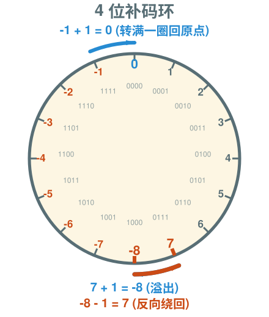
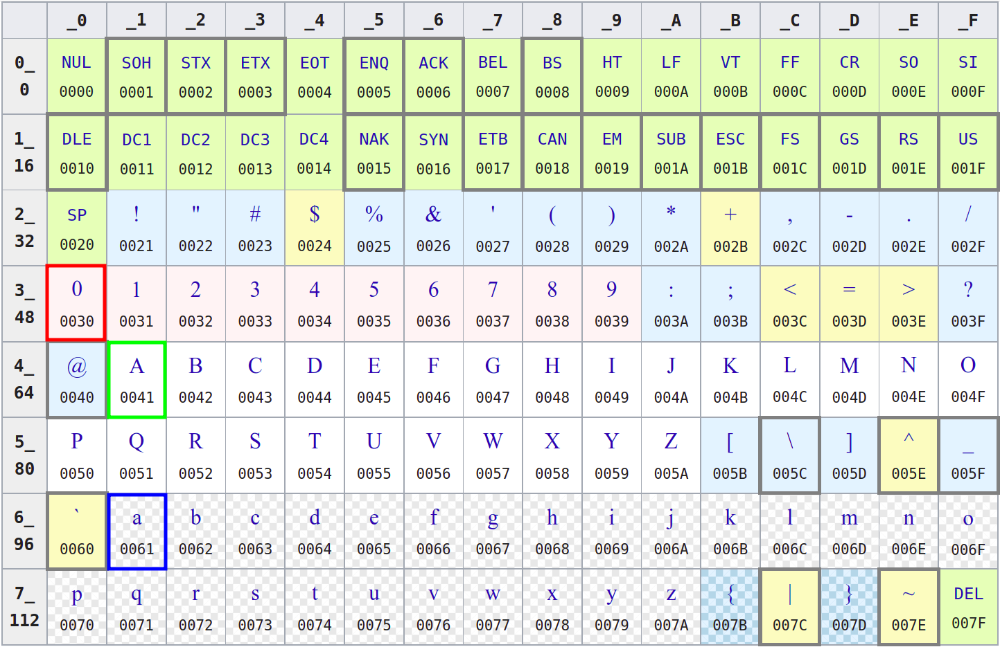

---
presentation:
  width: 1280
  height: 720
  margin: 0
  center: false
  transition: "convex"
  enableSpeakerNotes: true
  slideNumber: "c/t"
  navigationMode: "linear"
---

@import "../../css/font-awesome-4.7.0/css/font-awesome.css"
@import "../../css/theme/solarized.css"
@import "../../css/logo.css"
@import "../../css/font.css"
@import "../../css/color.css"
@import "../../css/margin.css"
@import "../../css/table.css"
@import "../../css/main.css"
@import "../../plugin/zoom/zoom.js"
@import "../../plugin/customcontrols/plugin.js"
@import "../../plugin/customcontrols/style.css"
@import "../../plugin/chalkboard/plugin.js"
@import "../../plugin/chalkboard/style.css"
@import "../../plugin/menu/menu.js"
@import "../../js/anychart/anychart-core.min.js"
@import "../../js/anychart/anychart-venn.min.js"
@import "../../js/anychart/pastel.min.js"
@import "../../js/anychart/venn-ml.js"


<!-- slide data-notes="" -->

<div class="bottom20"></div>

# 智能程序设计（C语言）

<hr class="width50 center">

## 数据类型深化

<div class="bottom8"></div>

### 计算机学院 &nbsp;&nbsp; 杨已彪

#### [yangyibiao@nju.edu.cn](mailto:yangyibiao@nju.edu.cn)


<!-- slide data-notes="" -->

##### 提纲

---

- 类型修饰符与取值范围

- 整型溢出与字符运算 (深化)

- 赋值细节

- 常量与符号常量

- 案例: Circle 与 Sphere

---

<!-- slide data-notes="" -->


##### 类型修饰符

---

==修饰符==: 改变整数类型的取值范围, 或是否允许负号

<div class="fullborder">

| 修饰符           | 含义                                    |
| :--             | :--                                     |
| `short` / `long` | 短整型 / 长整型                          |
| `signed`         | 有符号 (默认, 可表示负数)                 |
| `unsigned`       | 无符号 (只表示 0 与正数, 范围更大)         |

</div>

常见组合: `short int`, `long int`, `unsigned int`, `unsigned long`

- 位数: `short` ≤ `int` ≤ `long`
<!-- slide data-notes="" -->##### sizeof 运算符

---

用 ==sizeof== 运算符可查看类型占用的==字节数==

- `sizeof` 用法: `sizeof(int)` 类型 / `sizeof x` 变量 (括号可省)

```C
printf("%zu %zu %zu\n", sizeof(int), sizeof(double), sizeof(char));
```

- 打印 sizeof 的结果用 ==`%zu`== (它不是 int)


---
<!-- slide data-notes="" -->

##### 整型的取值范围与溢出

---

- int 通常是 ==32 位==(4 字节), 最大整数 $2^{31}-1$ = ==2 147 483 647==(约 21 亿)

- ==INT_MAX== / ==INT_MIN== 定义在 `limits.h` 中

<div style="font-size:0.8em;">

```C
#include <stdio.h>
#include <limits.h>

int main(void) {
  int x = INT_MAX;
  printf("INT_MAX     = %d\n", INT_MAX);
  printf("INT_MAX + 1 = %d\n", x + 1);   /* 溢出! */
  return 0;
}
```

</div>

- <span class="yellow">:fa-weixin:</span> 溢出==不会报错==, 会"绕回"成负数——C 不做检查; 用 ==sizeof== 查看类型字节数 (呼应修饰符页)

---


<!-- slide data-notes="" -->##### 溢出: 像时钟一样"绕圈"

---

<div style="display:flex;align-items:flex-start;gap:24px;">

<div style="flex:1;">

<div class="top-2">
  
</div>

</div>

<div style="flex:1;">

12 小时钟: ==11 点 + 2 小时 = 1 点==——转满一圈, 绕回起点

int 的取值也像这样一个表盘:

- ==INT_MAX + 1 == INT_MIN==: 最大正数加 1, 绕回最小负数

- ==INT_MIN - 1 == INT_MAX==: 反方向同理

- C 不报错——==溢出不被检查==, 这是追求性能的代价

</div>

</div>
<!-- slide data-notes="" -->

##### 整数在内存里长什么样 (了解)

---

<div style="display:flex;align-items:flex-start;gap:24px;">

<div style="flex:1.3;font-size:0.8em;">

```text
int x =  5;   00000000 00000000 00000000 00000101
int y = -5;   11111111 11111111 11111111 11111011
              (补码 = 按位取反再加 1)

最高位是符号位: 0 表示正, 1 表示负 (对 signed 而言)
```

```text
  00000000 00000000 00000000 00000000
- 00000000 00000000 00000000 00000001
---------------------------------------
  11111111 11111111 11111111 11111111
```

</div>

<div style="flex:1;">

整数用 ==二进制== 存; 负数的存法有个巧妙设计: ==补码==

换个角度看: 0 减 1 一路借位到底, 结果全是 1——这就是 -1 (见左):

- 为什么用补码? 让==减法变成加法== ($5 + (-5)$ 直接相加得 0), 电路更简单

- 同样 32 位, ==解释方式==不同, 能表示的范围就不同:
  - `int` (有符号): $-2^{31}$ ~ $2^{31}-1$ (约 ±21 亿)
  - `unsigned int` (无符号): $0$ ~ $2^{32}-1$ (约 42 亿)

- 溢出"绕回"的真相: 最大的正数加 1, 最高位翻成 1, 就被解释成负数

```C
printf("%d\n", 2147483647 + 1);    /* -2147483648 */
```

<span class="blue">:fa-lightbulb-o:</span> 本页==了解即可==: 知道"负数用补码、最高位是符号位"就够了

---

</div>

</div>

<!-- slide data-notes="" -->

##### 整数常量的进制

---

同一个整数有三种写法:

```C{.line-numbers}
int a = 17;      /* 十进制 */
int b = 021;     /* 八进制: 以 0 开头, 021 = 17 */
int c = 0x11;    /* 十六进制: 以 0x 开头, 0x11 = 17 */
```

- <span class="yellow">:fa-weixin:</span> ==坑==: `010` 不是 10, 而是 ==8== (前导 0 表示八进制)

- 打印时用不同转换说明看同一数字的"不同面孔":

```C
printf("%d %o %x\n", 17, 17, 17);   /* 输出: 17 21 11 */
```

- 十六进制在==位运算、内存地址、颜色码==中很常见 (如 `0xFF0000` 表示红色)


<!-- slide data-notes="" -->

##### float 与 double 的精度

---

- ==float==: 约 6 位有效数字; ==double==: 约 15 位有效数字

```C
float f = 1.0f / 3.0f;   /* 0.333333            */
double d = 1.0 / 3.0;    /* 0.333333333333333   */
```

- 为什么默认用 ==double==? 精度高, 且字面量 `3.14` 本来就是 double

- float 字面量要加 ==`f`== 后缀 (`1.0f`); 不加就是 double (赋给 float 会有转换警告)

- float 一般只在==内存紧张==时用 (如嵌入式)

- 浮点运算==有误差==: 0.1 + 0.2 不等于 0.3——第 3 周细讲

---

<!-- slide data-notes="" -->

##### 浮点数在内存里长什么样 (了解)

---

浮点数按 ==IEEE 754== 存储——"==二进制的科学计数法==": 符号、有效数字、指数三部分 (类比 $3.14 \times 10^{2}$)

<div class="fullborder">

| 类型 | 总位数 | 符号位 | 指数位 | 尾数位 |
| :-- | :-- | :-- | :-- | :-- |
| float | 32 | 1 | 8 | 23 |
| double | 64 | 1 | 11 | 52 |

</div>

```text
float f = 0.1f;  内存里大约是这样:
0  01111011  10011001100110011001101
↑  ↑         ↑
符号 指数      尾数: 0.1 的二进制是无限循环小数,
             只能截断存 23 位 —— 存进去的已不是 0.1
```

- 十进制小数在二进制里==大多无法精确表示== (就像十进制写不出精确的 1/3)

- 位数决定精度: float 约 6-7 位有效数字, double 约 15-16 位

- 结论: 浮点是==近似存储==; 比较浮点数不要用 `==`, 用 `fabs(a - b) < 1e-9`

<span class="blue">:fa-lightbulb-o:</span> 本页==了解即可==, 不要求掌握位级细节

---
<!-- slide data-notes="" -->##### 字符与 ASCII: char 其实是小整数

---

上一周知道 char 存的是==编码==; 今天把它当整数用

- 'a'=97, 'A'=65, '0'=48, ' '=32——大写字母与小写字母==差 32==

- 同一个变量, ==%c== 打字符 / ==%d== 打编码

```C
char ch = 'a';
printf("%c  %d\n", ch, ch);      /* a  97 */
printf("%c\n", ch - 32);         /* A      */
printf("%d\n", '9' - '0');       /* 9 (字符数字转整数) */
```

<div class="top-2">
  
</div>

- 常用技巧: ==toupper/tolower== (ctype.h); '9'-'0' 把字符数字变成整数

---

<!-- slide data-notes="" -->

##### 变量与赋值 - 赋值

---

==赋值==: 通过赋值的方式获得值

```C{.line-numbers}
height = 8;
length = 12;
width = 10;
gender = 'M';
```

浮点常量的小尾巴: ==float 加 f==, double 不加

```C
float profit = 2150.48f;   /* float: 加 f */
double pi = 3.14159;       /* double: 不加 f */
```

<span class="yellow">:fa-weixin:</span> 赋的值==超出目标类型范围==时, 结果==无意义== (不会自动截到最大/最小值):

```C
char c = 10000;      /* 无意义 */
int i = 1.0e20;      /* 无意义: 超出 int 范围 */
float f = 1.0e100;   /* 无意义: 超出 float 范围 */
```


---
<!-- slide data-notes="" -->


##### 常量与符号常量

---

==常量==: 程序运行过程中其值已知且不能改变的量, 如 `8`, `12`, `10`, `'M'`

==符号常量==: 给常量起一个名字, 提高可读性、便于修改

- 宏定义: 预处理命令, 结尾==没有分号==

```C
#define PI 3.14159
#define GRAM_PER_MOL 32
```

- const限定: 声明为只读变量

```C
const double MOL = 6.02E23;
const int GRAM_PER_MOL = 32;
```

<span class="yellow">:fa-weixin:</span> 宏里如果含运算符, ==整体要加括号==, 否则替换后会因优先级出错:

```C
#define SCALE_FACTOR (5.0f / 9.0f)   /* 安全: 带括号 */
```

---


<!-- slide data-notes="" -->


##### 演示: Circle

---

<div style="display:flex;align-items:flex-start;gap:24px;">

<div style="flex:1.25;font-size:0.7em;">

```C
/*
 * circle.c(计算周长和面积)
 */
#include <stdio.h>

int main(void) {
    int radius = 10;

    double circumference = 2 * 3.14159 * radius;
    double area = 3.14159 * radius * radius;

    // .2: precision 小数点后保留几位
    printf("circumference = %.2f\narea = %.2f\n", circumference, area);
    return 0;
}
```

</div>

<div style="flex:1;">

给定一个圆的==半径== (如 $10$), 计算其==周长==和==面积==

$L = 2\pi r$ &emsp; $S = \pi r^2$

- 每个结果各占一行

- 小数点后保留两位


</div>

</div>

<!-- slide data-notes="" -->


##### 演示: Sphere

---

<div style="display:flex;align-items:flex-start;gap:24px;">

<div style="flex:1.25;font-size:0.7em;">

```C
/*
 * sphere.c(球的体积和面积)
*/
#include <stdio.h>

int main() {
    int radius = 100;

    double surface_area = 4 * 3.14159 * radius * radius;
    double volume = 4.0 / 3 * 3.14159 * radius * radius * radius;

    // 15: width
    printf("%-15.4f : surface_area\n%-15.4f : volume\n",
           surface_area, volume);
}
```

</div>

<div style="flex:1;">

给定一个球的==半径== (如 $100$), 计算其==表面积==和==体积==

$A = 4 \pi r^2\quad V = \frac{4}{3} \pi r^3$

- 每个结果占 $1$ 行, 小数点后保留 $4$ 位

- 每个结果至少占 $15$ 字符, 左对齐


</div>

</div>

<!-- slide data-notes="" -->


##### 课堂小测

---

1. `unsigned int` 与 `int` 的区别是什么？查看类型占用字节数用什么运算符？

2. 用 `#define` 定义符号常量时行末要不要分号？`const` 呢？

3. `INT_MAX` 在哪个头文件中定义？它代表什么？

4. 计算圆的面积时为什么要用符号常量 `PI` 而不是直接写 `3.14159`？

<!-- slide data-notes="" -->


#####

---

<div class="bottom20"></div>

# 周三见!

<hr class="width50 center">

## 未完待续

---


