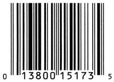

---
presentation:
  width: 1280
  height: 720
  margin: 0
  center: false
  transition: "convex"
  enableSpeakerNotes: true
  slideNumber: "c/t"
  navigationMode: "linear"
---

@import "../../css/font-awesome-4.7.0/css/font-awesome.css"
@import "../../css/theme/solarized.css"
@import "../../css/logo.css"
@import "../../css/font.css"
@import "../../css/color.css"
@import "../../css/margin.css"
@import "../../css/table.css"
@import "../../css/main.css"
@import "../../plugin/zoom/zoom.js"
@import "../../plugin/customcontrols/plugin.js"
@import "../../plugin/customcontrols/style.css"
@import "../../plugin/chalkboard/plugin.js"
@import "../../plugin/chalkboard/style.css"
@import "../../plugin/menu/menu.js"
@import "../../js/anychart/anychart-core.min.js"
@import "../../js/anychart/anychart-venn.min.js"
@import "../../js/anychart/pastel.min.js"
@import "../../js/anychart/venn-ml.js"


<!-- slide data-notes="" -->

<div class="bottom20"></div>

# 智能程序设计（C语言）

<hr class="width50 center">

## 运算符与表达式

<div class="bottom8"></div>

### 计算机学院 &nbsp;&nbsp; 杨已彪

#### [yangyibiao@nju.edu.cn](mailto:yangyibiao@nju.edu.cn)


<!-- slide data-notes="" -->

##### 提纲

---

- 运算符

- 优先级与结合性

- 赋值运算符

- 自增和自减运算符

- 案例: 计算产品代码校验位

---


<!-- slide data-notes="" -->


##### 运算符

---

<span class="yellow">:fa-weixin:</span> C语言的特点在于更加强调==表达式的使用==

==表达式==是由==变量==、==常量==和==运算符==所构成的

C拥有丰富的运算符集合, 包括: 

- 算术运算符
- 关系运算符
- 逻辑运算符
- 赋值运算符
- 自增和自减运算符
- 其他运算符

---

<!-- slide data-notes="" -->


##### 算术运算符

---

五个二元算术运算符(有两个操作数): 

- `+` 加法
- `-` 减法
- `*` 乘法
- `/` 除法
- `%` 求余

两个一元算术运算符(仅一个操作数): 

- `+` 一元加
- `-` 一元减

---

<!-- slide data-notes="" -->


##### 一元算术运算符

---

一元运算符只需要一个操作数: 

```C
i = +1;
j = -i;
```

<span class="yellow">:fa-weixin:</span> 一元`+`运算符什么也不做, 它主要用于强调数字常数是正数

---

<!-- slide data-notes="" -->


##### 二元算术运算符

---

==i % j==是i除以j时的余数

- 二元算术运算符(%除外)允许使用整数或浮点操作数, 并允许混合

- 当==int==和==float/double==操作数混合时, 结果的类型为==float/double==

1. ==10 % 3==的值为1, 而==12 % 4==的值为0
2. ==9 + 2.5== 的值为11.5, 而==6.7 / 2== 的值为3.35

---

<!-- slide data-notes="" -->


##### `/`和`%`运算符

---

`/`和`%`运算符使用需要特别注意: 

- 当两个操作数都是整数时, `/`会==截断==结果: 值==1 / 2==是0, 而不是0.5

- `%`运算符要求整数作为操作数; 任一操作数不是整数, 程序将无法编译

- 使用==零==作为`/`或`%`的==右操作数==会导致未定义的行为

- `/`和`%`与负操作数一起使用时的行为在C89中由实现定义

<span class="yellow">:fa-weixin:</span> C99中, 除法结果总是向零截断, 并且==i % j==的值与==i==有相同符号

---

<!-- slide data-notes="" -->


##### 由实现定义的行为

---

<span class="yellow">:fa-weixin:</span> C标准故意不指定语言的某些部分

- 未指定部分是因为C语言更强调==效率==, 常常意味着与硬件行为相匹配

<span class="blue">:fa-weixin:</span> 避免编写依赖于由具体实现所定义的行为的程序

---

<!-- slide data-notes="" -->


##### 运算符优先级

---

`i + j * k` 是先加再乘, 还是先乘再加? 加括号可以消歧; 省略括号时, C 用==运算符优先级==规则来确定含义

==算术运算符== 的优先级: 
- 最高: `+ -` (一元)
- 其次: `* / %` (二元)
- 最低: `+ -` (二元)

示例: 

<div class="fullborder">

| `i + j * k`  | 等价于  | `i + (j * k)`    | 
| :--          | :--    | :--              |
| `-i * -j`    | 等价于  | `(-i) * (-j)`    | 
| `+i + j / k` | 等价于  | `(+i) + (j / k)` | 

</div>

---

<!-- slide data-notes="" -->


##### 运算符结合性

---

表达式有多个相同优先级操作符, 考虑运算符的结合性

如果运算符从左到右结合的, 则称它为==左结合运算符==

二元算术运算符`*`, `/`, `%`, `+`, `-`都是==左结合==的:

<div class="fullborder">

| `i - j – k` | 等价于 | `(i - j) - k` |
| :--         | :--   | :--           |
| `i * j / k` | 等价于 | `(i * j) / k` |

</div>

如果运算符从右向左结合, 则它是右结合的运算符

一元算术运算符(`+`和`-`)都是右结合的: 

`-+i`等价于`-(+i)`

---

<!-- slide data-notes="" -->


##### 程序: 计算产品代码校验位(s)

---

<div class="top-2">
  
</div>

条形码下方数字的含义: 第 1 位商品类型, 两组五位数分别是制造商与产品, ==末位是校验位== (识别前面的数字错误)

计算校验位流程: 

- 第`1`、`3`、`5`、`7`、`9`和第`11`位数字求和
- 第`2`、`4`、`6`、`8`和第`10`位数字求和
- 第一个总和 × `3` 加第二个总和, 再减 `1`
- 调整后的总数除以 `10` 取余数, 再用 `9` 减去它

---

<!-- slide data-notes="" -->


##### 程序: 计算产品代码校验位(s)

---

<div style="display:flex;align-items:flex-start;gap:24px;">

<div style="flex:1.3;font-size:0.6em;">

```C{.line-numbers}
/* Computes a Universal Product Code check digit */
 
#include <stdio.h>
 
int main(void)
{
  int d, i1, i2, i3, i4, i5, j1, j2, j3, j4, j5,
      first_sum, second_sum, total;
 
  printf("Enter the first (single) digit: ");
  scanf("%1d", &d);
  printf("Enter first group of five digits: ");
  scanf("%1d%1d%1d%1d%1d", &i1, &i2, &i3, &i4, &i5);
  printf("Enter second group of five digits: ");
  scanf("%1d%1d%1d%1d%1d", &j1, &j2, &j3, &j4, &j5);
  first_sum = d + i2 + i4 + j1 + j3 + j5;
  second_sum = i1 + i3 + i5 + j2 + j4;
  total = 3 * first_sum + second_sum;
 
  printf("Check digit: %d\n", 9 - ((total - 1) % 10));
 
  return 0;
}
```

</div>

<div style="flex:1;">

产品编码为 $0 13800 15173 5$ 的校验位计算示例: 

- 第一个总和: $0 + 3 + 0 + 1 + 1 + 3 = 8$
- 第二个总和: $1 + 8 + 0 + 5 + 7 = 21$
- 将第一个总和乘以 $3$ 并加上第二个总和得到 $45$
- 减去 $1$ 得到 $44$
- 除以 $10$ 的余数是 $4$
- 从 $9$ 中减去余数
- 结果是 $5$

`upc.c`


</div>

</div>

<!-- slide data-notes="" -->


##### 赋值运算符

---

- ==简单赋值==: 把值存进变量 (`=`); ==复合赋值==: 更新已有变量的值 (`+=`)

`v = e`先评估表达式`e`的值, 然后将值复制到`v`中

`e`可以是常量、变量或更复杂的表达式: 

```C{.line-numbers}
i = 5;            /* i is now 5  */
j = i;            /* j is now 5  */
k = 10 * i + j;   /* k is now 55 */
```

如果 ==`v`== 和 ==`e`== 的类型不同, 在赋值时 ==`e`== 的值将转换为 ==`v`== 的类型: 

```C
int i;
float f;

i = 72.99f;   /* i is now 72 */
f = 136;      /* f is now 136.0 */
```

---

<!-- slide data-notes="" -->


##### 简单赋值

---

在许多编程语言中, 赋值是一个语句; 而在 ==`C`== 中, 赋值操作的结果类似运算符, 就像运算符 ==`+`== 一样

赋值表达式 ==`v = e`== 的值是赋值后 ==`v`== 的值

- 表达式 `i = 72.99f` 的值是 $72$, 而不是 $72.99$

```C
i = j = 50 + 3;
```

<span class="yellow">:fa-weixin:</span> 由于 ==赋值== 是一个运算符, 因此可以将多个赋值链接在一起: 

```C{.line-numbers}
i = j = k = 0;
```

==`=`== 运算符是右结合的, 所以这个赋值等价于

```C{.line-numbers}
i = (j = (k = 0));
```

---

<!-- slide data-notes="" -->


##### 复合赋值

---

使用变量的旧值来计算其新值的赋值很常见

例如: `i = i + 2;`

使用 ==`+=`== 复合赋值运算符, 可改写为: 

```C
i += 2;   /* same as i = i + 2; */
```

还有其他九个复合赋值运算符, 包括: ==`-= *= /= %=`== 和位运算(`^= &= >>= <<= |=`)

<div class="fullborder">

| v += e | 将v加e, 将结果存储在v中         |
| :--    | :--                          |
| v -= e | 将v减e, 将结果存储在v中         |
| v *= e | 将v乘以e, 将结果存储在v中        |
| v /= e | 将v除以e, 将结果存储在v中        |
| v %= e | 计算v除以e的余数, 将结果存储在v中 |

</div>

---

<!-- slide data-notes="" -->


##### 复合赋值

---

`v += e`与`v = v + e`可能==不等价==

- 一是运算符优先级:  

`i *= j + k` 与 `i = i * j + k` 不等价

- 在极少数情况下, `v += e` 不同于 `v = v + e` 因为 `v`本身有副作用(如`v`为`++i`或`i++`等)

<span class="blue">:fa-lightbulb-o:</span> 使用复合赋值运算符时, 不要交换构成复合运算符的两个字符

虽然`i =+ j`能编译通过, 但意义不同, 它相当于 `i = (+j)`, 它只是将`j`的值复制到`i`中

---

<!-- slide data-notes="" -->


##### 自增和自减运算符

---

对变量最常见的两种操作是 ==自增==(加 `1`)和 ==自减==(减 `1`): 

```C{.line-numbers}
i = i + 1;
j = j - 1;
```

可以使用复合赋值运算符进行自增和自减: 

```C{.line-numbers}
i += 1;
j -= 1;
```

C 特别提供了 `++` 自增 和 `-–` 自减 运算符

- ==`++`== 运算符将操作数加1

- ==`--`== 运算符将操作数减1

- 有前缀运算符(`++i`和`–-i`)或后缀运算符(`i++`和`i--`)

---

<!-- slide data-notes="" -->


##### 自增和自减运算符

---

<div style="display:flex;align-items:flex-start;gap:24px;">

<div style="flex:1.2;font-size:0.7em;">

```C{.line-numbers}
i = 1;
printf("i is %d\n", ++i);   /* prints "i is 2" */
printf("i is %d\n", i);     /* prints "i is 2" */
```

```C{.line-numbers}
i = 1;
printf("i is %d\n", i++);   /* prints "i is 1" */
printf("i is %d\n", i);     /* prints "i is 2" */
```

```C{.line-numbers}
i = 1;
printf("i is %d\n", --i);   /* prints "i is 0" */
printf("i is %d\n", i);     /* prints "i is 0" */
i = 1;
printf("i is %d\n", i--);   /* prints "i is 1" */
printf("i is %d\n", i);     /* prints "i is 0" */
```

</div>

<div style="flex:1;">

评估表达式`++i` (前缀自增) 的结果是`i + 1`, 副作用是`i`自增`1`:

评估表达式`i++` (后缀自增) 的结果是`i`, 副作用是`i`随后自增`1`:

==`++i`表示立即自增i, 而`i++`表示暂时使用i的旧值, 稍后再自增i==

`--`运算符与`++`运算符相似:


</div>

</div>

<!-- slide data-notes="" -->


##### 自增和自减运算符

---

<div style="display:flex;align-items:flex-start;gap:24px;">

<div style="flex:1.2;font-size:0.72em;">

```C{.line-numbers}
i = 1;
j = 2;
k = ++i + j++;
```

```C{.line-numbers}
i = i + 1;
k = i + j;
j = j + 1;
```

```C{.line-numbers}
i = 1;
j = 2;
k = i++ + j++;
```

</div>

<div style="flex:1;">

当`++`或`--`在同一个表达式中多次使用时, 结果通常很难理解, 如:

最后一条语句等价于:

i, j和k的最终值分别为 2, 3和4.

相反, 执行语句

`i`、`j`和`k`的值最终为`2`、`3`和`3`

<span class="blue">:fa-lightbulb-o:</span> 多个`++`/`--`混用容易写错, 实际编程中尽量==分行写==

</div>

</div>

<!-- slide data-notes="" -->


##### 表达式语句

---

C 有一个不寻常的规则, 即任何表达式都可以用作语句
例子: 

```C
++i;
```

i首先递增, 然后获取i的新值, 然后丢弃

由于它的值被丢弃了, 除非表达式有副作用, 否则将表达式用作语句几乎没有意义: 

```C
i = 1;     /* useful */
i--;       /* useful */
i * j - 1; /* not useful */
```

一个无意的编码错误很容易会创建一个 ==什么都不做== 的表达式语句, 如 `i = j;` 误编写为 `i + j;`

---

<!-- slide data-notes="" -->


##### 课堂小测

---

1. `1 / 2` 的值是多少？`7 % 2` 呢？`9 % 3` 呢？

2. `-i * -j` 等价于什么？`i * j / k` 按什么顺序计算？

3. `i += 2` 等价于什么？`i *= j + k` 等价于 `i = i * j + k` 吗？

4. `i = 1; j = i++;` 执行后 `i` 和 `j` 分别是多少？


<!-- slide data-notes="" -->


#####

---

<div class="bottom20"></div>

# 周三见!

<hr class="width50 center">

## 未完待续

---


