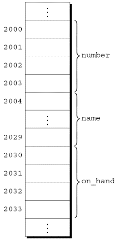
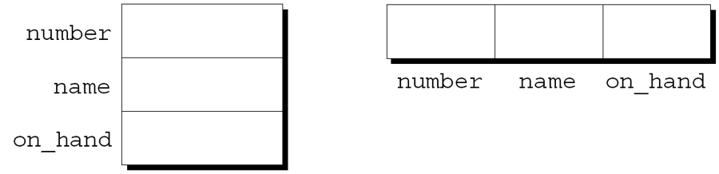
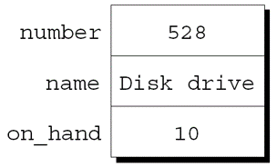

---
presentation:
  margin: 0
  center: false
  transition: "convex"
  enableSpeakerNotes: true
  slideNumber: "c/t"
  navigationMode: "linear"
---

@import "../css/font-awesome-4.7.0/css/font-awesome.css"
@import "../css/theme/solarized.css"
@import "../css/logo.css"
@import "../css/font.css"
@import "../css/color.css"
@import "../css/margin.css"
@import "../css/table.css"
@import "../css/main.css"
@import "../plugin/zoom/zoom.js"
@import "../plugin/customcontrols/plugin.js"
@import "../plugin/customcontrols/style.css"
@import "../plugin/chalkboard/plugin.js"
@import "../plugin/chalkboard/style.css"
@import "../plugin/menu/menu.js"
@import "../js/anychart/anychart-core.min.js"
@import "../js/anychart/anychart-venn.min.js"
@import "../js/anychart/pastel.min.js"
@import "../js/anychart/venn-ml.js"
@import "https://cdn.bootcdn.net/ajax/libs/jquery/3.5.0/jquery.js"


<!-- slide data-notes="" -->

<div class="bottom20"></div>

# 智能程序设计（C语言）

<hr class="width50 center">

## 结构体

<div class="bottom8"></div>

### 计算机学院 &nbsp;&nbsp; 杨已彪

#### [yangyibiao@nju.edu.cn](mailto:yangyibiao@nju.edu.cn)


<!-- slide data-notes="" -->

##### 提纲

---

- 结构体变量: 把相关的数据打包

- 声明、初始化与操作

- 结构体类型与 typedef

- 结构体数组与案例: 零件数据库

---


<!-- slide data-notes="" -->


##### 结构体变量

---

<div style="display:flex;align-items:flex-start;gap:24px;">

<div style="flex:1.2;font-size:0.6em;">

```C{.line-numbers}
struct {
  int number;
  char name[NAME_LEN+1];
  int on_hand;
} part1, part2;
```

</div>

<div style="flex:1;">

<div style="display:flex;align-items:flex-start;gap:24px;">

<div style="flex:1.2;font-size:0.6em;">

</div>

<div style="flex:1;">

结构体与数组的特性不同. 

- 结构体的元素(成员)不需要具有相同的类型. 

- 结构体的成员有名字; 为了选择特定的成员, 需要指明它的名字, 而不是它的位置. 

在某些语言中, 结构体称为记录, 成员称为字段. 


---

在存储相关数据项的集合时, 结构体是个好选择. 

声明两个结构体变量, 用于存储仓库中零件的信息:

结构体的成员按照声明的顺序存储在内存中. part1:

<div class="top-2">
  
</div>

</div>

</div>

</div>

</div>

<!-- slide data-notes="" -->


##### 声明结构体变量

---

<div style="display:flex;align-items:flex-start;gap:24px;">

<div style="flex:1.2;font-size:0.6em;">

```C{.line-numbers}
struct {
  int number;
  char name[NAME_LEN+1];
  int on_hand;
} part1, part2;

struct {
  char name[NAME_LEN+1];
  int number;
  char sex;
} employee1, employee2;
```

</div>

<div style="flex:1;">

<div style="display:flex;align-items:flex-start;gap:24px;">

<div style="flex:1.2;font-size:0.6em;">

</div>

<div style="flex:1;">

假设: 

- part1位于地址2000. 

- 整数占用4个字节. 

- NAME_LEN的值为25. 

- 成员之间没有间隙.


结构体的抽象表示: 

<div class="top-2">
  
</div>

成员的值将在稍后放入盒子中.


每个结构体代表一种新的作用域. 

在该作用域内声明的任何名称都不会与程序中的其他名称冲突. 

每个结构体都为它的成员设置了独立的名字空间.


例如, 以下声明可以出现在同一程序中:


</div>

</div>

</div>

</div>

<!-- slide data-notes="" -->


##### 初始化结构体变量

---

<div style="display:flex;align-items:flex-start;gap:24px;">

<div style="flex:1.2;font-size:0.6em;">

```C
struct {
 int number;
 char name[NAME_LEN+1];
 int on_hand;
} part1 = {528, "Disk drive", 10},
  part2 = {914, "Printer cable", 5};
```

</div>

<div style="flex:1;">

<div style="display:flex;align-items:flex-start;gap:24px;">

<div style="flex:1.2;font-size:0.6em;">

</div>

<div style="flex:1;">

结构体变量可以在声明的同时进行初始化:

part1初始化后的样子: 

<div class="top-2">
  
</div>


结构体初始化式遵循类似于数组初始化式的规则. 

结构体初始化式中使用的表达式必须是常量. (这个限制在 C99 中放宽了)

初始化式的成员数可以少于它所初始化的结构体. 

任何"剩余的"成员用 0 作为其初始值.

</div>

</div>

</div>

</div>

<!-- slide data-notes="" -->


##### 对结构体的操作

---

<div style="display:flex;align-items:flex-start;gap:24px;">

<div style="flex:1.3;font-size:0.6em;">

```C{.line-numbers}
printf("Part number: %d\n", part1.number);
printf("Part name: %s\n", part1.name);
printf("Quantity on hand: %d\n", part1.on_hand);
```

```C
part1.number = 258;     
 /* changes part1's part number */
part1.on_hand++;
 /* increments part1's quantity on hand */
```

```C
scanf("%d", &part1.on_hand);
```

</div>

<div style="flex:1;">

<div style="display:flex;align-items:flex-start;gap:24px;">

<div style="flex:1.3;font-size:0.6em;">

</div>

<div style="flex:1;">

要访问结构体中的成员, 首先写出结构体的名称, 然后写一个句点, 再写出成员的名称. 

打印part1的成员的值的语句:

结构体的成员是左值. 

它们可以出现在赋值的左侧, 也可以作为自增或自减表达式中的操作数:

用于访问结构体成员的句点实际上是一个 C 运算符. 

它优先于几乎所有其他运算符. 例子:

`.`运算符优先级高于`&`运算符, 因此`&`计算part1.on_hand的地址.


另一个主要的结构体操作是赋值: 

`part2 = part1;`

该语句的效果是将 part1.number 复制到part2.number, 将 part1.name 复制到 part2.name , 依此类推.

</div>

</div>

</div>

</div>

<!-- slide data-notes="" -->


##### 对结构体的操作 (续)

---

`=`运算符无法用于复制数组, 但在复制结构体时也会复制嵌在结构体中的数组. 

一些程序员利用此属性创建"空"结构体来封装稍后将复制的数组来: 

```C
struct { int a[10]; } a1, a2;
a1 = a2;
 /* legal, since a1 and a2 are structures */
```


`=`运算符只能用于类型兼容的结构体. 

两个同时声明的结构体(如part1和part2)是兼容的. 

使用相同"结构体标记"或相同类型名声明的结构体也是兼容的. 

除了赋值之外, C 不提供对整个结构体的操作. 

特别是, `==`和`!=`运算符不能用于判定两个结构体是否相等.

---


<!-- slide data-notes="" -->


##### 结构体类型

---

<div style="display:flex;align-items:flex-start;gap:24px;">

<div style="flex:1.4;font-size:0.55em;">

```C{.line-numbers}
struct part {
  int number;
  char name[NAME_LEN+1];
  int on_hand;
};
```

```C
struct part {
 int number;
 char name[NAME_LEN+1];
 int on_hand;
} part1, part2;
```

```C
struct part part1 = {528, "Disk drive", 10};
struct part part2;

part2 = part1; /* legal; both parts have the same type */
```

</div>

<div style="flex:1;">

<div style="display:flex;align-items:flex-start;gap:24px;">

<div style="flex:1.4;font-size:0.55em;">

</div>

<div style="flex:1;">

假设程序需要声明几个具有相同成员的结构体变量. 

需要一个代表一种结构体类型的名称, 而不是一个特定的结构体变量. 

命名结构体的方法: 

- 声明一个"结构体标记"

- 使用typedef定义类型名


---

结构体标记是用于标识特定类型结构体的名称. 

名为part的结构体标记的声明:

请注意, 分号必须跟在右大括号后面.


part标记可用于声明变量: 

`struct part part1, part2;`

struct不能省略: 

`part part1, part2;   /*** WRONG ***/`

part不是类型名; 没有struct这个词, 它是没有意义的. 

结构体标记只有在struct后才有意义, 因此它们不会与程序中使用的其他名称冲突.


结构体标记的声明可以与结构体变量的声明相结合:

所有声明为struct part类型的结构体相互兼容:


</div>

</div>

</div>

</div>

<!-- slide data-notes="" -->


##### 定义结构体类型 (typedef)

---

除了声明结构体标记, 还可以使用typedef来定义真实的类型名. 

一个名为Part的类型的定义: 

```C{.line-numbers}
typedef struct {
  int number;
  char name[NAME_LEN+1];
  int on_hand;
} Part;
```

Part的使用方式与内置类型相同: 

`Part part1, part2;`


当需要命名结构体时, 通常可以选择声明结构体标记或typedef. 

但是, 当要在链表中使用结构体时, 必须声明结构体标记.

---


<!-- slide data-notes="" -->


##### 结构体作为参数和返回值

---

<div style="display:flex;align-items:flex-start;gap:24px;">

<div style="flex:1.4;font-size:0.55em;">

```C{.line-numbers}
void print_part(struct part p)
{
  printf("Part number: %d\n", p.number);
  printf("Part name: %s\n", p.name);
  printf("Quantity on hand: %d\n", p.on_hand);
}
```

```C
print_part(part1);
```

```C{.line-numbers}
struct part build_part(int number,
                       const char *name,
                       int on_hand)
{
  struct part p;

  p.number = number;
  strcpy(p.name, name);
  p.on_hand = on_hand;
  return p;
}
```

```C
part1 = build_part(528, "Disk drive", 10);
```

</div>

<div style="flex:1;">

<div style="display:flex;align-items:flex-start;gap:24px;">

<div style="flex:1.4;font-size:0.55em;">

</div>

<div style="flex:1;">

函数可以有结构体类型的参数和返回值. 

带有结构体参数的函数:

调用print_part:

返回part结构体的函数:

调用build_part:

将结构体传递给函数和从函数返回结构体都需要复制结构体中的所有成员. 

为了避免这种开销, 有时建议用一个指向结构体的指针来代替结构体本身. 

第17章给出了以结构体指针作为参数或作为返回值的函数示例.


避免复制结构体还有其他原因. 

例如, <stdio.h>头文件定义了一个名为FILE的类型, 它通常是一个结构体. 

每个FILE结构体都存储已打开文件的状态信息, 因此在程序中必须是唯一的. 

<stdio.h>中打开文件的每个函数都返回一个指向FILE结构体的指针. 

每个对已打开文件执行操作的函数都需要一个FILE指针作为参数.

</div>

</div>

</div>

</div>

<!-- slide data-notes="" -->


##### 嵌套的结构体

---

<div style="display:flex;align-items:flex-start;gap:24px;">

<div style="flex:1.3;font-size:0.6em;">

```C{.line-numbers}
struct person_name {
  char first[FIRST_NAME_LEN+1];
  char middle_initial;
  char last[LAST_NAME_LEN+1];
};
```

```C{.line-numbers}
struct student {
  struct person_name name;
  int id, age;
  char sex;
} student1, student2;
```

</div>

<div style="flex:1;">

<div style="display:flex;align-items:flex-start;gap:24px;">

<div style="flex:1.3;font-size:0.6em;">

</div>

<div style="flex:1;">

结构体和数组可以无限制地组合. 

数组可以有结构体作为元素, 结构体可以包含数组和结构体作为成员. 


---

将一个结构体嵌套在另一个结构体中通常很有用. 

假设person_name是以下结构体:

我们可以使用person_name作为更大结构体的一部分:

访问student1的名字、中间名首字母或姓氏需两次应用`.`运算符: 

`strcpy(student1.name.first, "Fred");`

</div>

</div>

</div>

</div>

<!-- slide data-notes="" -->


##### 结构体数组

---

数组和结构体的最常见组合之一是其元素是结构体的数组. 

这种数组可以作为一个简单的数据库. 

能够存储100个零件信息的结构体part数组: 

`struct part inventory[100];`


通过取下标来访问数组中的零件: 
`print_part(inventory[i]);`

访问结构体part中的成员需要结合使用下标和成员选择: 
`inventory[i].number = 883;`

访问零件名称中的单个字符需要先取下标, 然后是选择成员, 然后再取下标: 
`inventory[i].name[0] = '\0';`

---


<!-- slide data-notes="" -->


##### 初始化结构体数组

---

<div style="display:flex;align-items:flex-start;gap:24px;">

<div style="flex:1.4;font-size:0.55em;">

```C
struct dialing_code {
  char *country;
  int code;
};
```

```C
const struct dialing_code country_codes[] =
  { {"Argentina",            54}, {"Bangladesh",      880},
   {"Brazil",               55}, {"Burma (Myanmar)",  95},
   {"China",                86}, {"Colombia",         57},
   {"Congo, Dem. Rep. of", 243}, {"Egypt",            20},
   {"Ethiopia",            251}, {"France",           33},
   {"Germany",              49}, {"India",            91},
   {"Indonesia",            62}, {"Iran",             98},
   {"Italy",                39}, {"Japan",            81},
   {"Mexico",               52}, {"Nigeria",         234},
   {"Pakistan",             92}, {"Philippines",      63},
   {"Poland",               48}, {"Russia",            7},
   {"South Africa",         27}, {"South Korea",      82},
   {"Spain",                34}, {"Sudan",           249},
   {"Thailand",             66}, {"Turkey",           90},
   {"Ukraine",             380}, {"United Kingdom",   44},
   {"United States",         1}, {"Vietnam",          84} };
```

```C
struct part inventory[100] = 
 {[0].number = 528, [0].on_hand = 10,
  [0].name[0] = '\0'};
```

</div>

<div style="flex:1;">

<div style="display:flex;align-items:flex-start;gap:24px;">

<div style="flex:1.4;font-size:0.55em;">

</div>

<div style="flex:1;">

初始化结构体数组的方式与初始化多维数组的方式大致相同. 

每个结构体都有自己的大括号括起来的初始化式; 数组的初始化式将另一组大括号包裹在结构体初始化式的外围.


初始化结构体数组的一个原因是它包含在程序执行期间不会改变的信息. 

示例: 存储拨打国际电话时使用的国家/地区代码的数组. 

数组的元素将是存储国家名称及其代码的结构体:

每个结构体值两边的内层大括号是可选的.


C99 的指定初始化式允许每一项有多个指示符. 

声明inventory数组, 使用指定初始化式来包含一个零件:

初始化式中的前两项使用两个指示符; 最后一项使用三个.

</div>

</div>

</div>

</div>

<!-- slide data-notes="" -->


##### 程序: 维护零件数据库 (说明)

---

<div style="display:flex;align-items:flex-start;gap:24px;">

<div style="flex:1.2;font-size:0.46em;">

```
Enter operation code: i
Enter part number: 528
Enter part name: Disk drive
Enter quantity on hand: 10

Enter operation code: s
Enter part number: 528
Part name: Disk drive
Quantity on hand: 10

Enter operation code: s
Enter part number: 914
Part not found.

Enter operation code: i
Enter part number: 914
Enter part name: Printer cable
Enter quantity on hand: 5

Enter operation code: u
Enter part number: 528
Enter change in quantity on hand: -2

Enter operation code: s
Enter part number: 528
Part name: Disk drive
Quantity on hand: 8

Enter operation code: p
Part Number   Part Name             Quantity on Hand
   528       Disk drive                    8
   914       Printer cable                 5

Enter operation code: q
```

</div>

<div style="flex:1;">

inventory.c 演示==嵌套数组与结构体==的实战: 零件存在结构体数组中, 每个结构体含零件号、名称、数量.

支持的操作: 插入 (i)、搜索 (s)、更新 (u)、打印 (p)、退出 (q).

结构体存进 inventory 数组, num_parts 跟踪当前零件数.

</div>
</div>


<!-- slide data-notes="" -->


##### 程序: 维护零件数据库 (代码)

---

<div style="display:flex;align-items:flex-start;gap:24px;">

<div style="flex:1.4;font-size:0.6em;">

```C{.line-numbers}
for (;;) {
 prompt user to enter operation code;
 read code;
 switch (code) {
   case 'i': perform insert operation; break;
   case 's': perform search operation; break;
   case 'u': perform update operation; break;
   case 'p': perform print operation; break;
   case 'q': terminate program;
   default:  print error message;
 }
}
```

</div>

<div style="flex:1;">

主循环: 读操作码 → 调用对应函数 (insert/search/update/print); 每种零件的信息保存在结构体中, 结构体存进 inventory 数组.

代码结构: struct part 定义 → 各操作函数 → main 主循环.

</div>
</div>


<!-- slide data-notes="" -->

##### 课堂小测

---

1. 声明一个结构体类型 `point`，含 `int x, y;`，并声明一个变量 `p` 怎么写？

2. `p.x` 与 `p->x` 分别什么时候用？结构体指针的名词是什么？

3. 结构体可以直接用 `==` 比较吗？可以整体赋值吗？

4. 结构体作函数参数与数组作参数，哪个是"复制"、哪个是"共享"？

---


<!-- slide data-notes="" -->

#####

---

<div class="bottom20"></div>

# 周三见!

<hr class="width50 center">

## 未完待续

---


