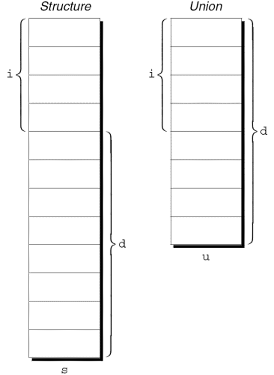

---
presentation:
  margin: 0
  center: false
  transition: "convex"
  enableSpeakerNotes: true
  slideNumber: "c/t"
  navigationMode: "linear"
---

@import "../css/font-awesome-4.7.0/css/font-awesome.css"
@import "../css/theme/solarized.css"
@import "../css/logo.css"
@import "../css/font.css"
@import "../css/color.css"
@import "../css/margin.css"
@import "../css/table.css"
@import "../css/main.css"
@import "../plugin/zoom/zoom.js"
@import "../plugin/customcontrols/plugin.js"
@import "../plugin/customcontrols/style.css"
@import "../plugin/chalkboard/plugin.js"
@import "../plugin/chalkboard/style.css"
@import "../plugin/menu/menu.js"
@import "../js/anychart/anychart-core.min.js"
@import "../js/anychart/anychart-venn.min.js"
@import "../js/anychart/pastel.min.js"
@import "../js/anychart/venn-ml.js"
@import "https://cdn.bootcdn.net/ajax/libs/jquery/3.5.0/jquery.js"


<!-- slide data-notes="" -->

<div class="bottom20"></div>

# 智能程序设计（C语言）

<hr class="width50 center">

## 枚举、联合与 typedef

<div class="bottom8"></div>

### 计算机学院 &nbsp;&nbsp; 杨已彪

#### [yangyibiao@nju.edu.cn](mailto:yangyibiao@nju.edu.cn)


<!-- slide data-notes="" -->

##### 提纲

---

- 联合: 共用同一块内存 (选讲)

- 枚举类型: 给整数起有意义的名字

- typedef 命名类型

- const 类型限定符

---


<!-- slide data-notes="" -->


##### 联合

---

<div style="display:flex;align-items:flex-start;gap:24px;">

<div style="flex:1.4;font-size:0.55em;">

```C{.line-numbers}
union {
  int i;
  double d;
} u;
```

```C{.line-numbers}
struct {
  int i;
  double d;
} s;
```

```C
u.i = 82;
u.d = 74.8;
```

</div>

<div style="flex:1;">

像结构体一样, 联合由一个或多个成员组成, 这些成员可能是不同类型的. 

编译器只为最大的成员分配足够的空间, 联合的成员在这个空间内彼此覆盖. 

为一个成员赋予新值也会改变其他成员的值. 


---

联合变量的示例:

联合声明与结构体声明非常相似:

结构体s和联合变量u只有一处不同. 

s的成员存储在不同的内存地址中. 

u的成员存储在同一个地址. 

<div class="top-2">
  
</div>


联合成员的访问方式与结构体成员的访问方式相同:

更改联合的一个成员会更改以前存储在任何其他成员中的值. 

- 把一个值存储到u.d中会导致之前存储在u.i中的值丢失. 

- 更改u.i也会影响u.d.


联合的性质与结构体的性质几乎相同. 

可以像声明结构体标记和类型一样声明联合标记和类型. 

与结构体一样, 联合可以使用=运算符复制、传递给函数和由函数返回.

</div>

</div>

<!-- slide data-notes="" -->


##### 使用联合来节省空间

---

<div style="display:flex;align-items:flex-start;gap:24px;">

<div style="flex:1.4;font-size:0.5em;">

```
Books: Title, author, number of pages
Mugs: Design
Shirts: Design, colors available, sizes available
```

```C{.line-numbers}
struct catalog_item {
  int stock_number;
  double price;
  int item_type;
  char title[TITLE_LEN+1];
  char author[AUTHOR_LEN+1];
  int num_pages;
  char design[DESIGN_LEN+1];
  int colors;
  int sizes;
};
```

```C{.line-numbers}
struct catalog_item {
  int stock_number;
  double price;
  int item_type;
  union {
    struct {
      char title[TITLE_LEN+1];
      char author[AUTHOR_LEN+1];
      int num_pages;
    } book;
    struct {
      char design[DESIGN_LEN+1];
    } mug;
    struct {
      char design[DESIGN_LEN+1];
      int colors;
      int sizes;
    } shirt;
  } item;
};
```

</div>

<div style="flex:1;">

联合可用于==节省结构体空间==: 设计礼品册商品结构体, 每件物品有库存量、价格和与类型相关的其他信息:

catalog_item 的最初设计: item_type 取 BOOK/MUG/SHIRT 之一; colors 与 sizes 存颜色和尺寸的组合码——只有部分信息对全部商品通用, 这样设计==浪费空间==; 在结构体里放一个联合可减少所需空间


</div>

</div>

<!-- slide data-notes="" -->


##### 为联合添加"标记字段"

---

<div style="display:flex;align-items:flex-start;gap:24px;">

<div style="flex:1.4;font-size:0.55em;">

```C{.line-numbers}
void print_number(Number n) 
{
 if (n contains an integer)
   printf("%d", n.i);
 else
   printf("%g", n.d);
}
```

```C{.line-numbers}
#define INT_KIND 0
#define DOUBLE_KIND 1

typedef struct {
 int kind;   /* tag field */
 union {
   int i;
   double d;
 } u;
} Number;
```

```C{.line-numbers}
n.kind = INT_KIND;
n.u.i = 82;
```

</div>

<div style="flex:1;">

不容易确定联合最后改变的成员, 因此包含的值可能是无意义的. 

考虑编写一个显示存储在联合Number中的值的函数:

print_number无法确定n包含的是整数还是浮点数.


为了跟踪这些信息, 我们可以将联合嵌入到一个结构体中, 且此结构体还含有另一个成员: "标记字段"或"判别式". 

标记字段的目的是提示当前存储在联合中的内容. 

结构体catalog_item中的item_type用于此目的.


把Number类型转换成具有嵌入联合的结构体类型:

kind的值可能是INT_KIND或DOUBLE_KIND.


每次为u的成员赋值时, 也会改变kind, 从而提示出修改的是u的哪个成员. 

对u的成员i进行赋值操作的示例:

假定n为Number类型的变量.

</div>

</div>

<!-- slide data-notes="" -->


##### 枚举

---

<div style="display:flex;align-items:flex-start;gap:24px;">

<div style="flex:1.4;font-size:0.55em;">

```C
int s;   /* s will store a suit */
…
s = 2;   /* 2 represents "hearts" */
```

```C{.line-numbers}
#define SUIT     int
#define CLUBS    0
#define DIAMONDS 1
#define HEARTS   2
#define SPADES   3
```

```C
SUIT s;
…
s = HEARTS;
```

</div>

<div style="flex:1;">

在许多程序中, 我们需要只有少量有意义的值的变量. 

存储扑克牌花色的变量应该只有4种可能的值: "梅花"、"方片"、"红心"和"黑桃". 


---

可以将花色变量声明为一个整数, 并用一组编码表示变量的可能值:

这种方法的问题: 
- 读程序时不会意识到s只有4个可能的值. 
- 2的意义不明确.


使用宏定义花色"类型"和各种花色的名称是朝着正确方向迈出的一步:

上一个示例的改进版本:

这种方法的问题: 
- 没有指出宏表示具有相同"类型"的值. 
- 如果可能值的数量很多, 那么为每个值定义一个宏是很麻烦的. 
- 预处理器会删除名称CLUBS、DIAMONDS、HEARTS和SPADES, 因此它们在调试期间将不可用.


C 提供了一种特殊类型, 专为具有少量可能值的变量而设计. 

**枚举类型**是其值由程序员列出("枚举")的类型. 

每个值都必须有一个名称(枚举常量).

</div>

</div>

<!-- slide data-notes="" -->


##### 枚举标记和类型名称

---

与结构体和联合一样, 有两种命名枚举的方法: 声明标记或使用typedef创建真正的类型名称. 

枚举标记类似于结构体和联合标记: 
`enum suit {CLUBS, DIAMONDS, HEARTS, SPADES};`

suit变量将以下列方式声明: 
`enum suit s1, s2;`


也可以使用typedef把Suit定义为类型名称: 
```C
typedef enum {CLUBS, DIAMONDS, HEARTS, SPADES} Suit;
Suit s1, s2;
```

在 C89 中, 使用typedef命名枚举是创建布尔类型的极好方法: 
`typedef enum {FALSE, TRUE} Bool;`

---


<!-- slide data-notes="" -->


##### 枚举作为整数

---

<div style="display:flex;align-items:flex-start;gap:24px;">

<div style="flex:1.4;font-size:0.55em;">

```C
enum suit {CLUBS = 1, DIAMONDS = 2,
          HEARTS = 3, SPADES = 4};
```

```C
enum dept {RESEARCH = 20,
          PRODUCTION = 10, SALES = 25};
```

```C
enum EGA_colors {BLACK, LT_GRAY = 7,
                DK_GRAY, WHITE = 15};
```

```C{.line-numbers}
int i;
enum {CLUBS, DIAMONDS, HEARTS, SPADES} s;

i = DIAMONDS;   /* i is now 1            */
s = 0;          /* s is now 0 (CLUBS)    */
s++;            /* s is now 1 (DIAMONDS) */
i = s + 2;      /* i is now 3            */
```

</div>

<div style="flex:1;">

在系统内部, C 将枚举变量和常量视为整数. 

默认情况下, 编译器将整数 0, 1, 2, ... 赋给特定枚举中的常量. 

在花色枚举中, CLUBS、DIAMONDS、HEARTS和SPADES分别代表 0、1、2和3.


程序员可以为枚举常量选择不同的值:

枚举常量的值可以是任意整数, 不用按特定顺序列出:

两个或多个枚举常量具有相同的值甚至也是合法的.


当没有为枚举常量指定值时, 它的值比前一个常量的值大1. 

第一个枚举常量的值默认为0. 

例子:

BLACK的值为0, LT_GRAY为7, DK_GRAY为8, WHITE为15.


枚举值可以与普通整数混合:

s被视为整型变量. 

CLUBS、DIAMONDS、HEARTS和SPADES是整数0、1、2和3的名称.

</div>

</div>

<!-- slide data-notes="" -->


##### 用枚举声明"标记字段"

---

<div style="display:flex;align-items:flex-start;gap:24px;">

<div style="flex:1.2;font-size:0.6em;">

```C{.line-numbers}
typedef struct {
 enum {INT_KIND, DOUBLE_KIND} kind;
 union {
   int i;
   double d;
 } u;
} Number;
```

</div>

<div style="flex:1;">

枚举非常适合用来确定联合中最后一个被赋值的成员. 

在Number结构体中, 可以将kind成员声明为枚举而不是int:

新结构体的使用方式与旧结构体完全相同. 

新结构体的优点:

- 不需要INT_KIND和DOUBLE_KIND宏

- 阐明kind只有两种可能的值: INT_KIND和DOUBLE_KIND

</div>

</div>

<!-- slide data-notes="" -->


##### 类型限定符 (const 等)

---

<div style="display:flex;align-items:flex-start;gap:24px;">

<div style="flex:1.3;font-size:0.6em;">

```C
const int n = 10;
const int tax_brackets[] =
  {750, 2250, 3750, 5250, 7000};
```

```C
const int n = 10;
int [n]; /*** 错误的 ***/
```

</div>

<div style="flex:1;">

有两种类型限定符: const和volatile . 
- C99 有第三种类型限定符, restrict, 它只用于指针. 

volatile在第 20 章中讨论. 

const用于声明"只读"对象. 

例子:

将对象声明为const的优点: 
- const是文档格式. 
- 允许编译器检查对象的值是否未更改. 
- 提醒编译器对象可以存储在ROM(只读存储器)中.


看起来const与#define指令的作用相同, 但是这两个功能之间存在显着差异. 

`#define`可用于为数字、字符或字符串常量创建名称, 但const可以创建任何类型的只读对象. 

const对象受制于与变量相同的作用域规则; 使用#define创建的常量不是.


const对象的值与宏的值不同, 可以在调试器中查看. 

与宏不同, const对象不能用于常量表达式:

对const对象应用&是合法的, 因为它有一个地址; 宏没有地址.

</div>

</div>

<!-- slide data-notes="" -->


##### 使用 typedef 简化声明

---

一些程序员使用类型定义来简化复杂的声明. 

假设x声明如下:  
`int *(*x[10])(void);`

以下类型定义使x的类型更易于理解: 
```C
typedef int *Fcn(void);
typedef Fcn *Fcn_ptr;
typedef Fcn_ptr Fcn_ptr_array[10];
fcn_ptr_array x;
```

---


<!-- slide data-notes="" -->

##### 课堂小测

---

1. 结构体与联合的本质区别是什么（内存怎么分配）？

2. `enum week {MON, TUE, WED};` 中 `MON`、`TUE`、`WED` 的值分别是多少？

3. 枚举与符号常量 (#define) 相比，优势在哪里？

4. `typedef int Length;` 之后 `Length a, b;` 与 `int a, b;` 有区别吗？

---


<!-- slide data-notes="" -->

#####

---

<div class="top-2">
  
</div>

---


