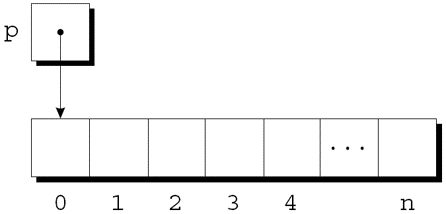

---
presentation:
  margin: 0
  center: false
  transition: "convex"
  enableSpeakerNotes: true
  slideNumber: "c/t"
  navigationMode: "linear"
---

@import "../css/font-awesome-4.7.0/css/font-awesome.css"
@import "../css/theme/solarized.css"
@import "../css/logo.css"
@import "../css/font.css"
@import "../css/color.css"
@import "../css/margin.css"
@import "../css/table.css"
@import "../css/main.css"
@import "../plugin/zoom/zoom.js"
@import "../plugin/customcontrols/plugin.js"
@import "../plugin/customcontrols/style.css"
@import "../plugin/chalkboard/plugin.js"
@import "../plugin/chalkboard/style.css"
@import "../plugin/menu/menu.js"
@import "../js/anychart/anychart-core.min.js"
@import "../js/anychart/anychart-venn.min.js"
@import "../js/anychart/pastel.min.js"
@import "../js/anychart/venn-ml.js"
@import "https://cdn.bootcdn.net/ajax/libs/jquery/3.5.0/jquery.js"

<!-- slide data-notes="" -->

<div class="bottom20"></div>

# 智能程序设计（C语言）

<hr class="width50 center">

## 动态内存管理

<div class="bottom8"></div>

### 计算机学院 &nbsp;&nbsp; 杨已彪

#### [yangyibiao@nju.edu.cn](mailto:yangyibiao@nju.edu.cn)


<!-- slide data-notes="" -->

##### 提纲

---

- 为什么需要动态内存

- malloc / calloc / realloc / free

- 空指针与悬空指针

- 案例: 动态字符串与动态数组

---


<!-- slide data-notes="" -->


##### 动态存储分配

---

动态存储分配最常用于字符串、数组和结构. 

动态分配的结构可以链接形成链表、树和其他数据结构. 

动态存储分配是通过调用内存分配函数来完成的.


<stdlib.h>头文件声明了三个内存分配函数: 

- malloc — 分配内存块, 但不对其进行初始化. 

- calloc — 分配内存块并进行清零. 

- realloc — 调整先前分配的内存块的大小. 

这些函数返回一个`void *`类型的值(一个“通用”指针).

---


<!-- slide data-notes="" -->


##### 空指针

---

<div style="display:flex;align-items:flex-start;gap:24px;">

<div style="flex:1.3;font-size:0.6em;">

```C{.line-numbers}
p = malloc(10000);
if (p == NULL) {
 /* allocation failed; take appropriate action */
}
```

```C{.line-numbers}
if ((p = malloc(10000)) == NULL) {
  /* allocation failed; take appropriate action */
}
```

```C{.line-numbers}
if (p == NULL) …
if (!p) …

if (p != NULL) …
if (p) …
```

</div>

<div style="flex:1;">

如果内存分配函数找不到请求大小的内存块, 则返回**空指针**. 

空指针是可以与所有有效指针区分开来的特殊值. 

在将函数的返回值存储在指针变量中之后, 需要判断它是否为空指针.


malloc的返回值的示例:

NULL是一个表示空指针的宏(在各种库头文件中定义). 

一些程序员将malloc的调用与NULL测试结合起来:

指针以与数字相同的方式测试真假. 

所有非空指针都为真; 只有空指针是假的.

语句1-2等价, 4-5等价

</div>

</div>

<!-- slide data-notes="" -->


##### 动态分配字符串

---

<div style="display:flex;align-items:flex-start;gap:24px;">

<div style="flex:1.3;font-size:0.6em;">

```C{.line-numbers}
char *p;
p = malloc(n + 1);
```

```C
p = (char *) malloc(n + 1);
```

</div>

<div style="flex:1;">

动态存储分配常用于处理字符串. 

若字符串存储在字符数组中, 很难预测数组需要的长度. 

动态分配字符串, 则允许在程序运行时决定长度. 


---

malloc函数的原型: 

`void *malloc(size_t size);`

malloc分配size个字节的内存块并返回一个指向它的(类型为void*)指针. 

size_t是库中定义的无符号整数类型.


为n个字符的字符串分配内存的malloc调用:

每个字符需要一个字节的内存; 加1是为空字符留出空间. 

一些程序员更喜欢强制转换malloc的返回值:

malloc分配的内存不需要清零, 因此p将指向带有n+1个字符的未初始化的数组: 

<div class="top-2">
  
</div>

</div>

</div>

<!-- slide data-notes="" -->


##### 在字符串函数中使用动态存储分配

---

<div style="display:flex;align-items:flex-start;gap:24px;">

<div style="flex:1.3;font-size:0.6em;">

```C{.line-numbers}
/* 
 * two macros defined in <stdlib.h>
 * #define EXIT_SUCCESS 0
 * #define EXIT_FAILURE 1
 */
char *concat(const char *s1, const char *s2)
{
  char *result;

  result = malloc(strlen(s1) + strlen(s2) + 1);
  if (result == NULL) {
    printf("Error: malloc failed in concat\n");
    exit(EXIT_FAILURE); // 等价于 exit(1);
  }

  strcpy(result, s1);
  strcat(result, s2);
  return result;
}
```

</div>

<div style="flex:1;">

动态存储分配使得编写返回指向新字符串的指针成为可能. 

编写一个函数, 连接两个字符串而不更改任何一个字符串. 

该函数先计算要拼接的两个字符串的长度, 然后调用malloc为结果分配适量的空间.


</div>

</div>

<!-- slide data-notes="" -->


##### 动态分配数组

---

<div style="display:flex;align-items:flex-start;gap:24px;">

<div style="flex:1.3;font-size:0.6em;">

```C
int *a;
a = malloc(n * sizeof(int)); 
// int *a = (int *) malloc(n * sizeof(int));
```

```C{.line-numbers}
for (i = 0; i < n; i++)
  a[i] = 0;
```

</div>

<div style="flex:1;">

动态分配的数组与动态分配的字符串具有相同的优点, 动态分配的数组和普通数组一样易于使用. 

可以使用`malloc`为数组分配空间, 也可以使用`calloc`函数, 后者会初始化它分配的内存. 

`realloc`函数允许我们根据需要使数组==扩展==或==缩减==. 


---

假设需要一个包含n个整数的数组, n是在程序运行期间计算的. 

先声明一个指针变量, 依据n, 调用malloc为数组分配空间:

始终使用sizeof运算符来计算每个元素所需的空间量.


一旦a指向动态分配的内存块, 就可以将指针a用作数组名称. 

例如, 可以使用以下循环来初始化a指向的数组:

还可以选择使用指针算术运算代替取下标来访问数组的元素.

</div>

</div>

<!-- slide data-notes="" -->


##### calloc 函数

---

<div style="display:flex;align-items:flex-start;gap:24px;">

<div style="flex:1.2;font-size:0.6em;">

```C
struct point { int x, y; } *p;

p = calloc(1, sizeof(struct point));
```

</div>

<div style="flex:1;">

calloc函数是malloc的替代方法. 

calloc的原型: 

`void *calloc(size_t nmemb, size_t size);`

calloc的规则: 

- 为nmemb个元素的数组分配空间, 每个元素的长度都是size个字节. 

- 如果请求的空间不可用, 则返回空指针. 

- 通过将所有位设置为0来初始化分配的内存.


为n个整数的数组分配空间的calloc调用: 

`a = calloc(n, sizeof(int));`

以1作为第一个参数调用calloc, 可为任何类型数据项分配空间:


</div>

</div>

<!-- slide data-notes="" -->


##### realloc 函数

---

<div style="display:flex;align-items:flex-start;gap:24px;">

<div style="flex:1.3;font-size:0.6em;">


</div>

<div style="flex:1;">

realloc函数可以调整动态分配的数组的大小. 

realloc的原型: 

`void *realloc(void *ptr, size_t size);`

ptr必须指向通过先前调用malloc、calloc或realloc获得的内存块. 

size表示块的新大小, 可能大于或小于原始大小.


realloc的规则: 

- 当扩展内存块时, realloc不会初始化添加到块中的字节. 

- 如果realloc不能按要求扩大内存块, 则返回空指针; 旧内存块中的数据不变. 

- 如果realloc被调用时以空指针作为其第一个参数, 它的行为类似于malloc. 

- 如果realloc被调用时以0作为第二个参数, 它会释放内存块.


我们期望realloc相当有效: 

- 当被要求减小内存块的大小时, realloc应该"在原先的内存块上"直接缩减. 

- 同理, 扩大内存块时realloc也不应该移动它. 

如果不能扩大一个块, realloc会在别处分配一个新块, 然后将旧块的内容复制到新块中. 

一旦realloc返回, 一定要更新所有指向内存块的指针, 以防内存块被移动.

</div>

</div>

<!-- slide data-notes="" -->


##### 释放存储空间: free

---

free原型: 

`void free(void *ptr);`

向free传递一个指向不需要的内存块的指针: 

```C{.line-numbers}
p = malloc(…);
q = malloc(…);
free(p);
p = q;
```

调用free会释放p指向的内存块.

---


<!-- slide data-notes="" -->


##### "悬空指针"问题

---

使用free会导致一个新问题: **悬空指针**. 

`free(p)`释放p指向的内存块, 但不改变p本身. 

如果我们忘记了p不再指向一个有效的内存块, 可能会出现混乱: 

```C{.line-numbers}
char *p = malloc(4);
…
free(p);
…
strcpy(p, "abc");   /*** WRONG ***/
```

修改p指向的内存是一个严重的错误.


悬空指针很难被发现, 因为几个指针可能指向同一个内存块. 

当块被释放时, 所有的指针都悬空.

---


<!-- slide data-notes="" -->

##### 课堂小测

---

1. `int *p = malloc(sizeof(int) * 10);` 分配了多大的内存？用完必须做什么？

2. `malloc` 失败时返回什么？为什么要检查它？

3. `free(p)` 之后还能用 p 吗？为什么？应该把 p 置成什么？

4. `calloc` 与 `malloc` 的区别是什么？

---


<!-- slide data-notes="" -->

#####

---

<div class="bottom20"></div>

# 周三见!

<hr class="width50 center">

## 未完待续

---


