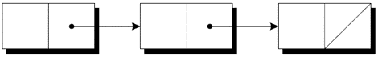
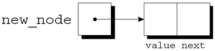
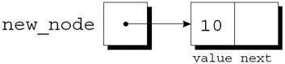
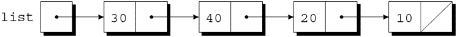
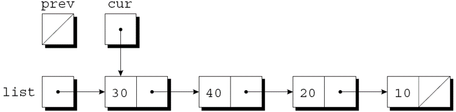

---
presentation:
  margin: 0
  center: false
  transition: "convex"
  enableSpeakerNotes: true
  slideNumber: "c/t"
  navigationMode: "linear"
---

@import "../css/font-awesome-4.7.0/css/font-awesome.css"
@import "../css/theme/solarized.css"
@import "../css/logo.css"
@import "../css/font.css"
@import "../css/color.css"
@import "../css/margin.css"
@import "../css/table.css"
@import "../css/main.css"
@import "../plugin/zoom/zoom.js"
@import "../plugin/customcontrols/plugin.js"
@import "../plugin/customcontrols/style.css"
@import "../plugin/chalkboard/plugin.js"
@import "../plugin/chalkboard/style.css"
@import "../plugin/menu/menu.js"
@import "../js/anychart/anychart-core.min.js"
@import "../js/anychart/anychart-venn.min.js"
@import "../js/anychart/pastel.min.js"
@import "../js/anychart/venn-ml.js"
@import "https://cdn.bootcdn.net/ajax/libs/jquery/3.5.0/jquery.js"

<!-- slide data-notes="" -->

<div class="bottom20"></div>

# 智能程序设计（C语言）

<hr class="width50 center">

## 链表

<div class="bottom8"></div>

### 计算机学院 &nbsp;&nbsp; 杨已彪

#### [yangyibiao@nju.edu.cn](mailto:yangyibiao@nju.edu.cn)


<!-- slide data-notes="" -->

##### 提纲

---

- 链表: 结点 + 指针串起来

- 声明结点类型与创建结点

- 插入、搜索、删除

- 案例: 零件数据库(改进版)

---


<!-- slide data-notes="" -->


##### 链表

---

动态存储分配对于构建链表、树、图形和其他链接数据结构特别有用. 

**链表**由一系列结构(称为**结点**)组成, 每个结点都包含指向链中下一个结点的指针: 
<div class="top-2">
    
</div>

链表中的最后一个结点包含一个空指针. 


---

链表比数组更灵活: 我们可以轻松地在链表中插入和删除结点, 允许链表按需扩大和缩小. 

另一方面, 我们失去了数组的"随机访问"能力: 

- 可以在相同的时间内访问数组的任何元素. 

- 如果结点靠近链表的开头, 则访问链表中的结点很快, 如果靠近链表的尾端, 则访问速度较慢.

---


<!-- slide data-notes="" -->


##### 声明结点类型

---

要建立一个链表, 首先需要一个代表单个结点的结构. 

结点结构将包含数据(在本例中为整数)以及指向链表中下一个结点的指针: 
```C{.line-numbers}
struct node {
  int value;          /* data stored in the node  */
  struct node *next;  /* pointer to the next node */
};
```

node必须是结构标记, 而不是typedef名称, 否则将无法声明next的类型.


接下来, 需要一个始终指向链表中第一个结点的变量: 

`struct node *first = NULL;`

将first设置为NULL表示链表最初为空.

---


<!-- slide data-notes="" -->


##### 创建结点

---

<div style="display:flex;align-items:flex-start;gap:24px;">

<div style="flex:1.2;font-size:0.6em;">


</div>

<div style="flex:1;">

构建链表时, 需要逐个创建结点, 并添加到链表中. 

创建结点的步骤: 

- 为结点分配内存. 

- 在结点中存储数据. 

- 将结点插入到链表中. 

现在集中介绍前两个步骤.


创建结点时, 需要一个临时指向该结点的变量: 

`struct node *new_node;`

用malloc为新结点分配内存, 将返回值保存在new_node中: 

`new_node = malloc(sizeof(struct node));`

new_node现在指向一个刚好足以容纳结点结构体的内存块: 

<div class="top-2">
  
</div>


接下来, 将数据存储在新结点的value成员中: 
`(*new_node).value = 10;`

赋值后: 
<div class="top-2">
  
</div>

`*new_node`周围的括号是强制要求的, 因为.运算符优先于*运算符.

</div>

</div>

<!-- slide data-notes="" -->


##### `->` 运算符

---

为了便于使用指针访问结构体的成员, C提供了名为**右箭头选择(->)**的运算符. 

使用`->`运算符: 

`new_node->value = 10;`

来代替

`(*new_node).value = 10;`


`->`运算符产生一个左值, 可以在任何允许普通变量的地方使用它. 

scanf调用中的示例: 

`scanf("%d", &new_node->value);`

`&`运算符仍然是必需的, 即使new_node是一个指针.

---


<!-- slide data-notes="" -->


##### 链表的开头插入一个结点

---

<div style="display:flex;align-items:flex-start;gap:24px;">

<div style="flex:1.2;font-size:0.6em;">


</div>

<div style="flex:1;">

链表的优点之一是可以在链表中的任何位置添加结点. 

但是, 链表的开头是最容易插入结点的地方. 

假设new_node指向要插入的结点, first指向链表中的第一个结点.


将结点插入链表需要两个语句. 

第一步是修改新结点的成员next, 使其指向之前在链表开头的结点: 

`new_node->next = first;`

第二步是使first指向新结点: 

`first = new_node;`

即使链表为空, 这些语句也有效.


让我们跟踪将两个结点插入一个空链表的过程. 

首先插入一个包含数字10的结点, 然后插入一个包含20的结点.

</div>

</div>

<!-- slide data-notes="" -->


##### 搜索链表

---

<div style="display:flex;align-items:flex-start;gap:24px;">

<div style="flex:1.3;font-size:0.6em;">

```C
for (p = first; p != NULL; p = p->next)
  …
```

```C
struct node *search_list(struct node *list, int n)
{
 struct node *p;

 for (p = list; p != NULL; p = p->next)
   if (p->value == n)
     return p;
 return NULL;
}
```

```C
struct node *search_list(struct node *list, int n)
{
 for (; list != NULL; list = list->next)
   if (list->value == n)
     return list;
 return NULL; 
}
```

</div>

<div style="flex:1;">

虽然while循环也可以搜索链表, 但for语句通常是首选. 

访问链表中结点的循环, 使用指针变量p来跟踪"当前"结点:

这种形式的循环可用于在链表中搜索整数n的函数.


如果找到n, 该函数将返回一个指向包含n的结点的指针; 否则, 它将返回一个空指针. 

该函数的初始版本:

还有很多其他的方法来编写search_list. 

一种替代方法是消除变量p, 用list本身来跟踪当前结点:

由于list是原始链表指针的副本, 因此在函数中更改它没有损害.

</div>

</div>

<!-- slide data-notes="" -->


##### 从链表中删除结点

---

<div style="display:flex;align-items:flex-start;gap:24px;">

<div style="flex:1.3;font-size:0.6em;">

```C
for (cur = list, prev = NULL;
    cur != NULL && cur->value != n;
    prev = cur, cur = cur->next)
  ;
```

</div>

<div style="flex:1;">

将数据存储在链表中的一大优势是我们可以轻松删除结点. 

删除结点包含3个步骤: 

- 找到要删除的结点.

- 更改前一个结点, 使其“绕过”已删除的结点. 

- 调用free回收被删除结点占用的空间. 

第1步比看起来更难, 因为第2步需要更改前一个结点. 

这个问题有多种解决方案.


"追踪指针"技术涉及保持指向前一个结点(prev)的指针以及指向当前结点(cur)的指针. 

假设list指向要搜索的链表, n是要删除的整数. 

实现步骤1的循环:

当循环终止时, cur指向要删除的结点, prev指向前一个结点.


假设链表如下并且n为20: 

<div class="top-2">
  
</div>

执行完`cur = list, prev = NULL`后: 

<div class="top-2">
  
</div>

</div>

</div>

<!-- slide data-notes="" -->


##### 有序链表

---

当链表的结点是有序的——按结点中的数据排序——我们称该链表是**有序链表**. 

向有序链表中插入结点更加困难, 因为结点并不总是放在链表的开头. 

但是搜索会更快: 在到达期望结点应该出现的位置后, 就可以停止查找.

---


<!-- slide data-notes="" -->


##### 程序: 维护零件数据库(改进版)

---

<div style="display:flex;align-items:flex-start;gap:24px;">

<div style="flex:1.5;font-size:0.5em;">

```C{.line-numbers}
struct part {
  int number;
  char name[NAME_LEN+1];
  int on_hand;
  struct part *next;
};
```

</div>

<div style="flex:1;">

*inventory2.c*程序是对第 16 章零件数据库程序的修改, 这次数据库存储在一个链表中. 

使用链表的优点: 

- 无需限制数据库的大小. 

- 数据库可以很容易地按零件编号排序. 

在原始程序中, 数据库没有排序.


part结构将包含一个额外的成员(指向下一个结点的指针):

inventory将指向链表首结点: 

`struct part *inventory = NULL;`


新程序中的大多数函数与原始程序中的版本非常相似. 

find_part和insert会更复杂, 因为将按零件编号对链表inventory中的结点进行排序.

</div>

</div>

<!-- slide data-notes="" -->

##### 课堂小测

---

1. 链表的一个"结点"至少包含哪两部分？

2. `struct node *next;` 中，为什么结构体里能出现指向自己的指针？

3. `p->value` 等价于什么（用 `*` 和 `.` 表示）？

4. 在链表头部插入一个结点，需要改哪几个指针？顺序有什么讲究？

---


<!-- slide data-notes="" -->

#####

---

<div class="top-2">
  
</div>

---


