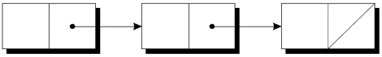

---
presentation:
  margin: 0
  center: false
  transition: "convex"
  enableSpeakerNotes: true
  slideNumber: "c/t"
  navigationMode: "linear"
---

@import "../css/font-awesome-4.7.0/css/font-awesome.css"
@import "../css/theme/solarized.css"
@import "../css/logo.css"
@import "../css/font.css"
@import "../css/color.css"
@import "../css/margin.css"
@import "../css/table.css"
@import "../css/main.css"
@import "../plugin/zoom/zoom.js"
@import "../plugin/customcontrols/plugin.js"
@import "../plugin/customcontrols/style.css"
@import "../plugin/chalkboard/plugin.js"
@import "../plugin/chalkboard/style.css"
@import "../plugin/menu/menu.js"
@import "../js/anychart/anychart-core.min.js"
@import "../js/anychart/anychart-venn.min.js"
@import "../js/anychart/pastel.min.js"
@import "../js/anychart/venn-ml.js"
@import "https://cdn.bootcdn.net/ajax/libs/jquery/3.5.0/jquery.js"

<!-- slide data-notes="" -->

<div class="bottom20"></div>

# C语言程序设计基础

<hr class="width50 center">

## 指针的高级应用


<div class="bottom8"></div>

### 计算机系 &nbsp;&nbsp; 杨已彪

#### yangyibiao@nju.edu.cn


<!-- slide vertical=true data-notes="" -->

##### 提纲

---

- <a href="#/dsa">动态存储分配</a>

- <a href="#/das">动态分配字符串</a>

- <a href="#/daa">动态分配数组</a>

- <a href="#/deallocate">释放存储空间</a>

- <a href="#/linkedlists">链表</a>

- <a href="#/p2p">指向指针的指针</a>

- <a href="#/p2f">指向函数的指针</a>

- <a href="#/restrictedP">受限指针</a>

- <a href="#/fam">灵活数组成员</a>


<!-- slide id="dsa" vertical=true data-notes="" -->

##### 动态存储分配

---

C的数据结构, 包括数组, 通常是固定大小. 

固定大小的数据结构可能会浪费大量内存资源. 

C支持**动态存储分配**: 在程序执行期间分配内存单元的能力. 

使用动态存储分配, 可以设计根据需要扩大(和缩小)的数据结构. 


<!-- slide vertical=true data-notes="" -->

##### 动态存储分配

---

动态存储分配最常用于字符串、数组和结构体. 

动态分配的结构可以链接形成链表、树和其他数据结构. 

动态存储分配是通过调用内存分配函数来完成的. 


<!-- slide vertical=true data-notes="" -->

##### 内存分配函数

---

<stdlib.h>头文件声明了三个内存分配函数: 

- malloc — 分配内存块, 但不对其进行初始化. 

- calloc — 分配内存块并进行清零. 

- realloc — 调整先前分配的内存块的大小. 

这些函数返回一个`void *`类型的值(一个"通用"指针). 


<!-- slide vertical=true data-notes="" -->

##### 空指针

---

如果内存分配函数找不到请求大小的内存块, 则返回**空指针**. 

空指针是可以与所有有效指针区分开来的特殊值. 

在将函数的返回值存储在指针变量中之后, 需要判断它是否为空指针. 


<!-- slide vertical=true data-notes="" -->

##### 空指针

---

malloc的返回值的示例: 
```C{.line-numbers}
p = malloc(10000);
if (p == NULL) {
 /* allocation failed; take appropriate action */
}
```

NULL是一个表示空指针的宏(在各种库头文件中定义). malloc的调用与NULL测试可结合起来: 

```C{.line-numbers}
if ((p = malloc(10000)) == NULL) {
  /* allocation failed; take appropriate action */
}
```

---


<!-- slide vertical=true data-notes="" -->

##### 空指针

---

指针以与数字相同的方式测试真假. 

所有非空指针都为真; 只有空指针是假的. 

```C{.line-numbers}
if (p == NULL) …
if (!p) …

if (p != NULL) …
if (p) …
```

语句1-2等价, 4-5等价


<!-- slide vertical=true data-notes="" -->


##### 动态分配字符串

---

动态存储分配常用于处理字符串. 

若字符串存储在字符数组中, 很难预测数组需要的长度. 

动态分配字符串, 则允许在程序运行时决定长度. 


<!-- slide id="das" vertical=true data-notes="" -->


##### 使用malloc为字符串分配内存

---

malloc函数的原型: 

`void *malloc(size_t size);`

malloc分配size个字节的内存块并返回一个指向它的(类型为void*)指针. 

size_t是库中定义的无符号整数类型. 


<!-- slide vertical=true data-notes="" -->


##### 使用malloc为字符串分配内存

---

为n个字符的字符串分配内存的malloc调用: 

```C{.line-numbers}
char *p;
p = malloc(n + 1);
```

每个字符需要一个字节的内存; 加1是为空字符留出空间. 

一些程序员更喜欢强制转换malloc的返回值: 

```C
p = (char *) malloc(n + 1);
```

---


<!-- slide vertical=true data-notes="" -->


##### 使用malloc为字符串分配内存

---

malloc分配的内存不需要清零, 因此p将指向带有n+1个字符的未初始化的数组: 

<div class="top-2">
  
</div>


<!-- slide vertical=true data-notes="" -->


##### 使用malloc为字符串分配内存

---

调用strcpy是初始化此数组的一种方法: 

```C
strcpy(p, "abc");
```

数组中的前四个字符现在将是a、b、c和`\0`: 
<div class="top-2">
  
</div>

---


<!-- slide vertical=true data-notes="" -->


##### 在字符串函数中使用动态存储分配

---

动态存储分配使得编写返回指向新字符串的指针成为可能. 

编写一个函数, 连接两个字符串而不更改任何一个字符串. 

该函数先计算要拼接的两个字符串的长度, 然后调用malloc为结果分配适量的空间. 


<!-- slide vertical=true data-notes="" -->


##### 在字符串函数中使用动态存储分配

---

```C{.line-numbers}
/* 
 * two macros defined in <stdlib.h>
 * #define EXIT_SUCCESS 0
 * #define EXIT_FAILURE 1
 */
char *concat(const char *s1, const char *s2)
{
  char *result;

  result = malloc(strlen(s1) + strlen(s2) + 1);
  if (result == NULL) {
    printf("Error: malloc failed in concat\n");
    exit(EXIT_FAILURE); // 等价于 exit(1);
  }

  strcpy(result, s1);
  strcat(result, s2);
  return result;
}
```

---


<!-- slide vertical=true data-notes="" -->


##### 在字符串函数中使用动态存储分配

---

调用concat函数: 

```C
char * p = concat("abc", "def");
```

指针p将指向字符串"abcdef", 该字符串存储在动态分配的数组中. 


<!-- slide vertical=true data-notes="" -->


##### 在字符串函数中使用动态存储分配

---

必须小心使用动态分配存储的concat等函数. 

当不再需要concat返回的字符串时, 需要调用==free函数==来`释放`字符串占用的空间. 

否则, 程序最终可能会耗尽内存. 


<!-- slide vertical=true data-notes="" -->


##### 程序: 打印一个月的提醒链表(改进版)

---

*remind2.c*程序基于第13章的*remind.c*程序, 该程序打印一个月的每日提醒链表. 

最初的*remind.c*程序将提醒字符串存储在一个二维字符数组中. 

在新程序中, 存储在元素是指向动态分配字符串指针的一维数组. 


<!-- slide vertical=true data-notes="" -->


##### 程序: 打印一个月的提醒链表(改进版)

---

换成动态分配的字符串的优点: 

- 空间利用更高效: 可为要存储的提醒分配确切字符数量的空间. 

- 无需移动字符串: 不需要为了给新提醒腾出空间而调用strcpy来移动现有字符串. 

从二维数组切换到指针数组只需要更改程序的八行. 


<!-- slide vertical=true data-notes="" -->


##### remind2.c

---

```C{.line-numbers}
/* Prints a one-month reminder list (dynamic string version) */
 
#include <stdio.h>
#include <stdlib.h>                                 /* 1 */
#include <string.h>
 
#define MAX_REMIND 50   /* maximum number of reminders */
#define MSG_LEN 60      /* max length of reminder message */
 
int read_line(char str[], int n);
int main(void)
{
  char *reminders[MAX_REMIND];                      /* 2 */
  char day_str[3], msg_str[MSG_LEN+1];
  int day, i, j, num_remind = 0;

  for (;;) {
    if (num_remind == MAX_REMIND) {
      printf("-- No space left --\n");
      break;
    }
 
    printf("Enter day and reminder: ");
    scanf("%2d", &day);
    if (day == 0)
      break;
    sprintf(day_str, "%2d", day);
    read_line(msg_str, MSG_LEN);
 
    for (i = 0; i < num_remind; i++)
      if (strcmp(day_str, reminders[i]) < 0)
        break;
    for (j = num_remind; j > i; j--)
      reminders[j] = reminders[j-1];                 /* 3 */
    
    reminders[i] = malloc(2 + strlen(msg_str) + 1);  /* 4 */
    if (reminders[i] == NULL) {                      /* 5 */
      printf("-- No space left --\n");               /* 6 */
      break;                                         /* 7 */
    }                                                /* 8 */
 
    strcpy(reminders[i], day_str);
    strcat(reminders[i], msg_str);
 
    num_remind++;
  }
 
  printf("\nDay Reminder\n");
  for (i = 0; i < num_remind; i++)
    printf(" %s\n", reminders[i]);
 
  return 0;
}

int read_line(char str[], int n)
{
  int ch, i = 0;
 
  while ((ch = getchar()) != '\n')
    if (i < n)
      str[i++] = ch;
  str[i] = '\0';
  return i;
}
```

---


<!-- slide vertical=true data-notes="" -->


##### 动态分配数组

---

动态分配的数组与动态分配的字符串具有相同的优点, 动态分配的数组和普通数组一样易于使用. 

可以使用`malloc`为数组分配空间, 也可以使用`calloc`函数, 后者会初始化它分配的内存. 

`realloc`函数允许我们根据需要使数组==扩展==或==缩减==. 


<!-- slide id="daa" vertical=true data-notes="" -->


##### 使用malloc为数组分配存储空间

---

假设需要一个包含n个整数的数组, n是在程序运行期间计算的. 

先声明一个指针变量, 依据n, 调用malloc为数组分配空间: 

```C
int *a;
a = malloc(n * sizeof(int)); 
// int *a = (int *) malloc(n * sizeof(int));
```

始终使用sizeof运算符来计算每个元素所需的空间量. 


<!-- slide vertical=true data-notes="" -->


##### 使用malloc为数组分配存储空间

---

一旦a指向动态分配的内存块, 就可以将指针a用作数组名称. 

例如, 可以使用以下循环来初始化a指向的数组: 

```C{.line-numbers}
for (i = 0; i < n; i++)
  a[i] = 0;
```

还可以选择使用指针算术运算代替取下标来访问数组的元素. 


<!-- slide vertical=true data-notes="" -->


##### calloc函数

---

calloc函数是malloc的替代方法. 

calloc的原型: 

`void *calloc(size_t nmemb, size_t size);`

calloc的规则: 

- 为nmemb个元素的数组分配空间, 每个元素的长度都是size个字节. 

- 如果请求的空间不可用, 则返回空指针. 

- 通过将所有位设置为0来初始化分配的内存. 


<!-- slide vertical=true data-notes="" -->


##### calloc函数

---

为n个整数的数组分配空间的calloc调用: 

`a = calloc(n, sizeof(int));`

以1作为第一个参数调用calloc, 可为任何类型数据项分配空间: 

```C
struct point { int x, y; } *p;

p = calloc(1, sizeof(struct point));
```

---


<!-- slide vertical=true data-notes="" -->


##### realloc函数

---

realloc函数可以调整动态分配的数组的大小. 

realloc的原型: 

`void *realloc(void *ptr, size_t size);`

ptr必须指向通过先前调用malloc、calloc或realloc获得的内存块. 

size表示块的新大小, 可能大于或小于原始大小. 


<!-- slide vertical=true data-notes="" -->


##### realloc函数

---

realloc的规则: 

- 当扩展内存块时, realloc不会初始化添加到块中的字节. 

- 如果realloc不能按要求扩大内存块, 则返回空指针; 旧内存块中的数据不变. 

- 如果realloc被调用时以空指针作为其第一个参数, 它的行为类似于malloc. 

- 如果realloc被调用时以0作为第二个参数, 它会释放内存块. 


<!-- slide vertical=true data-notes="" -->


##### realloc函数

---

我们期望realloc相当有效: 

- 当被要求减小内存块的大小时, realloc应该"在原先的内存块上"直接缩减. 

- 同理, 扩大内存块时realloc也不应该移动它. 

如果不能扩大一个块, realloc会在别处分配一个新块, 然后将旧块的内容复制到新块中. 

一旦realloc返回, 一定要更新所有指向内存块的指针, 以防内存块被移动. 


<!-- slide vertical=true data-notes="" -->


##### 释放存储空间

---

malloc和其他内存分配函数从称为**堆**的存储池中获取内存块. 

过于频繁地调用这些函数(或者向它们请求大块内存)会耗尽堆, 导致函数返回空指针. 

更糟糕的是, 程序可能会分配内存块然后失去对它们的跟踪, 从而浪费空间. 


<!-- slide id="deallocate" vertical=true data-notes="" -->


##### 释放存储空间

---

例子: 

```C{.line-numbers}
p = malloc(…);
q = malloc(…);
p = q;
```

前两条语句执行后: 

<div class="top-2">
  
</div>

---


<!-- slide vertical=true data-notes="" -->

##### 动态存储分配

---

将q分配给p后, 两个变量现在都指向第二个内存块: 

<div class="top-2">
  
</div>

没有指向第一个块的指针, 因此再也不能使用它了. 


<!-- slide vertical=true data-notes="" -->

##### 释放存储

---

程序不可再访问到的内存块被称为**垃圾**. 

留有垃圾的程序存在**内存泄漏**. 

一些语言提供了自动定位和回收垃圾的**垃圾收集器**, 但 C 没有. 

需要用free函数释放不需要的内存来回收自己的垃圾. 


<!-- slide vertical=true data-notes="" -->

##### free函数

---

free原型: 

`void free(void *ptr);`

向free传递一个指向不需要的内存块的指针: 

```C{.line-numbers}
p = malloc(…);
q = malloc(…);
free(p);
p = q;
```

调用free会释放p指向的内存块. 


<!-- slide vertical=true data-notes="" -->

##### "悬空指针"问题

---

使用free会导致一个新问题: **悬空指针**. 

`free(p)`释放p指向的内存块, 但不改变p本身. 

如果我们忘记了p不再指向一个有效的内存块, 可能会出现混乱: 

```C{.line-numbers}
char *p = malloc(4);
…
free(p);
…
strcpy(p, "abc");   /*** WRONG ***/
```

修改p指向的内存是一个严重的错误. 


<!-- slide vertical=true data-notes="" -->

##### "悬空指针"问题

---

悬空指针很难被发现, 因为几个指针可能指向同一个内存块. 

当块被释放时, 所有的指针都悬空. 


<!-- slide vertical=true data-notes="" -->

##### 链表

---

动态存储分配对于构建链表、树、图形和其他链接数据结构特别有用. 

**链表**由一系列结构(称为**结点**)组成, 每个结点都包含指向链中下一个结点的指针: 
<div class="top-2">
    
</div>

链表中的最后一个结点包含一个空指针. 


<!-- slide id="linkedlists" vertical=true data-notes="" -->

##### 链表

---

链表比数组更灵活: 我们可以轻松地在链表中插入和删除结点, 允许链表按需扩大和缩小. 

另一方面, 我们失去了数组的"随机访问"能力: 

- 可以在相同的时间内访问数组的任何元素. 

- 如果结点靠近链表的开头, 则访问链表中的结点很快, 如果靠近链表的尾端, 则访问速度较慢. 


<!-- slide vertical=true data-notes="" -->

##### 声明结点类型

---

要建立一个链表, 首先需要一个代表单个结点的结构. 

结点结构将包含数据(在本例中为整数)以及指向链表中下一个结点的指针: 
```C{.line-numbers}
struct node {
  int value;          /* data stored in the node  */
  struct node *next;  /* pointer to the next node */
};
```

node必须是结构标记, 而不是typedef名称, 否则将无法声明next的类型. 


<!-- slide vertical=true data-notes="" -->

##### 声明结点类型

---

接下来, 需要一个始终指向链表中第一个结点的变量: 

`struct node *first = NULL;`

将first设置为NULL表示链表最初为空. 


<!-- slide vertical=true data-notes="" -->

##### 创建结点

---

构建链表时, 需要逐个创建结点, 并添加到链表中. 

创建结点的步骤: 

- 为结点分配内存. 

- 在结点中存储数据. 

- 将结点插入到链表中. 

现在集中介绍前两个步骤. 


<!-- slide vertical=true data-notes="" -->

##### 创建结点

---

创建结点时, 需要一个临时指向该结点的变量: 

`struct node *new_node;`

用malloc为新结点分配内存, 将返回值保存在new_node中: 

`new_node = malloc(sizeof(struct node));`

new_node现在指向一个刚好足以容纳结点结构体的内存块: 

<div class="top-2">
  
</div>

---


<!-- slide vertical=true data-notes="" -->

##### 创建结点

---

接下来, 将数据存储在新结点的value成员中: 
`(*new_node).value = 10;`

赋值后: 
<div class="top-2">
  
</div>

`*new_node`周围的括号是强制要求的, 因为.运算符优先于*运算符. 


<!-- slide vertical=true data-notes="" -->


##### `->`运算符

---

为了便于使用指针访问结构体的成员, C提供了名为**右箭头选择(->)**的运算符. 

使用`->`运算符: 

`new_node->value = 10;`

来代替

`(*new_node).value = 10;`


<!-- slide vertical=true data-notes="" -->

##### `->`运算符

---

`->`运算符产生一个左值, 可以在任何允许普通变量的地方使用它. 

scanf调用中的示例: 

`scanf("%d", &new_node->value);`

`&`运算符仍然是必需的, 即使new_node是一个指针. 


<!-- slide vertical=true data-notes="" -->

##### 链表的开头插入一个结点

---

链表的优点之一是可以在链表中的任何位置添加结点. 

但是, 链表的开头是最容易插入结点的地方. 

假设new_node指向要插入的结点, first指向链表中的第一个结点. 


<!-- slide vertical=true data-notes="" -->

##### 链表的开头插入一个结点

---

将结点插入链表需要两个语句. 

第一步是修改新结点的成员next, 使其指向之前在链表开头的结点: 

`new_node->next = first;`

第二步是使first指向新结点: 

`first = new_node;`

即使链表为空, 这些语句也有效. 


<!-- slide vertical=true data-notes="" -->

##### 链表的开头插入一个结点

---

让我们跟踪将两个结点插入一个空链表的过程. 

首先插入一个包含数字10的结点, 然后插入一个包含20的结点. 


<!-- slide vertical=true data-notes="" -->

##### 链表的开头插入一个结点

---

```C
first = NULL;
```

<div class="top-2">
  
</div>

```C
new_node = malloc(sizeof(struct node));
```

<div class="top-2">
  
</div>

---


<!-- slide vertical=true data-notes="" -->

##### 链表的开头插入一个结点

---

```C
new_node->value = 10;
```

<div class="top-2">
  
</div>

```C
new_node->next = first;
```

<div class="top-2">
  
</div>

---


<!-- slide vertical=true data-notes="" -->

##### 链表的开头插入一个结点

---

```C
first = new_node;
```

<div class="top-2">
  
</div>

```C
new_node = malloc(sizeof(struct node));
```

<div class="top-2">
  
</div>

---


<!-- slide vertical=true data-notes="" -->

##### 链表的开头插入一个结点

---

```C
new_node->value = 20;
```

<div class="top-2">
  
</div>

```C
new_node->next = first;
```

<div class="top-2">
  
</div>

---


<!-- slide vertical=true data-notes="" -->

##### 链表的开头插入一个结点

---

```C
first = new_node;
```

<div class="top-2">
  
</div>

---


<!-- slide vertical=true data-notes="" -->

##### 链表的开头插入一个结点

---

将包含n的结点插入到链表中的函数, 该链表由list指向: 

```C{.line-numbers}
struct node *add_to_list(struct node *list, int n)
{
  struct node *new_node;

  new_node = malloc(sizeof(struct node));
  if (new_node == NULL) {
    printf("Error: malloc failed in add_to_list\n");
    exit(EXIT_FAILURE);
  }
  new_node->value = n;
  new_node->next = list;
  return new_node;
}
```

---


<!-- slide vertical=true data-notes="" -->

##### 链表的开头插入一个结点

---

请注意, add_to_list返回一个指向新创建结点的指针(现在位于链表的开头). 

当我们调用add_to_list时, 我们需要将其返回值存储到first中: 

```C
first = add_to_list(first, 10);
first = add_to_list(first, 20);
```

用add_to_list直接更新first, 而不是返回first的新值, 这样做是个技巧. 


<!-- slide vertical=true data-notes="" -->

##### 链表的开头插入一个结点

---

使用add_to_list创建包含用户输入数字的链表的函数: 

```C{.line-numbers}
struct node *read_numbers(void)
{
  struct node *first = NULL;
  int n;

  printf("Enter a series of integers (0 to terminate): ");
  for (;;) {
    scanf("%d", &n);
    if (n == 0)
      return first;
    first = add_to_list(first, n);
  }
}
```

这些数字将在链表中以相反的顺序排列. 


<!-- slide vertical=true data-notes="" -->

##### 搜索链表

---

虽然while循环也可以搜索链表, 但for语句通常是首选. 

访问链表中结点的循环, 使用指针变量p来跟踪"当前"结点: 

```C
for (p = first; p != NULL; p = p->next)
  …
```

这种形式的循环可用于在链表中搜索整数n的函数. 


<!-- slide vertical=true data-notes="" -->

##### 搜索链表

---

如果找到n, 该函数将返回一个指向包含n的结点的指针; 否则, 它将返回一个空指针. 

该函数的初始版本: 
```C
struct node *search_list(struct node *list, int n)
{
 struct node *p;

 for (p = list; p != NULL; p = p->next)
   if (p->value == n)
     return p;
 return NULL;
}
```

--


<!-- slide vertical=true data-notes="" -->


##### 搜索链表

---

还有很多其他的方法来编写search_list. 

一种替代方法是消除变量p, 用list本身来跟踪当前结点: 
```C
struct node *search_list(struct node *list, int n)
{
 for (; list != NULL; list = list->next)
   if (list->value == n)
     return list;
 return NULL; 
}
```

由于list是原始链表指针的副本, 因此在函数中更改它没有损害. 

<!-- slide vertical=true data-notes="" -->


##### 搜索链表

---

另一种选择: 
```C
struct node *search_list(struct node *list, int n)
{
 for (; list != NULL && list->value != n;
        list = list->next)
   ;
 return list; 
}
```

因为到达链表末尾处时list为NULL, 所以即使找不到n, 返回list也是正确的. 

<!-- slide vertical=true data-notes="" -->


##### 搜索链表

---

如果使用while语句, 这个版本的search_list可能会更清晰一些: 
```C
struct node *search_list(struct node *list, int n)
{
  while (list != NULL && list->value != n)
    list = list->next;
  return list;
}
```

---


<!-- slide vertical=true data-notes="" -->

##### 从链表中删除结点

---

将数据存储在链表中的一大优势是我们可以轻松删除结点. 

删除结点包含3个步骤: 

- 找到要删除的结点.

- 更改前一个结点, 使其“绕过”已删除的结点. 

- 调用free回收被删除结点占用的空间. 

第1步比看起来更难, 因为第2步需要更改前一个结点. 

这个问题有多种解决方案. 


<!-- slide vertical=true data-notes="" -->

##### 从链表中删除结点

---

"追踪指针"技术涉及保持指向前一个结点(prev)的指针以及指向当前结点(cur)的指针. 

假设list指向要搜索的链表, n是要删除的整数. 

实现步骤1的循环: 
```C
for (cur = list, prev = NULL;
    cur != NULL && cur->value != n;
    prev = cur, cur = cur->next)
  ;
```

当循环终止时, cur指向要删除的结点, prev指向前一个结点. 


<!-- slide vertical=true data-notes="" -->

##### 从链表中删除结点

---

假设链表如下并且n为20: 

<div class="top-2">
  
</div>

执行完`cur = list, prev = NULL`后: 

<div class="top-2">
  
</div>

<!-- slide vertical=true data-notes="" -->


##### 从链表中删除结点

---

判定表达式`cur != NULL && cur->value != n`为真, 因为cur指向一个结点且该结点不包含20. 

执行完`prev = cur, cur = cur->next`后: 
<div class="top-2">
  
</div>

<!-- slide vertical=true data-notes="" -->


##### 从链表中删除结点

---

判定表达式`cur != NULL && cur->value != n`再次为真, 所以再次执行`prev = cur`, `cur = cur->next`: 
<div class="top-2">
  
</div>

由于cur现在指向包含20的结点, 条件`cur->value != n`为假, 循环终止. 


<!-- slide vertical=true data-notes="" -->

##### 从链表中删除结点

---

接下来, 执行第 2 步所需的绕过. 

语句
`prev->next = cur->next;`

使前一个结点中的指针指向当前结点后面的结点: 

<div class="top-2">
  
</div>


<!-- slide vertical=true data-notes="" -->

##### 从链表中删除结点

---

第 3 步, 释放当前结点占用的内存: 
`free(cur);`

---


<!-- slide vertical=true data-notes="" -->

##### 从链表中删除结点

---

delete_from_list函数使用刚刚概述的策略. 

当给定链表和整数n时, 该函数删除包含n的第一个结点. 

如果没有结点包含n, delete_from_list什么也不做. 

无论哪种情况, 该函数都会返回一个指向链表的指针. 

删除链表中的首结点是一种特殊情况, 需要不同的绕过步骤. 


<!-- slide vertical=true data-notes="" -->

##### 从链表中删除结点

---

```C{.line-numbers}
struct node *delete_from_list(struct node *list, int n)
{
  struct node *cur, *prev;

  for (cur = list, prev = NULL;
       cur != NULL && cur->value != n;
       prev = cur, cur = cur->next)
    ;
  if (cur == NULL) 
    return list;             /* n was not found */
  if (prev == NULL)
    list = list->next;       /* n is in the first node */
  else
    prev->next = cur->next;  /* n is in some other node */
  free(cur);
  return list;
}
```

---

<!-- slide vertical=true data-notes="" -->

##### 有序链表

---

当链表的结点是有序的——按结点中的数据排序——我们称该链表是**有序链表**. 

向有序链表中插入结点更加困难, 因为结点并不总是放在链表的开头. 

但是搜索会更快: 在到达期望结点应该出现的位置后, 就可以停止查找. 


<!-- slide vertical=true data-notes="" -->

##### 程序: 维护零件数据库(改进版)

---

*inventory2.c*程序是对第 16 章零件数据库程序的修改, 这次数据库存储在一个链表中. 

使用链表的优点: 

- 无需限制数据库的大小. 

- 数据库可以很容易地按零件编号排序. 

在原始程序中, 数据库没有排序. 


<!-- slide vertical=true data-notes="" -->

##### 程序: 维护零件数据库(改进版)

---

part结构将包含一个额外的成员(指向下一个结点的指针): 

```C{.line-numbers}
struct part {
  int number;
  char name[NAME_LEN+1];
  int on_hand;
  struct part *next;
};
```

inventory将指向链表首结点: 

`struct part *inventory = NULL;`


<!-- slide vertical=true data-notes="" -->

##### 程序: 维护零件数据库(改进版)

---

新程序中的大多数函数与原始程序中的版本非常相似. 

find_part和insert会更复杂, 因为将按零件编号对链表inventory中的结点进行排序. 


<!-- slide vertical=true data-notes="" -->

##### 程序: 维护零件数据库(改进版)

---

在原始程序中, find_part返回数组inventory的索引. 

在新程序中, find_part将返回一个指向包含所需零件编号的结点的指针. 

如果没有找到该零件编号, find_part将返回一个空指针. 


<!-- slide vertical=true data-notes="" -->

##### 程序: 维护零件数据库(改进版)

---

由于链表inventory已排序, 因此find_part可以在找到包含大于或等于所需零件编号的结点时停止. 

find_part的搜索循环: 
```C
for (p = inventory;
     p != NULL && number > p->number;
     p = p->next)
  ;
```

当循环终止时, 需要测试是否找到了该零件: 

```C
if (p != NULL && number == p->number)
  return p;
```

---


<!-- slide vertical=true data-notes="" -->

##### 程序: 维护零件数据库(改进版)

---

原始版本的insert将新零件存储在下一个可用数组元素中. 

新版本必须确定新零件在链表中的位置并将其插入到那里. 

它还要检查零件编号是否已存在于链表中. 

完成这两项任务的循环: 

```C
for (cur = inventory, prev = NULL;
     cur != NULL && new_node->number > cur->number;
     prev = cur, cur = cur->next)
  ;
```

---


<!-- slide vertical=true data-notes="" -->

##### 程序: 维护零件数据库(改进版)

---

一旦循环终止, insert将检查cur是否不为NULL, 以及new_node->number是否等于cur->number. 

- 如果两者都为真, 则零件编号已在链表中. 

- 否则, insert将在prev和cur指向的结点之间插入一个新结点. 

即使新零件的编号大于链表中的任何编号, 此策略也有效. 

和原程序一样, 这个版本需要第 16 章的read_line函数. 


<!-- slide vertical=true data-notes="" -->

##### *inventory2.c*

---

```C{.line-numbers}
/* Maintains a parts database (linked list version) */
 
#include <stdio.h>
#include <stdlib.h>
#include "readline.h"
#define NAME_LEN 25
 
struct part {
  int number;
  char name[NAME_LEN+1];
  int on_hand;
  struct part *next;
};
 
struct part *inventory = NULL;   /* points to first part */
 
struct part *find_part(int number);
void insert(void);
void search(void);
void update(void);
void print(void);

/********************************************************** 
 * main: Prompts the user to enter an operation code,     * 
 *       then calls a function to perform the requested   * 
 *       action. Repeats until the user enters the        * 
 *       command 'q'. Prints an error message if the user * 
 *       enters an illegal code.                          * 
 **********************************************************/
int main(void)
{
  char code;
 
  for (;;) {
    printf("Enter operation code: ");
    scanf(" %c", &code);
    while (getchar() != '\n')   /* skips to end of line */
      ;
    switch (code) {
      case 'i': insert(); 
                break;
      case 's': search(); 
                break;
      case 'u': update(); 
                break;
      case 'p': print();  
                break;
      case 'q': return 0;
      default:  printf("Illegal code\n");
    }
    printf("\n");
  }
}

/********************************************************** 
 * find_part: Looks up a part number in the inventory     * 
 *            list. Returns a pointer to the node         * 
 *            containing the part number; if the part     * 
 *            number is not found, returns NULL.          * 
 **********************************************************/
struct part *find_part(int number)
{
  struct part *p;
 
  for (p = inventory;
       p != NULL && number > p->number;
       p = p->next)
    ;
  if (p != NULL && number == p->number)
    return p;
  return NULL;
}

/********************************************************** 
 * insert: Prompts the user for information about a new   * 
 *         part and then inserts the part into the        *
 *         inventory list; the list remains sorted by     *
 *         part number. Prints an error message and       * 
 *         returns prematurely if the part already exists * 
 *         or space could not be allocated for the part.  * 
 **********************************************************/
void insert(void)
{
  struct part *cur, *prev, *new_node;
 
  new_node = malloc(sizeof(struct part));
  if (new_node == NULL) {
    printf("Database is full; can't add more parts.\n");
    return;
  }
 
  printf("Enter part number: ");
  scanf("%d", &new_node->number);

 for (cur = inventory, prev = NULL;
      cur != NULL && new_node->number > cur->number;
      prev = cur, cur = cur->next)
    ;
  if (cur != NULL && new_node->number == cur->number) {
    printf("Part already exists.\n");
    free(new_node);
    return;
  }
 
  printf("Enter part name: ");
  read_line(new_node->name, NAME_LEN);
  printf("Enter quantity on hand: ");
  scanf("%d", &new_node->on_hand);
 
  new_node->next = cur;
  if (prev == NULL)
    inventory = new_node;
  else
    prev->next = new_node;
}

/********************************************************** 
 * search: Prompts the user to enter a part number, then  * 
 *         looks up the part in the database. If the part * 
 *         exists, prints the name and quantity on hand;  * 
 *         if not, prints an error message.               * 
 **********************************************************/
void search(void)
{
  int number;
  struct part *p;
 
  printf("Enter part number: ");
  scanf("%d", &number);
  p = find_part(number);
  if (p != NULL) {
    printf("Part name: %s\n", p->name);
    printf("Quantity on hand: %d\n", p->on_hand);
  } else
    printf("Part not found.\n");
}

/********************************************************** 
 * update: Prompts the user to enter a part number.       * 
 *         Prints an error message if the part doesn't    * 
 *         exist; otherwise, prompts the user to enter    * 
 *         change in quantity on hand and updates the     * 
 *         database.                                      * 
 **********************************************************/
void update(void)
{
  int number, change;
  struct part *p;
 
  printf("Enter part number: ");
  scanf("%d", &number);
  p = find_part(number);
  if (p != NULL) {
    printf("Enter change in quantity on hand: ");
    scanf("%d", &change);
    p->on_hand += change;
  } else
    printf("Part not found.\n");
}

/********************************************************** 
 * print: Prints a listing of all parts in the database,  * 
 *        showing the part number, part name, and         * 
 *        quantity on hand. Part numbers will appear in   * 
 *        ascending order.                                * 
 **********************************************************/
void print(void)
{
  struct part *p;
  printf("Part Number   Part Name                  "
         "Quantity on Hand\n");
  for (p = inventory; p != NULL; p = p->next)
    printf("%7d       %-25s%11d\n", p->number, p->name, p->on_hand);
}
```

---


<!-- slide vertical=true data-notes="" -->

##### 指向指针的指针

---

第 13 章介绍了指向指针的指针的概念. 

"指向指针的指针"的概念也经常出现在链式数据结构中. 

特别是, 当函数的实际参数是指针变量时, 可能会希望函数能够修改变量. 

这样做需要使用指向指针的指针. 


<!-- slide id="p2p" vertical=true data-notes="" -->

##### 指向指针的指针

---

向add_to_list函数传递一个指向原始链表首结点的指针; 它返回一个指向新链表首结点的指针: 

```C{.line-numbers}
struct node *add_to_list(struct node *list, int n)
{
  struct node *new_node;

  new_node = malloc(sizeof(struct node));
  if (new_node == NULL) {
    printf("Error: malloc failed in add_to_list\n");
    exit(EXIT_FAILURE);
  }
  new_node->value = n;
  new_node->next = list;
  return new_node;
}
```

---


<!-- slide vertical=true data-notes="" -->

##### 指向指针的指针

---

如果要修改add_to_list, 把new_node赋值给list, 而不是返回new_node, 这是不起作用的. 

调用函数: 
`add_to_list(first, 10);`

在调用点, first被复制到list中. 

函数可以改变list的值, 使其指向新结点, 但first不受影响. 


<!-- slide vertical=true data-notes="" -->

##### 指向指针的指针

---

让函数add_to_list修改first是可能的, 需要向add_to_list传递一个指向first的指针: 

```C{.line-numbers}
void add_to_list(struct node **list, int n)
{
  struct node *new_node;
   
  new_node = malloc(sizeof(struct node));
  if (new_node == NULL) {
    printf("Error: malloc failed in add_to_list\n");
    exit(EXIT_FAILURE);
  }
  new_node->value = n;
  new_node->next = *list;
  *list = new_node;
}
```

---


<!-- slide vertical=true data-notes="" -->

##### 指向指针的指针

---

当调用新版本的add_to_list时, 第一个参数将是first的地址: 
`add_to_list(&first, 10);`

由于给list赋予了first的地址, 可以使用*list作为first的别名. 

特别是, 将new_node赋值给*list将修改first. 


<!-- slide vertical=true data-notes="" -->

##### 指向函数的指针

---

C 不要求指针只指向数据; 也可以有指向函数的指针. 

函数占用内存单元, 因此每个函数都有一个地址. 

可以像使用指向数据的指针一样使用函数指针. 

将函数指针作为参数传递是相当普遍的. 


<!-- slide id="p2f" vertical=true data-notes="" -->

##### 函数指针作为参数

---

编写integrate函数求函数f在a点和b点之间的积分, 可以把f作为参数传入, 从而使其尽可能通用. 

integrate原型: 
```C
double integrate(double (*f)(double), double a, double b);
```
`*f`两边的括号表示f是指向函数的指针. 

另一种原型: 
```C
double integrate(double f(double), double a, double b);
```

---


<!-- slide vertical=true data-notes="" -->

##### 函数指针作为参数

---

调用integrate计算sin函数从0到$\pi$/2的积分: 

`result = integrate(sin, 0.0, PI/2);`

当函数名后面没有括号时, C 编译器会生成一个指向该函数的指针. 

在integrate函数体内, 可以调用f指向的函数: 

`y = (*f)(x);`

允许使用f(x)代替(*f)(x) . 


<!-- slide vertical=true data-notes="" -->

##### qsort函数

---

C 库中一些功能强大的函数要求把函数指针作为参数. 

其中之一是qsort, 它的原型在<stdlib.h>中. 

qsort是一个通用的排序函数, 能够对任何数组进行排序. 


<!-- slide vertical=true data-notes="" -->

##### qsort函数

---

必须告诉qsort如何确定两个数组元素中的哪个"更小". 

这是通过向qsort传递一个指向比较函数的指针来完成的. 

当给定两个指向数组元素的指针p和q时, 比较函数必须返回一个整数, 即: 

- 如果*p “小于” *q, 返回负数; 

- 如果*p “等于” *q, 返回零; 

- 如果*p “大于” *q, 返回正数. 


<!-- slide vertical=true data-notes="" -->

##### qsort函数

---

qsort的原型: 
```C
void qsort(void *base, size_t nmemb, size_t size,
           int (*compar)(const void *, const void *));
```

base必须指向数组中的第一个元素(或要排序的部分中的第一个元素). 

nmemb是要排序的元素数. 

size是每个数组元素的大小, 以字节为单位. 

compar是指向比较函数的指针. 


<!-- slide vertical=true data-notes="" -->

##### qsort函数

---

调用qsort时, 它将对数组按升序排序, 当需要比较数组元素时调用比较函数. 

调用qsort对inventory数组进行排序: 
`qsort(inventory, num_parts, sizeof(struct part), compare_parts);`

compare_parts是一个比较两个part结构的函数. 


<!-- slide vertical=true data-notes="" -->

##### qsort函数

---

编写compare_parts函数很棘手. 

qsort要求其参数的类型为`void *`, 但我们不能通过`void *`型的指针访问part结构的成员. 

为了解决这个问题, compare_parts会将其参数p和q赋值给struct part *类型的变量. 


<!-- slide vertical=true data-notes="" -->

##### qsort函数

---

compare_parts的一个版本, 按零件编号升序排序inventory数组: 

```C{.line-numbers}
int compare_parts(const void *p, const void *q)
{
  const struct part *p1 = p;
  const struct part *q1 = q;

  if (p1->number < q1->number)
    return -1;
  else if (p1->number == q1->number)
    return 0;
  else
    return 1;
}
```

---


<!-- slide vertical=true data-notes="" -->

##### qsort函数

---

大多数 C 程序员会更简洁地编写函数: 

```C{.line-numbers}
int compare_parts(const void *p, const void *q)
{
 if (((struct part *) p)->number < ((struct part *) q)->number)
   return -1;
 else if (((struct part *) p)->number == ((struct part *) q)->number)
   return 0;
 else
   return 1;
}
```

---


<!-- slide vertical=true data-notes="" -->

##### qsort函数

---

移除if语句可以使compare_parts更短: 

```C{.line-numbers}
int compare_parts(const void *p, const void *q)
{
  return ((struct part *) p)->number -
         ((struct part *) q)->number;
}
```

---


<!-- slide vertical=true data-notes="" -->

##### qsort函数

---

compare_parts的一个版本, 按零件名称而不是零件编号对inventory数组进行排序: 

```C{.line-numbers}
int compare_parts(const void *p, const void *q)
{
  return strcmp(((struct part *) p)->name, ((struct part *) q)->name);
}
```

---


<!-- slide vertical=true data-notes="" -->

##### 函数指针的其他用途

---

尽管函数指针经常用作参数, 但这并不是它们的全部优点. 

C 将指向函数的指针视为指向数据的指针. 

它们可以存储在变量中, 也可以用作数组的元素, 结构或联合的成员. 

函数甚至可以返回函数指针. 


<!-- slide vertical=true data-notes="" -->

##### 函数指针的其他用途

---

可以存储指向函数的指针的变量, pf指向具有int型参数且返回void型值的函数: 

```C
void (*pf)(int);
```

如果f是这样一个函数, 可以通过以下方式使pf指向f: 

`pf = f;`

可以通过以下方式调用f: 

`(*pf)(i);`

或者

`pf(i);`

---


<!-- slide vertical=true data-notes="" -->

##### 函数指针的其他用途

---

元素是函数指针的数组: 

```C{.line-numbers}
void (*file_cmd[])(void) = {new_cmd,
                           open_cmd,
                           close_cmd,
                           close_all_cmd,
                           save_cmd,
                           save_as_cmd,
                           save_all_cmd,
                           print_cmd,
                           exit_cmd
                          };
```

---


<!-- slide vertical=true data-notes="" -->

##### 函数指针的其他用途

---

对数组file_cmd取下标调用对应位置的函数: 

`(*file_cmd[n])();  /* or file_cmd[n](); */`

switch语句可以获得类似的效果, 但函数指针数组提供了更大的灵活性. 


<!-- slide vertical=true data-notes="" -->

##### 程序: 列三角函数表

---

tabulate.c程序打印显示cos、sin和tan函数值的表格. 

程序围绕名为tabulate的函数构建, 当传递函数指针f时, 它会打印出函数f的值. 

tabulate使用了ceil函数. 

当给定一个double类型的参数x时, ceil返回大于或等于x的最小整数. 


<!-- slide vertical=true data-notes="" -->

##### 程序: 列三角函数表

---

tabulate.c的会话: 
```
Enter initial value: 0
Enter final value: .5
Enter increment: .1

     x        cos(x)
  -------    -------
  0.00000    1.00000
  0.10000    0.99500
  0.20000    0.98007
  0.30000    0.95534
  0.40000    0.92106
  0.50000    0.87758

     x        sin(x)
  -------    -------
  0.00000    0.00000
  0.10000    0.09983
  0.20000    0.19867
  0.30000    0.29552
  0.40000    0.38942
  0.50000    0.47943

     x        tan(x)
  -------    -------
  0.00000    0.00000
  0.10000    0.10033
  0.20000    0.20271
  0.30000    0.30934
  0.40000    0.42279
  0.50000    0.54630
```

---


<!-- slide vertical=true data-notes="" -->

##### tabulate.c

---

```C{.line-numbers}
/* Tabulates values of trigonometric functions */

#include <math.h>
#include <stdio.h>

void tabulate(double (*f)(double), double first,
              double last, double incr);

int main(void)
{
  double final, increment, initial;

  printf("Enter initial value: ");
  scanf("%lf", &initial);

  printf("Enter final value: ");
  scanf("%lf", &final);

  printf("Enter increment: ");
  scanf("%lf", &increment);

  printf("\n      x        cos(x)"
         "\n   -------    -------\n");
  tabulate(cos, initial, final, increment);

  printf("\n      x        sin(x)"
         "\n   -------    -------\n");
  tabulate(sin, initial, final, increment);

  printf("\n      x        tan(x)"
         "\n   -------    -------\n");
  tabulate(tan, initial, final, increment);

  return 0;
}
 
void tabulate(double (*f)(double), double first,
              double last, double incr)
{
  double x;
  int i, num_intervals;
 
  num_intervals = ceil((last - first) / incr);
  for (i = 0; i <= num_intervals; i++) {
    x = first + i * incr;
    printf("%10.5f %10.5f\n", x, (*f)(x));
  }
}
```

---


<!-- slide vertical=true data-notes="" -->

##### 受限指针(C99)

---

在 C99 中, 关键字restrict可以出现在指针的声明中: 

```C
int * restrict p;
```

p被称为**受限指针**. 

目的是如果p指向一个稍后被修改的对象, 那么该对象不会允许除了p之外的任何方式访问. 

如果一个对象有多种访问方式, 通常把这些方式互称为**别名**. 


<!-- slide id="restrictedP" vertical=true data-notes="" -->

##### 受限指针(C99)

---

考虑以下代码: 
```C
int * restrict p;
int * restrict q;
p = malloc(sizeof(int));
```

通常将p复制到q中然后通过q修改整数是合法的: 
```C
q = p;
*q = 0;  /* causes undefined behavior */
```

但因为p是一个受限指针, 语句`*q = 0;`的执行效果是未定义的. 


<!-- slide vertical=true data-notes="" -->

##### 受限指针(C99)

---

为了说明restrict的使用, 考虑memcpy和memmove函数. 

memcpy的 C99 原型, 它将字节从一个对象(由s2指向)复制到另一个对象(由s1指向): 

```C
void *memcpy(void * restrict s1, const void * restrict s2, size_t n);
```

对s1和s2使用restrict表示它们指向的对象不应重叠. 


<!-- slide vertical=true data-notes="" -->

##### 受限指针(C99)

---

相反, restrict没有出现在memmove的原型中: 

`void *memmove(void *s1, const void *s2, size_t n);`

memmove类似于memcpy, 但即使源和目标重叠也可以保证工作. 

使用memmove移动数组元素的示例: 
```C
int a[100];
…
memmove(&a[0], &a[1], 99 * sizeof(int));
```

---


<!-- slide vertical=true data-notes="" -->

##### 受限指针(C99)

---

在 C99 之前, 没有文档说明memcpy和memmove之间的区别. 

这两个函数的原型几乎相同: 

```C
void *memcpy(void *s1, const void *s2, size_t n);
void *memmove(void *s1, const void *s2, size_t n);
```

memcpy的原型的C99版本中使用restrict是警告s1和s2指向的目标不应重叠. 


<!-- slide vertical=true data-notes="" -->

##### 受限指针(C99)

---

restrict向编译器提供信息, 使其能够生成更高效的代码——这一过程称为**优化**. 

C99 标准保证restrict对符合标准的程序的行为没有影响. 

大多数程序员不会使用restrict, 除非他们要微调程序以实现最佳性能. 


<!-- slide vertical=true data-notes="" -->

##### 灵活数组成员 (C99)

---

有时, 我们需要定义一个包含未知大小数组的结构. 

例如, 我们可能需要一个将字符串中的字符与字符串长度一起存储的结构: 

```C{.line-numbers}
struct vstring {
  int len;
  char chars[N];
};
```

使用固定长度的数组是不可取的: 它限制了字符串的长度并浪费了内存. 


<!-- slide id="fam" vertical=true data-notes="" -->

##### 灵活数组成员 (C99)

---

声明chars的长度为1, 然后动态分配每个字符串来解决这个问题: 

```C{.line-numbers}
struct vstring {
  int len;
  char chars[1];
};
…
struct vstring *str = malloc(sizeof(struct vstring) + n - 1);
str->len = n;
```

这种技术被称为"struct hack". 


<!-- slide vertical=true data-notes="" -->

##### 灵活数组成员 (C99)

---

许多编译器都支持 struct hack. 

有些(包括 GCC)甚至允许chars数组的长度为零. 

C89 标准不保证 struct hack 会起作用, 但 C99 提供了**灵活数组成员**来达到相同目的. 


<!-- slide vertical=true data-notes="" -->

##### 灵活数组成员 (C99)

---

当结构的最后一个成员是数组时, 可以省略其长度: 

```C{.line-numbers}
struct vstring {
  int len;
  char chars[];  /* flexible array member - C99 only */
};
```

chars数组的长度在为vstring结构分配内存时确定: 

```C{.line-numbers}
struct vstring *str = malloc(sizeof(struct vstring) + n);
str->len = n;
```

sizeof在计算结构的大小时忽略chars成员. 


<!-- slide vertical=true data-notes="" -->

##### 灵活数组成员 (C99)

---

包含灵活数组成员的结构的特殊规则: 

- 灵活数组必须是最后一个成员. 

- 该结构必须至少有一个其他成员. 

复制包含灵活数组成员的结构时, 其他成员都会被复制, 但不复制灵活数组本身. 


<!-- slide vertical=true data-notes="" -->

##### 灵活数组成员 (C99)

---

包含灵活数组成员的结构是**不完整类型**. 

不完整类型缺少用于确定所需内存大小的信息. 

不完整类型受到各种限制. 

特别是, 不完整类型不能是另一个结构的成员或数组的元素. 

但是, 数组可以包含指向具有灵活数组成员的结构的指针. 