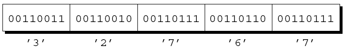
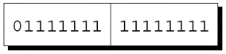
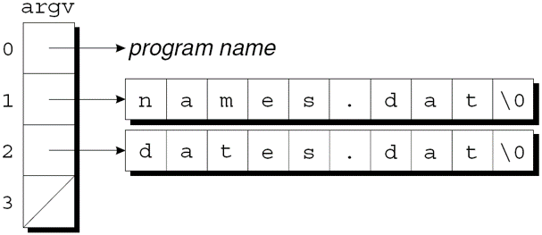

---
presentation:
  margin: 0
  center: false
  transition: "convex"
  enableSpeakerNotes: true
  slideNumber: "c/t"
  navigationMode: "linear"
---

@import "../css/font-awesome-4.7.0/css/font-awesome.css"
@import "../css/theme/solarized.css"
@import "../css/logo.css"
@import "../css/font.css"
@import "../css/color.css"
@import "../css/margin.css"
@import "../css/table.css"
@import "../css/main.css"
@import "../plugin/zoom/zoom.js"
@import "../plugin/customcontrols/plugin.js"
@import "../plugin/customcontrols/style.css"
@import "../plugin/chalkboard/plugin.js"
@import "../plugin/chalkboard/style.css"
@import "../plugin/menu/menu.js"
@import "../js/anychart/anychart-core.min.js"
@import "../js/anychart/anychart-venn.min.js"
@import "../js/anychart/pastel.min.js"
@import "../js/anychart/venn-ml.js"
@import "https://cdn.bootcdn.net/ajax/libs/jquery/3.5.0/jquery.js"

<!-- slide data-notes="" -->

<div class="bottom20"></div>

# 智能程序设计（C语言）

<hr class="width50 center">

## 文件操作

<div class="bottom8"></div>

### 计算机学院 &nbsp;&nbsp; 杨已彪

#### [yangyibiao@nju.edu.cn](mailto:yangyibiao@nju.edu.cn)


<!-- slide data-notes="" -->

##### 提纲

---

- 流与标准流、重定向

- 文本文件与二进制文件

- 打开、读写、关闭: fopen / fgetc / fgets / fclose

- 案例: 文件复制、修改零件记录

---


<!-- slide data-notes="" -->


##### 流

---

在 C 中, 术语**流**表示任意输入的源或任意输出的目的地. 

许多小程序从一个流(键盘)获取所有输入, 并将其所有输出写入另一个流(屏幕). 

较大的程序可能需要额外的流. 

流通常表示存储在不同介质上的文件. 

但也很容易与网络端口和打印机等设备相关联. 


---

访问流是通过**文件指针**完成的, 该指针具有FILE *类型.

FILE类型在<stdio.h>中声明. 

某些流由具有标准名称的文件指针表示. 

可以根据需要声明其他文件指针:  
`FILE *fp1, *fp2;`

---


<!-- slide data-notes="" -->


##### 标准流和重定向

---

<stdio.h>提供了三个标准流: 
| 文件指针 | 流 | 默认含义 |
| ---- | ---- | ---- |
| stdin | 标准输入 | 键盘 |
| stdout | 标准输出| 屏幕 |
| stderr | 标准错误| 屏幕 |

这些流可以直接使用——我们不需要声明它们, 也不打开或关闭它们.


前面章节中讨论的 I/O 函数从stdin获取输入并将输出发送到stdout. 

许多操作系统允许通过称为**重定向**的机制更改这些默认含义.


强制程序从文件而不是键盘获取输入的典型方法:  
`demo <in.dat`  
这种方法称为**输入重定向**. 

**输出重定向**类似:  
`demo >out.dat`  
所有写入stdout的数据现在都将进入out.dat文件, 而不是出现在屏幕上.


输入重定向和输出重定向可以结合使用:  
`demo <in.dat >out.dat`

`<`和`>`字符不需要与文件名相邻, 重定向文件的列出顺序无关紧要:  
`demo <in.dat> out.dat`  
等价于:  
`demo >out.dat <in.dat`


输出重定向的一个问题是写入stdout的所有内容都被放入一个文件中. 

将错误消息写入stderr而不是stdout可以保证即使stdout已被重定向, 错误信息也会出现在屏幕上.

---


<!-- slide data-notes="" -->


##### 文本文件与二进制文件

---

<stdio.h>支持两种文件: 文本文件和二进制文件. 

**文本文件**中的字节代表字符, 允许人们检查或编辑文件. 
- C 程序的源代码存储在文本文件中. 

在**二进制文件**中, 字节不一定代表字符. 
- 字节组可能代表其他类型的数据, 例如整数和浮点数. 
- 可执行的 C 程序存储在二进制文件中.


文本文件具有二进制文件不具备的两个特征. 

文本文件分为若干行. 文本文件中的每一行通常以一个或两个特殊字符结尾. 
- Windows: 回车符('\x0d')后跟换行符('\x0a')
- UNIX和较新版本的Mac OS: 换行符
- 旧版本的Mac OS: 回车符


文本文件可以包含一个特殊的"文件结束"标记. 
- 在Windows中, 标记是'\x1a'(Ctrl+Z), 但这不是必需的. 
- 大多数其他操作系统, 包括UNIX, 没有特殊的文件结束字符. 

在二进制文件中, 没有行尾或文件结束标记; 所有字节都被平等对待.

---


<!-- slide data-notes="" -->


##### 文本文件与二进制文件 (续)

---

数据写入文件时, 可以选择以文本格式或二进制格式存储. 

将数字32767存储在文件中, 一种方法是以文本形式写入字符3、2、7、6和7: 
<div class="top-2">
  
</div>


另一种选择是以二进制形式存储数字, 这只需两个字节: 
<div class="top-2">
  
</div>
  
以二进制存储数字通常可以节省空间.


从文件读取或写入文件的程序必须考虑它是文本还是二进制文件. 

在屏幕上显示文件内容的程序可能会假设它是一个文本文件. 

另一方面, 文件复制程序不能假定要复制的文件是文本文件. 
- 如果是这样, 则不会完全复制包含文件结尾字符的二进制文件. 

当无法确定文件是文本形式还是二进制形式时, 假设它是二进制文件会更安全.

---


<!-- slide data-notes="" -->


##### 文件操作

---

简单性是输入和输出重定向的魅力之一. 

不幸的是, 重定向在许多应用中受到限制. 
- 当程序依赖重定向时, 它无法控制自己的文件; 甚至不知道文件的名字. 
- 如果程序需要同时读取两个文件或写入两个文件, 重定向将无法做到. 

当重定向无法满足需要时, 我们将使用<stdio.h>提供的文件操作. 


---

如果要把文件用作流, 打开时需要调用fopen函数. 

fopen的原型: 
```C
FILE *fopen(const char * restrict filename,
	          const char * restrict mode);
```

filename是要打开的文件的名称. 
- 此参数可能包括有关文件位置的信息, 例如驱动器符或路径. 

mode是一个"模式字符串", 它指定打算对文件执行的操作.

---


<!-- slide data-notes="" -->


##### 打开文件

---

fopen的原型中, restrict关键字出现了两次. 

restrict是 C99 关键字, 表示filename和mode应指向不共享内存单元的字符串. 

fopen的 C89 原型不包含restrict, 但也有这样的要求. 

restrict对fopen的行为没有影响, 因此通常可以忽略它.


fopen调用中的文件名包含`\`字符时要小心. 

调用  
`fopen("c:\project\test1.dat", "r")`  
将失败, 因为`\t`被视为转义字符. 

避免该问题的一种方法是用`\\`代替`\`:  
`fopen("c:\\project\\test1.dat", "r")`

另一种方法是用`/`代替`\`:  
`fopen("c:/project/test1.dat", "r")`


fopen函数返回一个文件指针, 程序可以(并且通常会)把这个指针保存在变量中: 
```C
fp = fopen("in.dat", "r");
/* 打开 in.dat 以供阅读 */
```

无法打开文件时, fopen返回一个空指针.

---


<!-- slide data-notes="" -->


##### 打开模式

---

决定将哪个模式字符串传递给fopen的因素: 
- 要对文件执行的操作
- 文件中的数据是文本形式还是二进制形式


用于文本文件的模式字符串: 
| 字符串 | 含义 |
| ---- | ---- |
| "r" | 打开文件读 |
| "w" | 打开文件写(文件不需要存在) |
| "a" | 打开文件追加(文件不需要存在) |
| "r+" | 打开文件读写, 从文件头开始 |
| "w+" | 打开文件读写(如果文件存在则截去) |
| "a+" | 打开文件读写(如果文件存在则追加) |


用于二进制文件的模式字符串: 
| 字符串 | 含义 |
| ---- | ---- |
| "rb" | 打开文件读 |
| "wb" | 打开文件写(文件不需要存在) |
| "ab" | 打开文件追加(文件不需要存在) |
| "r+b"或者"rb+" | 打开文件读写, 从文件头开始 |
| "w+b"或者"wb+" | 打开文件读写(如果文件存在则截去) |
| "a+b"或者"ab+" | 打开文件读写(如果文件存在则追加) |


写数据和追加数据有不同的模式字符串. 

当数据写入文件时, 它通常会覆盖以前存在的内容. 

当打开文件进行追加时, 写入文件的数据将添加到末尾.


当打开文件进行读写时, 适用特殊规则. 
- 除非读取操作遇到文件末尾, 否则不先调用文件定位函数就无法从读模式切换到写模式. 
- 如果既没有调用fflush函数也没有调用文件定位函数, 则无法从写模式切换到读模式.

---


<!-- slide data-notes="" -->


##### 关闭文件

---

fclose函数允许程序关闭不再使用的文件. 

fclose的参数必须是从调用fopen或freopen获得的文件指针. 

如果文件成功关闭, fclose返回零. 

否则, 它返回错误代码EOF(在<stdio.h>中定义的宏).


打开文件进行读取的程序框架: 
```C
#include <stdio.h>
#include <stdlib.h>
	 
#define FILE_NAME "example.dat"
	 
int main(void)
{
  FILE *fp;
	 
  fp = fopen(FILE_NAME, "r");
  if(fp == NULL) {
    printf("Can't open %s\n", FILE_NAME);
    exit(EXIT_FAILURE);
  }
  …
  fclose(fp);
  return 0;
}
```


可以把fopen的调用与fp的声明相结合:  
`FILE *fp = fopen(FILE_NAME, "r");`

还可以与NULL的判断相结合:  
`if((fp = fopen(FILE_NAME, "r")) == NULL) …`

---


<!-- slide data-notes="" -->


##### 从命令行获取文件名

---

有几种方法可以为程序提供文件名. 
- 将文件名嵌入程序中不太灵活. 
- 提示用户输入文件名也很笨拙. 
- 让程序从命令行获取文件名通常是最好的解决方案. 

为demo程序提供两个文件名的示例:  
`demo names.dat dates.dat`


将main定义为具有两个参数的函数来访问命令行参数: 
```C
int main(int argc, char *argv[])
{
  …
}
```

argc是命令行参数的数量. 

argv是指向参数字符串的指针数组.


argv[0]指向程序名, argv[1]到argv[argc-1]指向剩余的参数, argv[argc]是空指针. 

在上述示例中, argc为3, 而argv如下图所示: 
<div class="top-2">
  
</div>

---


<!-- slide data-notes="" -->


##### 程序: 检查文件是否可以打开

---

canopen.c程序判断文件是否存在, 如果存在是否可以打开进行读取. 

用户提供给程序要检查的文件的名字:  
`canopen file`

然后程序将显示`file can be opened`或`file can't be opened`. 

如果用户在命令行中输入错误数量的参数, 程序将显示消息`usage: canopen filename`.


```C
/* Checks whether a file can be opened for reading */

#include <stdio.h>
#include <stdlib.h>

int main(int argc, char *argv[])
{
  FILE *fp;
 
  if(argc != 2) {
    printf("usage: canopen filename\n");
    exit(EXIT_FAILURE);
  }
 
  if((fp = fopen(argv[1], "r")) == NULL) {
    printf("%s can't be opened\n", argv[1]);
    exit(EXIT_FAILURE);
  }
 
  printf("%s can be opened\n", argv[1]);
  fclose(fp);
  return 0;
}
```

---


<!-- slide data-notes="" -->


##### 检测文件末尾和错误条件

---

如果要求...scanf函数读取并存储n个数据项, 那么期望它的返回值为n. 

如果返回值小于n, 则出现问题: 
- 文件末尾. 该函数在完全匹配格式字符串之前遇到文件末尾. 
- 读取错误. 该函数无法从流中读取字符. 
- 匹配失败. 数据项的格式错误.


每个流都有两个与之关联的指示器: **错误指示器**和**文件末尾指示器**.  

打开流时, 这些指示器会被清除. 

遇到文件末尾就设置文件末尾指示器, 读取错误就设置错误指示器. 
- 当输出流上发生写错误时, 也会设置错误指示器. 

匹配失败不会改变任意一个指示器.


一旦设置了错误或文件末尾指示器, 它就会保持该状态直到被显式清除, 可能通过调用clearerr函数.  
clearerr清除文件末尾和错误指示器: 
```C
clearerr(fp);
	/* clears eof and error indicators for fp */
```
并不需要经常使用clearerr, 因为其他一些库函数的副作用可以清楚指示器.


feof和ferror函数可用于测试流的指示器以确定先前对流的操作失败的原因. 

如果为与fp关联的流设置了文件末尾指示器, 则调用feof(fp)将返回一个非零值. 

如果设置了错误指示器, 调用ferror(fp)会返回一个非零值.

---


<!-- slide data-notes="" -->


##### 检测文件末尾 (续)

---

当scanf返回小于预期的值时, 可以使用feof和ferror来判断原因. 
- 如果feof返回非零值, 则已到达输入文件的末尾. 
- 如果ferror返回非零值, 则在输入期间发生读取错误. 
- 如果两者都没有返回非零值, 则一定发生匹配失败. 

scanf的返回值表示在问题发生之前读取了多少数据项.


find_int函数是一个示例, 它显示了如何使用feof和ferror. 

find_int在文件中搜索以整数开头的行:  
`n = find_int("foo");`

find_int返回它找到的整数的值或错误代码: 
- –1 文件无法打开
- –2 读取错误
- –3 没有行以整数开头

---


<!-- slide data-notes="" -->


##### 字符的输入/输出

---

下一组库函数可以读取和写入单个字符. 

这些函数同样适用于文本流和二进制流. 

这些函数将字符视为int类型的值, 而不是char. 

一个原因是输入函数通过返回EOF来指示文件结束(或错误)条件, EOF是一个负整数常量. 


---

putchar将一个字符写入标准输出流:  
`putchar(ch); /* 将 ch 写入标准输出流 */`

fputc和putc将一个字符写入任意流: 
```C
fputc(ch, fp); /* 将 ch 写入 fp */
putc(ch, fp); /* 将 ch 写入 fp */
```

putc通常实现为宏(以及函数), 而fputc仅实现为函数.


putchar本身通常也定义为宏:  
`#define putchar(c) putc((c), stdout)`

C标准允许putc宏对stream参数多次求值, 而fputc不可以. 

程序员通常更喜欢putc, 因为它速度更快. 

如果发生写入错误, 上述这3个函数都会为流设置错误指示器并返回EOF. 

否则, 它们返回写入的字符.


getchar从stdin读取一个字符:  
`ch = getchar();`

fgetc和getc从任意流中读取一个字符:  
```C
ch = fgetc(fp);
ch = getc(fp);
```

这三个函数都将字符视为unsigned char类型的值(返回之前转换为int类型). 

因此, 它们不会返回EOF以外的负值.

---


<!-- slide data-notes="" -->


##### 程序: 复制文件

---

fcopy.c程序进行文件的复制操作. 

执行程序时, 将在命令行中指定原始文件和新文件的名称. 

使用fcopy将文件f1.c复制到f2.c的示例:  
`fcopy f1.c f2.c`

如果命令行中的文件名不完全是两个, 或者其中一个文件都无法打开, fcopy将产生错误消息.


使用"rb"和"wb"作为文件模式使fcopy可以复制文本和二进制文件. 

如果改用"r"和"w", 程序将无法复制二进制文件.


```C
/* Copies a file */
 
#include <stdio.h>
#include <stdlib.h>
 
int main(int argc, char *argv[])
{
  FILE *source_fp, *dest_fp;
  int ch;
 
  if(argc != 3) {
    fprintf(stderr, "usage: fcopy source dest\n");
    exit(EXIT_FAILURE);
  }

  if((source_fp = fopen(argv[1], "rb")) == NULL) {
    fprintf(stderr, "Can't open %s\n", argv[1]);
    exit(EXIT_FAILURE);
  }
 
  if((dest_fp = fopen(argv[2], "wb")) == NULL) {
    fprintf(stderr, "Can't open %s\n", argv[2]);
    fclose(source_fp);
    exit(EXIT_FAILURE);
  }
 
  while((ch = getc(source_fp)) != EOF)
    putc(ch, dest_fp);
 
  fclose(source_fp);
  fclose(dest_fp);
  return 0;
}
```

---


<!-- slide data-notes="" -->


##### 行的输入/输出

---

下一组中的库函数能够读取和写入行. 

这些函数主要用于文本流, 尽管将它们也能用于二进制流. 


---

puts函数将字符串写入stdout:  
`puts("Hi, there!");  /* writes to stdout */`

在写入字符串中的字符后, puts总是添加一个换行符.


fputs是puts的更通用版本. 

它的第二个参数指示输出应写入的流:  
`fputs("Hi, there!", fp);  /* writes to fp */`

与puts不同, fputs函数不会写入换行符, 除非字符串中本身存在换行符. 

如果发生写入错误, 这两个函数都返回EOF; 否则, 它们返回一个非负数.


gets函数从stdin读取一行输入:  
`gets(str); /* reads a line from stdin */`

get逐个读取字符, 将它们存储在str指向的数组中, 直到它读取一个换行符(丢弃换行符). 

fgets是更通用的get版本, 可以从任意流中读取. 

fgets也比gets更安全, 因为它限制了它将存储的字符数.

---


<!-- slide data-notes="" -->


##### 块的输入/输出

---

fread和fwrite函数允许程序在单步中读取和写入大的数据块. 

fread和fwrite主要用于二进制流, 尽管也可以用于文本流. 


---

fwrite旨在将数组从内存复制到流中. 

fwrite调用中的参数: 
- 数组地址
- 每个数组元素的大小(以字节为单位)
- 要写入的元素数
- 文件指针

调用fwrite写入数组a的全部内容: 
```C
fwrite(a, sizeof(a[0]),
sizeof(a) / sizeof(a[0]), fp);
```


fwrite返回实际写入的元素数. 

如果发生写入错误, 此数字将小于第三个参数.


fread将从流中读取数组的元素. 

将文件内容读入数组a的fread调用: 
```C
n = fread(a, sizeof(a[0]),
sizeof(a) / sizeof(a[0]), fp);
```

fread的返回值表示实际读取的元素数. 

此数字应等于第三个参数, 除非已到达输入文件的末尾或发生读取错误.


fwrite对于需要在终止之前将数据存储在文件中的程序来说很方便. 

以后程序(或其他程序)可以使用fread将数据读回内存. 

数据不需要是数组形式. 

将结构变量s写入文件的fwrite调用:  
`fwrite(&s, sizeof(s), 1, fp);`

---


<!-- slide data-notes="" -->


##### 文件定位

---

每个流都有一个关联的**文件位置**.  

打开文件时, 文件位置设置在文件的开头. 
- 在"追加"模式下, 初始文件位置可能在开头或结尾, 具体取决于实现. 

当执行读取或写入操作时, 文件位置会自动前进, 从而提供对数据的顺序访问. 


---

尽管顺序访问对许多应用程序来说都很好, 但有些程序需要能够在文件中跳转. 

如果文件包含一系列记录, 我们可能希望直接跳转到特定记录. 

<stdio.h>提供五个函数, 允许程序确定当前文件位置或更改它.


fseek函数更改与第一个参数(文件指针)关联的文件位置. 

第三个参数是三个宏之一: 
- SEEK_SET: 文件开头
- SEEK_CUR: 当前文件位置
- SEEK_END: 文件结尾

第二个参数, 类型为long int, 是一个(可能是负数)字节计数.


使用fseek移动到文件的开头:  
`fseek(fp, 0L, SEEK_SET);`

使用fseek移动到文件末尾:  
`fseek(fp, 0L, SEEK_END);`

使用fseek往回移动10个字节:  
`fseek(fp, -10L, SEEK_CUR);`

如果发生错误(例如, 请求的位置不存在), fseek返回一个非零值.

---


<!-- slide data-notes="" -->


##### 程序: 修改零件记录文件

---

invclear.c程序执行的操作: 
- 打开包含part结构的二进制文件. 
- 将结构读入数组. 
- 把每个结构的成员on_hand设置为0. 
- 将结构写回文件. 

"rb+"模式打开文件, 允许读写.


```C
/* Modifies a file of part records by setting the quantity
   on hand to zero for all records */
 
#include <stdio.h>
#include <stdlib.h>
 
#define NAME_LEN 25
#define MAX_PARTS 100
 
struct part {
  int number;
  char name[NAME_LEN+1];
  int on_hand;
} inventory[MAX_PARTS];
 
int num_parts;

int main(void)
{
  FILE *fp;
  int i;
 
  if((fp = fopen("inventory.dat", "rb+")) == NULL) {
    fprintf(stderr, "Can't open inventory file\n");
    exit(EXIT_FAILURE);
  }
 
  num_parts = fread(inventory, sizeof(struct part),
                    MAX_PARTS, fp);
 
  for(i = 0; i < num_parts; i++)
    inventory[i].on_hand = 0;
 
  rewind(fp);
  fwrite(inventory, sizeof(struct part), num_parts, fp);
  fclose(fp);
 
  return 0;
}
```

---


<!-- slide data-notes="" -->

##### 课堂小测

---

1. `fopen("data.txt", "r")` 与 `fopen("data.txt", "w")` 有什么区别？返回什么？

2. `fgetc` / `fputc` 的返回值为什么是 `int` 而不是 `char`？

3. `while (!feof(fp))` 这种写法有什么陷阱？应该用什么判断循环结束？

4. `fgets` 与 `fscanf` 读行有什么区别？各适合什么场景？

---


<!-- slide data-notes="" -->

#####

---

<div class="bottom20"></div>

# 周三见!

<hr class="width50 center">

## 未完待续

---


