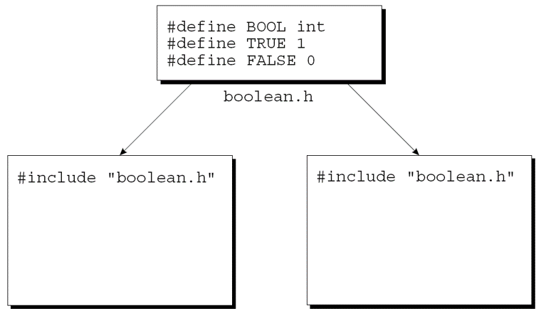
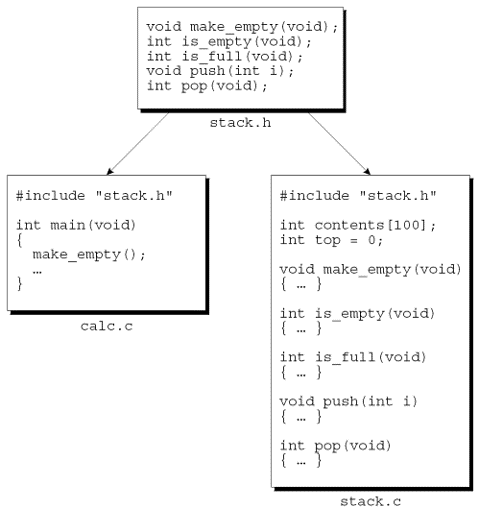
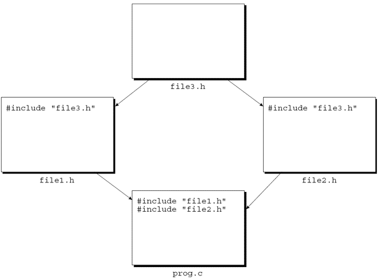

---
presentation:
  margin: 0
  center: false
  transition: "convex"
  enableSpeakerNotes: true
  slideNumber: "c/t"
  navigationMode: "linear"
---

@import "../css/font-awesome-4.7.0/css/font-awesome.css"
@import "../css/theme/solarized.css"
@import "../css/logo.css"
@import "../css/font.css"
@import "../css/color.css"
@import "../css/margin.css"
@import "../css/table.css"
@import "../css/main.css"
@import "../plugin/zoom/zoom.js"
@import "../plugin/customcontrols/plugin.js"
@import "../plugin/customcontrols/style.css"
@import "../plugin/chalkboard/plugin.js"
@import "../plugin/chalkboard/style.css"
@import "../plugin/menu/menu.js"
@import "../js/anychart/anychart-core.min.js"
@import "../js/anychart/anychart-venn.min.js"
@import "../js/anychart/pastel.min.js"
@import "../js/anychart/venn-ml.js"
@import "https://cdn.bootcdn.net/ajax/libs/jquery/3.5.0/jquery.js"

<!-- slide data-notes="" -->

<div class="bottom20"></div>

# 智能程序设计（C语言）

<hr class="width50 center">

## 多文件组织

<div class="bottom8"></div>

### 计算机学院 &nbsp;&nbsp; 杨已彪

#### [yangyibiao@nju.edu.cn](mailto:yangyibiao@nju.edu.cn)


<!-- slide data-notes="" -->

##### 提纲

---

- 源文件与头文件

- #include、共享宏/类型/函数原型

- 保护头文件

- 构建多文件程序与 makefile

---


<!-- slide data-notes="" -->


##### 源文件

---

<div style="display:flex;align-items:flex-start;gap:24px;">

<div style="flex:1.4;font-size:0.55em;">


</div>

<div style="flex:1;">

C 程序可分割成任意数量的==源文件== (扩展名 `.c`), 每个源文件包含程序的一部分 (主要是函数和变量的定义); 其中一个必须包含 `main` 函数, 作为程序的起点.

例: 逆波兰记法 (RPN) 计算器 (`30 5 - 7 *` → 175)——读取操作数与运算符, 用栈跟踪中间结果, 左列是程序划分方案.

</div>
</div>

<!-- slide data-notes="" -->


##### 源文件 (续)

---

读取记号的函数可以与任何需要用到记号的函数一起放入一个源文件(例如`token.c`). 

与栈相关的函数, 如push, pop, make_empty, is_empty和is_full可以放入另一个文件`stack.c`中. 

代表栈的变量也放入stack.c. 

main函数放入另一个文件calc.c中.


将程序拆分为多个源文件具有显着优势: 

- 将相关函数和变量分组到一个文件中可以使程序的结构清晰. 

- 每个源文件都可以单独编译, 节省时间. 

- 将函数分组放在不同的源文件中更利于复用.

---


<!-- slide data-notes="" -->


##### 头文件

---

<div style="display:flex;align-items:flex-start;gap:24px;">

<div style="flex:1.3;font-size:0.6em;">


</div>

<div style="flex:1;">

当一个程序被分成几个源文件时出现的问题: 

- 一个文件中的函数如何调用另一个文件中定义的函数？ 

- 函数如何访问另一个文件中的外部变量？ 

- 两个文件如何共享相同的宏定义或类型定义？

`#include`指令, 它可以在任意数量的源文件之间共享信息. 


---

`#include`指令告诉预处理器插入指定文件的内容. 

可以将要在多个源文件之间共享的信息放入这样的文件中. 

`#include`然后可用于将该文件的内容带入每个源文件. 

以这种方式包含的文件称为**头文件**(有时称为包含文件). 

按照惯例, 头文件的扩展名为`.h`.

</div>

</div>

<!-- slide data-notes="" -->


##### #include 指令

---

<div style="display:flex;align-items:flex-start;gap:24px;">

<div style="flex:1.5;font-size:0.5em;">

```C
#include <文件名>
```

```C
#include "文件名"
```

```C
#include <myheader.h> /*** 错误 ***/
```

```C
#include "c:\cprogs\utils.h"
/* Windows 路径 */

#include "/cprogs/utils.h"
/* UNIX 路径 */
```

```C
#include "d:utils.h"
#include "\cprogs\include\utils.h"
#include "d:\cprogs\include\utils.h"
```

```C
#include "utils.h"
#include "..\include\utils.h"
```

```C
#include 标记
```

```C
#if defined(IA32)
  #define CPU_FILE "ia32.h" 
#elif defined(IA64)
  #define CPU_FILE "ia64.h" 
#elif defined(AMD64)
  #define CPU_FILE "amd64.h"
#endif

#include CPU_FILE
```

</div>

<div style="flex:1;">

`#include` 有两种形式: `<文件名>` 用于 C 自带库头文件, `"文件名"` 用于其他头文件——区别在于编译器如何定位头文件:

- `<文件名>`: 搜索系统头文件目录
- `"文件名"`: 先搜当前目录, 再搜系统头文件目录

通常: 自带库用尖括号, 自己写的头文件用引号.

</div>
</div>

<!-- slide data-notes="" -->


##### 共享宏定义和类型定义

---

<div style="display:flex;align-items:flex-start;gap:24px;">

<div style="flex:1.4;font-size:0.55em;">

```C{.line-numbers}
#define BOOL int
#define TRUE 1
#define FALSE 0
```

```C
#include "boolean.h"
```

```C
#define TRUE 1
#define FALSE 0
typedef int Bool;
```

</div>

<div style="flex:1;">

大多数大型程序包含由多个源文件共享的宏定义和类型定义. 

这些定义应该放入头文件.


假设一个程序使用名为BOOL, TRUE和FALSE的宏. 

它们的定义可以放在一个名为*boolean.h*的头文件中:

任何需要这些宏的源文件将只包含该行

两个文件都包含了boolean.h: 

<div class="top-2">
  
</div>


类型定义在头文件中也很常见. 

例如可使用typedef来创建一个Bool类型, 而不是定义BOOL宏. 

如果我们这样做, boolean.h文件将有下列显示:

将宏和类型的定义放在头文件中的优点: 

- 节省时间. 我们不必将定义复制到需要它们的源文件中. 

- 使程序更容易修改. 更改宏或类型的定义只需要编辑单个头文件. 

- 避免由源文件包含相同宏或类型的不同定义而导致的不一致.

</div>

</div>

<!-- slide data-notes="" -->


##### 共享函数原型

---

<div style="display:flex;align-items:flex-start;gap:24px;">

<div style="flex:1.4;font-size:0.55em;">

```C{.line-numbers}
void make_empty(void);
int is_empty(void);
int is_full(void);
void push(int i);
int pop(void);
```

</div>

<div style="flex:1;">

假设源文件包含对另一个文件foo.c中定义的函数f的调用. 

没有先声明的情况下调用f是有风险的. 

- 编译器假定f的返回类型是int. 

- 并假定形式参数的数量与f调用中的实际参数数量相匹配. 

- 实际参数自身由默认参数提升自动转换.


声明f可以解决问题, 但会造成维护方面的"噩梦". 

更好的方案是将f的原型放在头文件(foo.h)中, 然后将头文件包含在所有调用f的地方. 

还需要在foo.c中包含foo.h, 使编译器能够检查f在foo.h中的原型是否与它在foo.c中的定义相匹配.


如果foo.c包含其他函数, 则大多数应在foo.h中声明. 

但是, 仅在foo.c中使用的函数不应在头文件中声明；这样做会产生误导.


RPN 计算器示例用于说明头文件中函数原型的使用. 

`stack.c`包含make_empty, is_empty, is_full, push和pop函数的定义. 

这些函数的原型应放在stack.h头文件中:

文件calc.c中将包含stack.h以允许编译器检查出现在后一个文件中的栈函数的任何调用. 

文件stack.c中也将包含stack.h, 以便编译器可以验证stack.h中的原型是否与stack.c中的定义匹配.


<div class="top-2">
  
</div>

</div>

</div>

<!-- slide data-notes="" -->


##### 共享变量声明

---

<div style="display:flex;align-items:flex-start;gap:24px;">

<div style="flex:1.4;font-size:0.55em;">

```C
int i;
```

```C
extern int i;
```

```C
extern int a[];
```

```C
int i;
```

```C
extern int i;
```

```C
int i;
```

```C
extern long i;
```

</div>

<div style="flex:1;">

共享函数: 定义放在一个源文件, 声明放在需要调用的其他文件; 共享外部变量的方式相同.

声明并定义 `i` (编译器为 i 留空间) 见左; `extern` 关键字==只声明不定义== (i 在别处定义, 无需分配空间); 数组声明用 extern 时可省略长度.

</div>
</div>

<!-- slide data-notes="" -->


##### 嵌套包含

---

<div style="display:flex;align-items:flex-start;gap:24px;">

<div style="flex:1.2;font-size:0.62em;">

```C
int is_empty(void);
int is_full(void);
```

```C
Bool is_empty(void);
Bool is_full(void);
```

</div>

<div style="flex:1;">

头文件可能包含`#include`指令. 

stack.h包含以下原型:

由于这些函数只返回 0 或 1, 最好将它们的返回类型声明为Bool:

在 stack.h 中包含boolean.h, 以便在编译时可以使用Bool的定义.


传统上, C 程序员避免使用嵌套包含. 

然而, 对嵌套包含的偏见已经在很大程度上消失了, 部分原因是嵌套包含是 C++ 中的常见做法.

</div>

</div>

<!-- slide data-notes="" -->


##### 保护头文件

---

<div style="display:flex;align-items:flex-start;gap:24px;">

<div style="flex:1.4;font-size:0.55em;">

```C{.line-numbers}
#ifndef BOOLEAN_H
#define BOOLEAN_H

#define TRUE 1
#define FALSE 0
typedef int Bool;

#endif
```

</div>

<div style="flex:1;">

如果一个源文件两次包含相同的头文件, 可能会导致编译错误. 

当头文件包含其他头文件时, 此问题很常见. 

假设file1.h包含file3.h, file2.h包含file3.h, prog.c包含file1.h和file2.h.


<div class="top-2">
  
</div>

编译prog.c时, file3.h将被编译两次.


两次包含相同的头文件并不总是会导致编译错误. 

如果文件只包含宏定义, 函数原型和/或变量声明, 则不会有任何困难. 

但是, 如果文件包含类型定义, 则会带来编译错误.


安全起见, 保护所有头文件不被多次包含可能是个好主意. 

这样, 可以稍后将类型定义添加到文件中, 而不会有忘记保护文件的风险. 

此外, 在程序开发过程中, 避免不必要地重新编译相同的头文件可以节省一些时间.


为了保护头文件, 将文件的内容包含在#ifndef - #endif对中. 

如何保护boolean.h文件:

使宏的名称类似于头文件的名称是避免与其他宏冲突的好方法. 

由于不能命名宏BOOLEAN.H, 所以像BOOLEAN_H这样的名称是一个不错的选择.

</div>

</div>

<!-- slide data-notes="" -->


##### 将程序划分为文件

---

<div style="display:flex;align-items:flex-start;gap:24px;">

<div style="flex:1.3;font-size:0.6em;">


</div>

<div style="flex:1;">

设计程序需确定程序需要什么函数并将函数分为逻辑相关的组. 

一旦设计好程序, 就有一种简单的方法可以将其分成文件. 


---

每组函数都将放入一个单独的源文件(foo.c). 

为每个源文件创建一个同名的头文件(foo.h). 

- foo.h将包含foo.c中定义的函数的原型. 

- 仅在foo.c中使用的函数不应在foo.h中声明. 

foo.h将包含在需要调用foo.c中定义的函数的每个源文件中. 

foo.c也将包含foo.h, 编译器检查函数原型与定义是否匹配.


main函数将放入一个名称与程序名称匹配的文件中. 

main所在的文件中也可以有其他函数, 只要程序中的其他文件不会调用它们.

</div>

</div>

<!-- slide data-notes="" -->


##### 构建多文件程序

---

<div style="display:flex;align-items:flex-start;gap:24px;">

<div style="flex:1.4;font-size:0.55em;">


</div>

<div style="flex:1;">

构建大型程序与构建小型程序所需的基本步骤相同: 

- 编译

- 链接


---

程序中的每个源文件都必须单独编译. 

头文件不需要编译. 

每当编译包含它的源文件时, 都会自动编译头文件的内容. 

对于每个源文件, 编译器都会生成一个包含目标代码的文件. 

这些文件(称为**目标文件**)在UNIX中具有扩展名.o, 在Windows中具有扩展名.obj.


链接器将上一步产生的目标文件与库函数的代码结合起来, 生成一个可执行文件. 

链接器的一个职责是解决编译器遗留的外部引用问题. 

当一个文件中的函数调用另一个文件中定义的函数或访问另一个文件中定义的变量时, 就会发生外部引用.


大多数编译器允许一步构建程序. 

构建justify的 GCC 命令:  
`gcc -o justify justify.c line.c word.c`

这三个源文件首先被编译成目标代码. 

然后目标文件自动传递给链接器, 链接器将它们组合成一个文件. 

-o选项表明我们希望将可执行文件命名为justify.

</div>

</div>

<!-- slide data-notes="" -->


##### makefile

---

<div style="display:flex;align-items:flex-start;gap:24px;">

<div style="flex:1.4;font-size:0.55em;">

```
justify: justify.o word.o line.o
        gcc -o justify justify.o word.o line.o
	 
justify.o: justify.c word.h line.h
        gcc -c justify.c
	 
word.o: word.c word.h
        gcc -c word.c
	 
line.o: line.c line.h
        gcc -c line.c
```

```
justify: justify.o word.o line.o
	      gcc -o justify justify.o word.o line.o
```

</div>

<div style="flex:1;">

为了更容易构建大型程序, UNIX发明makefile的概念.  

makefile不仅列出了作为程序一部分的文件, 而且还描述了文件之间的依赖关系. 

假设文件foo.c包含文件bar.h. 

我们说foo.c"依赖于"bar.h, 因为修改bar.h之后需要重新编译foo.c.


针对justify程序的UNIX系统的makefile:

有4组代码行；每个组称为一条规则. 

每个规则的第一行给出目标文件, 然后是它所依赖的文件. 

第二行是当目标文件依赖的文件发生改变而需要重新构建目标文件时要执行的命令.


在第一条规则中, justify(可执行文件)是目标文件:

第一行说明justify依赖于文件justify.o, word.o和line.o. 

如果自上次构建程序以来这些文件中的任何一个发生了更改, 则需要重新构建justify. 

下一行的命令显示了如何进行重新构建.

</div>

</div>

<!-- slide data-notes="" -->


##### 链接期间的错误

---

一些编译时检测不到的错误会在链接时发现. 

如果程序中缺少函数或变量的定义, 链接器将无法解析对其的外部引用

导致出现诸如"undefined symbol"或"undefined reference"之类的消息.


链接过程中常见的错误原因: 
- 拼写错误. 如果变量或函数的名称拼写错误, 链接器将报告它丢失. 
- 缺少文件. 如果链接器找不到文件foo.c中的函数, 它可能不知道该文件. 
- 缺少库. 链接器可能无法找到程序中使用的所有库函数. 

在 UNIX 中, 当链接使用<math.h>的程序时, 可能需要指定-lm选项.

---


<!-- slide data-notes="" -->

##### 课堂小测

---

1. 头文件里通常放什么？源文件 (.c) 里放什么？

2. 为什么头文件要加"保护宏"（#ifndef … #define … #endif）？

3. 三个 .c 文件一起编译，gcc 命令怎么写？

4. 把函数原型放进头文件、函数定义放进 .c 文件，有什么好处？

---


<!-- slide data-notes="" -->

#####

---

<div class="top-2">
  
</div>

---


