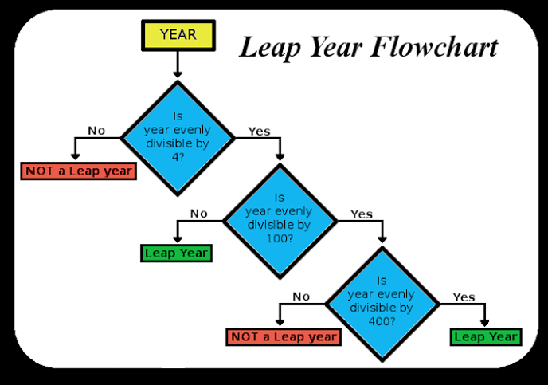

---
presentation:
  width: 1280
  height: 720
  margin: 0
  center: false
  transition: "convex"
  enableSpeakerNotes: true
  slideNumber: "c/t"
  navigationMode: "linear"
---

@import "../../css/font-awesome-4.7.0/css/font-awesome.css"
@import "../../css/theme/solarized.css"
@import "../../css/logo.css"
@import "../../css/font.css"
@import "../../css/color.css"
@import "../../css/margin.css"
@import "../../css/table.css"
@import "../../css/main.css"
@import "../../plugin/zoom/zoom.js"
@import "../../plugin/customcontrols/plugin.js"
@import "../../plugin/customcontrols/style.css"
@import "../../plugin/chalkboard/plugin.js"
@import "../../plugin/chalkboard/style.css"
@import "../../plugin/menu/menu.js"
@import "../../js/anychart/anychart-core.min.js"
@import "../../js/anychart/anychart-venn.min.js"
@import "../../js/anychart/pastel.min.js"
@import "../../js/anychart/venn-ml.js"


<!-- slide data-notes="" -->

<div class="bottom20"></div>

# 智能程序设计（C语言）

<hr class="width50 center">

## 选择结构 (上)

<div class="bottom8"></div>

### 计算机学院 &nbsp;&nbsp; 杨已彪

#### [yangyibiao@nju.edu.cn](mailto:yangyibiao@nju.edu.cn)


<!-- slide data-notes="" -->

##### 提纲

---

- 结构化算法与三种基本结构

- 关系、判等与逻辑运算

- if 语句与 else 子句

- 演示: min 与闰年判断

---


<!-- slide data-notes="" -->


##### 结构化算法与三种基本结构

---

==结构化程序设计==: 任何程序都可以只用 ==顺序==、==选择==、==循环== 三种基本结构组合而成 (自顶向下、逐步细化)

- ==顺序==: 语句一条接一条执行

- ==选择==: 根据条件决定走哪条分支 (if/switch)

- ==循环==: 重复执行一段语句 (while/do/for)

<span class="blue">:fa-lightbulb-o:</span> 本节学习 ==选择== 结构: 让程序会"判断"

---


<!-- slide data-notes="" -->


##### 选择语句

---

到目前为止, 我们已经讲完了返回语句和表达式语句. 

`C` 的其他大部分语句: 

- 选择语句: `if`和`switch`

- 循环语句: `while`, `do`和`for`

- 跳转语句: `break`, `continue`和`goto`(`return`也属于这一类)

- 其他语句: 复合语句 和 空语句(Null)

---


<!-- slide data-notes="" -->


##### 逻辑表达式

---

`C` 的一些语句需要测试一个表达式的值, 看它是真还是假
例如, 一个`if`语句可能需要测试表达式`i < j`真值则表示`i小于j`
在许多编程语言中, 诸如`i < j`之类的表达式会有一个特殊的 ==布尔== 或 ==逻辑== 类型
在 `C` 中, 如`i < j`的比较会产生一个整数: `0` (==假==)或 `1` (==真==)

```C
10 < 11
11 < 10
1 < 2.5
5.6 < 4
```

---


<!-- slide data-notes="" -->


##### 关系运算符

---

`C` 的关系运算符: 

<div class="threelines column1-border-left-solid column1-border-right-solid column2-border-right-solid head-highlight-1 tr-hover">

| 符号 | 含义 |
| :-- | :-- |
| `<` | 小于 |
| '>' | 大于 |
| `<=`| 小于或等于 |
| `>=`| 大于或等于 |

</div>

这些运算符在表达式中使用时会产生 `0` (==假==)或 `1` (==真==)

关系运算符可用于比较整数和浮点数, 允许不同类型的混合运算

关系运算符的优先级 ==低于== 算术运算符: `i + j < k – 1` 表示 `(i + j) < (k - 1)`

关系运算符是左结合的

---

<!-- slide data-notes="" -->


##### 关系运算符

---

表达方式 `i < j < k` 是合法的, 但并不是测试 `j` 的大小是否在 `i` 和 `k` 之间

因为 `<` 运算符是`左结合的`, 所以这个表达式等价于

```C
(i < j) < k
```

- `i < j` 产生的 `1` 或 `0` 随后将与k进行比较

- 并非测试`j`是否位于`i`与`k`之间

<span class="yellow">:fa-weixin:</span> 正确的表达式是 `i < j && j < k`

---


<!-- slide data-notes="" -->


##### 判等运算符

---

C 提供了两个判等运算符: 

<div class="threelines column1-border-left-solid column1-border-right-solid column2-border-right-solid head-highlight-1 tr-hover">

| 符号  | 含义   |
| :--  | :--    |
| `==` | 等于   |
| `!=` | 不等于 |

</div>

判等运算符也是`左结合的`, 产生 `0` (==假==)或 `1` (==真==)作为其结果. 

判等运算符优先级 ==低于== 关系运算符, 因此表达式: 

`i < j == j < k`
等价于
`(i < j) == (j < k)`

<span class="yellow">:fa-weixin:</span> ==判等== `==` 与 ==赋值== `=` 极易混淆, 是 C 语言的经典错误

---

<!-- slide data-notes="" -->


##### 逻辑运算符

---

利用逻辑运算符, 可以从简单逻辑表达式构建复杂逻辑表达式: 

<div class="threelines column1-border-left-solid column1-border-right-solid column2-border-right-solid head-highlight-1 tr-hover">

| 符号 | 含义 |
| :-- | :-- |
| `!` | 逻辑非 |
| `&&` | 逻辑与 |
| `\|\|` | 逻辑或 |

</div>

`!`运算符是一元的, 而`&&`和`||`是二元的

逻辑运算符产生 `0` 或 `1` 作为其结果

逻辑运算符将任何非零操作数视为真值, 零值操作数视为假值

- 如果 ==表达式== 的值为 `0`, 则 ==!表达式== 的值为`1`

- 如果 ==表达式1== 和 ==表达式2== 值都不为零, 则 ==表达式1 && 表达式2== 的值为 `1`

- 如果 ==表达式1== 或 ==表达式2== 中任意一个不为零, 则 ==表达式1 || 表达式2== 的值为 `1`

---

<!-- slide data-notes="" -->


##### 逻辑运算符

---

==&&== 和 ==||== 会进行 =="短路"== 计算: 先计算左操作数, 然后是右操作数

若表达式的值可 ==单独== 从左操作数推导出来, 则不计算右操作数

例子: `(i != 0) && (j / i > 0)`

- 先计算`(i != 0)` 如果`i`不等于 `0`, 则计算`(j / i > 0)`的值

- 若`i`为`0`, 则整个表达式必定为假, 因此无需计算`(j / i > 0)`

- 如果没有短路计算, 就会发生除零

---

<!-- slide data-notes="" -->


##### 逻辑运算符

---

因为 ==&&== 和 ==||== 两种运算符的短路特性, 逻辑表达式中的副作用可能不会产生

例子: `i > 0 && ++j > 0`

- 如果`i > 0`为假, 则不会计算`++j > 0`, `j`也就不会自增

`!`运算符与一元加号和减号运算符具有相同的优先级

`&&`和`||`的优先级低于关系运算符和等式运算符

例子: `i < j && k == m` 表示: `(i < j) && (k == m)`

- `!`运算符是右结合的
- `&&`和`||`是左结合的

---


<!-- slide data-notes="" -->


##### if语句

---

`if` 语句形式:

==[if语句]== &emsp; `if (表达式) 语句`

判定表达式的值是真还是假, 不为零, 则执行语句, 如: 

```C{.line-numbers}
if (line_num == MAX_LINES)
  line_num = 0;
```

<span class="yellow">:fa-weixin:</span> 表达式两边的圆括号是必须的，它是`if`语句的组成部分

---

<!-- slide data-notes="" -->


##### if语句

---

<span class="blue">:fa-weixin:</span> 将`==`(判等)和`=`(赋值)混淆是常见的 ==C== 语言编程错误

```C{.line-numbers}
if (i == 0) …  
/* 检查i是否等于0 */

if (i = 0) … 
/* 将0赋值给i, 然后检查结果是否为非零 */
```

通常, `if`语句中的表达式检查变量是否在某个值范围内

判定i是否满足 $0 \leq i < n$:

`if (0 <= i && i < n) …`

要判定相反的条件(`i`超出范围):

`if (i < 0 || i >= n) …`

---


<!-- slide data-notes="" -->


##### 复合语句

---

在`if`语句模板中, 需注意statement(语句)是单数, 而不是复数: 

`if (表达式) 语句`

要使`if`语句控制两条或更多条语句, 要使用 ==复合语句==

==[复合语句]== &emsp; `{ 多条语句 }`

在一组语句周围放置大括号会强制编译器将其视为单个语句

```C
{ line_num = 0; page_num++; }
```

复合语句通常放在多行中, 每行一条语句: 

```C
{
  line_num = 0;
  page_num++;
}
```

每个内部语句仍然以分号结尾, 但复合语句本身没有分号

---

<!-- slide data-notes="" -->


##### 复合语句

---

if语句中使用的复合语句示例: 

```C
if (line_num == MAX_LINES) {
  line_num = 0;
  page_num++;
}
```

复合语句在循环和其他C语法要求单个语句的地方也很常见

---


<!-- slide data-notes="" -->


##### else子句

---

`if`语句可能有`else`子句: 

`if (表达式) 语句 else 语句`

如果表达式的值为`0`, 则执行`else`后面的语句

例子: 

```C{.line-numbers}
if (i > j)
  max = i;
else
  max = j;
```

当内部语句很短, `if`和`else`可放在同一行: 

```C{.line-numbers}
if (i > j) max = i;
else max = j;
```

---


<!-- slide data-notes="" -->


##### else子句

---

`if`语句嵌套在其他`if`语句中也很普遍: 

```C{.line-numbers}
if (i > j)
  if (i > k)
    max = i;
  else 
    max = k;
else
  if (j > k)
    max = j;
  else 
    max = k;
```

`else`与匹配的`if`对齐可以使嵌套层次更易辨别; 为避免混淆, 最好添加大括号: 

```C{.line-numbers}
if (i > j) {
  if (i > k) {
    max = i;
  } else {
    max = k;
  }
} else {
  if (j > k) {
    max = j;
  } else {
    max = k;
  }
}
```

---

<!-- slide data-notes="" -->


##### else子句

---

使用大括号的优点(即使在不需要时): 

- 使程序更易于修改, 可以轻松地将更多语句添加到任何`if`或`else`子句中

- 避免使用`if`或`else`子句时忘记使用大括号而导致的错误

---


<!-- slide data-notes="" -->


##### 演示: min of two

---

==现场演示==

输入两个整数, 输出其中较小的一个

```C
#include <stdio.h>

int main() {
    int a = 0;
    int b = 0;
    scanf("%d%d", &a, &b);
    int min = 0;
    if (a < b)
        min = a;
    else
        min = b;

    printf("min(%d, %d) = %d", a, b, min);
}
```

<span class="blue">:fa-weixin:</span> if/else 各只控制一条语句时, 花括号可省略

---


<!-- slide data-notes="" -->


##### 演示: min of three

---

==现场演示==

输入三个整数, 输出其中最小的一个 (嵌套的 if else)

```C
#include <stdio.h>

int main() {
    int a = 0;
    int b = 0;
    int c = 0;
    scanf("%d%d%d", &a, &b, &c);
    int min = 0;
    if (a < b) {
        if (a < c) {
            min = a;
        } else {
            min = c;
        }
    } else {
        if (b < c) {
            min = b;
        } else {
            min = c;
        }
    }
    printf("min(%d, %d, %d) = %d", a, b, c, min);
    return 0;
}
```

---

<!-- slide data-notes="" -->


##### 演示: 闰年判断

---

==现场演示==

对照流程图写代码: 输入年份, 判断是否为闰年

<div class="top-2">
  
</div>

```C
#include <stdio.h>

int main(void) {
    int year = 0;
    scanf("%d", &year);

    int leap = 0; // boolean; indicator; flag
    if (year % 4 == 0) {
        if (year % 100 == 0) {
            if (year % 400 == 0) {
                leap = 1;
            } else {
                leap = 0;
            }
        } else {
            leap = 1;
        }
    } else {
        leap = 0;
    }

    if (leap == 0) {
       printf("%d is a common year\n", year);
    } else {
       printf("%d is a leap year\n", year);
    }
    return 0;
}
```

---


<!-- slide data-notes="" -->


##### 课堂小测

---

1. `i < j < k` 能判断 j 是否在 i 和 k 之间吗？正确的写法是什么？

2. `if (i = 0)` 与 `if (i == 0)` 有什么区别？哪个是常见错误？

3. `(i != 0) && (j / i > 0)` 中短路计算起了什么作用？

4. if 语句要控制两条语句时，应该怎么写？


<!-- slide data-notes="" -->


#####

---

<div class="bottom20"></div>

# 周三见!

<hr class="width50 center">

## 未完待续

---


