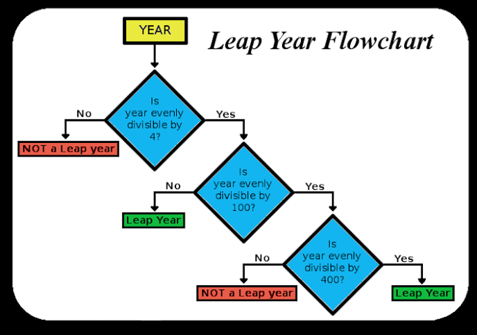

---
presentation:
  width: 1280
  height: 720
  margin: 0
  center: false
  transition: "convex"
  enableSpeakerNotes: true
  slideNumber: "c/t"
  navigationMode: "linear"
---

@import "../../css/font-awesome-4.7.0/css/font-awesome.css"
@import "../../css/theme/solarized.css"
@import "../../css/logo.css"
@import "../../css/font.css"
@import "../../css/color.css"
@import "../../css/margin.css"
@import "../../css/table.css"
@import "../../css/main.css"
@import "../../plugin/zoom/zoom.js"
@import "../../plugin/customcontrols/plugin.js"
@import "../../plugin/customcontrols/style.css"
@import "../../plugin/chalkboard/plugin.js"
@import "../../plugin/chalkboard/style.css"
@import "../../plugin/menu/menu.js"
@import "../../js/anychart/anychart-core.min.js"
@import "../../js/anychart/anychart-venn.min.js"
@import "../../js/anychart/pastel.min.js"
@import "../../js/anychart/venn-ml.js"


<!-- slide data-notes="" -->

<div class="bottom20"></div>

# 智能程序设计（C语言）

<hr class="width50 center">

## 选择结构 (上)

<div class="bottom8"></div>

### 计算机学院 &nbsp;&nbsp; 杨已彪

#### [yangyibiao@nju.edu.cn](mailto:yangyibiao@nju.edu.cn)


<!-- slide data-notes="" -->

##### 提纲

---

- 结构化算法与三种基本结构

- if 语句与 else 子句

- 关系、判等与逻辑运算

- 演示: min、闰年、三角形、奇偶判断

---


<!-- slide data-notes="" -->

##### 结构化算法与三种基本结构

---

==结构化程序设计==: 任何程序都可以只用 ==顺序==、==选择==、==循环== 三种基本结构组合而成 (自顶向下、逐步细化)

- ==顺序==: 语句一条接一条执行

- ==选择==: 根据条件决定走哪条分支 (`if` / `switch`)

- ==循环==: 重复执行一段语句 (`while` / `do` / `for`)

<span class="blue">:fa-lightbulb-o:</span> 本节学习 ==选择== 结构——让程序会"判断"

---
<!-- slide data-notes="" -->

##### 选择语句

---

到目前为止, 我们已经写过了返回语句和表达式语句。==C 语言==其余的大部分语句: 

- ==选择语句==: `if` 和 `switch` (本节讲 `if`)

- ==循环语句==: `while`、`do` 和 `for`

- ==跳转语句==: `break`、`continue`、`goto` (`return` 也属于这一类)

- ==其他语句==: 复合语句 `{ }` 和空语句 `;`

---
<!-- slide data-notes="" -->

##### if语句

---

<div style="display:flex;align-items:flex-start;gap:24px;">

<div style="flex:1.3;">

==if 语句==的形式: `if (表达式) 语句`

- 表达式非零 (真) → 执行语句; 为零 (假) → 跳过语句

- <span class="yellow">:fa-weixin:</span> 表达式两边的==圆括号是必须的==——它是 `if` 语句的组成部分

</div>

<div style="flex:1;font-size:0.75em;">

```C{.line-numbers}
/* 第 1 周的猜数字游戏 */
if (guess == reward)
    printf("恭喜, 猜对了!\n");
```

</div>

</div>

---
<!-- slide data-notes="" -->


##### else子句

---

<div style="display:flex;align-items:flex-start;gap:24px;">

<div style="flex:1.2;font-size:0.62em;">

```C{.line-numbers}
if (i > j)
  max = i;
else
  max = j;
```

```C{.line-numbers}
if (i > j) max = i;
else max = j;
```

</div>

<div style="flex:1;">

`if` 语句可以带一个 ==`else`== 子句: `if (表达式) 语句 else 语句`

- 表达式值为 `0` → 执行 `else` 后面的语句; 非零 → 执行 `if` 后面的语句

- 内部语句短时, 可以==写成一行== (如左)

- `if`/`else` 各控制==一条==语句; 要控制多条, 记得用复合语句 `{ }` (后面会讲)


</div>

</div>

<!-- slide data-notes="" -->


##### 逻辑表达式

---

`C` 里"判断真假"的表达式就是==逻辑表达式==——把两个值做比较, 结果是一个整数:

- 成立 → ==`1`== (真); 不成立 → ==`0`== (假)

许多编程语言有专门的"布尔类型"; ==C 没有==——真假就是普通整数 `0` 和 `1`

<div class="fullborder">

| 表达式 | 值 | 说明 |
| :-- | :-- | :-- |
| `10 < 11` | `1` | 10 确实小于 11 |
| `11 < 10` | `0` | 不成立 |
| `1 < 2.5` | `1` | 整数和浮点数可以混合比较 |
| `5.6 < 4` | `0` | 不成立 |

</div>

- 逻辑表达式==可以用在任何需要值的地方==: 打印、赋值、参与运算都可以——`i < j` 就是一个"值为 `0` 或 `1`"的普通表达式

---


<!-- slide data-notes="" -->

##### 关系运算符

---

<div style="display:flex;align-items:flex-start;gap:24px;">

<div style="flex:1;">

==关系运算符== 用来比较两个值的大小: 

<div class="threelines column1-border-left-solid column1-border-right-solid column2-border-right-solid head-highlight-1 tr-hover">

| 符号 | 含义 |
| :-- | :-- |
| `<` | 小于 |
| `>` | 大于 |
| `<=`| 小于或等于 |
| `>=`| 大于或等于 |

</div>

</div>

<div style="flex:1;">

- 比较的结果是整数 `0` (==假==) 或 `1` (==真==)

- 可以比较整数、浮点数, 也允许==混合比较== (`1 < 2.5` 成立)

- 优先级==低于==算术运算符: `i + j < k - 1` 表示 `(i + j) < (k - 1)`

- 关系运算符是==左结合==的

</div>

</div>

---
<!-- slide data-notes="" -->

##### 关系运算符

---

<div style="display:flex;align-items:flex-start;gap:24px;">

<div style="flex:1.25;">

`i < j < k` 看起来像"判断 `j` 是否在 `i` 和 `k` 之间", 语法上==合法==——但==不是那个意思==: 

```C
(i < j) < k
```

`<` 是==左结合==的: 先算 `i < j` 得 `0` 或 `1`, 再拿结果和 `k` 比

</div>

<div style="flex:1;">

- 例: `i = 5, j = 1, k = 2`——数学上 `5 < 1` 已不成立, 应判假; 而 C 算 `(5 < 1) < 2` = `0 < 2` = `1`, ==判了真==

<span class="yellow">:fa-weixin:</span> 正确写法: `i < j && j < k` (逻辑与, 下一页讲)

</div>

</div>

---
<!-- slide data-notes="" -->

##### 判等运算符

---

<div style="display:flex;align-items:flex-start;gap:24px;">

<div style="flex:1;">

==判等运算符== 判断两个值是否相等: 

<div class="threelines column1-border-left-solid column1-border-right-solid column2-border-right-solid head-highlight-1 tr-hover">

| 符号  | 含义   |
| :--  | :--    |
| `==` | 等于   |
| `!=` | 不等于 |

</div>

</div>

<div style="flex:1;">

- 结果同样是 `0` (==假==) 或 `1` (==真==), 左结合

- 优先级==低于==关系运算符: `i < j == j < k` 要先算两边的比较, 再判相等

- 即: `(i < j) == (j < k)`

<span class="yellow">:fa-weixin:</span> ==判等== `==` 与 ==赋值== `=` 极易混淆——下一页演示后果

</div>

</div>

---
<!-- slide data-notes="" -->

##### 演示: if (x = 5) 的经典 bug

---

<div style="display:flex;align-items:flex-start;gap:24px;">

<div style="flex:1.25;font-size:0.7em;">

```C{.line-numbers}
#include <stdio.h>

int main(void) {
    int x = 0;
    if (x = 5)          /* 本意是 x == 5, 少打了一个 = */
        printf("x 等于 5\n");
    else
        printf("x 不等于 5\n");
    printf("x = %d\n", x);
    return 0;
}
```

```
x 等于 5
x = 5
```

</div>

<div style="flex:1;">

- `x = 5` 是==赋值表达式==, 它的值就是 `5` (非零 → ==真==), 条件永远成立

- 更糟的是 `x` 被==悄悄改成了 5==——bug 静默发生, 编译器通常不报错 (开 `-Wall` 会警告)

- 防御写法: 把常量放左边 ==`if (5 == x)`==——写错成 `5 = x` 时编译器直接报错 (不能给常量赋值)

</div>

</div>

---
<!-- slide data-notes="" -->

##### 逻辑运算符

---

<div style="display:flex;align-items:flex-start;gap:24px;">

<div style="flex:1;">

==逻辑运算符== 把简单判断组合成复杂判断: 

<div class="threelines column1-border-left-solid column1-border-right-solid column2-border-right-solid head-highlight-1 tr-hover">

| 符号 | 含义 |
| :-- | :-- |
| `!` | 逻辑非 (一元) |
| `&&` | 逻辑与 (二元) |
| `||` | 逻辑或 (二元) |

</div>

- ==任何非零值都算真==, `0` 算假; 结果也是 `0` 或 `1`

</div>

<div style="flex:1;">

- `!表达式`: 表达式为 `0` 时结果为 `1` (取反)

- `表达式1 && 表达式2`: ==两个都不为零==才得 `1`

- `表达式1 || 表达式2`: ==任意一个不为零==就得 `1`

</div>

</div>

---
<!-- slide data-notes="" -->

##### 逻辑运算符

---

<div style="display:flex;align-items:flex-start;gap:24px;">

<div style="flex:1.2;">

==&&== 和 ==||== 会进行 =="短路"== 计算: 先算左操作数, 若结果已经能定, ==右边就不算了==

```C
(i != 0) && (j / i > 0)
```

</div>

<div style="flex:1;">

- 若 `i` 为 `0`: 左边已为假, 整个 `&&` 必定为假 → 右边的 `j / i` ==不会计算==, 避免了除零

- 若 `i` 不为 `0`: 才轮到右边——这正是"==先判除数非零, 再做除法=="的安全写法

</div>

</div>

---
<!-- slide data-notes="" -->

##### 逻辑运算符

---

<div style="display:flex;align-items:flex-start;gap:24px;">

<div style="flex:1.25;">

因为短路, 表达式里的==副作用可能根本不发生==: `i > 0 && ++j > 0`

- 若 `i > 0` 为假, `++j` 不会执行, `j` 也不自增

</div>

<div style="flex:1;">

优先级小结: `!` 与一元正负同级; `&&`、`||` ==低于==关系/判等; `&&` 高于 `||`

- `i < j && k == m` 表示先算两边的比较, 再做逻辑与

- 即: `(i < j) && (k == m)`

- `!` 右结合; `&&`、`||` 左结合

</div>

</div>

---
<!-- slide data-notes="" -->

##### if语句: 范围判断

---

`if` 常用于==范围判断==。判断 `i` 满足 $0 \leq i < n$:

```C
if (0 <= i && i < n) …
```

判断相反条件 (`i` 超出范围): `if (i < 0 || i >= n) …`

- 数学上的"连写" `0 <= i < n` 在 C 里==是错的== (连比较陷阱, 前面刚讲过)——必须用 `&&` 把两个条件连起来

<span class="blue">:fa-lightbulb-o:</span> 范围判断是 if 的==最高频用法==: 检查下标、成绩、温度……都长这样

---
<!-- slide data-notes="" -->

##### 复合语句

---

<div style="display:flex;align-items:flex-start;gap:24px;">

<div style="flex:1.2;">

`if` 的模板里 statement 是==单数==: `if (表达式) 语句`

要控制==多条==语句, 用==复合语句==把多条包成"一条": `{ 语句1 语句2 … }`

- 大括号让编译器把一组语句==当作一条语句==

- 内部语句照常带分号; ==复合语句本身没有分号==

</div>

<div style="flex:1;font-size:0.75em;">

```C
{ t = a; a = b; b = t; }   /* 交换两个数: 三条语句包成一条 */
```

```C
{
  t = a;
  a = b;
  b = t;
}
```

</div>

</div>

---
<!-- slide data-notes="" -->

##### 复合语句

---

<div style="display:flex;align-items:flex-start;gap:24px;">

<div style="flex:1.25;font-size:0.75em;">

```C
if (a > b) {                 /* 若 a 比 b 大就交换 */
    int t = a;
    a = b;
    b = t;
}
```

</div>

<div style="flex:1;">

- 条件成立时, 大括号里的==三条语句都执行==; 不加大括号只会执行第一条

- 复合语句也用在循环等其他"只接受一条语句"的地方

</div>

</div>

---
<!-- slide data-notes="" -->


##### else子句

---

<div style="display:flex;align-items:flex-start;gap:24px;">

<div style="flex:1;font-size:0.55em;">

==缩进对齐版== (不用大括号): 

```C{.line-numbers}
if (i > j)
  if (i > k)
    max = i;
  else 
    max = k;
else
  if (j > k)
    max = j;
  else 
    max = k;
```

</div>

<div style="flex:1;font-size:0.55em;">

==大括号版== (层次清晰): 

```C{.line-numbers}
if (i > j) {
  if (i > k) {
    max = i;
  } else {
    max = k;
  }
} else {
  if (j > k) {
    max = j;
  } else {
    max = k;
  }
}
```

</div>

<div style="flex:1;">

`if` 语句嵌套在另一个 `if` 里==很普遍==

- 左右两种写法==功能完全一样==

- 靠缩进对齐 `else` 能帮助辨别层次, 但容易写错

- ==大括号==让层次一目了然, 是更稳妥的习惯

</div>

</div>

<!-- slide data-notes="" -->

##### else子句

---

大括号的优点 (即使只有一条语句也建议加): 

- 程序更易修改——以后往 `if`/`else` 里加语句不用补大括号

- 避免"忘加大括号"类错误——缩进对齐了, 逻辑没对齐 (下一课的"悬空 else"就是典型)

---
<!-- slide data-notes="" -->


##### 演示: min of two

---

==现场演示==: 输入两个整数, 输出其中较小的一个

---


<!-- slide data-notes="" -->


##### 演示: min of two (参考代码)

---

<div style="display:flex;align-items:flex-start;gap:24px;">

<div style="flex:1.15;font-size:0.7em;">

```C
#include <stdio.h>

int main() {
    int a = 0;
    int b = 0;
    scanf("%d%d", &a, &b);
    int min = 0;
    if (a < b)
        min = a;
    else
        min = b;

    printf("min(%d, %d) = %d", a, b, min);
}
```

</div>

<div style="flex:1;">

- `min` 先取 `a`, 若 `b` 更小再换成 `b`——"==先假定, 再修正=="的常用思路

- 输入 `5 3` → `min(5, 3) = 3`

- if/else 各控制一条语句, 花括号可省略; 但养成==加花括号==的习惯更安全

</div>

</div>

---


<!-- slide data-notes="" -->


##### 演示: min of three

---

==现场演示==: 输入三个整数, 输出其中最小的一个

---


<!-- slide data-notes="" -->


##### 演示: min of three (参考代码 1: 嵌套版)

---

<div style="display:flex;align-items:flex-start;gap:24px;">

<div style="flex:1.2;font-size:0.62em;">

```C
#include <stdio.h>

int main() {
    int a = 0;
    int b = 0;
    int c = 0;
    scanf("%d%d%d", &a, &b, &c);
    int min = 0;
    if (a < b) {
        if (a < c) {
            min = a;
        } else {
            min = c;
        }
    } else {
        if (b < c) {
            min = b;
        } else {
            min = c;
        }
    }
    printf("min(%d, %d, %d) = %d", a, b, c, min);
    return 0;
}
```

</div>

<div style="flex:1;">

- 外层 `if (a < b)` 决定先排除谁, 内层再和 `c` 比——==嵌套 if/else== 的经典结构

- 输入 `8 3 5` → `min(8, 3, 5) = 3`


</div>

</div>

<!-- slide data-notes="" -->


##### 演示: min of three (挑战: 另一种写法)

---

写完了? ==还有另一种写法==——不用嵌套

延续 min of two 的"==先假定, 再修正=="思路: `min` 先取 `a`, 然后逐个比较替换

<span class="yellow">:fa-weixin:</span> 试试看, 再翻页看参考代码 2

---


<!-- slide data-notes="" -->


##### 演示: min of three (参考代码 2: 单分支版)

---

<div style="display:flex;align-items:flex-start;gap:24px;">

<div style="flex:1.2;font-size:0.7em;">

```C
#include <stdio.h>

int main(void) {
    int a = 0, b = 0, c = 0;
    scanf("%d%d%d", &a, &b, &c);
    int min = a;              /* 先假定 a 最小 */
    if (b < min) min = b;     /* b 更小就换 */
    if (c < min) min = c;     /* c 更小就换 */
    printf("min(%d, %d, %d) = %d", a, b, c, min);
    return 0;
}
```

</div>

<div style="flex:1;">

- 三个 `if` 都是==单分支==——if 不配 else 也合法

- 输入 `8 3 5` → `min(8, 3, 5) = 3` (先 3 换掉 8, 5 不动)

- "先假定, 再修正"的思路==第 8 周学数组后会大放异彩== (循环里不断更新最小值)

</div>

</div>

---
<!-- slide data-notes="" -->


##### 演示: 闰年判断

---

==现场演示==: 输入年份, 判断是否为闰年

闰年规则: ==能被 4 整除且不能被 100 整除, 或能被 400 整除== (2024 是闰年, 1900 不是, 2000 是)

<div class="top-2">
  
</div>

<span class="yellow">:fa-weixin:</span> 对照流程图写代码

---


<!-- slide data-notes="" -->


##### 演示: 闰年判断 (参考代码)

---

<div style="display:flex;align-items:flex-start;gap:24px;">

<div style="flex:1.4;font-size:0.55em;">

```C
#include <stdio.h>

int main(void) {
    int year = 0;
    scanf("%d", &year);

    int leap = 0; // boolean; indicator; flag
    if (year % 4 == 0) {
        if (year % 100 == 0) {
            if (year % 400 == 0) {
                leap = 1;
            } else {
                leap = 0;
            }
        } else {
            leap = 1;
        }
    } else {
        leap = 0;
    }

    if (leap == 0) {
       printf("%d is a common year\n", year);
    } else {
       printf("%d is a leap year\n", year);
    }
    return 0;
}
```

</div>

<div style="flex:1;">

- 三层嵌套 if/else 对应流程图的==三个判断框==

- `leap` 是==标志变量== (flag/indicator): 先算"是闰年吗"存成 `0`/`1`, 输出时再看标志——"算"和"用"分离, 结构清晰

- 化简版 (一个 `&&`/`||` 复合条件搞定) 周三 4-2 讲

- 测试: `2024` → leap year; `1900` → common year; `2000` → leap year

</div>

</div>


<!-- slide data-notes="" -->


##### 演示: 三角形判定

---

==现场演示==: 输入三边 `a b c`, 判断能否构成三角形

规则: ==任意两边之和大于第三边==——三个条件要==同时==成立

---


<!-- slide data-notes="" -->


##### 演示: 三角形判定 (参考代码)

---

<div style="display:flex;align-items:flex-start;gap:24px;">

<div style="flex:1.2;font-size:0.7em;">

```C
#include <stdio.h>

int main(void) {
    int a = 0, b = 0, c = 0;
    scanf("%d%d%d", &a, &b, &c);
    if (a + b > c && a + c > b && b + c > a)
        printf("能构成三角形\n");
    else
        printf("不能构成三角形\n");
    return 0;
}
```

</div>

<div style="flex:1;">

==现场边写边讲==: ① 声明 `a b c` + `scanf`; ② 写条件——把三个条件用刚学的 ==`&&`== 连起来; ③ 补 `printf` 两个分支

- 边界: `1 2 3` → 不能 (`1 + 2 > 3` 为假, 相等也不行)

- `&&` 有短路: 第一个条件不成立, 后面就不算了

</div>

</div>

---


<!-- slide data-notes="" -->


##### 演示: 奇偶判断

---

==现场演示==: 输入一个整数, 输出它是奇数还是偶数

<span class="yellow">:fa-weixin:</span> 提示: 除了 `% 2` 的余数, 第 3 周学的==位运算==也能判断——两种方法都想一想

---


<!-- slide data-notes="" -->


##### 演示: 奇偶判断 (参考代码)

---

<div style="display:flex;align-items:flex-start;gap:24px;">

<div style="flex:1.2;font-size:0.7em;">

```C
#include <stdio.h>

int main(void) {
    int n = 0;
    scanf("%d", &n);
    if (n % 2 == 0)              /* 方法一: 取余 */
        printf("%d 是偶数\n", n);
    else
        printf("%d 是奇数\n", n);

    if ((n & 1) == 0)            /* 方法二: 位运算 */
        printf("%d 是偶数\n", n);
    else
        printf("%d 是奇数\n", n);
    return 0;
}
```

</div>

<div style="flex:1;">

==现场边写边讲==: ① 先用刚学的 `%` 写直白版; ② 问: 第 3 周的==位运算==能不能判?——最低位 `n & 1` 试写一遍

- `n % 2`: 偶数除以 2 余 0——最直白

- `n & 1`: 二进制最低位, 偶数必为 0——位运算的第一次实战

- 两种方法结果相同: 位运算往往==更快==, 但 `% 2` 更易读——先写对、再谈快

</div>

</div>

---
<!-- slide data-notes="" -->


##### 课堂习题

---

两道题, 限时 10 分钟, 答案见讲义: 

1. ==正负判定==: 输入一个整数, 输出"正数 / 负数 / 零"三个分支 (if/else 嵌套)

2. ==水仙花数判定==: 输入一个 3 位整数, 判断是否水仙花数 (各位立方和等于本身, 如 `153 = 1³+5³+3³`)——复习第 3 周的数字拆分

---
<!-- slide data-notes="" -->


##### 课堂小测

---

1. `i < j < k` 能判断 j 是否在 i 和 k 之间吗？正确的写法是什么？

2. `if (i = 0)` 与 `if (i == 0)` 有什么区别？哪个是常见错误？

3. `(i != 0) && (j / i > 0)` 中短路计算起了什么作用？

4. if 语句要控制两条语句时，应该怎么写？


<!-- slide data-notes="" -->


#####

---

<div class="bottom20"></div>

# 周三见!

<hr class="width50 center">

## 未完待续

---


