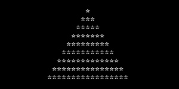
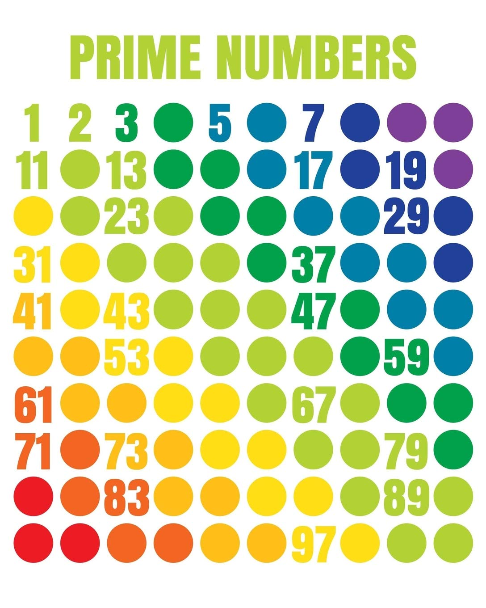
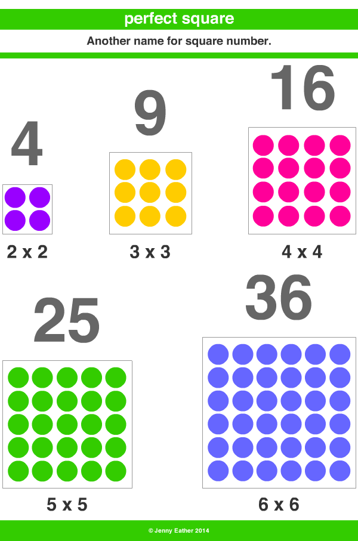

---
presentation:
  width: 1280
  height: 720
  margin: 0
  center: false
  transition: "convex"
  enableSpeakerNotes: true
  slideNumber: "c/t"
  navigationMode: "linear"
---

@import "../../css/font-awesome-4.7.0/css/font-awesome.css"
@import "../../css/theme/solarized.css"
@import "../../css/logo.css"
@import "../../css/font.css"
@import "../../css/color.css"
@import "../../css/margin.css"
@import "../../css/table.css"
@import "../../css/main.css"
@import "../../plugin/zoom/zoom.js"
@import "../../plugin/customcontrols/plugin.js"
@import "../../plugin/customcontrols/style.css"
@import "../../plugin/chalkboard/plugin.js"
@import "../../plugin/chalkboard/style.css"
@import "../../plugin/menu/menu.js"
@import "../../js/anychart/anychart-core.min.js"
@import "../../js/anychart/anychart-venn.min.js"
@import "../../js/anychart/pastel.min.js"
@import "../../js/anychart/venn-ml.js"


<!-- slide data-notes="" -->

<div class="bottom20"></div>

# 智能程序设计（C语言）

<hr class="width50 center">

## 循环结构 (下)

<div class="bottom8"></div>

### 计算机学院 &nbsp;&nbsp; 杨已彪

#### [yangyibiao@nju.edu.cn](mailto:yangyibiao@nju.edu.cn)


<!-- slide data-notes="" -->

##### 提纲

---

- for 语句与常见用法

- C99 的 for 与逗号运算符

- 嵌套循环: 打印星号塔

- 算法案例: 累加累乘、素数、非完全平方数

---


<!-- slide data-notes="" -->


##### for语句

---

<div style="display:flex;align-items:flex-start;gap:24px;">

<div style="flex:1.2;font-size:0.7em;">

```C
for (表达式1; 表达式2; 表达式3) 语句
```

```C
for (i = 10; i > 0; i--) 
  printf("T minus %d and counting\n", i);
```

```C
表达式1;
while (表达式2) {
  语句
  表达式3;
}
```

</div>

<div style="flex:1;">

`for` 非常适合使用==计数变量==的循环 (也可用于其他循环); 一般形式:

表达式1: 初始化表达式

- 表达式2: 条件判断表达式

- 表达式3: 变量递增/减表达式

`for` 与 `while` 密切相关, 除极少数情况外总可互换:

表达式1是一个初始化步骤, 只在循环开始之前执行一次; 表达式2 控制循环终止(只要表达式2的值非零, 循环就会继续执行); 表达式3 是每次循环中最后被执行的一个操作

</div>

</div>

<!-- slide data-notes="" -->


##### for语句

---

研究等效的while语句有助于更好地理解for语句

例如, 如果`i--`被替换为`—-i`会如何？

```C
for (i = 10; i > 0; --i) 
  printf("T minus %d and counting\n", i);
```

等效的while循环表明这种更改对循环没有影响:

```C
i = 10;
while (i > 0) {
  printf("T minus %d and counting\n", i);
  --i;
}
```

for语句中的第一个和第三个表达式都是以语句的方式执行的, 它们的值是无关紧要的——它们有用仅仅是因为有副作用; 因此, 这两个表达式通常是赋值递增/递减表达式

---

<!-- slide data-notes="" -->


##### for语句常见用法

---

`for` 是向上计数 (==变量递增==) 或向下计数 (==变量递减==) 循环的最佳选择, 常见形式:

```C{.line-numbers}
/* 从0计数到n – 1 */       for (i = 0; i < n; i++) ...
/* 从1计数到n */           for (i = 1; i <= n; i++) ...
/* 从n – 1倒数到0 */       for (i = n - 1; i >= 0; i--) ...
/* 从n倒数到1 */           for (i = n; i > 0; i--) ...
```

常见的for语句错误:

- 在控制表达式中把`>`写成`<`(或者相反). 向上计数循环的控制语句应使用`<`或`<=`运算符. 向下计数循环应该使用`>`或`>=`

- 在控制表达式中把`<`、`<=`、`>`或`>=`写成`==`. `i==n`这样的判定没有意义, 因为它的初始值不为真

- 循环次数差一错误, 例如在控制表达式中把`i < n`写为`i <= n`

---

<!-- slide data-notes="" -->


##### for语句省略表达式

---

<div style="display:flex;align-items:flex-start;gap:24px;">

<div style="flex:1.2;font-size:0.7em;">

```C{.line-numbers}
i = 10; 
for (; i > 0; --i) 
  printf("T minus %d and counting\n", i);
```

```C{.line-numbers}
for (i = 10; i > 0;) 
  printf("T minus %d and counting\n", i--);
```

```C
  for (;;) …
```

</div>

<div style="flex:1;">

`C`允许省略`for语句`中的表达式

如果省略第一个表达式, 则在执行循环之前没有初始化的操作:

如果省略第三个表达式, 则循环体需要确保第二个表达式的值最终变为`false`:

当`for`语句同时省略第一个和第三个表达式时, 它和`while`语句没有任何分别, `while`版本更清晰, 因此更推荐

如果省略第二个表达式, 则它 ==默认为真值==, 因此for语句不会终止(除非以其他方式停止); 一些程序员使用下面的for语句来建立一个无限循环:


</div>

</div>

<!-- slide data-notes="" -->


##### C99中的for语句

---

<div style="display:flex;align-items:flex-start;gap:24px;">

<div style="flex:1.2;font-size:0.7em;">

```C
for (int i = 0; i < n; i++)
  …
```

```C{.line-numbers}
for (int i = 0; i < n; i++) {
  …
  printf("%d", i); /* 合法的; i 在循环内可见 */
  …
}
printf("%d", i); /*** WRONG ***/
```

```C{.line-numbers}
for (int i = 0, j = 0; i < n; i++)
  …
```

</div>

<div style="flex:1;">

在 `C99` 中, `for`语句中的第一个表达式可以替换为声明

此功能允许程序员声明一个供循环使用的变量(作用域):

变量i不需要在此语句之前声明

由`for`语句声明的变量不能在循环外访问(在循环外不可见):

让`for`语句声明它自己的循环控制变量通常是一个好主意: 它很方便且程序的可读性更强; 但是, 如果程序需要在循环终止后访问该变量, 则必须使用以前的`for`语句格式

`for`语句可以声明多个变量, 只要它们的类型相同:


</div>

</div>

<!-- slide data-notes="" -->


##### 逗号运算符

---

`for` 需要两个初始化表达式或一次递增多个变量时, 可用==逗号表达式==作第一或第三个表达式, 形式为:

```C
表达式1, 表达式2
```

计算逗号表达式的步骤:

- 首先计算表达式1并且丢弃计算出的值
- 然后计算表达式2, 并把它的值作为整个表达式的值

<span class="blue">:fa-weixin:</span> 逗号运算符的优先级==低于==所有其他运算符, 结合方向为左结合

例子: 

```C
i = 1, j = 2, k = i + j   /* (i=1), (j=2), (k=i+j) */
```

---

<!-- slide data-notes="" -->


##### 程序: 打印平方表 (for版)

---

<div style="display:flex;align-items:flex-start;gap:24px;">

<div style="flex:1.3;font-size:0.6em;">

```C{.line-numbers}
/* 使用 for 语句打印一个平方表 */
 
#include <stdio.h>
 
int main(void)
{
  int i, n;
  
  printf("This program prints a table of squares.\n");
  printf("Enter number of entries in table: ");
  scanf("%d", &n);
 
  for (i = 1; i <= n; i++)
    printf("%10d%10d\n", i, i * i);
 
  return 0;
}
```

</div>

<div style="flex:1;">

使用 `for` 语句重写平方表程序:

对比 while 版本: for 把初始化、判定、递增三件事集中在一行, 计数循环更清晰

</div>

</div>

<!-- slide data-notes="" -->


##### 嵌套循环: 打印星号塔

---

<div style="display:flex;align-items:flex-start;gap:24px;">

<div style="flex:1.3;font-size:0.55em;">

```C
/* stars.c: 打印星号塔 */
#include <stdio.h>

int main(void)
{
    int n;
    printf("Enter height: ");
    scanf("%d", &n);

    for (int i = 1; i <= n; i++) {        /* 外层: 控制行数 */
        for (int j = 1; j <= i; j++)      /* 内层: 控制每行星号个数 */
            printf("*");
        printf("\n");
    }
    return 0;
}
```

</div>

<div style="flex:1;">

==现场演示==

用两层循环打印星号塔:

<div class="top-2">
  
</div>

<span class="blue">:fa-lightbulb-o:</span> 外层循环每执行一次, 内层循环完整执行一轮

</div>

</div>

<!-- slide data-notes="" -->


##### 算法案例: 数据交换、累加、累乘

---

==数据交换==: 交换两个变量的值 (借助临时变量)

<div style="font-size:0.85em;">

```C
int a = 3, b = 5, t;
t = a; a = b; b = t;   /* a 为 5, b 为 3 */
```

</div>

==累加==: 计算 1+2+...+n

<div style="font-size:0.85em;">

```C
int sum = 0;
for (int i = 1; i <= n; i++)
    sum += i;
```

</div>

==累乘==: 计算 n! (注意: 初始值为 1, 且很快溢出)

<div style="font-size:0.85em;">

```C
int product = 1;
for (int i = 1; i <= n; i++)
    product *= i;
```

</div>

<span class="blue">:fa-weixin:</span> 累加器初始化为 0, 累乘器初始化为 1——这是循环的经典写法

---

<!-- slide data-notes="" -->


##### 算法案例: 素数判断

---

<div style="display:flex;align-items:flex-start;gap:24px;">

<div style="flex:1.3;font-size:0.55em;">

```C
/* primes.c: 判断 n 是否为素数 */
#include <stdio.h>

int main(void) {
    int n, d;
    printf("Enter a number: ");
    scanf("%d", &n);

    for (d = 2; d < n; d++)
        if (n % d == 0)
            break;              /* 找到约数, 提前退出 */

    if (d < n)
        printf("%d is not a prime\n", n);
    else
        printf("%d is a prime\n", n);
    return 0;
}
```

</div>

<div style="flex:1;">

判断 n 是否为素数: 检查 2 ~ n-1 之间是否存在约数

<div class="top-2">
  
</div>

<span class="blue">:fa-lightbulb-o:</span> 改进: 只需检查到 $\sqrt{n}$ (下节课配合 sqrt 函数实现)

</div>

</div>

<!-- slide data-notes="" -->


##### 算法案例: 非完全平方数的和

---

<div style="display:flex;align-items:flex-start;gap:24px;">

<div style="flex:1.3;font-size:0.55em;">

```C
/* perfectsquare.c: 1~n 中非完全平方数之和 */
#include <stdio.h>
#include <math.h>

int main(void) {
    int n, sum = 0;
    printf("Enter n: ");
    scanf("%d", &n);

    for (int i = 1; i <= n; i++) {
        int r = (int) sqrt(i);
        if (r * r == i)
            continue;          /* 完全平方数, 跳过 */
        sum += i;
    }
    printf("sum = %d\n", sum);
    return 0;
}
```

</div>

<div style="flex:1;">

计算 1~n 中所有==非完全平方数==的和

<div class="top-2">
  
</div>

<span class="blue">:fa-lightbulb-o:</span> continue + sqrt 的组合: 循环与数学库函数的第一次合作

</div>

</div>

<!-- slide data-notes="" -->


##### 课堂小测

---

1. `for (i = 0; i < n; i++)` 循环体执行了多少次？

2. `for (;;)` 是什么循环？省略的三个表达式分别默认什么？

3. 打印 n 行星号塔，外层和内层循环分别控制什么？

4. 计算 1+2+...+100 用循环怎么写？如果 n=100，累乘 100! 用什么类型存结果？


<!-- slide data-notes="" -->


#####

---

<div class="top-2">
  
</div>

---


