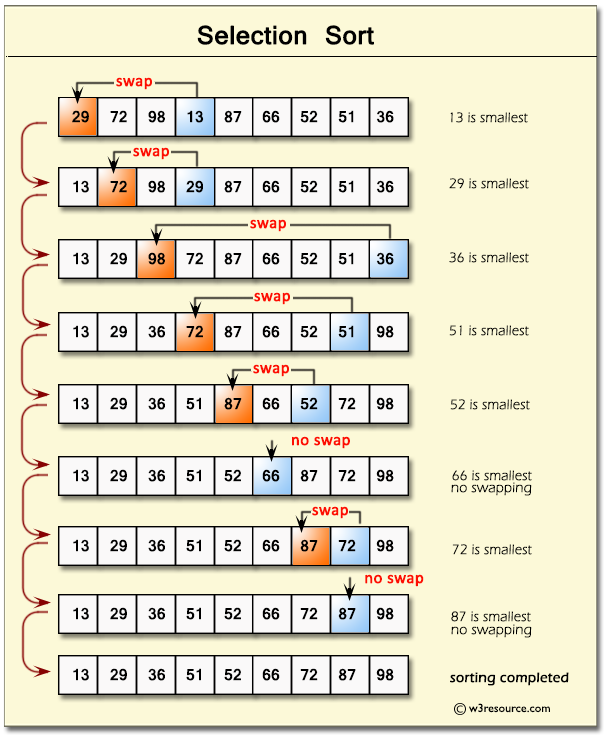
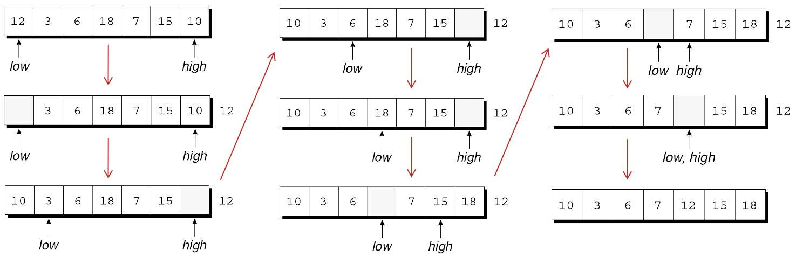

---
presentation:
  margin: 0
  center: false
  transition: "convex"
  enableSpeakerNotes: true
  slideNumber: "c/t"
  navigationMode: "linear"
---

@import "../../css/font-awesome-4.7.0/css/font-awesome.css"
@import "../../css/theme/solarized.css"
@import "../../css/logo.css"
@import "../../css/font.css"
@import "../../css/color.css"
@import "../../css/margin.css"
@import "../../css/table.css"
@import "../../css/main.css"
@import "../../plugin/zoom/zoom.js"
@import "../../plugin/customcontrols/plugin.js"
@import "../../plugin/customcontrols/style.css"
@import "../../plugin/chalkboard/plugin.js"
@import "../../plugin/chalkboard/style.css"
@import "../../plugin/menu/menu.js"
@import "../../js/anychart/anychart-core.min.js"
@import "../../js/anychart/anychart-venn.min.js"
@import "../../js/anychart/pastel.min.js"
@import "../../js/anychart/venn-ml.js"

<!-- slide data-notes="" -->

<div class="bottom20"></div>

# 智能程序设计（C语言）

<hr class="width50 center">

## 排序与查找

<div class="bottom8"></div>

### 计算机学院 &nbsp;&nbsp; 杨已彪

#### [yangyibiao@nju.edu.cn](mailto:yangyibiao@nju.edu.cn)


<!-- slide data-notes="" -->

##### 提纲

---

- 数组作函数参数 (排序函数的基础)

- 三种排序: 选择、冒泡、插入

- 查找: 顺序查找与二分查找

- 递归排序: 快速排序

---


<!-- slide data-notes="" -->


##### 为什么排序与查找

---

成绩排名、字典、数据库……==排序==和==查找==是程序处理数据的基本功

- 排序: 把一组数据按大小整理好

- 查找: 在一组数据中找到目标

<span class="blue">:fa-lightbulb-o:</span> 第 1 周的冒泡排序预告, 今天正式实现!

---


<!-- slide data-notes="" -->


##### 数组作函数参数

---

排序函数要对数组操作, 先学会==把数组传给函数==

```C
int sum_array(int a[], int n)   /* 形参: 数组 + 长度 */
{
  int i, sum = 0;
  for (i = 0; i < n; i++)
    sum += a[i];
  return sum;
}
```

- 一维数组形参写作 ==`int a[]`==, 长度可以==不写==

- 函数==不知道==数组有多长——长度必须作为==额外的参数==传进去

- 调用时只写==数组名==, 不要加方括号: `sum_array(b, LEN);` (`b[]` 是错的)

---


<!-- slide data-notes="" -->


##### 数组作函数参数: 能改原数组

---

函数不仅可以==读==数组, 还可以==改==它——改动会反映到原数组

```C{.line-numbers}
void store_zeros(int a[], int n)
{
  int i;
  for (i = 0; i < n; i++)
    a[i] = 0;              /* 把 b 的每个元素清零 */
}
```

```C
int b[100];
store_zeros(b, 100);       /* 调用后 b 全为 0 */
```

- 排序函数正是利用这一点: `bubble_sort(a, n)` 之后 ==a 本身就被排好了==

- <span class="blue">:fa-lightbulb-o:</span> 这看似和"按值传递"矛盾——第 10 周指针章会解释为什么

---


<!-- slide data-notes="" -->


##### 数组作函数参数: 注意事项

---

- 传的长度==不要超过==数组实际长度, 否则越界访问 (未定义行为)

```C
int b[100];
total = sum_array(b, 150);   /*** WRONG: 越界 ***/
```

- 也可以传==更小==的长度, 只处理数组的一部分:

```C
total = sum_array(b, 50);    /* 只求前 50 个元素的和 */
```

- 多维数组作参数时, ==只能省略第一维==的长度: `int sum(int a[][LEN], int n)`

---


<!-- slide data-notes="" -->


##### 选择排序

---

每一轮从剩余元素中==选出最小==的, 放到前面

<div class="top-2">
  
</div>

```C
void selection_sort(int a[], int n)
{
  for (int i = 0; i < n - 1; i++) {
    int min = i;
    for (int j = i + 1; j < n; j++)
      if (a[j] < a[min])
        min = j;
    int t = a[i]; a[i] = a[min]; a[min] = t;
  }
}
```

---


<!-- slide data-notes="" -->


##### 冒泡排序

---

相邻元素两两比较, 顺序不对就交换, 一轮后最大的元素"沉"到最后

```C
void bubble_sort(int a[], int n)
{
  for (int i = 0; i < n - 1; i++)           /* 共 n-1 轮 */
    for (int j = 0; j < n - 1 - i; j++)     /* 每轮少比一个 */
      if (a[j] > a[j + 1]) {
        int t = a[j];
        a[j] = a[j + 1];
        a[j + 1] = t;
      }
}
```

---


<!-- slide data-notes="" -->


##### 插入排序

---

像打牌理手牌: 每次拿起一张, 插到已排序部分的正确位置

```C
void insertion_sort(int a[], int n)
{
  for (int i = 1; i < n; i++) {
    int key = a[i];
    int j = i - 1;
    while (j >= 0 && a[j] > key) {
      a[j + 1] = a[j];
      j--;
    }
    a[j + 1] = key;
  }
}
```

---


<!-- slide data-notes="" -->


##### 顺序查找

---

从第一个元素开始==逐个比较==, 找到即停

```C
int linear_search(int a[], int n, int key)
{
  for (int i = 0; i < n; i++)
    if (a[i] == key)
      return i;      /* 找到, 返回下标 */
  return -1;          /* 没找到 */
}
```

- 适合无序数据; 平均比较 n/2 次, 最坏 n 次

---


<!-- slide data-notes="" -->


##### 二分查找

---

数据==排好序==后, 可以每次砍掉一半: 和中间元素比较, 决定去左半边还是右半边

<div class="top-2">
  
</div>

```C
int binary_search(int a[], int n, int key)
{
  int low = 0, high = n - 1;
  while (low <= high) {
    int mid = (low + high) / 2;
    if (a[mid] == key) return mid;
    if (a[mid] < key) low = mid + 1;
    else high = mid - 1;
  }
  return -1;
}
```

- n 个元素最多比较 log2(n)+1 次——100 万个数也只要约 20 次!

---


<!-- slide data-notes="" -->

##### 分治法

---

==分治法== (divide and conquer): 把大问题拆成几个==同类的小问题==, 分别解决, 再合并结果

- 三步: ==分== (拆) → ==治== (解决小问题) → ==合== (拼起来)

- 生活例子: 整理一摞试卷——分成两摞, 各自整理好, 再合并

- 排序中的分治: 把数组分成两半, 各自排好, 再合并

<span class="blue">:fa-lightbulb-o:</span> 递归常常是分治法的==自然结果==——下一页的快速排序正是如此


<!-- slide data-notes="" -->


##### 递归排序: 快速排序

---

用第 7 周的==递归==做排序: 选一个基准, 小的放左、大的放右, 再对左右递归

```C{.line-numbers}
void quicksort(int a[], int low, int high)
{
  int middle;

  if (low >= high) return;            /* 基准情形: 只剩 0 或 1 个元素 */
  middle = split(a, low, high);       /* 划分: 小的在左, 大的在右 */
  quicksort(a, low, middle - 1);      /* 递归排左半 */
  quicksort(a, middle + 1, high);     /* 递归排右半 */
}
```

- 平均 O(n log n), 比冒泡/选择/插入的 O(n^2) 快得多

- `split` 是划分函数, 下一页展开

---


<!-- slide data-notes="" -->


##### 快速排序: 划分函数 split

---

<div style="display:flex;align-items:flex-start;gap:24px;">

<div style="flex:1.3;font-size:0.6em;">

```C{.line-numbers}
int split(int a[], int low, int high)
{
  int part_element = a[low];

  for (;;) {
    while (low < high && part_element <= a[high])
      high--;
    if (low >= high) break;
    a[low++] = a[high];

    while (low < high && a[low] <= part_element)
      low++;
    if (low >= high) break;
    a[high--] = a[low];
  }

  a[high] = part_element;
  return high;
}
```

</div>

<div style="flex:1;">

==split==: 以 `a[low]` 为基准, 把小元素换到左边、大的换到右边, 返回基准的最终下标

完整可运行程序: [code/qsort-split.c](code/qsort-split.c) (无指针版, 全部用数组下标)

</div>

</div>

<!-- slide data-notes="" -->

##### 一趟划分在做什么: "空位法"

---

以 `a = {4, 3, 9, 7}`, 基准 4 为例:

1. 取出基准 4 → `a[0]` 成了==空位==
2. ==从右往左==找比 4 小的: 3 → 填进左边空位, 右边留下空位
3. ==从左往右==找比 4 大的: 9 → 填进右边空位, 左边又留空位
4. 左右相遇 → 把基准 4 放进最后的空位

结果: 4 左边都比它小、右边都比它大——==一趟划分完成==, 再对左右两半各自递归

<div class="top-2">
  
</div>


<!-- slide data-notes="" -->


##### 课堂编码

---

==现场演示==

1. 输入 10 个数, 用冒泡排序从小到大输出

2. 输入一个数, 在有序数组中用二分查找找到它

---


<!-- slide data-notes="" -->


##### 课堂小测

---

1. 选择排序每一轮做什么？总共需要几轮？

2. 冒泡排序一轮结束后，什么元素"就位"了？

3. 二分查找的前提条件是什么？100 万个元素最多比较几次？

4. 快速排序和前面三种排序的本质区别是什么？

---


<!-- slide data-notes="" -->


#####

---

<div class="bottom20"></div>

# 周三见!

<hr class="width50 center">

## 未完待续

---


