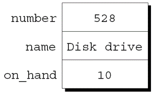

---
presentation:
  margin: 0
  center: false
  transition: "convex"
  enableSpeakerNotes: true
  slideNumber: "c/t"
  navigationMode: "linear"
---

@import "../css/font-awesome-4.7.0/css/font-awesome.css"
@import "../css/theme/solarized.css"
@import "../css/logo.css"
@import "../css/font.css"
@import "../css/color.css"
@import "../css/margin.css"
@import "../css/table.css"
@import "../css/main.css"
@import "../plugin/zoom/zoom.js"
@import "../plugin/customcontrols/plugin.js"
@import "../plugin/customcontrols/style.css"
@import "../plugin/chalkboard/plugin.js"
@import "../plugin/chalkboard/style.css"
@import "../plugin/menu/menu.js"
@import "../js/anychart/anychart-core.min.js"
@import "../js/anychart/anychart-venn.min.js"
@import "../js/anychart/pastel.min.js"
@import "../js/anychart/venn-ml.js"
@import "https://cdn.bootcdn.net/ajax/libs/jquery/3.5.0/jquery.js"


<!-- slide data-notes="" -->

<div class="bottom20"></div>

# C语言程序设计基础

<hr class="width50 center">

## 结构体、联合和枚举


<div class="bottom8"></div>

### 计算机系 &nbsp;&nbsp; 杨已彪

#### _yangyibiao@nju.edu.cn_


<!-- slide vertical=true data-notes="" -->

##### 提纲

---

- <a href="#/structvar">结构体变量</a>

- <a href="#/structtype">结构体类型</a>

- <a href="#/nestedarrandstruct">嵌套的数组和结构体</a>

- <a href="#/union">联合</a>

- <a href="#/enum">枚举</a>


<!-- slide vertical=true data-notes="" -->

##### 结构体变量

---

结构体与数组的特性不同. 

- 结构体的元素(成员)不需要具有相同的类型. 

- 结构体的成员有名字; 为了选择特定的成员, 需要指明它的名字, 而不是它的位置. 

在某些语言中, 结构体称为记录, 成员称为字段. 


<!-- slide id="structvar" vertical=true data-notes="" -->

##### 声明结构体变量

---

在存储相关数据项的集合时, 结构体是个好选择. 

声明两个结构体变量, 用于存储仓库中零件的信息: 

```C{.line-numbers}
struct {
  int number;
  char name[NAME_LEN+1];
  int on_hand;
} part1, part2;
```


<!-- slide vertical=true data-notes="" -->

##### 声明结构体变量

---

结构体的成员按照声明的顺序存储在内存中. part1:

<div class="top-2">
  
</div>


<!-- slide vertical=true data-notes="" -->

##### 声明结构体变量

---

假设: 

- part1位于地址2000. 

- 整数占用4个字节. 

- NAME_LEN的值为25. 

- 成员之间没有间隙. 


<!-- slide vertical=true data-notes="" -->

##### 声明结构体变量

---

结构体的抽象表示: 

<div class="top-2">
  
</div>

成员的值将在稍后放入盒子中. 


<!-- slide vertical=true data-notes="" -->

##### 声明结构体变量

---

每个结构体代表一种新的作用域. 

在该作用域内声明的任何名称都不会与程序中的其他名称冲突. 

每个结构体都为它的成员设置了独立的名字空间. 


<!-- slide vertical=true data-notes="" -->

##### 声明结构体变量

---

例如, 以下声明可以出现在同一程序中: 

```C{.line-numbers}
struct {
  int number;
  char name[NAME_LEN+1];
  int on_hand;
} part1, part2;

struct {
  char name[NAME_LEN+1];
  int number;
  char sex;
} employee1, employee2;
```


<!-- slide vertical=true data-notes="" -->

##### 初始化结构体变量

---

结构体变量可以在声明的同时进行初始化: 

```C
struct {
 int number;
 char name[NAME_LEN+1];
 int on_hand;
} part1 = {528, "Disk drive", 10},
  part2 = {914, "Printer cable", 5};
```

part1初始化后的样子: 

<div class="top-2">
  
</div>


<!-- slide vertical=true data-notes="" -->

##### 初始化结构体变量

---

结构体初始化式遵循类似于数组初始化式的规则. 

结构体初始化式中使用的表达式必须是常量. (这个限制在 C99 中放宽了)

初始化式的成员数可以少于它所初始化的结构体. 

任何"剩余的"成员用 0 作为其初始值. 


<!-- slide vertical=true data-notes="" -->

##### 指定初始化式(C99)

---

C99 的结构体也可以使用指定初始化. 

前面示例中part1的初始化式: 

`{528, "Disk drive", 10}`

指定初始化式在初始化时需要对每个元素名赋值: 

`{.number = 528, .name = "Disk drive", .on_hand = 10}`

点号和成员名称的组合称为**指示符**. 


<!-- slide vertical=true data-notes="" -->


##### 指定初始化式(C99)

---

指定初始化式更容易阅读和检查正确性. 

此外, 指定初始化式中的值不必与成员在结构体中的顺序一致. 

- 程序员不必记住最初声明成员的顺序. 

- 将来可以更改成员的顺序, 而不会影响指定初始值化式. 


<!-- slide vertical=true data-notes="" -->

##### 指定初始化式(C99)

---

指定初始化式中列出的值的前面不一定要有指示符. 

例子: 

`{.number = 528, "Disk drive", .on_hand = 10}`

编译器认为"Disk drive"用于初始化结构体中number后面的成员. 

初始化式中没有涉及的成员都设为0. 


<!-- slide vertical=true data-notes="" -->

##### 对结构体的操作

---

要访问结构体中的成员, 首先写出结构体的名称, 然后写一个句点, 再写出成员的名称. 

打印part1的成员的值的语句: 

```C{.line-numbers}
printf("Part number: %d\n", part1.number);
printf("Part name: %s\n", part1.name);
printf("Quantity on hand: %d\n", part1.on_hand);
```


<!-- slide vertical=true data-notes="" -->

##### 对结构体的操作

---

结构体的成员是左值. 

它们可以出现在赋值的左侧, 也可以作为自增或自减表达式中的操作数: 

```C
part1.number = 258;     
 /* changes part1's part number */
part1.on_hand++;
 /* increments part1's quantity on hand */
```


<!-- slide vertical=true data-notes="" -->

##### 对结构体的操作

---

用于访问结构体成员的句点实际上是一个 C 运算符. 

它优先于几乎所有其他运算符. 例子: 

```C
scanf("%d", &part1.on_hand);
```

`.`运算符优先级高于`&`运算符, 因此`&`计算part1.on_hand的地址. 


<!-- slide vertical=true data-notes="" -->

##### 对结构体的操作

---

另一个主要的结构体操作是赋值: 

`part2 = part1;`

该语句的效果是将 part1.number 复制到part2.number, 将 part1.name 复制到 part2.name , 依此类推. 


<!-- slide vertical=true data-notes="" -->

##### 对结构体的操作

---

`=`运算符无法用于复制数组, 但在复制结构体时也会复制嵌在结构体中的数组. 

一些程序员利用此属性创建"空"结构体来封装稍后将复制的数组来: 

```C
struct { int a[10]; } a1, a2;
a1 = a2;
 /* legal, since a1 and a2 are structures */
```


<!-- slide vertical=true data-notes="" -->

##### 对结构体的操作

---

`=`运算符只能用于类型兼容的结构体. 

两个同时声明的结构体(如part1和part2)是兼容的. 

使用相同"结构体标记"或相同类型名声明的结构体也是兼容的. 

除了赋值之外, C 不提供对整个结构体的操作. 

特别是, `==`和`!=`运算符不能用于判定两个结构体是否相等. 


<!-- slide vertical=true data-notes="" -->

##### 结构体类型

---

假设程序需要声明几个具有相同成员的结构体变量. 

需要一个代表一种结构体类型的名称, 而不是一个特定的结构体变量. 

命名结构体的方法: 

- 声明一个"结构体标记"

- 使用typedef定义类型名


<!-- slide id="structtype" vertical=true data-notes="" -->

##### 声明结构体标记

---

结构体标记是用于标识特定类型结构体的名称. 

名为part的结构体标记的声明: 

```C{.line-numbers}
struct part {
  int number;
  char name[NAME_LEN+1];
  int on_hand;
};
```

请注意, 分号必须跟在右大括号后面. 


<!-- slide vertical=true data-notes="" -->

##### 声明结构体标记

---

part标记可用于声明变量: 

`struct part part1, part2;`

struct不能省略: 

`part part1, part2;   /*** WRONG ***/`

part不是类型名; 没有struct这个词, 它是没有意义的. 

结构体标记只有在struct后才有意义, 因此它们不会与程序中使用的其他名称冲突. 

<!-- slide vertical=true data-notes="" -->


##### 声明结构体标记

---

结构体标记的声明可以与结构体变量的声明相结合: 
```C
struct part {
 int number;
 char name[NAME_LEN+1];
 int on_hand;
} part1, part2;
```


<!-- slide vertical=true data-notes="" -->


##### 声明结构体标记

---

所有声明为struct part类型的结构体相互兼容: 
```C
struct part part1 = {528, "Disk drive", 10};
struct part part2;

part2 = part1; /* legal; both parts have the same type */
```

<!-- slide vertical=true data-notes="" -->


##### 定义结构体类型

---

除了声明结构体标记, 还可以使用typedef来定义真实的类型名. 

一个名为Part的类型的定义: 

```C{.line-numbers}
typedef struct {
  int number;
  char name[NAME_LEN+1];
  int on_hand;
} Part;
```

Part的使用方式与内置类型相同: 

`Part part1, part2;`


<!-- slide vertical=true data-notes="" -->


##### 定义结构体类型

---

当需要命名结构体时, 通常可以选择声明结构体标记或typedef. 

但是, 当要在链表中使用结构体时, 必须声明结构体标记. 

<!-- slide vertical=true data-notes="" -->


##### 结构体作为参数和返回值

---

函数可以有结构体类型的参数和返回值. 

带有结构体参数的函数: 

```C{.line-numbers}
void print_part(struct part p)
{
  printf("Part number: %d\n", p.number);
  printf("Part name: %s\n", p.name);
  printf("Quantity on hand: %d\n", p.on_hand);
}
```

调用print_part: 

```C
print_part(part1);
```


<!-- slide vertical=true data-notes="" -->

##### 结构体作为参数和返回值

---

返回part结构体的函数: 

```C{.line-numbers}
struct part build_part(int number,
                       const char *name,
                       int on_hand)
{
  struct part p;

  p.number = number;
  strcpy(p.name, name);
  p.on_hand = on_hand;
  return p;
}
```

调用build_part: 

```C
part1 = build_part(528, "Disk drive", 10);
```


<!-- slide vertical=true data-notes="" -->

##### 结构体作为参数和返回值

---

将结构体传递给函数和从函数返回结构体都需要复制结构体中的所有成员. 

为了避免这种开销, 有时建议用一个指向结构体的指针来代替结构体本身. 

第17章给出了以结构体指针作为参数或作为返回值的函数示例. 


<!-- slide vertical=true data-notes="" -->

##### 结构体作为参数和返回值

---

避免复制结构体还有其他原因. 

例如, <stdio.h>头文件定义了一个名为FILE的类型, 它通常是一个结构体. 

每个FILE结构体都存储已打开文件的状态信息, 因此在程序中必须是唯一的. 

<stdio.h>中打开文件的每个函数都返回一个指向FILE结构体的指针. 

每个对已打开文件执行操作的函数都需要一个FILE指针作为参数. 


<!-- slide vertical=true data-notes="" -->

##### 结构体作为参数和返回值

---

在函数中, 结构体变量的初始化式可以是另一个结构体: 

```C
void f(struct part part1)
{
  struct part part2 = part1;
  …
}
```

初始化的结构体具有自动存储期限. 


<!-- slide vertical=true data-notes="" -->

##### 复合字面量(C99)

---

第 9 章介绍了称为复合字面量的 C99 特性. 

复合字面量可用于"即时"创建结构体, 而无需先将其存储在变量中. 

生成的结构体可以作为参数传递、由函数返回或赋值给变量. 


<!-- slide vertical=true data-notes="" -->

##### 复合字面量(C99)

---

复合字面量可用于创建将传递给函数的结构体: 

```C
print_part((struct part) {528, "Disk drive", 10});
```

复合字面量也可以赋值给变量: 

```C
part1 = (struct part) {528, "Disk drive", 10};
```

复合字面量由圆括号中的类型名称和花括号中的一组值组成. 

当复合字面量表示结构体时, 类型名称可以是结构体标记, 前面带有单词struct或typedef. 


<!-- slide vertical=true data-notes="" -->

##### 复合字面量(C99)

---

复合字面量可以包含指示符, 就像指定初始值式一样: 
```C
print_part((struct part) {.on_hand = 10,
                          .name = "Disk drive",
                          .number = 528});
```

复合字面量不会提供完全的初始化, 所以任何未初始化的成员默认为0. 


<!-- slide vertical=true data-notes="" -->

##### 嵌套的数组和结构体

---

结构体和数组可以无限制地组合. 

数组可以有结构体作为元素, 结构体可以包含数组和结构体作为成员. 


<!-- slide id="nestedarrandstruct" vertical=true data-notes="" -->

##### 嵌套结构体

---

将一个结构体嵌套在另一个结构体中通常很有用. 

假设person_name是以下结构体: 

```C{.line-numbers}
struct person_name {
  char first[FIRST_NAME_LEN+1];
  char middle_initial;
  char last[LAST_NAME_LEN+1];
};
```


<!-- slide vertical=true data-notes="" -->

##### 嵌套结构体

---

我们可以使用person_name作为更大结构体的一部分: 

```C{.line-numbers}
struct student {
  struct person_name name;
  int id, age;
  char sex;
} student1, student2;
```

访问student1的名字、中间名首字母或姓氏需两次应用`.`运算符: 

`strcpy(student1.name.first, "Fred");`


<!-- slide vertical=true data-notes="" -->

##### 嵌套结构体

---

将name作为结构体可以更容易地将名称视为数据单元. 

显示名称的函数可以只传递一个person_name结构体的实际参数而不是三个参数: 
`display_name(student1.name);`

person_name结构体中的信息复制到student结构体的name成员只需要一次赋值, 而不是三次: 
```C
struct person_name new_name;
…
student1.name = new_name;
```


<!-- slide vertical=true data-notes="" -->

##### 结构体数组

---

数组和结构体的最常见组合之一是其元素是结构体的数组. 

这种数组可以作为一个简单的数据库. 

能够存储100个零件信息的结构体part数组: 

`struct part inventory[100];`


<!-- slide vertical=true data-notes="" -->

##### 结构体数组

---

通过取下标来访问数组中的零件: 
`print_part(inventory[i]);`

访问结构体part中的成员需要结合使用下标和成员选择: 
`inventory[i].number = 883;`

访问零件名称中的单个字符需要先取下标, 然后是选择成员, 然后再取下标: 
`inventory[i].name[0] = '\0';`


<!-- slide vertical=true data-notes="" -->

##### 初始化结构体数组

---

初始化结构体数组的方式与初始化多维数组的方式大致相同. 

每个结构体都有自己的大括号括起来的初始化式; 数组的初始化式将另一组大括号包裹在结构体初始化式的外围. 


<!-- slide vertical=true data-notes="" -->

##### 初始化结构体数组

---

初始化结构体数组的一个原因是它包含在程序执行期间不会改变的信息. 

示例: 存储拨打国际电话时使用的国家/地区代码的数组. 

数组的元素将是存储国家名称及其代码的结构体: 

```C
struct dialing_code {
  char *country;
  int code;
};
```


<!-- slide vertical=true data-notes="" -->

##### 初始化结构体数组

---

```C
const struct dialing_code country_codes[] =
  { {"Argentina",            54}, {"Bangladesh",      880},
   {"Brazil",               55}, {"Burma (Myanmar)",  95},
   {"China",                86}, {"Colombia",         57},
   {"Congo, Dem. Rep. of", 243}, {"Egypt",            20},
   {"Ethiopia",            251}, {"France",           33},
   {"Germany",              49}, {"India",            91},
   {"Indonesia",            62}, {"Iran",             98},
   {"Italy",                39}, {"Japan",            81},
   {"Mexico",               52}, {"Nigeria",         234},
   {"Pakistan",             92}, {"Philippines",      63},
   {"Poland",               48}, {"Russia",            7},
   {"South Africa",         27}, {"South Korea",      82},
   {"Spain",                34}, {"Sudan",           249},
   {"Thailand",             66}, {"Turkey",           90},
   {"Ukraine",             380}, {"United Kingdom",   44},
   {"United States",         1}, {"Vietnam",          84} };
```

每个结构体值两边的内层大括号是可选的. 


<!-- slide vertical=true data-notes="" -->

##### 初始化结构体数组

---

C99 的指定初始化式允许每一项有多个指示符. 

声明inventory数组, 使用指定初始化式来包含一个零件: 
```C
struct part inventory[100] = 
 {[0].number = 528, [0].on_hand = 10,
  [0].name[0] = '\0'};
```
初始化式中的前两项使用两个指示符; 最后一项使用三个. 


<!-- slide vertical=true data-notes="" -->

##### 程序: 维护零件数据库

---

inventory.c程序说明了在实践中如何使用嵌套数组和结构体. 

该程序跟踪存储在仓库中的零件. 

有关零件的信息存储在结构体数组中. 

每个结构体包含的信息: 

- 零件号

- 名称

- 数量

<!-- slide vertical=true data-notes="" -->


##### 程序: 维护零件数据库

---

程序支持的操作: 

- 添加新的零件编号、名称和初始数量

- 给定零件编号, 打印零件名称和当前数量

- 给定零件编号, 更改现有数量

- 打印一个表格, 显示数据库中的所有信息

- 终止程序执行

<!-- slide vertical=true data-notes="" -->


##### 程序: 维护零件数据库

---

代码i(插入)、s(搜索)、u(更新)、p(打印)和q(退出)将用于表示这些操作. 

与程序的会话: 
```
Enter operation code: i
Enter part number: 528
Enter part name: Disk drive
Enter quantity on hand: 10

Enter operation code: s
Enter part number: 528
Part name: Disk drive
Quantity on hand: 10

Enter operation code: s
Enter part number: 914
Part not found.

Enter operation code: i
Enter part number: 914
Enter part name: Printer cable
Enter quantity on hand: 5

Enter operation code: u
Enter part number: 528
Enter change in quantity on hand: -2

Enter operation code: s
Enter part number: 528
Part name: Disk drive
Quantity on hand: 8

Enter operation code: p
Part Number   Part Name             Quantity on Hand
   528       Disk drive                    8
   914       Printer cable                 5

Enter operation code: q
```
<!-- slide vertical=true data-notes="" -->


##### 程序: 维护零件数据库

---

该程序将在结构体中存储每种零件的信息. 

这些结构体将存储在inventory数组中. 

num_parts变量将跟踪当前存储在数组中的零件数. 

<!-- slide vertical=true data-notes="" -->


##### 程序: 维护零件数据库

---

程序主循环的概要: 
```C{.line-numbers}
for (;;) {
 prompt user to enter operation code;
 read code;
 switch (code) {
   case 'i': perform insert operation; break;
   case 's': perform search operation; break;
   case 'u': perform update operation; break;
   case 'p': perform print operation; break;
   case 'q': terminate program;
   default:  print error message;
 }
}
```

<!-- slide vertical=true data-notes="" -->


##### 对结构体的操作

---

分别设置不同的函数执行插入、搜索、更新和打印操作. 

由于这些函数都需要访问inventory和num_parts, 因此这些变量设置为外部变量. 

该程序分为三个文件: 

- inventory.c (包含程序的大部分内容)

- readline.h (包含read_line函数的原型)

- readline.c (包含read_line函数的定义)

<!-- slide vertical=true data-notes="" -->


##### inventory.c

---

```C{.line-numbers}
/* Maintains a parts database (array version) */ 
 
#include <stdio.h>
#include "readline.h"
 
#define NAME_LEN 25
#define MAX_PARTS 100
 
struct part {
  int number;
  char name[NAME_LEN+1];
  int on_hand;
} inventory[MAX_PARTS];
 
int num_parts = 0;   /* number of parts currently stored */
 
int find_part(int number);
void insert(void);
void search(void);
void update(void);
void print(void);

/********************************************************** 
 * main: Prompts the user to enter an operation code,     * 
 *       then calls a function to perform the requested   * 
 *       action. Repeats until the user enters the        * 
 *       command 'q'. Prints an error message if the user * 
 *       enters an illegal code.                          * 
 **********************************************************/
int main(void)
{
  char code;
  for (;;) {
    printf("Enter operation code: ");
    scanf(" %c", &code);
    while (getchar() != '\n')   /* skips to end of line */
      ;
    switch (code) {
      case 'i': insert(); 
                break;
      case 's': search();
                break;
      case 'u': update();
                break;
      case 'p': print();
                break;
      case 'q': return 0;
      default:  printf("Illegal code\n");
    }
    printf("\n");
  }
}

/********************************************************** 
 * find_part: Looks up a part number in the inventory     * 
 *            array. Returns the array index if the part  * 
 *            number is found; otherwise, returns -1.     * 
 **********************************************************/
int find_part(int number)
{
  int i;
 
  for (i = 0; i < num_parts; i++)
    if (inventory[i].number == number)
      return i;
  return -1;
}

/********************************************************** 
 * insert: Prompts the user for information about a new   * 
 *         part and then inserts the part into the        * 
 *         database. Prints an error message and returns  * 
 *         prematurely if the part already exists or the  * 
 *         database is full.                              * 
 **********************************************************/
void insert(void)
{
  int part_number;
 
  if (num_parts == MAX_PARTS) {
    printf("Database is full; can't add more parts.\n");
    return;
  }
  printf("Enter part number: ");
  scanf("%d", &part_number);
  if (find_part(part_number) >= 0) {
    printf("Part already exists.\n");
    return;
  }
 
  inventory[num_parts].number = part_number;
  printf("Enter part name: ");
  read_line(inventory[num_parts].name, NAME_LEN);
  printf("Enter quantity on hand: ");
  scanf("%d", &inventory[num_parts].on_hand);
  num_parts++;
}

/********************************************************** 
 * search: Prompts the user to enter a part number, then  * 
 *         looks up the part in the database. If the part * 
 *         exists, prints the name and quantity on hand;  * 
 *         if not, prints an error message.               * 
 **********************************************************/
void search(void)
{
  int i, number;
 
  printf("Enter part number: ");
  scanf("%d", &number);
  i = find_part(number);
  if (i >= 0) {
    printf("Part name: %s\n", inventory[i].name);
    printf("Quantity on hand: %d\n", inventory[i].on_hand);
  } else
    printf("Part not found.\n");
}

/********************************************************** 
 * update: Prompts the user to enter a part number.       * 
 *         Prints an error message if the part doesn't    * 
 *         exist; otherwise, prompts the user to enter    * 
 *         change in quantity on hand and updates the     * 
 *         database.                                      * 
 **********************************************************/
void update(void)
{
  int i, number, change;

  printf("Enter part number: ");
  scanf("%d", &number);
  i = find_part(number);
  if (i >= 0) {
    printf("Enter change in quantity on hand: ");
    scanf("%d", &change);
    inventory[i].on_hand += change;
  } else
    printf("Part not found.\n");
}

/********************************************************** 
 * print: Prints a listing of all parts in the database,  * 
 *        showing the part number, part name, and         * 
 *        quantity on hand. Parts are printed in the      * 
 *        order in which they were entered into the       * 
 *        database.                                       * 
 **********************************************************/
void print(void)
{
  int i;
 
  printf("Part Number   Part Name                  "
         "Quantity on Hand\n");
  for (i = 0; i < num_parts; i++)
    printf("%7d       %-25s%11d\n", inventory[i].number,
           inventory[i].name, inventory[i].on_hand);
}
```

<!-- slide vertical=true data-notes="" -->


##### 程序: 维护零件数据库

---

read_line在当前程序版本中将无法正常工作. 

考虑当用户插入零件时会发生什么: 
```
Enter part number: 528
Enter part name: Disk drive
```

用户在输入零件编号后按 Enter 键, 留下一个程序必须读取的不可见换行符. 

当scanf读取部件号时, 它会吸收5、2和8, 但不会读取换行符. 

<!-- slide vertical=true data-notes="" -->


##### 程序: 维护零件数据库

---

如果我们尝试使用原始的read_line函数读取零件名称, 它将立即遇到换行符并停止读取. 

当数字输入后跟字符输入时, 此问题很常见. 

一种解决方案是编写一个read_line函数, 在开始存储字符之前跳过空白字符. 

这解决了换行问题, 也可以避免在零件名称之前存储空白. 

<!-- slide vertical=true data-notes="" -->


##### readline.h

---

```C{.line-numbers}
#ifndef READLINE_H
#define READLINE_H
 
/**********************************************************
 * read_line: Skips leading white-space characters, then  *
 *            reads the remainder of the input line and   *
 *            stores it in str. Truncates the line if its *
 *            length exceeds n. Returns the number of     *
 *            characters stored.                          *
 **********************************************************/
int read_line(char str[], int n);
 
#endif 

#include <ctype.h>
#include <stdio.h>
#include "readline.h"
 
int read_line(char str[], int n)
{
  int ch, i = 0;
 
  while (isspace(ch = getchar()))
    ;
  while (ch != '\n' && ch != EOF) {
    if (i < n)
      str[i++] = ch;
    ch = getchar();
  }
  str[i] = '\0';
  return i;
}

```

<!-- slide vertical=true data-notes="" -->


##### 联合

---

像结构体一样, 联合由一个或多个成员组成, 这些成员可能是不同类型的. 

编译器只为最大的成员分配足够的空间, 联合的成员在这个空间内彼此覆盖. 

为一个成员赋予新值也会改变其他成员的值. 

<!-- slide id="union" vertical=true data-notes="" -->


##### 联合

---

联合变量的示例: 
```C{.line-numbers}
union {
  int i;
  double d;
} u;
```

联合声明与结构体声明非常相似: 
```C{.line-numbers}
struct {
  int i;
  double d;
} s;
```

<!-- slide vertical=true data-notes="" -->


##### 联合

---

结构体s和联合变量u只有一处不同. 

s的成员存储在不同的内存地址中. 

u的成员存储在同一个地址. 

<div class="top-2">
  
</div>

<!-- slide vertical=true data-notes="" -->


##### 联合

---

联合成员的访问方式与结构体成员的访问方式相同: 

```C
u.i = 82;
u.d = 74.8;
```

更改联合的一个成员会更改以前存储在任何其他成员中的值. 

- 把一个值存储到u.d中会导致之前存储在u.i中的值丢失. 

- 更改u.i也会影响u.d. 


<!-- slide vertical=true data-notes="" -->

##### 联合

---

联合的性质与结构体的性质几乎相同. 

可以像声明结构体标记和类型一样声明联合标记和类型. 

与结构体一样, 联合可以使用=运算符复制、传递给函数和由函数返回. 


<!-- slide vertical=true data-notes="" -->

##### 联合

---

只有联合的第一个成员可以被赋予初始值. 

将u的i成员初始化为0: 
```C{.line-numbers}
union {
  int i;
  double d;
} u = {0};
```
大括号内的表达式必须是常量. (C99 中的规则略有不同. )


<!-- slide vertical=true data-notes="" -->

##### 联合

---

指定初始化式也可以用在联合中. 

指定初始化式允许我们指定应初始化联合的哪个成员: 

```C{.line-numbers}
union {
 int i;
 double d;
} u = {.d = 10.0};
```

只能初始化一个成员, 但不必是第一个. 


<!-- slide vertical=true data-notes="" -->

##### 联合

---

联合的应用: 

- 节省空间

- 构造混合的数据结构体

- 以不同的方式查看存储(在第 20 章中讨论)


<!-- slide vertical=true data-notes="" -->

##### 使用联合来节省空间

---

联合可用于节省结构体中的空间. 

假设我们正在设计一个结构体, 该结构体将包含有关通过礼品册销售的物品的信息. 

每个项目都有库存量、价格以及与商品类型相关的其他信息: 

```
Books: Title, author, number of pages
Mugs: Design
Shirts: Design, colors available, sizes available
```


<!-- slide vertical=true data-notes="" -->

##### 使用联合来节省空间

---

catalog_item结构体的最初设计: 

```C{.line-numbers}
struct catalog_item {
  int stock_number;
  double price;
  int item_type;
  char title[TITLE_LEN+1];
  char author[AUTHOR_LEN+1];
  int num_pages;
  char design[DESIGN_LEN+1];
  int colors;
  int sizes;
};
```


<!-- slide vertical=true data-notes="" -->

##### 使用联合来节省空间

---

成员item_type的值将是BOOK、MUG或SHIRT之一. 

成员colors和sizes将存储颜色和尺寸的组合代码. 

这种结构体浪费空间, 因为结构体中只有部分信息对礼品册中的所有商品是通用的. 

在结构体catalog_item中放置一个联合, 可以减少结构体所需的空间. 

<!-- slide vertical=true data-notes="" -->


##### 使用联合来节省空间

---

```C{.line-numbers}
struct catalog_item {
  int stock_number;
  double price;
  int item_type;
  union {
    struct {
      char title[TITLE_LEN+1];
      char author[AUTHOR_LEN+1];
      int num_pages;
    } book;
    struct {
      char design[DESIGN_LEN+1];
    } mug;
    struct {
      char design[DESIGN_LEN+1];
      int colors;
      int sizes;
    } shirt;
  } item;
};
```


<!-- slide vertical=true data-notes="" -->

##### 使用联合来节省空间

---

如果c是表示一本书的结构体catalog_item, 可以通过以下方式打印书名: 
`printf("%s", c.item.book.title);`

如本例所示, 访问嵌套在结构体内的联合是很困难的. 


<!-- slide vertical=true data-notes="" -->

##### 使用联合来节省空间

---

catalog_item结构体可用于说明联合有趣的一面. 

通常, 将值存储到联合的一个成员中然后通过另一个名字来访问该数据不太可取. 

但是, 有一种特殊情况: 联合的两个或多个成员是结构体, 并且结构体最初的一个或多个成员是匹配的. 

如果当前某个结构体有效, 则其他结构体中的匹配成员也有效. 


<!-- slide vertical=true data-notes="" -->

##### 使用联合来节省空间

---

catalog_item结构体中嵌入的联合包含三个结构体成员. 

其中两个结构体(nug和shirt)的起始成员(design)相匹配. 

现在, 假设我们为其中一个design成员赋值: 
`strcpy(c.item.mug.design, "Cats");`

另一个结构体中的design成员也会被定义, 并具有相同的值: 
```C
printf("%s", c.item.shirt.design);
 /* prints "Cats" */
```


<!-- slide vertical=true data-notes="" -->

##### 使用联合构建混合数据结构体

---

联合可用于创建包含不同类型的混合数据的数据结构体. 

假设我们需要一个数组, 其元素是int和double值的混合. 

首先, 我们定义一个联合类型, 其成员代表要存储在数组中的不同类型的数据: 
```C
typedef union {
 int i;
 double d;
} Number;
```


<!-- slide vertical=true data-notes="" -->

##### 使用联合构建混合数据结构体

---

接下来, 我们创建一个数组, 其元素为Number类型的值: 
`Number number_array[1000];`

Number联合既可以存储int类型的值又可以存储double类型的值. 

所以可以在数组number_array中存储int和double的混合值: 
```C
number_array[0].i = 5;
number_array[1].d = 8.395;
```


<!-- slide vertical=true data-notes="" -->

##### 为联合添加"标记字段"

---

不容易确定联合最后改变的成员, 因此包含的值可能是无意义的. 

考虑编写一个显示存储在联合Number中的值的函数: 

```C{.line-numbers}
void print_number(Number n) 
{
 if (n contains an integer)
   printf("%d", n.i);
 else
   printf("%g", n.d);
}
```

print_number无法确定n包含的是整数还是浮点数. 


<!-- slide vertical=true data-notes="" -->

##### 为联合添加"标记字段"

---

为了跟踪这些信息, 我们可以将联合嵌入到一个结构体中, 且此结构体还含有另一个成员: "标记字段"或"判别式". 

标记字段的目的是提示当前存储在联合中的内容. 

结构体catalog_item中的item_type用于此目的. 


<!-- slide vertical=true data-notes="" -->

##### 为联合添加"标记字段"

---

把Number类型转换成具有嵌入联合的结构体类型: 

```C{.line-numbers}
#define INT_KIND 0
#define DOUBLE_KIND 1

typedef struct {
 int kind;   /* tag field */
 union {
   int i;
   double d;
 } u;
} Number;
```

kind的值可能是INT_KIND或DOUBLE_KIND. 


<!-- slide vertical=true data-notes="" -->

##### 为联合添加"标记字段"

---

每次为u的成员赋值时, 也会改变kind, 从而提示出修改的是u的哪个成员. 

对u的成员i进行赋值操作的示例: 

```C{.line-numbers}
n.kind = INT_KIND;
n.u.i = 82;
```

假定n为Number类型的变量. 


<!-- slide vertical=true data-notes="" -->

##### 为联合添加"标记字段"

---

当检索存储在Number变量中的数字时,  kind将表明联合的哪个成员是最后被赋值的. 

利用此功能的函数: 
```C{.line-numbers}
void print_number(Number n) 
{
 if (n.kind == INT_KIND) 
   printf("%d", n.u.i);
 else 
   printf("%g", n.u.d);
}
```

<!-- slide vertical=true data-notes="" -->


##### 枚举

---

在许多程序中, 我们需要只有少量有意义的值的变量. 

存储扑克牌花色的变量应该只有4种可能的值: "梅花"、"方片"、"红心"和"黑桃". 

<!-- slide id="enum" vertical=true data-notes="" -->


##### 枚举

---

可以将花色变量声明为一个整数, 并用一组编码表示变量的可能值: 
```C
int s;   /* s will store a suit */
…
s = 2;   /* 2 represents "hearts" */
```

这种方法的问题: 
- 读程序时不会意识到s只有4个可能的值. 
- 2的意义不明确. 

<!-- slide vertical=true data-notes="" -->


##### 枚举

---

使用宏定义花色"类型"和各种花色的名称是朝着正确方向迈出的一步: 
```C{.line-numbers}
#define SUIT     int
#define CLUBS    0
#define DIAMONDS 1
#define HEARTS   2
#define SPADES   3
```

上一个示例的改进版本: 
```C
SUIT s;
…
s = HEARTS;
```

<!-- slide vertical=true data-notes="" -->


##### 枚举

---

这种方法的问题: 
- 没有指出宏表示具有相同"类型"的值. 
- 如果可能值的数量很多, 那么为每个值定义一个宏是很麻烦的. 
- 预处理器会删除名称CLUBS、DIAMONDS、HEARTS和SPADES, 因此它们在调试期间将不可用. 

<!-- slide vertical=true data-notes="" -->


##### 枚举

---

C 提供了一种特殊类型, 专为具有少量可能值的变量而设计. 

**枚举类型**是其值由程序员列出("枚举")的类型. 

每个值都必须有一个名称(枚举常量). 

<!-- slide vertical=true data-notes="" -->


##### 枚举

---

尽管枚举与结构体和联合几乎没有共同之处, 但它们的声明方式类似: 

`enum {CLUBS, DIAMONDS, HEARTS, SPADES} s1, s2;`

枚举常量的名称必须与作用域范围内声明的其他标识符不同. 

<!-- slide vertical=true data-notes="" -->


##### 枚举

---

枚举常量类似于使用#define指令创建的常量, 但它们并不等价. 

如果枚举在函数内部声明, 则其常量在函数外部将不可见. 

<!-- slide vertical=true data-notes="" -->


##### 枚举标记和类型名称

---

与结构体和联合一样, 有两种命名枚举的方法: 声明标记或使用typedef创建真正的类型名称. 

枚举标记类似于结构体和联合标记: 
`enum suit {CLUBS, DIAMONDS, HEARTS, SPADES};`

suit变量将以下列方式声明: 
`enum suit s1, s2;`

<!-- slide vertical=true data-notes="" -->


##### 枚举标记和类型名称

---

也可以使用typedef把Suit定义为类型名称: 
```C
typedef enum {CLUBS, DIAMONDS, HEARTS, SPADES} Suit;
Suit s1, s2;
```

在 C89 中, 使用typedef命名枚举是创建布尔类型的极好方法: 
`typedef enum {FALSE, TRUE} Bool;`

<!-- slide vertical=true data-notes="" -->


##### 枚举作为整数

---

在系统内部, C 将枚举变量和常量视为整数. 

默认情况下, 编译器将整数 0, 1, 2, ... 赋给特定枚举中的常量. 

在花色枚举中, CLUBS、DIAMONDS、HEARTS和SPADES分别代表 0、1、2和3. 

<!-- slide vertical=true data-notes="" -->


##### 枚举作为整数

---

程序员可以为枚举常量选择不同的值: 
```C
enum suit {CLUBS = 1, DIAMONDS = 2,
          HEARTS = 3, SPADES = 4};
```

枚举常量的值可以是任意整数, 不用按特定顺序列出: 
```C
enum dept {RESEARCH = 20,
          PRODUCTION = 10, SALES = 25};
```

两个或多个枚举常量具有相同的值甚至也是合法的. 

<!-- slide vertical=true data-notes="" -->


##### 枚举作为整数

---

当没有为枚举常量指定值时, 它的值比前一个常量的值大1. 

第一个枚举常量的值默认为0. 

例子: 
```C
enum EGA_colors {BLACK, LT_GRAY = 7,
                DK_GRAY, WHITE = 15};
```
BLACK的值为0, LT_GRAY为7, DK_GRAY为8, WHITE为15. 

<!-- slide vertical=true data-notes="" -->


##### 枚举作为整数

---

枚举值可以与普通整数混合: 

```C{.line-numbers}
int i;
enum {CLUBS, DIAMONDS, HEARTS, SPADES} s;

i = DIAMONDS;   /* i is now 1            */
s = 0;          /* s is now 0 (CLUBS)    */
s++;            /* s is now 1 (DIAMONDS) */
i = s + 2;      /* i is now 3            */
```

s被视为整型变量. 

CLUBS、DIAMONDS、HEARTS和SPADES是整数0、1、2和3的名称. 

<!-- slide vertical=true data-notes="" -->


##### 枚举作为整数

---

虽然把枚举值作为整数使用很方便, 但把整数用作枚举的值是危险的. 

例如, 我们可能会不小心将数字4(它不对应任何花色)存储到s中. 

<!-- slide vertical=true data-notes="" -->


##### 用枚举声明"标记字段"

---

枚举非常适合用来确定联合中最后一个被赋值的成员. 

在Number结构体中, 可以将kind成员声明为枚举而不是int: 

```C{.line-numbers}
typedef struct {
 enum {INT_KIND, DOUBLE_KIND} kind;
 union {
   int i;
   double d;
 } u;
} Number;
```

<!-- slide vertical=true data-notes="" -->


##### 用枚举声明"标记字段"

---

新结构体的使用方式与旧结构体完全相同. 

新结构体的优点:

- 不需要INT_KIND和DOUBLE_KIND宏

- 阐明kind只有两种可能的值: INT_KIND和DOUBLE_KIND