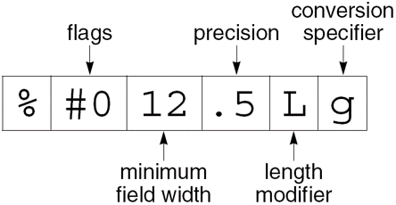

---
presentation:
  margin: 0
  center: false
  transition: "convex"
  enableSpeakerNotes: true
  slideNumber: "c/t"
  navigationMode: "linear"
---

@import "../css/font-awesome-4.7.0/css/font-awesome.css"
@import "../css/theme/solarized.css"
@import "../css/logo.css"
@import "../css/font.css"
@import "../css/color.css"
@import "../css/margin.css"
@import "../css/table.css"
@import "../css/main.css"
@import "../plugin/zoom/zoom.js"
@import "../plugin/customcontrols/plugin.js"
@import "../plugin/customcontrols/style.css"
@import "../plugin/chalkboard/plugin.js"
@import "../plugin/chalkboard/style.css"
@import "../plugin/menu/menu.js"
@import "../js/anychart/anychart-core.min.js"
@import "../js/anychart/anychart-venn.min.js"
@import "../js/anychart/pastel.min.js"
@import "../js/anychart/venn-ml.js"
@import "https://cdn.bootcdn.net/ajax/libs/jquery/3.5.0/jquery.js"

<!-- slide data-notes="" -->

<div class="bottom20"></div>

# C语言程序设计基础

<hr class="width50 center">

## 输入输出


<div class="bottom8"></div>

### 计算机系 &nbsp;&nbsp; 杨已彪

#### _yangyibiao@nju.edu.cn_


<!-- slide vertical=true data-notes="" -->

##### 提纲

---

- <a href="#/Streams">流</a>

- <a href="#/FileOp">文件操作</a>

- <a href="#/FormattedIO">格式化的输入输出</a>

- <a href="#/CharIO">字符的输入输出</a>

- <a href="#/LineIO">行的输入输出</a>

- <a href="#/BlockIO">块的输入输出</a>

- <a href="#/FilePosition">文件定位</a>

- <a href="#/StringIO">字符串的输入输出</a>

<!-- slide vertical=true data-notes="" -->


##### 介绍

---

C 的输入/输出库是标准库中最大和最重要的部分. 

<stdio.h>标头是输入/输出函数的主要存储库, 包括printf、scanf、putchar、getchar、puts和gets. 

本章提供有关这六个函数的更多信息. 

并介绍一些新函数用于处理文件. 

<!-- slide vertical=true data-notes="" -->


##### 介绍

---

本章讨论的问题: 
- 流的概念,  FILE类型, 输入和输出重定向, 文本文件和二进制文件的区别
- 专门设计用于文件的函数, 包括打开和关闭文件的函数
- 与"格式化"输入/输出相关的函数
- 读/写非格式化数据(字符、行和块)的函数
- 对文件执行随机的访问操作
- 写入或读取字符串的函数

<!-- slide vertical=true data-notes="" -->


##### 介绍

---

在 C99 中, 一些输入/输出函数属于<wchar.h>头文件. 

<wchar.h>中的函数处理宽字符而不是普通字符. 

<stdio.h>中用于读取或写入数据的函数称为字节输入/输出函数. 

<wchar.h>中的类似函数称为宽字符输入/输出函数. 

<!-- slide vertical=true data-notes="" -->


##### 流

---

在 C 中, 术语**流**表示任意输入的源或任意输出的目的地. 

许多小程序从一个流(键盘)获取所有输入, 并将其所有输出写入另一个流(屏幕). 

较大的程序可能需要额外的流. 

流通常表示存储在不同介质上的文件. 

但也很容易与网络端口和打印机等设备相关联. 

<!-- slide id="Stream" vertical=true data-notes="" -->


##### 文件指针

---

访问流是通过**文件指针**完成的, 该指针具有FILE *类型.

FILE类型在<stdio.h>中声明. 

某些流由具有标准名称的文件指针表示. 

可以根据需要声明其他文件指针:  
`FILE *fp1, *fp2;`

<!-- slide vertical=true data-notes="" -->


##### 标准流和重定向

---

<stdio.h>提供了三个标准流: 
| 文件指针 | 流 | 默认含义 |
| ---- | ---- | ---- |
| stdin | 标准输入 | 键盘 |
| stdout | 标准输出| 屏幕 |
| stderr | 标准错误| 屏幕 |

这些流可以直接使用——我们不需要声明它们, 也不打开或关闭它们. 

<!-- slide vertical=true data-notes="" -->


##### 标准流和重定向

---

前面章节中讨论的 I/O 函数从stdin获取输入并将输出发送到stdout. 

许多操作系统允许通过称为**重定向**的机制更改这些默认含义. 

<!-- slide vertical=true data-notes="" -->


##### 标准流和重定向

---

强制程序从文件而不是键盘获取输入的典型方法:  
`demo <in.dat`  
这种方法称为**输入重定向**. 

**输出重定向**类似:  
`demo >out.dat`  
所有写入stdout的数据现在都将进入out.dat文件, 而不是出现在屏幕上. 

<!-- slide vertical=true data-notes="" -->


##### 标准流和重定向

---

输入重定向和输出重定向可以结合使用:  
`demo <in.dat >out.dat`

`<`和`>`字符不需要与文件名相邻, 重定向文件的列出顺序无关紧要:  
`demo <in.dat> out.dat`  
等价于:  
`demo >out.dat <in.dat`

<!-- slide vertical=true data-notes="" -->


##### 标准流和重定向

---

输出重定向的一个问题是写入stdout的所有内容都被放入一个文件中. 

将错误消息写入stderr而不是stdout可以保证即使stdout已被重定向, 错误信息也会出现在屏幕上. 

<!-- slide vertical=true data-notes="" -->


##### 文本文件与二进制文件

---

<stdio.h>支持两种文件: 文本文件和二进制文件. 

**文本文件**中的字节代表字符, 允许人们检查或编辑文件. 
- C 程序的源代码存储在文本文件中. 

在**二进制文件**中, 字节不一定代表字符. 
- 字节组可能代表其他类型的数据, 例如整数和浮点数. 
- 可执行的 C 程序存储在二进制文件中. 

<!-- slide vertical=true data-notes="" -->


##### 文本文件与二进制文件

---

文本文件具有二进制文件不具备的两个特征. 

文本文件分为若干行. 文本文件中的每一行通常以一个或两个特殊字符结尾. 
- Windows: 回车符('\x0d')后跟换行符('\x0a')
- UNIX和较新版本的Mac OS: 换行符
- 旧版本的Mac OS: 回车符

<!-- slide vertical=true data-notes="" -->


##### 文本文件与二进制文件

---

文本文件可以包含一个特殊的"文件结束"标记. 
- 在Windows中, 标记是'\x1a'(Ctrl+Z), 但这不是必需的. 
- 大多数其他操作系统, 包括UNIX, 没有特殊的文件结束字符. 

在二进制文件中, 没有行尾或文件结束标记; 所有字节都被平等对待. 

<!-- slide vertical=true data-notes="" -->


##### 文本文件与二进制文件

---

数据写入文件时, 可以选择以文本格式或二进制格式存储. 

将数字32767存储在文件中, 一种方法是以文本形式写入字符3、2、7、6和7: 
<div class="top-2">
  
</div>

<!-- slide vertical=true data-notes="" -->


##### 文本文件与二进制文件

---

另一种选择是以二进制形式存储数字, 这只需两个字节: 
<div class="top-2">
  
</div>
  
以二进制存储数字通常可以节省空间. 

<!-- slide vertical=true data-notes="" -->


##### 文本文件与二进制文件

---

从文件读取或写入文件的程序必须考虑它是文本还是二进制文件. 

在屏幕上显示文件内容的程序可能会假设它是一个文本文件. 

另一方面, 文件复制程序不能假定要复制的文件是文本文件. 
- 如果是这样, 则不会完全复制包含文件结尾字符的二进制文件. 

当无法确定文件是文本形式还是二进制形式时, 假设它是二进制文件会更安全. 

<!-- slide vertical=true data-notes="" -->


##### 文件操作

---

简单性是输入和输出重定向的魅力之一. 

不幸的是, 重定向在许多应用中受到限制. 
- 当程序依赖重定向时, 它无法控制自己的文件; 甚至不知道文件的名字. 
- 如果程序需要同时读取两个文件或写入两个文件, 重定向将无法做到. 

当重定向无法满足需要时, 我们将使用<stdio.h>提供的文件操作. 

<!-- slide id="FileOp" vertical=true data-notes="" -->


##### 打开文件

---

如果要把文件用作流, 打开时需要调用fopen函数. 

fopen的原型: 
```C
FILE *fopen(const char * restrict filename,
	          const char * restrict mode);
```

filename是要打开的文件的名称. 
- 此参数可能包括有关文件位置的信息, 例如驱动器符或路径. 

mode是一个"模式字符串", 它指定打算对文件执行的操作. 

<!-- slide vertical=true data-notes="" -->


##### 打开文件

---

fopen的原型中, restrict关键字出现了两次. 

restrict是 C99 关键字, 表示filename和mode应指向不共享内存单元的字符串. 

fopen的 C89 原型不包含restrict, 但也有这样的要求. 

restrict对fopen的行为没有影响, 因此通常可以忽略它. 

<!-- slide vertical=true data-notes="" -->


##### 打开文件

---

fopen调用中的文件名包含`\`字符时要小心. 

调用  
`fopen("c:\project\test1.dat", "r")`  
将失败, 因为`\t`被视为转义字符. 

避免该问题的一种方法是用`\\`代替`\`:  
`fopen("c:\\project\\test1.dat", "r")`

另一种方法是用`/`代替`\`:  
`fopen("c:/project/test1.dat", "r")`

<!-- slide vertical=true data-notes="" -->


##### 打开文件

---

fopen函数返回一个文件指针, 程序可以(并且通常会)把这个指针保存在变量中: 
```C
fp = fopen("in.dat", "r");
/* 打开 in.dat 以供阅读 */
```

无法打开文件时, fopen返回一个空指针. 

<!-- slide vertical=true data-notes="" -->


##### 模式

---

决定将哪个模式字符串传递给fopen的因素: 
- 要对文件执行的操作
- 文件中的数据是文本形式还是二进制形式

<!-- slide vertical=true data-notes="" -->


##### 模式

---

用于文本文件的模式字符串: 
| 字符串 | 含义 |
| ---- | ---- |
| "r" | 打开文件读 |
| "w" | 打开文件写(文件不需要存在) |
| "a" | 打开文件追加(文件不需要存在) |
| "r+" | 打开文件读写, 从文件头开始 |
| "w+" | 打开文件读写(如果文件存在则截去) |
| "a+" | 打开文件读写(如果文件存在则追加) |

<!-- slide vertical=true data-notes="" -->


##### 模式

---

用于二进制文件的模式字符串: 
| 字符串 | 含义 |
| ---- | ---- |
| "rb" | 打开文件读 |
| "wb" | 打开文件写(文件不需要存在) |
| "ab" | 打开文件追加(文件不需要存在) |
| "r+b"或者"rb+" | 打开文件读写, 从文件头开始 |
| "w+b"或者"wb+" | 打开文件读写(如果文件存在则截去) |
| "a+b"或者"ab+" | 打开文件读写(如果文件存在则追加) |

<!-- slide vertical=true data-notes="" -->


##### 模式

---

写数据和追加数据有不同的模式字符串. 

当数据写入文件时, 它通常会覆盖以前存在的内容. 

当打开文件进行追加时, 写入文件的数据将添加到末尾. 

<!-- slide vertical=true data-notes="" -->


##### 模式

---

当打开文件进行读写时, 适用特殊规则. 
- 除非读取操作遇到文件末尾, 否则不先调用文件定位函数就无法从读模式切换到写模式. 
- 如果既没有调用fflush函数也没有调用文件定位函数, 则无法从写模式切换到读模式. 

<!-- slide vertical=true data-notes="" -->


##### 关闭文件

---

fclose函数允许程序关闭不再使用的文件. 

fclose的参数必须是从调用fopen或freopen获得的文件指针. 

如果文件成功关闭, fclose返回零. 

否则, 它返回错误代码EOF(在<stdio.h>中定义的宏). 

<!-- slide vertical=true data-notes="" -->


##### 关闭文件

---

打开文件进行读取的程序框架: 
```C
#include <stdio.h>
#include <stdlib.h>
	 
#define FILE_NAME "example.dat"
	 
int main(void)
{
  FILE *fp;
	 
  fp = fopen(FILE_NAME, "r");
  if(fp == NULL) {
    printf("Can't open %s\n", FILE_NAME);
    exit(EXIT_FAILURE);
  }
  …
  fclose(fp);
  return 0;
}
```

<!-- slide vertical=true data-notes="" -->


##### 关闭文件

---

可以把fopen的调用与fp的声明相结合:  
`FILE *fp = fopen(FILE_NAME, "r");`

还可以与NULL的判断相结合:  
`if((fp = fopen(FILE_NAME, "r")) == NULL) …`

<!-- slide vertical=true data-notes="" -->


##### 为打开的流附加文件

---

freopen为已经打开的流附加上一个不同的文件. 

最常见的用法是将文件与标准流之一(stdin、stdout或stderr)相关联. 

调用freopen使程序开始写入文件foo: 
```C
if(freopen("foo", "w", stdout) == NULL) {
	/* error; foo can't be opened */
}
```

<!-- slide vertical=true data-notes="" -->


##### 为打开的流附加文件

---

freopen的正常返回值是它的第三个参数(文件指针). 

如果无法打开新文件, 则freopen返回一个空指针. 

<!-- slide vertical=true data-notes="" -->


##### 为打开的流附加文件

---

C99 增加了一个新的机制: 如果filename是空指针, freopen会尝试将流的模式更改为mode参数指定的模式. 

具体的实现可以不支持此特性. 

如果支持, 可以对允许的模式更改施加限制. 

<!-- slide vertical=true data-notes="" -->


##### 从命令行获取文件名

---

有几种方法可以为程序提供文件名. 
- 将文件名嵌入程序中不太灵活. 
- 提示用户输入文件名也很笨拙. 
- 让程序从命令行获取文件名通常是最好的解决方案. 

为demo程序提供两个文件名的示例:  
`demo names.dat dates.dat`

<!-- slide vertical=true data-notes="" -->


##### 从命令行获取文件名

---

将main定义为具有两个参数的函数来访问命令行参数: 
```C
int main(int argc, char *argv[])
{
  …
}
```

argc是命令行参数的数量. 

argv是指向参数字符串的指针数组. 

<!-- slide vertical=true data-notes="" -->


##### 从命令行获取文件名

---

argv[0]指向程序名, argv[1]到argv[argc-1]指向剩余的参数, argv[argc]是空指针. 

在上述示例中, argc为3, 而argv如下图所示: 
<div class="top-2">
  
</div>

<!-- slide vertical=true data-notes="" -->


##### 程序: 检查文件是否可以打开

---

canopen.c程序判断文件是否存在, 如果存在是否可以打开进行读取. 

用户提供给程序要检查的文件的名字:  
`canopen file`

然后程序将显示`file can be opened`或`file can't be opened`. 

如果用户在命令行中输入错误数量的参数, 程序将显示消息`usage: canopen filename`.

<!-- slide vertical=true data-notes="" -->


##### canopen.c

---

```C
/* Checks whether a file can be opened for reading */

#include <stdio.h>
#include <stdlib.h>

int main(int argc, char *argv[])
{
  FILE *fp;
 
  if(argc != 2) {
    printf("usage: canopen filename\n");
    exit(EXIT_FAILURE);
  }
 
  if((fp = fopen(argv[1], "r")) == NULL) {
    printf("%s can't be opened\n", argv[1]);
    exit(EXIT_FAILURE);
  }
 
  printf("%s can be opened\n", argv[1]);
  fclose(fp);
  return 0;
}
```

<!-- slide vertical=true data-notes="" -->


##### 临时文件

---

程序通常需要创建临时文件——这些文件只在程序运行时存在. 

<stdio.h>提供了两个函数, tmpfile和tmpnam, 用于处理临时文件. 

<!-- slide vertical=true data-notes="" -->


##### 临时文件

---

tmpfile创建一个临时文件(以"wb+"模式打开), 该文件将一直存在, 直到它关闭或程序结束. 

调用tmpfile会返回一个文件指针, 该指针可用于稍后访问该文件: 
```C
FILE *tempptr;
…
tempptr = tmpfile();
/* 创建一个临时文件 */
```

如果创建文件失败, 则tmpfile返回一个空指针. 

<!-- slide vertical=true data-notes="" -->


##### 临时文件

---

使用tmpfile的缺点: 
- 不知道tmpfile创建的文件的名称. 
- 以后无法决定将该文件永久化. 

另一种方法是使用fopen创建一个临时文件. 

tmpnam函数可用于确保此文件与现有文件的名称不同. 

<!-- slide vertical=true data-notes="" -->


##### 临时文件

---

tmpnam为临时文件生成一个名称. 

如果其参数是空指针, 则tmpnam将文件名存储在静态变量中并返回指向它的指针: 
```C
char *filename;
…
filename = tmpnam(NULL);
/* 创建一个临时文件名 */
```

<!-- slide vertical=true data-notes="" -->


##### 临时文件

---

否则, tmpnam会将文件名复制到程序员提供的字符数组中: 
```C
char filename[L_tmpnam];
…
tmpnam(filename);
/* 创建一个临时文件名 */
```

在这种情况下, tmpnam还返回一个指向该数组第一个字符的指针. 

L_tmpnam是<stdio.h>中的一个宏, 它指明了保存临时文件名的字符数组的长度. 

<!-- slide vertical=true data-notes="" -->


##### 临时文件

---

TMP_MAX宏(在<stdio.h>中定义)指明了tmpnam可以生成的临时文件名的最大数量. 

如果无法生成文件名, 则tmpnam返回一个空指针. 

<!-- slide vertical=true data-notes="" -->


##### 文件缓冲

---

将数据传入到磁盘驱动器或从磁盘驱动器传出数据是相对较慢的操作. 

获得较好性能的秘诀是**缓冲**. 

写入流的数据实际上存储在内存的缓冲区中; 当缓冲区已满(或流已关闭)时, 对缓冲区进行"清洗"(写入实际的输出设备). 

输入流可以用类似的方式缓冲: 缓冲区包含来自输入设备的数据; 输入是从此缓冲区而不是设备本身读取的. 

<!-- slide vertical=true data-notes="" -->


##### 文件缓冲

---

缓冲可以极大地提高效率, 因为从缓冲区读取字节或将字节存储在缓冲区中非常快. 

将缓冲区内容传输到磁盘或从磁盘传输需要时间, 但是一次大的"块移动"比多次小字节移动要快得多. 

<stdio.h>中的函数会在缓冲有用时自动执行缓冲. 

在极少数情况下, 我们可能需要使用函数fflush、setbuf和setvbuf. 

<!-- slide vertical=true data-notes="" -->


##### 文件缓冲

---

通过调用fflush, 程序可以根据需要多次清洗文件的缓冲区. 

清洗fp关联的文件的缓冲区的调用:  
`fflush(fp); /* 为 fp 清洗缓冲区 */`

清洗所有输出流的调用:  
`fflush(NULL); /* 清洗所有缓冲区 */`

fflush如果成功则返回零, 如果发生错误则返回EOF . 

<!-- slide vertical=true data-notes="" -->


##### 文件缓冲

---

setvbuf允许改变缓冲流的方法, 并允许控制缓冲区的大小和位置. 

该函数的第三个参数指定所需的缓冲类型: 
- _IOFBF(满缓冲)
- _IOLBF(行缓冲)
- _IONBF(无缓冲)

对于未连接到交互式设备的流, 满缓冲是默认设置. 

<!-- slide vertical=true data-notes="" -->


##### 文件缓冲

---

setvbuf的第二个参数(如果它不是空指针)是所需缓冲区的地址. 

缓冲区可能具有静态存储期限、自动存储期限, 甚至是动态分配的. 

setvbuf的最后一个参数是缓冲区中的字节数. 

<!-- slide vertical=true data-notes="" -->


##### 文件缓冲

---

调用setvbuf将stream的缓冲更改为满缓冲, 使用buffer数组中的N个字节作为缓冲区: 
```C
char buffer[N];
…
setvbuf(stream, buffer, _IOFBF, N);
```

setvbuf函数的调用必须在打开stream之后在对其执行任意其他操作之前. 

<!-- slide vertical=true data-notes="" -->


##### 文件缓冲

---

使用空指针作为第二个参数调用setvbuf也是合法的, 它请求setvbuf创建具有指定大小的缓冲区. 

如果调用成功, setvbuf返回零. 

如果mode参数无效或要求无法满足, 它返回一个非零值. 

<!-- slide vertical=true data-notes="" -->


##### 文件缓冲

---

setbuf是一个较早期的函数, 它设定了缓冲模式和缓冲区大小的默认值. 

如果buf是空指针, 则调用setbuf(stream, buf)等价于  
`(void) setvbuf(stream, NULL, _IONBF, 0);`

否则, 它等价于  
`(void) setvbuf(stream, buf, _IOFBF, BUFSIZ);`  
其中BUFSIZ是在<stdio.h>中定义的宏. 

setbuf被认为是过时的. 

<!-- slide vertical=true data-notes="" -->


##### 其他文件操作

---

remove和rename函数允许程序执行基本的文件管理操作. 

与本节中的大多数其他函数不同, remove和rename使用文件名而不是文件指针. 

如果调用成功, 这两个函数都返回零; 否则, 返回非零值. 

<!-- slide vertical=true data-notes="" -->


##### 其他文件操作

---

remove删除文件: 
```C
remove("foo");
/* 删除名为"foo"的文件 */
```

如果一个程序使用fopen(而不是tmpfile)创建一个临时文件, 它可以使用remove在程序终止之前删除该文件. 

删除当前打开的文件的效果是由实现定义的. 

<!-- slide vertical=true data-notes="" -->


##### 其他文件操作

---

rename更改文件的名称: 
```C
rename("foo", "bar");
/* 将 "foo" 重命名为 "bar" */
```

如果程序需要决定将文件永久化, rename可以方便地重命名使用fopen创建的临时文件. 
- 如果具有新名称的文件已存在, 则效果由实现定义. 

如果要求重命名打开的文件, 重命名会失败. 

<!-- slide vertical=true data-notes="" -->


##### 格式化的输入/输出

---

下一组库函数使用格式字符串来控制读写. 

printf和相关函数能够在输出期间将数据从数值格式转换为字符格式. 

scanf和相关函数能够在输入过程中将数据从字符格式转换为数值格式. 

<!-- slide id="FormattedIO" vertical=true data-notes="" -->


##### …printf函数

---

fprintf和printf函数将可变数量的数据项写入输出流, 使用格式字符串控制输出的形式. 

两个函数的原型都以...符号(省略号)结尾, 表示后面还有可变数量的参数: 
```C
int fprintf(FILE * restrict stream,
	          const char * restrict format, ...);
int printf(const char * restrict format, ...);
```

两个函数都返回写入的字符数; 负返回值表示发生了错误. 

<!-- slide vertical=true data-notes="" -->


##### …printf函数

---

printf总是写入stdout, 而fprintf写入由其第一个参数指示的流: 
```C
printf("Total: %d\n", total);
	/* writes to stdout */
fprintf(fp, "Total: %d\n", total);
	/* writes to fp */
```

调用printf等价于调用fprintf并以stdout作为第一个参数. 

<!-- slide vertical=true data-notes="" -->


##### …printf函数

---

fprintf适用于任意输出流. 

它最常见的用途之一是将错误消息写入stderr:  
`fprintf(stderr, "Error: data file can't be opened.\n");`

将消息写入stderr可以保证即使用户重定向stdout, 它也会出现在屏幕上. 

<!-- slide vertical=true data-notes="" -->


##### …printf函数

---

<stdio.h>中的另外两个函数也可以将格式化的输出写入流. 

这两个函数很不常见, 一个是vfprintf函数, 另一个是vprintf函数. 

两者都依赖于<stdarg.h>中定义的va_list类型, 因此将它们与<stdarg.h>一起讨论. 

<!-- slide vertical=true data-notes="" -->


##### …printf转换说明

---

printf和fprintf都需要包含普通字符或转换说明的格式字符串. 
- 普通字符原样输出. 
- 转换说明描述了如何将剩余的参数转换为字符格式显示出来. 

<!-- slide vertical=true data-notes="" -->


##### …printf转换说明

---

…printf转换说明由`%`字符和跟随其后的最多5个不同的选项组成: 
<div class="top-2">
  
</div>

<!-- slide vertical=true data-notes="" -->


##### …printf转换说明

---

标志(可选项, 允许多个):  
| 标志 | 含义 |
| ---- | ---- |
| - | 在字段内左对齐(默认右对齐) | 
| + | 有符号转换得到的数总是以+或-开头(通常, 只有负数前面附上减号) |
| 空格 | 有符号转换得到的非负数前面加空格(+标志优先于空格标志) |
| # | 以0开头的八进制数, 以0x或0X开头的十六进制非零数. 浮点数始终有小数点. 不能删除由g或G转换输出的数的尾部零 |
| 0 (零) | 用前导零在数的字段宽度内进行填充. 如果转换时d、i、o、u、x或X, 并且指定了精度, 那么可以忽略标志0(-标志优先于0标志) |

<!-- slide vertical=true data-notes="" -->


##### …printf转换说明

---

**最小字段宽度**(可选项). 太小而无法占据该字段的数据项将被填充. 
- 默认情况下, 空格会添加到数据项的左侧. 

超过字段宽度的数据项仍将完整显示. 

字段宽度是整数或字符*. 
- 如果是字符*, 则字段宽度由下一个参数决定. 

<!-- slide vertical=true data-notes="" -->


##### …printf转换说明

---

**精度**(可选项). 精度的含义取决于转换说明符:  
- d、i、o、u、x、X: 最小位数(如果位数不够, 则添加前导零)
- a、A、e、E、f、F: 小数点后的位数
- g、G: 有效数字的个数
- s: 最大字节数

精度是由小数点(.)后跟一个整数或字符*构成的. 
- 出现字符*, 则精度由下一个参数决定. 

<!-- slide vertical=true data-notes="" -->


##### …printf转换说明

---

**长度修饰符**(可选项). 表示要显示的数据项类型的长度大于或小于特定转换说明中的正常值. 
- %d通常表示一个int值; %hd用于显示short int值, %ld用于显示long int值. 

<!-- slide vertical=true data-notes="" -->


##### …printf转换说明

---

| 长度修饰符 | 转换说明符 | 含义 |
| ---- | ---- | ---- |
|	hh | d, i, o, u, x, X | signed char, unsigned char |
|    | n	| signed char * |
|	h	| d, i, o, u, x, X | short int, unsigned short int |
|		| n	| short int * |
|	L	| d, i, o, u, x, X | long int, unsigned long int |
|   | n	| long int * |
|   | c	| wint_t |
|   | s	| wchar_t * |
|   | a, A, e, E, f, F, g, G | 无作用 |
|	ll | d, i, o, u, x, X | long long int, unsigned long long int |	
|		| n	| long long int * |
|	j | d, i, o, u, x, X	| intmax_t, uintmax_t |
| 	| n	| intmax_t * |
|	z | d, i, o, u, x, X	| size_t |
|	  | n	| size_t * |
|	t | d, i, o, u, x, X	| ptrdiff_t |
|		| n	| ptrdiff_t * |
|	L	| a, A, e, E, f, F, g, G | long double |

hh、ll、j、z、t仅C99有. 

<!-- slide vertical=true data-notes="" -->


##### …printf转换说明

---

**转换说明符**. 必须是下表中的字符之一. 
| 转换说明符 | 含义 |
| ---- | ---- |
| d、i | 把int类型值转换为十进制形式 |
| o、u、x、X | 把无符号整数转换为八进制(o)、十进制(u) 或十六进制(x、X)形式. x表示用小写字母a–f来显示十六进制数字, 而X表示用大写字幕A-F来显示 |
| f、F | 把double类型值转换为十进制形式, 并且把小数点放置在正确的位置. 如果没有指定精度, 在小数点后显示6位数字 |
| e、E | 把double类型值转换为科学计数法形式. 如果没有指定精度, 在小数点后显示6位数字. 如果选择e, 把字母e放在指数前面; 如果选择E, 把字母E放在指数前面|
| g、G | g会把double类型值转换为f形式或者e形式. 当数值的指数部分小于-4, 或者指数部分大于等于精度值时, 会选择e形式显示. 尾部的零不显示(除非使用了#标志), 且小数点仅在后边跟有数字时才显示出来. G会在F形式和E形式之间进行选择 |
| a、A | 使用格式[-]0xh.hhhhp±d的格式把double类型值转换为十六进制科学记数法形式. 其中[-]是可选的负号, h代表十六进制数位, ±是正号或者负号, d是指数. d为十进制数, 表示2的幂. 如果没有指定精度, 在小数点后将显示足够的数位来表示准确的数值(如果可能的话). a表示用小写形式显示a~f, A表示用大写形式显示A~F. 选择a还是A也会影响到字母x和p的情况 |
| c | 显示无符号字符的int类型值 |
| s | 写出由实参指向的字符. 当达到精度值(如果存在)或者遇到空字符时, 停止写操作 |
| p | 把void *类型值转换为可打印形式 |
| n | 相应的实参必须是指向int型对象的指针. 在该对象中存储...printf函数调用已经输出的字符数量, 不产生输出|
| & | 写字符% |

F、a、A仅C99有. 

<!-- slide vertical=true data-notes="" -->


##### C99 对...printf转换说明的修改

---

C99修改了printf和fprintf的转换说明: 
- 增加了长度修饰符
- 增加了转换说明符
- 允许输出无穷数和NaN
- 支持宽字符
- 之前未定义的转换说明现在允许了

<!-- slide vertical=true data-notes="" -->


##### …printf转换说明的示例

---

标志-、+、空格、0作用于%d转换的效果的示例: 
| 转换说明 | 对123应用转换说明的结果 | 对-123应用转换说明的结果 |
| ---- | ---- | ---- |
| %8d | •••••123 | ••••-123 |
| %-8d | 123••••• | -123•••• |
| %+8d | ••••+123 | ••••-123 |
| % 8d | •••••123 | ••••-123 |
| %08d | 00000123 | -0000123 |
| %-+8d | +123•••• | -123•••• |
| %- 8d | •123•••• | -123•••• |
| %+08d | +0000123 | -0000123 |
| % 08d | •0000123 | -0000123 |

•表示空格字符. 

<!-- slide vertical=true data-notes="" -->


##### …printf转换说明的示例

---

标志#作用于o、x、X、g和G转换的效果的示例: 
| 转换说明 | 对123应用转换说明的结果 | 对123.0应用转换说明的结果 |
| ---- | ---- | ---- |
| %8o | •••••173 | |
| %#8o | ••••0173 | |
| %8x | ••••••7b | |
| %#8x | ••••0x7b | |
| %8X | ••••••7B | |
| %#8X | ••••0X7B | |
| %8g | | •••••123 |
| %#8g | | •123.000 |
| %8G | | •••••123 |
| %#8G | | •123.000 |
 
<!-- slide vertical=true data-notes="" -->


##### …printf转换说明的示例

---

最小字段宽度和精度作用于%s转换的效果的示例: 
| 转换说明 | 对"bogus"应用转换说明的结果 | 对"buzzword"应用转换说明的结果 |
| ---- | ---- | ---- |
| %6s | •bogus | buzzword | 
| %-6s | bogus• | buzzword |
| %.4s | bogu | buzz | 
| %6.4s | ••bogu | ••buzz |
| %-6.4s | bogu••  | buzz•• | 

<!-- slide vertical=true data-notes="" -->


##### …printf转换说明的示例

---

%g转换如何以%e和%f的格式显示数的示例: 

| 数 | 对数应用转换%.4g的结果 |
| ---- | ---- |
| 123456. | 1.235e+05 |
| 12345.6 | 1.235e+04 |
| 1234.56 | 1235 |
| 123.456 | 123.5 |
| 12.3456 | 12.35 |
| 1.23456 | 1.235 |
| 0.123456 | 0.1235 |
| 0.0123456 | 0.01235 |
| 0.00123456 | 0.001235 |
| 0.000123456 | 0.0001235 |
| 0.0000123456 | 1.235e-05 |
| 0.00000123456 | 1.235e-06 |

<!-- slide vertical=true data-notes="" -->


##### …printf转换说明的示例

---

最小字段宽度和精度通常嵌入在格式字符串中. 

用*字符取代最小字段宽度或精度通常可以把它们作为格式字符串之后的实际参数加以指定. 

下列printf调用产生相同输出: 
```C
printf("%6.4d", i);
printf("%*.4d", 6, i);
printf("%6.*d", 4, i);
printf("%*.*d", 6, 4, i);
```

<!-- slide vertical=true data-notes="" -->


##### …printf转换说明的示例

---

`*`的一个主要优点是它允许使用宏来指定宽度或精度:  
`printf("%*d", WIDTH, i);`

甚至可以在程序执行期间计算宽度或精度:  
`printf("%*d", page_width / num_cols, i);`

<!-- slide vertical=true data-notes="" -->


##### …printf转换说明的示例

---

`%p`转换用于打印指针的值: 
```C
printf("%p",(void *) ptr);
/* 显示 ptr 的值 */
```

指针很可能显示为八进制或十六进制数. 

<!-- slide vertical=true data-notes="" -->


##### …printf转换说明的示例

---

`%n`转换用于找出到目前为止通过调用…printf打印的字符数量. 

调用下列语句后len的值为3: 
```C
printf("%d%n\n", 123, &len);
```

<!-- slide vertical=true data-notes="" -->


##### …scanf函数

---

fscanf和scanf从输入流中读取数据项, 使用格式字符串来指明输入的格式. 

在格式字符串之后, 可以有任意数量的指针(每个都指向一个对象)作为额外的实际参数. 

输入项被转换(根据格式字符串中的转换说明)并存储在这些对象中. 

<!-- slide vertical=true data-notes="" -->


##### …scanf函数

---

scanf始终从stdin读取, 而fscanf从其第一个参数指示的流中读取: 
```C
scanf("%d%d", &i, &j);
/* 从stdin读取 */
fscanf(fp, "%d%d", &i, &j);
/* 从 fp 读取 */
```

调用scanf等价于调用fscanf并以stdin作为第一个参数. 

<!-- slide vertical=true data-notes="" -->


##### …scanf函数

---

导致...scanf函数过早返回的错误: 
- 输入失败(没有输入字符可以读)
- 匹配失败(输入字符与格式字符串不匹配)

在 C99 中, 输入失败也可能由于编码错误. 

<!-- slide vertical=true data-notes="" -->


##### …scanf函数

---

…scanf函数返回已读取并赋值给对象的数据项的数量. 

如果在读取任意数据项之前发生输入失败, 它们将返回EOF. 

测试scanf返回值的循环很常见. 

下列循环读取一串整数, 在首个遇到问题的符号处停止: 
```C
while(scanf("%d", &i) == 1) {
	…
}
```

<!-- slide vertical=true data-notes="" -->


##### …scanf格式串

---

…scanf函数的调用类似于…printf函数的调用. 

但是, …scanf函数的工作方式不同. 

格式字符串表示…scanf函数在读取输入时尝试匹配的模式. 
- 如果输入与格式字符串不匹配, 则函数返回. 
- 不匹配的输入字符被"放回"以供将来读取. 

<!-- slide vertical=true data-notes="" -->


##### …scanf格式串

---

…scanf函数的格式串可能包含三种信息: 
- 转换说明
- 空白字符
- 非空白字符

<!-- slide vertical=true data-notes="" -->


##### …scanf格式串

---

**转换说明**. …scanf函数格式串中的转换说明类似于…printf函数格式串中的转换说明. 

大多数转换说明(%[、%c和%n例外)会跳过输入项开始处的空白字符. 

转换说明不会跳过尾部的空白字符

<!-- slide vertical=true data-notes="" -->


##### …scanf格式串

---

**空白字符**. 格式字符串中的一个或多个连续的空白字符与输入流中的零个或多个空白字符匹配. 

**非空白字符**. %以外的非空白字符与输入流中的相同字符匹配. 

<!-- slide vertical=true data-notes="" -->


##### …scanf格式串

---

格式字符串"ISBN %d-%d-%ld-%d"说明输入由下列内容构成: 
- 字母ISBN
- 可能有一些空白字符
- 一个整数
- 字符-
- 一个整数(可能前面有空白字符)
- 字符-
- 一个长整数(可能前面有空白字符)
- 字符-
- 一个整数(可能前面有空白字符)

<!-- slide vertical=true data-notes="" -->


##### …scanf转换说明

---

…scanf转换说明由字符%和跟随其后的下列选项构成: 
- 字符*
- 最大字段宽度
- 长度修饰符
- 转换说明符

**字符\***(可选). 表示赋值屏蔽: 读取输入项但不会把它赋值给对象. 
- *匹配的数据项不包括在...scanf返回的计数中. 

<!-- slide vertical=true data-notes="" -->


##### …scanf转换说明

---

**最大字段宽度**(可选). 限制输入项中的字符数. 
- 转换开始处跳过的空白字符不算在内. 

**长度修饰符**(可选). 表示将存储输入项的对象具有比正常更长或更短的类型. 

下一张幻灯片上的表格列出了每个长度修饰符以及与转换说明符组合时指示的类型. 

<!-- slide vertical=true data-notes="" -->


##### …scanf转换说明

---

用于...scanf函数的长度修饰符  
| 长度修饰符 | 转换说明符 | 含义 |
| ---- | ---- | ---- |
|	hh | d, i, o, u, x, X, n	| signed char *, unsigned char * |
|	h	| d, i, o, u, x, X, n	| short int *, unsigned short int * |
|	l	| d, i, o, u, x, X, n	| long int *, unsigned long int * |
|	  | a, A, e, E, f, F, g, G | double * |
|		| c, s, or [ | wchar_t * |
|	ll | d, i, o, u, x, X, n | long long int *, unsigned long long int * |
|	j | d, i, o, u, x, X, n	| intmax_t *, uintmax_t * |
|	z	| d, i, o, u, x, X, n	| size_t * |
|	t	| d, i, o, u, x, X, n	| ptrdiff_t * |
|	L	| a, A, e, E, f, F, g, G | long double * |

hh、ll、j、z、t、L仅C99有

<!-- slide vertical=true data-notes="" -->


##### …scanf转换说明

---

**转换说明符**. 必须是下表中的字符之一. 
| 转换说明符 | 含义 |
| ---- | ---- |
| d | 匹配十进制整数, 假设相应的实参是int *类型 |
| i | 匹配整数, 假设相应的实参是int *类型. 假定数是十进制形式的, 除非它以0开头(表示八进制)或以0x或0X开头(十六进制)  |
| o | 匹配八进制整数, 假设相应的实参是unsigned int *类型 |
| u | 匹配十进制整数, 假设相应的实参是unsigned int *类型 |
| x, X | 匹配十六进制整数, 假设相应的实参是unsigned int *类型 |
| a, A, e, E, f, F, g, G | 匹配浮点数, 假设相应的实参是float *类型, 在C99中, 该数可以是无穷大或NaN |
| c | 匹配n个字符, 这里的n是最大字段宽度. 如果没有指定字段宽度, 那么就匹配一个字符. 假设相应的实参是指向字符数组的指针(如果没有指定字段宽度, 就指向字符对象). 不在末尾添加空字符 |
| s | 匹配一串非空白字符, 然后在末尾添加空字符. 假设相应的实参是指向字符数组的指针 |
| [ | 匹配来自扫描集合的非空字符序列, 然后在末尾添加空字符. 假设相应的实参是指向字符数组的指针 |
| p | 以..printf函数的输出格式匹配指针值. 假设相应的实参是指向void*对象的指针 |
| n | 相应的实参必须指向int类型的对象. 把到目前为止读入的字符数量存储到此对象中. 没有输入会被吸收进去, 而且..scanf函数的返回值也不会受到影响 |
| % | 匹配字符% |

a、A、F仅C99有

<!-- slide vertical=true data-notes="" -->


##### …scanf转换说明

---

数值型数据项可以始终用符号(+或-)作为开头. 

然而, 说明符o、u、x和X将数据项转换为无符号形式, 因此它们通常不用于读取负数. 

<!-- slide vertical=true data-notes="" -->


##### …scanf转换说明

---

说明符[是说明符s的更复杂(也更灵活)的版本. 

使用`[`的转换说明具有`%[集合]`或`%[^集合]`的形式, 其中集合可以是任意字符集. 

`%[集合]`匹配集合(扫描集合)中的任意字符序列. 

`%[^集合]`匹配不在集合中的任意字符序列. 

例子:  
`%[abc]`匹配任意只包含a、b和c的字符串.  
`%[^abc]`匹配任意不包含a、b或c的字符串. 

<!-- slide vertical=true data-notes="" -->


##### …scanf转换说明

---

许多...scanf转换说明符与<stdlib.h>中的数值转换函数密切相关. 

这些函数将字符串(如"-297")转换为其等价的数值(–297). 

例如, d说明符查找可选的+或-符号, 后跟十进制数字; 这与strtol函数所需的格式相同. 

<!-- slide vertical=true data-notes="" -->


##### …scanf转换说明

---

…scanf转换说明符和数值转换函数之间的对应关系: 
| 转换说明符 | 数值转换函数 |
| ---- | ---- |
| d | 10作为基数的strtol函数 |
| i | 0作为基数的strtol函数 |
| o | 8作为基数的strtoul函数 |
| u | 10作为基数的strtoul函数 |
| x, X | 16作为基数的strtoul函数 |
| a, A, e, E, f, F, g, G | strtod函数 |

<!-- slide vertical=true data-notes="" -->


##### C99 对...scanf转换说明的更改

---

C99对scanf和fscanf的转换说明做了一些改变: 
- 增加了长度修饰符
- 增加了转换说明符
- 具有读无穷数和NaN的能力
- 支持宽字符

<!-- slide vertical=true data-notes="" -->


##### scanf示例

---

接下来的三个表包含scanf的调用示例. 

用删除线显示的字符会被调用吸收. 

<!-- slide vertical=true data-notes="" -->


##### scanf示例

---

结合转换说明、空白字符和非空白字符的示例: 

| scanf函数的调用 | 输入 | 变量 |
| ---- | ---- | ---- |
| n = scanf("%d%d", &i, &j); | ~~12•~~,•34¤ | n: 1 i: 12 j: unchanged |
| n = scanf("%d,%d", &i, &j); | ~~12~~•,•34¤ | n: 1 i: 12 j: unchanged |
| n = scanf("%d ,%d", &i, &j); | ~~12•,•34~~¤ | n: 2 i: 12 j: 34 |
| n = scanf("%d, %d", &i, &j); | ~~12~~•,•34¤ | n: 1 i: 12 j: unchanged |

<!-- slide vertical=true data-notes="" -->


##### scanf示例

---

显示赋值屏蔽和指定字段宽度的效果示例: 

| scanf函数的调用 | 输入 | 变量 |
| ---- | ---- | ---- |
| n = scanf("%*d%d", &i); | ~~12•34~~¤ | n: 1 i: 34 |
| n = scanf("%*s%s", str); | ~~My•Fair~~•Lady¤ | n: 1 str: "Fair" |
| n = scanf("%1d%2d%3d", &i, &j, &k); | ~~12345~~¤ | n: 3 i: 1 j: 23 k: 45 |
| n = scanf("%2d%2s%2d", &i, str, &j); | ~~123456~~¤	| n: 3 i: 12 str: "34" j: 56 |

<!-- slide vertical=true data-notes="" -->


##### scanf示例

---

描述i、[和n转换说明符的示例: 
| scanf函数的调用 | 输入 | 变量 |
| ---- | ---- | ---- |
| n = scanf("%i%i%i", &i, &j, &k);| ~~12•012•0x12~~¤ | n: 3 i: 12 j: 10 k: 18 |
| n = scanf("%[0123456789]", str); | ~~123~~abc¤ | n: 1 str: "123" |
| n = scanf("%[0123456789]", str); | abc123¤ | n: 0 str: unchanged |
| n = scanf("%[^0123456789]", str);	| ~~abc~~123¤	| n: 1 str: "abc" |
| n = scanf("%*d%d%n", &i, &j);	| ~~10•20~~•30¤	| n: 1 i: 20 j: 5 |

<!-- slide vertical=true data-notes="" -->


##### 检测文件末尾和错误条件

---

如果要求...scanf函数读取并存储n个数据项, 那么期望它的返回值为n. 

如果返回值小于n, 则出现问题: 
- 文件末尾. 该函数在完全匹配格式字符串之前遇到文件末尾. 
- 读取错误. 该函数无法从流中读取字符. 
- 匹配失败. 数据项的格式错误. 

<!-- slide vertical=true data-notes="" -->


##### 检测文件末尾和错误条件

---

每个流都有两个与之关联的指示器: **错误指示器**和**文件末尾指示器**.  

打开流时, 这些指示器会被清除. 

遇到文件末尾就设置文件末尾指示器, 读取错误就设置错误指示器. 
- 当输出流上发生写错误时, 也会设置错误指示器. 

匹配失败不会改变任意一个指示器. 

<!-- slide vertical=true data-notes="" -->


##### 检测文件末尾和错误条件

---

一旦设置了错误或文件末尾指示器, 它就会保持该状态直到被显式清除, 可能通过调用clearerr函数.  
clearerr清除文件末尾和错误指示器: 
```C
clearerr(fp);
	/* clears eof and error indicators for fp */
```
并不需要经常使用clearerr, 因为其他一些库函数的副作用可以清楚指示器. 

<!-- slide vertical=true data-notes="" -->


##### 检测文件末尾和错误条件

---

feof和ferror函数可用于测试流的指示器以确定先前对流的操作失败的原因. 

如果为与fp关联的流设置了文件末尾指示器, 则调用feof(fp)将返回一个非零值. 

如果设置了错误指示器, 调用ferror(fp)会返回一个非零值. 

<!-- slide vertical=true data-notes="" -->


##### 检测文件末尾和错误条件

---

当scanf返回小于预期的值时, 可以使用feof和ferror来判断原因. 
- 如果feof返回非零值, 则已到达输入文件的末尾. 
- 如果ferror返回非零值, 则在输入期间发生读取错误. 
- 如果两者都没有返回非零值, 则一定发生匹配失败. 

scanf的返回值表示在问题发生之前读取了多少数据项. 

<!-- slide vertical=true data-notes="" -->


##### 检测文件末尾和错误条件

---

find_int函数是一个示例, 它显示了如何使用feof和ferror. 

find_int在文件中搜索以整数开头的行:  
`n = find_int("foo");`

find_int返回它找到的整数的值或错误代码: 
- –1 文件无法打开
- –2 读取错误
- –3 没有行以整数开头

<!-- slide vertical=true data-notes="" -->


##### 

---

```C
int find_int(const char *filename)
{
  FILE *fp = fopen(filename, "r");
  int n;
	 
  if(fp == NULL)
    return -1;               /* can't open file */
	 
  while(fscanf(fp, "%d", &n) != 1) {
    if(ferror(fp)) {
      fclose(fp);
      return -2;             /* read error */
    }
    if(feof(fp)) {
      fclose(fp);
      return -3;             /* integer not found */
    }
    fscanf(fp, "%*[^\n]");   /* skips rest of line */
  }
	 
  fclose(fp);
  return n;
}
```

<!-- slide vertical=true data-notes="" -->


##### 字符的输入/输出

---

下一组库函数可以读取和写入单个字符. 

这些函数同样适用于文本流和二进制流. 

这些函数将字符视为int类型的值, 而不是char. 

一个原因是输入函数通过返回EOF来指示文件结束(或错误)条件, EOF是一个负整数常量. 

<!-- slide id="CharIO" vertical=true data-notes="" -->


##### 输出函数

---

putchar将一个字符写入标准输出流:  
`putchar(ch); /* 将 ch 写入标准输出流 */`

fputc和putc将一个字符写入任意流: 
```C
fputc(ch, fp); /* 将 ch 写入 fp */
putc(ch, fp); /* 将 ch 写入 fp */
```

putc通常实现为宏(以及函数), 而fputc仅实现为函数. 

<!-- slide vertical=true data-notes="" -->


##### 输出函数

---

putchar本身通常也定义为宏:  
`#define putchar(c) putc((c), stdout)`

C标准允许putc宏对stream参数多次求值, 而fputc不可以. 

程序员通常更喜欢putc, 因为它速度更快. 

如果发生写入错误, 上述这3个函数都会为流设置错误指示器并返回EOF. 

否则, 它们返回写入的字符. 

<!-- slide vertical=true data-notes="" -->


##### 输入函数

---

getchar从stdin读取一个字符:  
`ch = getchar();`

fgetc和getc从任意流中读取一个字符:  
```C
ch = fgetc(fp);
ch = getc(fp);
```

这三个函数都将字符视为unsigned char类型的值(返回之前转换为int类型). 

因此, 它们不会返回EOF以外的负值. 

<!-- slide vertical=true data-notes="" -->


##### 输入函数

---

getc通常实现为宏(以及函数), 而fgetc仅实现为函数. 

getchar本身通常也定义为宏:  
`#define getchar() getc(stdin)`

相比于fgetc, 程序员通常更喜欢getc. 

<!-- slide vertical=true data-notes="" -->


##### 输入函数

---

如果出现问题, fgetc、getc和getchar函数的行为相同. 

如果遇到文件末尾, 他们设置流的文件末尾指示器并返回EOF. 

如果发生读取错误, 它们会设置流的错误指示器并返回EOF. 

为了区分这两种情况, 可以调用feof或ferror. 

<!-- slide vertical=true data-notes="" -->


##### 输入函数

---

fgetc、getc和getchar最常见的用途之一是从文件中读取字符. 

一般使用下列while循环实现该目的: 
```C
while((ch = getc(fp)) != EOF) {
	…
}
```

始终将返回值存储在int变量中, 而不是char变量中. 

把char类型变量与EOF进行比较可能会得到错误的结果. 

<!-- slide vertical=true data-notes="" -->


##### 输入函数

---

ungetc函数把从流中读取的字符"放回"并清除流的文件末尾指示器. 

以下循环读取一系列数字, 在第一个非数字处停止: 
```C
while(isdigit(ch = getc(fp))) {
	…
}
ungetc(ch, fp);
	/* pushes back last character read */
```

<!-- slide vertical=true data-notes="" -->


##### 输入函数

---

持续调用ungetc放回的字符数量依赖于实现和所含的流类型; 只有第一次调用才能保证成功. 

调用文件定位函数(fseek、fsetpos或rewind)会导致放回的字符丢失. 

ungetc返回要求放回的字符. 
- 如果尝试放回EOF或超过最大允许数量的字符数, 则返回EOF. 

<!-- slide vertical=true data-notes="" -->


##### 程序: 复制文件

---

fcopy.c程序进行文件的复制操作. 

执行程序时, 将在命令行中指定原始文件和新文件的名称. 

使用fcopy将文件f1.c复制到f2.c的示例:  
`fcopy f1.c f2.c`

如果命令行中的文件名不完全是两个, 或者其中一个文件都无法打开, fcopy将产生错误消息. 

<!-- slide vertical=true data-notes="" -->


##### 程序: 复制文件

---

使用"rb"和"wb"作为文件模式使fcopy可以复制文本和二进制文件. 

如果改用"r"和"w", 程序将无法复制二进制文件. 

<!-- slide vertical=true data-notes="" -->


##### 复制文件

---

```C
/* Copies a file */
 
#include <stdio.h>
#include <stdlib.h>
 
int main(int argc, char *argv[])
{
  FILE *source_fp, *dest_fp;
  int ch;
 
  if(argc != 3) {
    fprintf(stderr, "usage: fcopy source dest\n");
    exit(EXIT_FAILURE);
  }

  if((source_fp = fopen(argv[1], "rb")) == NULL) {
    fprintf(stderr, "Can't open %s\n", argv[1]);
    exit(EXIT_FAILURE);
  }
 
  if((dest_fp = fopen(argv[2], "wb")) == NULL) {
    fprintf(stderr, "Can't open %s\n", argv[2]);
    fclose(source_fp);
    exit(EXIT_FAILURE);
  }
 
  while((ch = getc(source_fp)) != EOF)
    putc(ch, dest_fp);
 
  fclose(source_fp);
  fclose(dest_fp);
  return 0;
}
```

<!-- slide vertical=true data-notes="" -->


##### 行的输入/输出

---

下一组中的库函数能够读取和写入行. 

这些函数主要用于文本流, 尽管将它们也能用于二进制流. 

<!-- slide id="LineIO" vertical=true data-notes="" -->


##### 输出函数

---

puts函数将字符串写入stdout:  
`puts("Hi, there!");  /* writes to stdout */`

在写入字符串中的字符后, puts总是添加一个换行符. 

<!-- slide vertical=true data-notes="" -->


##### 输出函数

---

fputs是puts的更通用版本. 

它的第二个参数指示输出应写入的流:  
`fputs("Hi, there!", fp);  /* writes to fp */`

与puts不同, fputs函数不会写入换行符, 除非字符串中本身存在换行符. 

如果发生写入错误, 这两个函数都返回EOF; 否则, 它们返回一个非负数. 

<!-- slide vertical=true data-notes="" -->


##### 输入函数

---

gets函数从stdin读取一行输入:  
`gets(str); /* reads a line from stdin */`

get逐个读取字符, 将它们存储在str指向的数组中, 直到它读取一个换行符(丢弃换行符). 

fgets是更通用的get版本, 可以从任意流中读取. 

fgets也比gets更安全, 因为它限制了它将存储的字符数. 

<!-- slide vertical=true data-notes="" -->


##### 输入函数

---

将一行读入名为str的字符数组中的fgets调用:  
`fgets(str, sizeof(str), fp);`

fgets将逐个读取字符, 直到遇到首个换行符或已读取sizeof(str)-1个字符. 

如果fgets读入了换行符, 它会将其与其他字符一起存储. 

<!-- slide vertical=true data-notes="" -->


##### 输入函数

---

如果发生读取错误或在存储任意字符之前到达输入流的末尾,  gets和fgets都会返回空指针. 

否则, 两者都返回它们的第一个参数, 该参数指向存储输入的数组. 

这两个函数都在字符串的末尾存储了一个空字符. 

<!-- slide vertical=true data-notes="" -->


##### 输入函数

---

在大多数情况下, 应使用fgets而不是gets. 

仅当保证读取的字符串适合数组时, gets才能安全使用. 

当没有保证(通常没有)时, 使用fgets会更安全. 

stdin作为其第三个参数传递, fgets将从标准输入流中读取:  
`fgets(str, sizeof(str), stdin);`

<!-- slide vertical=true data-notes="" -->


##### 块的输入/输出

---

fread和fwrite函数允许程序在单步中读取和写入大的数据块. 

fread和fwrite主要用于二进制流, 尽管也可以用于文本流. 

<!-- slide id="BlockIO" vertical=true data-notes="" -->


##### 块的输入/输出

---

fwrite旨在将数组从内存复制到流中. 

fwrite调用中的参数: 
- 数组地址
- 每个数组元素的大小(以字节为单位)
- 要写入的元素数
- 文件指针

调用fwrite写入数组a的全部内容: 
```C
fwrite(a, sizeof(a[0]),
sizeof(a) / sizeof(a[0]), fp);
```

<!-- slide vertical=true data-notes="" -->


##### 块的输入/输出

---

fwrite返回实际写入的元素数. 

如果发生写入错误, 此数字将小于第三个参数. 

<!-- slide vertical=true data-notes="" -->


##### 块的输入/输出

---

fread将从流中读取数组的元素. 

将文件内容读入数组a的fread调用: 
```C
n = fread(a, sizeof(a[0]),
sizeof(a) / sizeof(a[0]), fp);
```

fread的返回值表示实际读取的元素数. 

此数字应等于第三个参数, 除非已到达输入文件的末尾或发生读取错误. 

<!-- slide vertical=true data-notes="" -->


##### 块的输入/输出

---

fwrite对于需要在终止之前将数据存储在文件中的程序来说很方便. 

以后程序(或其他程序)可以使用fread将数据读回内存. 

数据不需要是数组形式. 

将结构变量s写入文件的fwrite调用:  
`fwrite(&s, sizeof(s), 1, fp);`

<!-- slide vertical=true data-notes="" -->


##### 文件定位

---

每个流都有一个关联的**文件位置**.  

打开文件时, 文件位置设置在文件的开头. 
- 在"追加"模式下, 初始文件位置可能在开头或结尾, 具体取决于实现. 

当执行读取或写入操作时, 文件位置会自动前进, 从而提供对数据的顺序访问. 

<!-- slide id="FilePosition" vertical=true data-notes="" -->


##### 文件定位

---

尽管顺序访问对许多应用程序来说都很好, 但有些程序需要能够在文件中跳转. 

如果文件包含一系列记录, 我们可能希望直接跳转到特定记录. 

<stdio.h>提供五个函数, 允许程序确定当前文件位置或更改它. 

<!-- slide vertical=true data-notes="" -->


##### 文件定位

---

fseek函数更改与第一个参数(文件指针)关联的文件位置. 

第三个参数是三个宏之一: 
- SEEK_SET: 文件开头
- SEEK_CUR: 当前文件位置
- SEEK_END: 文件结尾

第二个参数, 类型为long int, 是一个(可能是负数)字节计数. 

<!-- slide vertical=true data-notes="" -->


##### 文件定位

---

使用fseek移动到文件的开头:  
`fseek(fp, 0L, SEEK_SET);`

使用fseek移动到文件末尾:  
`fseek(fp, 0L, SEEK_END);`

使用fseek往回移动10个字节:  
`fseek(fp, -10L, SEEK_CUR);`

如果发生错误(例如, 请求的位置不存在), fseek返回一个非零值. 

<!-- slide vertical=true data-notes="" -->


##### 文件定位

---

文件定位函数最适合用于二进制流. 

C不禁止程序对文本流使用这些定位函数, 但存在某些限制. 

对于文本流, fseek只能用于移动到文本流的开头或结尾, 或者返回之前访问过的地方. 

对于二进制流, fseek不需要支持第三个参数是SEEK_END的调用. 

<!-- slide vertical=true data-notes="" -->


##### 文件定位

---

ftell函数以长整数形式返回当前文件位置. 

ftell返回的值可能会被保存并稍后提供给fseek的调用:  
```C
…
file_pos = ftell(fp);
/* 保存当前位置 */
…
fseek(fp, file_pos, SEEK_SET);
/* 回到原来的位置 */
```

<!-- slide vertical=true data-notes="" -->


##### 文件定位

---

如果fp是二进制流, 则调用ftell(fp)以字节计数的形式返回当前文件位置, 其中零表示文件的开头. 

如果fp是文本流, 则ftell(fp)不一定是字节计数. 

因此, 最好不要对ftell返回的值执行算术运算. 

<!-- slide vertical=true data-notes="" -->


##### 文件定位

---

rewind函数将文件位置设置在开头. 

调用rewind(fp)几乎等同于fseek(fp, 0L, SEEK_SET). 
- 区别? rewind不返回值, 但会清除fp的错误指示器. 

<!-- slide vertical=true data-notes="" -->


##### 文件定位

---

fseek和ftell仅限于位置可以存储为长整数的文件. 

为了处理非常大的文件, C提供了另外两个函数: fgetpos和fsetpos. 

这些函数可以处理大文件, 因为它们使用fpos_t类型的值来表示文件位置. 
- fpos_t值不一定是整数; 例如, 它可以是一个结构. 

<!-- slide vertical=true data-notes="" -->


##### 文件定位

---

调用fgetpos(fp, &file_pos)将与fp关联的文件位置存储在file_pos变量中. 

调用fsetpos(fp, &file_pos)将fp的文件位置设置为存储在file_pos中的值. 

如果调用fgetpos或fsetpos失败, 它会在errno中存储一个错误代码. 

这两个函数在调用成功时返回零, 在失败时返回非零值. 

<!-- slide vertical=true data-notes="" -->


##### 文件定位

---

使用fgetpos和fsetpos保存文件位置并稍后返回该位置的示例: 
```C
fpos_t file_pos;
…
fgetpos(fp, &file_pos);
  /* saves current position */
…
fsetpos(fp, &file_pos);
	/* returns to old position */
```

<!-- slide vertical=true data-notes="" -->


##### 程序: 修改零件记录文件

---

invclear.c程序执行的操作: 
- 打开包含part结构的二进制文件. 
- 将结构读入数组. 
- 把每个结构的成员on_hand设置为0. 
- 将结构写回文件. 

"rb+"模式打开文件, 允许读写. 

<!-- slide vertical=true data-notes="" -->


##### invclear.c

---

```C
/* Modifies a file of part records by setting the quantity
   on hand to zero for all records */
 
#include <stdio.h>
#include <stdlib.h>
 
#define NAME_LEN 25
#define MAX_PARTS 100
 
struct part {
  int number;
  char name[NAME_LEN+1];
  int on_hand;
} inventory[MAX_PARTS];
 
int num_parts;

int main(void)
{
  FILE *fp;
  int i;
 
  if((fp = fopen("inventory.dat", "rb+")) == NULL) {
    fprintf(stderr, "Can't open inventory file\n");
    exit(EXIT_FAILURE);
  }
 
  num_parts = fread(inventory, sizeof(struct part),
                    MAX_PARTS, fp);
 
  for(i = 0; i < num_parts; i++)
    inventory[i].on_hand = 0;
 
  rewind(fp);
  fwrite(inventory, sizeof(struct part), num_parts, fp);
  fclose(fp);
 
  return 0;
}
```

<!-- slide vertical=true data-notes="" -->


##### 字符串的输入/输出

---

本节中描述的函数可以使用字符串作为流读取和写入数据.  

sprintf和snprintf将字符写入字符串. 

sscanf从字符串中读取字符. 

<!-- slide id="StringIO" vertical=true data-notes="" -->


##### 字符串的输入/输出

---

三个类似的函数(vsprintf、vsnprintf和vsscanf)也属于<stdio.h>. 

这些函数依赖于在<stdarg.h>中声明的va_list类型, 因此它们将在第 26 章中讨论. 

<!-- slide vertical=true data-notes="" -->


##### 输出函数

---

sprintf函数将输出写入字符数组(由其第一个参数指向)而不是流. 

将"9/20/2010"写入date的调用:  
`sprintf(date, "%d/%d/%d", 9, 20, 2010);`

sprintf在字符串末尾添加一个空字符. 

它返回存储的字符数(不包括空字符). 

<!-- slide vertical=true data-notes="" -->


##### 输出函数

---

sprintf可用于格式化数据, 将结果保存在字符串中, 直到需要产生输出的时候再写出. 

sprintf也便于将数字转换为字符形式. 

<!-- slide vertical=true data-notes="" -->


##### 输出函数

---

snprintf函数(C99中的新函数)与sprintf相同, 只是多了一个参数n. 

写入字符串的字符不会超过n-1, 不包括结尾的空字符, 只要n不是零, 都会有空字符. 

例子:  
`snprintf(name, 13, "%s, %s", "Einstein", "Albert");`

字符串"Einstein, Al"被写入name. 

<!-- slide vertical=true data-notes="" -->


##### 输出函数

---

snprintf返回在没有长度限制的情况下将被写入的字符数(不包括空字符). 

如果发生编码错误, snprintf返回一个负数. 

要查看snprintf是否有空间写入所有请求的字符, 我们可以测试它的返回值是否为非负且小于n. 

<!-- slide vertical=true data-notes="" -->


##### 输入函数

---

sscanf函数类似于scanf和fscanf. 

sscanf从字符串(由其第一个参数指向)中读取, 而不是从流中读取. 

sscanf的第二个参数与scanf和fscanf使用的格式字符串相同. 

<!-- slide vertical=true data-notes="" -->


##### 输入函数

---

sscanf可以方便地从另一个输入函数读取的字符串中提取数据. 

使用fgets获取一行输入, 然后将该行传递给sscanf进行进一步处理的示例: 
```C
fgets(str, sizeof(str), stdin);
  /* reads a line of input */
sscanf(str, "%d%d", &i, &j);
	/* extracts two integers */
```

<!-- slide vertical=true data-notes="" -->


##### 输入函数

---

sscanf的一个优点是可以根据需要多次检查输入行. 

这使得识别替代的输入形式和从错误中恢复更容易. 

提取月/日/年或月-日-年格式的日期的问题: 
```C
if(sscanf(str, "%d /%d /%d", &month, &day, &year) == 3)
  printf("Month: %d, day: %d, year: %d\n", month, day, year);
else if(sscanf(str, "%d -%d -%d", &month, &day, &year) == 3)
  printf("Month: %d, day: %d, year: %d\n", month, day, year);
else
  printf("Date not in the proper form\n"); 
```

<!-- slide vertical=true data-notes="" -->


##### 输入函数

---

与scanf和fscanf函数一样, sscanf返回成功读取并存储的数据项的数量. 

如果sscanf在找到第一个数据项之前到达字符串的末尾(由空字符标记), 则返回EOF. 

<!-- slide vertical=true data-notes="" -->


