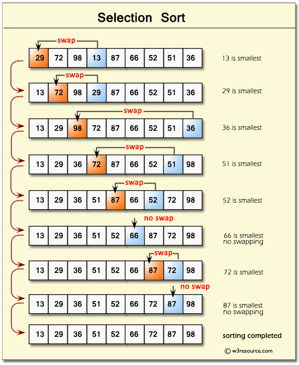

---
presentation:
  margin: 0
  center: false
  transition: "convex"
  enableSpeakerNotes: true
  slideNumber: "c/t"
  navigationMode: "linear"
---

@import "../../css/font-awesome-4.7.0/css/font-awesome.css"
@import "../../css/theme/solarized.css"
@import "../../css/logo.css"
@import "../../css/font.css"
@import "../../css/color.css"
@import "../../css/margin.css"
@import "../../css/table.css"
@import "../../css/main.css"
@import "../../plugin/zoom/zoom.js"
@import "../../plugin/customcontrols/plugin.js"
@import "../../plugin/customcontrols/style.css"
@import "../../plugin/chalkboard/plugin.js"
@import "../../plugin/chalkboard/style.css"
@import "../../plugin/menu/menu.js"
@import "../../js/anychart/anychart-core.min.js"
@import "../../js/anychart/anychart-venn.min.js"
@import "../../js/anychart/pastel.min.js"
@import "../../js/anychart/venn-ml.js"

<!-- slide data-notes="" -->

# C语言程序设计基础

## For Statement (More examples)

### 计算机学院 &nbsp;&nbsp; 杨已彪

#### [yangyibiao@nju.edu.cn](yangyibiao@nju.edu.cn)

<!-- slide data-notes="" -->

##### Review

---

### If Statement (`if` 语句)
### For Statement (`for` 语句)
### Logical Expressions (逻辑表达式)

 

### Array (数组)

---

<!-- slide data-notes="" -->

##### Overview

---

### For Statement (More Examples)
 

### While (Do-While) Statement
 

### `break`语句

---

<!-- slide data-notes="" -->

##### 

---

## <mark>stars.c &ensp; primes.c &ensp; perfectsquare.c &ensp; binary-search.c &ensp; digits.c &ensp; selection-sort.c &ensp; palindrome.c</mark>

---

<!-- slide data-notes="" -->

##### Stars Pyramid (`stars.c`)

---

  

<!--  -->

---

<!-- slide data-notes="" -->

##### Prime Numbers (`primes.c`)

---

  

<!--  -->

---

<!-- slide data-notes="" -->

##### 非完全平方数的和 (`perfectsquare.c`)

---

  

---

<!-- slide data-notes="" -->

##### 

---

Binary Search (`binary-search.c`)

  

<!--  -->

---

<!-- slide data-notes="" -->

##### 

---

<!-- fit --> Digits (`digits-while.c`, `digits-do-while.c`)

  

<!--  -->

---

<!-- slide data-notes="" -->

##### 

---

Selection Sort (`selection-sort.c`)

  

<!--  -->

---

<!-- slide data-notes="" -->

##### 

---
Palindrome (`palindrome.c`)

  

<!--  -->

---

<!-- slide data-notes="" -->

##### 

---

---