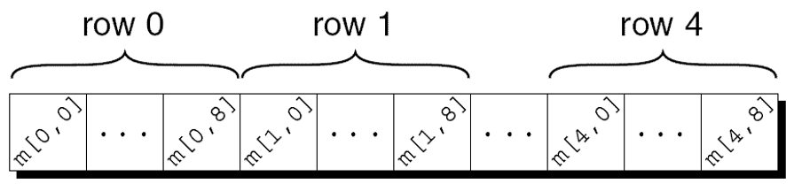

---
presentation:
  margin: 0
  center: false
  transition: "convex"
  enableSpeakerNotes: true
  slideNumber: "c/t"
  navigationMode: "linear"
---

@import "../../css/font-awesome-4.7.0/css/font-awesome.css"
@import "../../css/theme/solarized.css"
@import "../../css/logo.css"
@import "../../css/font.css"
@import "../../css/color.css"
@import "../../css/margin.css"
@import "../../css/table.css"
@import "../../css/main.css"
@import "../../plugin/zoom/zoom.js"
@import "../../plugin/customcontrols/plugin.js"
@import "../../plugin/customcontrols/style.css"
@import "../../plugin/chalkboard/plugin.js"
@import "../../plugin/chalkboard/style.css"
@import "../../plugin/menu/menu.js"
@import "../../js/anychart/anychart-core.min.js"
@import "../../js/anychart/anychart-venn.min.js"
@import "../../js/anychart/pastel.min.js"
@import "../../js/anychart/venn-ml.js"

<!-- slide data-notes="" -->

<div class="bottom20"></div>

# C语言程序设计基础

<hr class="width50 center">

## 多维数组

<div class="bottom8"></div>

### 计算机学院 &nbsp;&nbsp; 杨已彪

#### [yangyibiao@nju.edu.cn](yangyibiao@nju.edu.cn)

<!-- slide data-notes="" -->


##### 提纲

---

- 多维数组

- C99中的变长数组


<!-- slide data-notes="" -->


##### 多维数组

---

数组可以有任意维数

下面的声明创建了一个二维数组(数学术语称为矩阵): 

`int m[5][9];`

数组m有5行9列, 行和列下标都从0开始索引: 

<div class="row1-5-column2-10-fullborder">

|     |   0    |   1    |   2    |   3    |   4    |   5    |   6    |   7    |   8    |
| :-: | :----: | :----: | :----: | :----: | :----: | :----: | :----: | :----: | :----: |
|  0  | &zwnj; | &zwnj; | &zwnj; | &zwnj; | &zwnj; | &zwnj; | &zwnj; | &zwnj; | &zwnj; |
|  1  | &zwnj; | &zwnj; | &zwnj; | &zwnj; | &zwnj; | &zwnj; | &zwnj; | &zwnj; | &zwnj; |
|  2  | &zwnj; | &zwnj; | &zwnj; | &zwnj; | &zwnj; | &zwnj; | &zwnj; | &zwnj; | &zwnj; |
|  3  | &zwnj; | &zwnj; | &zwnj; | &zwnj; | &zwnj; | &zwnj; | &zwnj; | &zwnj; | &zwnj; |
|  4  | &zwnj; | &zwnj; | &zwnj; | &zwnj; | &zwnj; | &zwnj; | &zwnj; | &zwnj; | &zwnj; |

</div>


<!-- slide vertical=true data-notes="" -->


##### 多维数组

---

为了访问i行j列的元素, 需要写成`m[i][j]`的形式. 

表达式`m[i]`指定数组m第i行, 而`m[i][j]`选择该行中第j个元素. 

不要把`m[i][j]`写成`m[i,j]` 

这里, C将逗号视为 ==逗号运算符==, 因此`m[i,j]`等同于`m[j]`


<!-- slide vertical=true data-notes="" -->


##### 多维数组

---

虽然我们以表格形式显示二维数组, 但这并不是它们在计算机内存中实际存储的方式. 
行主序存储数组, 从第 0 行开始, 接着第 1 行, 依此类推. 
数组m的存储方式: 

<div class="top-2">
    
</div>

<!-- <div class="row0-2-column2-11-fullborder">

|     |   >     |  >     |  row0   | >       | >      | row1    | ...    |   >     | >      | row4    |
| :-: | :----:  | :----: | :----:  | :----:  | :----: | :----:  | :----: | :----:  | :----: | :----:  |
|     | m[0][0] | ...    | m[0][8] | m[1][0] | ...    | m[1][8] | ...    | m[4][0] | ...    | m[4][8] |

</div> -->

<!-- slide vertical=true data-notes="" -->


##### 多维数组

---

嵌套for循环非常适合处理多维数组. 

单位矩阵的数组的初始化: ==嵌套的for循环==

```C{.line-numbers}
#define N 10

double ident[N][N];
int row, col;
 
for (row = 0; row < N; row++) {
  for (col = 0; col < N; col++) {
    if (row == col)
      ident[row][col] = 1.0;
    else
      ident[row][col] = 0.0;
  }
}
```

---


<!-- slide data-notes="" -->

##### 多维数组初始化

---

通过嵌套一维初始化式的方法可以产生二维数组的初始化式: 

```C
int m[5][9] = { {1, 1, 1, 1, 1, 0, 1, 1, 1},
                {0, 1, 0, 1, 0, 1, 0, 1, 0},
                {0, 1, 0, 1, 1, 0, 0, 1, 0},
                {1, 1, 0, 1, 0, 0, 0, 1, 0},
                {1, 1, 0, 1, 0, 0, 1, 1, 1} };
```

高维数组的初始化式以类似的方式构造. 

C 提供了多种方法来缩写多维数组的初始化式


<!-- slide vertical=true data-notes="" -->

##### 多维数组初始化

---

如果初始值化式不足以填充整个多维数组, 则剩余元素赋值为0. 

下面初始化式只填充了数组m的前三行; 后两行将赋值为0: 

```C
int m[5][9] = { {1, 1, 1, 1, 1, 0, 1, 1, 1},
                {0, 1, 0, 1, 0, 1, 0, 1, 0},
                {0, 1, 0, 1, 1, 0, 0, 1, 0} };
```

---


<!-- slide vertical=true data-notes="" -->

##### 多维数组初始化

---

如果内层列表的长度不足以填满数组的一行, 则该行中的剩余元素将初始化为`0`: 

```C
int m[5][9] = { {1, 1, 1, 1, 1, 0, 1, 1, 1},
                {0, 1, 0, 1, 0, 1, 0, 1},
                {0, 1, 0, 1, 1, 0, 0, 1},
                {1, 1, 0, 1, 0, 0, 0, 1},
                {1, 1, 0, 1, 0, 0, 1, 1, 1} };
```

---


<!-- slide vertical=true data-notes="" -->


##### 多维数组初始化

---

内层的花括号可以 ==省略==: 

```C
int m[5][9] = {1, 1, 1, 1, 1, 0, 1, 1, 1,
               0, 1, 0, 1, 0, 1, 0, 1, 0,
               0, 1, 0, 1, 1, 0, 0, 1, 0,
               1, 1, 0, 1, 0, 0, 0, 1, 0,
               1, 1, 0, 1, 0, 0, 1, 1, 1};
```

一旦编译器发现数值足以填满一行, 它就会开始填充下一行. 

多维数组中省略内层大括号有风险, 额外的元素或缺失的元素会影响剩下的初始化式, 省略的花括号会引起编译警告 


<!-- slide vertical=true data-notes="" -->


##### 多维数组初始化

---

C99 的指定初始化式也适用于多维数组. 

创建2×2单位矩阵: 

```C
double ident[2][2] = {[0][0] = 1.0, [1][1] = 1.0};
```

像通常一样, 所有未指定值的元素都默认为0. 


<!-- slide data-notes="" -->

##### 常量数组

---

在声明数组的最开始处加上 ==const== 可以使数组成为 ==常量==: 

```C
const char hex_chars[] =
  {'0', '1', '2', '3', '4', '5', '6', '7', '8', '9',
   'A', 'B', 'C', 'D', 'E', 'F'};
```

程序不应修改声明为const的数组. 


<!-- slide vertical=true data-notes="" -->

##### 常量数组

---

将数组声明为const的优点: 

- 表明程序不会更改数组. 

- 帮助编译器捕获错误. 

- const不仅限于数组, 也可用于任何别的变量. 

- const常用于数组的声明, 以保护在程序执行过程中不变的信息. 


<!-- slide data-notes="" -->

##### 程序: 发牌

---

*deal.c*程序说明了二维数组和常量数组的用法. 

该程序从一副标准的扑克牌中随机处理一手牌. 

标准套牌中的每张牌都有花色{梅花&clubs;(`c`), 方块&diams;(`d`), 红桃&hearts;(`h`), 黑桃&spades;(`s`)}和等级{$2, 3, 4, 5, 6, 7, 8, 9, 10, J, Q, K, A$}. 


<!-- slide vertical=true data-notes="" -->

##### 程序: 发牌

---

用户将指定手中应该有多少张牌: 

输入手牌数量: <u>5</u>
你的牌: 7c 2s 5d as 2h

需要解决的问题: 

- 如何从牌组中随机挑选牌？

- 如何避免两次选择同一张牌？

<!-- slide vertical=true data-notes="" -->


##### 程序: 发牌

---

为了随机挑选卡片, 可以采用一些 C 库函数: 

- time函数(来自`<time.h>`): 返回当前时间, 用一个数表示. 

- srand函数(来自`<stdlib.h>`): 初始化 C 的随机数生成器. 

- rand函数(来自`<stdlib.h>`): 每次调用时都会产生一个看似随机的数. 

通过使用%运算符, 缩放rand函数返回值, 使其介于0和3之间(表示花色)或介于0和12之间(表示等级). 


<!-- slide vertical=true data-notes="" -->

##### 程序: 发牌

---

in_hand数组用于记录已经选择过的牌. 

数组有4行13列; 每个元素对应52 张牌中的一张. 

数组的所有元素一开始都为假. 

每随机选择一张牌时, 检查in_hand中该牌对应的元素为真或假. 

- 如果为真, 就需要选择另一张牌. 

- 如果为假, 就把ture存储到对应的元素中, 以便稍后提醒我们这张牌已经被选中. 


<!-- slide vertical=true data-notes="" -->

##### 程序: 发牌

---

一旦验证了一张卡片是`"新"`的, 就需要将它的等级和花色转换成字符, 然后显示出来. 

为了将等级和花色转换为字符形式, 程序设置两个字符数组: 一个用于等级, 一个用于花色

然后用等级和花色作为下标取数组元素. 

数组在程序执行期间不会改变, 因此被声明为`const`. 


<!-- slide vertical=true data-notes="" -->

##### 程序: 发牌

---

*deal.c*

```C{.line-numbers}
/* 随机发牌 */
 
#include <stdbool.h>   /* C99 only */
#include <stdio.h>
#include <stdlib.h>
#include <time.h>
 
#define NUM_SUITS 4
#define NUM_RANKS 13
 
int main(void)
{
  bool in_hand[NUM_SUITS][NUM_RANKS] = {false};
  int num_cards, rank, suit;
  const char rank_code[] = {'2','3','4','5','6','7','8',
                            '9','t','j','q','k','a'};
  const char suit_code[] = {'c','d','h','s'};
  srand((unsigned) time(NULL));

  printf("Enter number of cards in hand: ");
  scanf("%d", &num_cards);
 
  printf("Your hand:");
  while (num_cards > 0) {
    suit = rand() % NUM_SUITS;    /* picks a random suit */
    rank = rand() % NUM_RANKS;    /* picks a random rank */
    if (!in_hand[suit][rank]) {
      in_hand[suit][rank] = true;
      num_cards--;
      printf(" %c%c", rank_code[rank], suit_code[suit]);
    }
  }
  printf("\n");
 
  return 0;
}
```

---


<!-- slide data-notes="" -->


##### 变长数组 (C99)

---

在C89中, 数组变量的长度必须由常量表达式指定. 

在C99中, 数组变量的长度也可使用非常量表达式(==变长数组==).

*reverse2.c*程序(*reverse.c*的修改版)展示了这种用法. 


<!-- slide vertical=true data-notes="" -->

##### 程序: 使用变长数组 (C99)

---

*reverse2.c*

```C{.line-numbers}
/* 使用变长数组反转数列 - 仅限 C99 */
 
#include <stdio.h>
 
int main(void)
{
  int i, n;
 
  printf("How many numbers do you want to reverse? ");
  scanf("%d", &n);
 
  int a[n];   /* C99 only - length of array depends on n */

  printf("Enter %d numbers: ", n);
  for (i = 0; i < n; i++)
    scanf("%d", &a[i]);
  
  printf("In reverse order:");
  for (i = n - 1; i >= 0; i--)
    printf(" %d", a[i]);
  printf("\n");
 
  return 0;
}
```

---


<!-- slide vertical=true data-notes="" -->

##### 变长数组 (C99)

---

*reverse2.c*程序中的数组a是变长数组. 

变长数组的长度是在程序执行时计算的. 

变长数组的主要优点是程序可以准确计算需要多少元素. 

如果程序员指定长度, 数组可能过长(浪费内存)或过短(导致出错). 


<!-- slide vertical=true data-notes="" -->


##### 变长数组 (C99)

---

变长数组的长度不一定要用变量来指定. 任意表达式都可以: 

```C
int a[3*i+5];
int b[j+k]; 
```

与其他数组一样, 变长数组可以是多维的: 

```C
int c[m][n];
```

对变长数组的主要限制: 

- 没有静态存储期限(在第 18 章中讨论). 

- 没有初始化式. 
