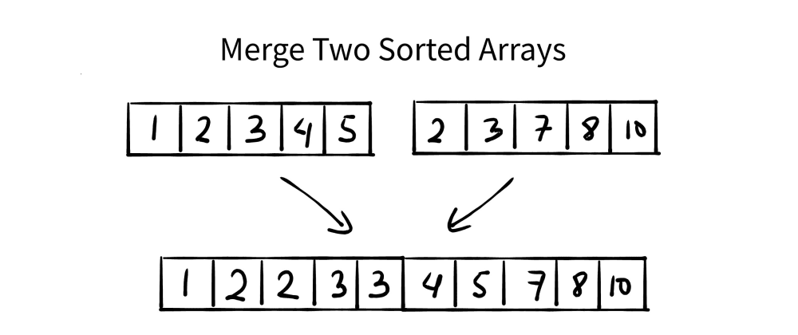

---
presentation:
  margin: 0
  center: false
  transition: "convex"
  enableSpeakerNotes: true
  slideNumber: "c/t"
  navigationMode: "linear"
---

@import "../../css/font-awesome-4.7.0/css/font-awesome.css"
@import "../../css/theme/solarized.css"
@import "../../css/logo.css"
@import "../../css/font.css"
@import "../../css/color.css"
@import "../../css/margin.css"
@import "../../css/table.css"
@import "../../css/main.css"
@import "../../plugin/zoom/zoom.js"
@import "../../plugin/customcontrols/plugin.js"
@import "../../plugin/customcontrols/style.css"
@import "../../plugin/chalkboard/plugin.js"
@import "../../plugin/chalkboard/style.css"
@import "../../plugin/menu/menu.js"
@import "../../js/anychart/anychart-core.min.js"
@import "../../js/anychart/anychart-venn.min.js"
@import "../../js/anychart/pastel.min.js"
@import "../../js/anychart/venn-ml.js"


<!-- slide data-notes="" -->


<div class="bottom20"></div>

# C语言程序设计基础

<hr class="width50 center">

## Loops (More examples)

<div class="bottom8"></div>

### 计算机学院 &nbsp;&nbsp; 杨已彪

#### [yangyibiao@nju.edu.cn](yangyibiao@nju.edu.cn)


<!-- slide vertical=true data-notes="" -->


##### Overview

---


### <font color = red>Loops (More Examples)</font>
<br>

### <font color = blue>Multidimensional Arrays (多维数组)</font>


<!-- slide data-notes="" -->


##### 多维数组

---

数组可以有任意维数

下面的声明创建了一个二维数组(数学术语称为矩阵): 

`int m[5][9];`

数组m有5行9列, 行和列下标都从0开始索引: 

<div class="row1-5-column2-10-fullborder">

|     |   0    |   1    |   2    |   3    |   4    |   5    |   6    |   7    |   8    |
| :-: | :----: | :----: | :----: | :----: | :----: | :----: | :----: | :----: | :----: |
|  0  | &zwnj; | &zwnj; | &zwnj; | &zwnj; | &zwnj; | &zwnj; | &zwnj; | &zwnj; | &zwnj; |
|  1  | &zwnj; | &zwnj; | &zwnj; | &zwnj; | &zwnj; | &zwnj; | &zwnj; | &zwnj; | &zwnj; |
|  2  | &zwnj; | &zwnj; | &zwnj; | &zwnj; | &zwnj; | &zwnj; | &zwnj; | &zwnj; | &zwnj; |
|  3  | &zwnj; | &zwnj; | &zwnj; | &zwnj; | &zwnj; | &zwnj; | &zwnj; | &zwnj; | &zwnj; |
|  4  | &zwnj; | &zwnj; | &zwnj; | &zwnj; | &zwnj; | &zwnj; | &zwnj; | &zwnj; | &zwnj; |

</div>


<!-- slide vertical=true data-notes="" -->


##### 多维数组

---

为了访问i行j列的元素, 需要写成`m[i][j]`的形式. 

表达式`m[i]`指定数组m第i行, 而`m[i][j]`选择该行中第j个元素. 

不要把`m[i][j]`写成`m[i,j]` 

这里, C将逗号视为 ==逗号运算符==, 因此`m[i,j]`等同于`m[j]`


<!-- slide vertical=true data-notes="" -->


##### 多维数组

---

虽然我们以表格形式显示二维数组, 但这并不是它们在计算机内存中实际存储的方式. 
行主序存储数组, 从第 0 行开始, 接着第 1 行, 依此类推. 
数组m的存储方式: 

<div class="top-2">
    
</div>

<!-- <div class="row0-2-column2-11-fullborder">

|     |   >     |  >     |  row0   | >       | >      | row1    | ...    |   >     | >      | row4    |
| :-: | :----:  | :----: | :----:  | :----:  | :----: | :----:  | :----: | :----:  | :----: | :----:  |
|     | m[0][0] | ...    | m[0][8] | m[1][0] | ...    | m[1][8] | ...    | m[4][0] | ...    | m[4][8] |

</div> -->

---


<!-- slide vertical=true data-notes="" -->


##### 多维数组

---

嵌套for循环非常适合处理多维数组. 

单位矩阵的数组的初始化: ==嵌套的for循环==

```C{.line-numbers}
#include <stdio.h>

#define N 10

double ident[N][N]; // 存放在堆中

int main() {
  for (int row = 0; row < N; row++) {
    for (int col = 0; col < N; col++) {
      if (row == col)
        ident[row][col] = 1.0;
      else
        ident[row][col] = 0.0;
    }
  }
}

```

---


<!-- slide data-notes="" -->

##### 多维数组初始化

---

通过嵌套一维初始化式的方法可以产生二维数组的初始化式: 

```C
int m[5][9] = { {1, 1, 1, 1, 1, 0, 1, 1, 1},
                {0, 1, 0, 1, 0, 1, 0, 1, 0},
                {0, 1, 0, 1, 1, 0, 0, 1, 0},
                {1, 1, 0, 1, 0, 0, 0, 1, 0},
                {1, 1, 0, 1, 0, 0, 1, 1, 1} };
```

高维数组的初始化式以类似的方式构造. 

C 提供了多种方法来缩写多维数组的初始化式

---

<!-- slide vertical=true data-notes="" -->

##### 多维数组初始化

---

如果初始值化式不足以填充整个多维数组, 则剩余元素赋值为0. 

下面初始化式只填充了数组m的前三行; 后两行将赋值为0: 

```C
int m[5][9] = { {1, 1, 1, 1, 1, 0, 1, 1, 1},
                {0, 1, 0, 1, 0, 1, 0, 1, 0},
                {0, 1, 0, 1, 1, 0, 0, 1, 0} };
```

---


<!-- slide vertical=true data-notes="" -->

##### 多维数组初始化

---

如果内层列表的长度不足以填满数组的一行, 则该行中的剩余元素将初始化为`0`: 

```C
int m[5][9] = { {1, 1, 1, 1, 1, 0, 1, 1, 1},
                {0, 1, 0, 1, 0, 1, 0, 1},
                {0, 1, 0, 1, 1, 0, 0, 1},
                {1, 1, 0, 1, 0, 0, 0, 1},
                {1, 1, 0, 1, 0, 0, 1, 1, 1} };
```

---


<!-- slide vertical=true data-notes="" -->


##### 多维数组初始化

---

内层的花括号可以 ==省略==: 

```C
int m[5][9] = {1, 1, 1, 1, 1, 0, 1, 1, 1,
               0, 1, 0, 1, 0, 1, 0, 1, 0,
               0, 1, 0, 1, 1, 0, 0, 1, 0,
               1, 1, 0, 1, 0, 0, 0, 1, 0,
               1, 1, 0, 1, 0, 0, 1, 1, 1};
```

一旦编译器发现数值足以填满一行, 它就会开始填充下一行. 

多维数组中省略内层大括号有风险, 额外的元素或缺失的元素会影响剩下的初始化式, 省略的花括号会引起编译警告 

---

<!-- slide vertical=true data-notes="" -->


##### 多维数组初始化

---

C99 的指定初始化式也适用于多维数组. 

创建2×2单位矩阵: 

```C
double ident[2][2] = {[0][0] = 1.0, [1][1] = 1.0};
```

像通常一样, 所有未指定值的元素都默认为0. 


<!-- slide data-notes="" -->

##### 常量数组

---

在声明数组的最开始处加上 ==const== 可以使数组成为 ==常量==: 

```C
const char hex_chars[] =
  {'0', '1', '2', '3', '4', '5', '6', '7', '8', '9',
   'A', 'B', 'C', 'D', 'E', 'F'};
```

程序不应修改声明为const的数组. 

---

<!-- slide vertical=true data-notes="" -->

##### 常量数组

---

将数组声明为const的优点: 

- 表明程序不会更改数组. 

- 帮助编译器捕获错误. 

- const不仅限于数组, 也可用于任何别的变量. 

- const常用于数组的声明, 以保护在程序执行过程中不变的信息. 

---


<!-- slide vertical=true data-notes="" -->


##### Coding

---

## <mark>game-of-life.c &ensp; merge.c &ensp; insertion-sort.c &ensp; bubble-sort.c

<!-- slide vertical=true data-notes="" -->

---

##### Conway's Game of Life

---

[Conway's Game of Life @ wiki](https://en.wikipedia.org/wiki/Conway%27s_Game_of_Life)


#### John Horton Conway ($1937 \sim 2020$)

---


<!-- slide vertical=true data-notes="" -->

##### Conway's Game of Life

---

[playgameoflife.com (Cellular Automata; 元胞自动机)](https://playgameoflife.com/)

* Any <font color = blue>**live**</font> cell with two or three live neighbours survives.
* All other <font color = blue>**live**</font> cells die in the next generation.
<br>

* Any <font color = red>**dead**</font> cell with three live neighbours becomes a live cell.
* All other <font color = red>**dead**</font> cells stay dead.

---


<!-- slide vertical=true data-notes="" -->

##### 

---

 &ensp; 


---


<!-- slide vertical=true data-notes="" -->


##### 

---

<!-- <video controls width = "1100"> <source src="videos/Conway-Game-of-Life.mp4" type = "video/mp4"> </video> -->

<video controls width="1100">
  <source src="videos/Conway-Game-of-Life.mp4" type="video/mp4">
  您的浏览器不支持视频播放，请
  [下载视频](videos/Conway-Game-of-Life.mp4) 观看。
</video>

游戏规则
- 任何活细胞周围有2-3个活细胞则存活
- 任何死细胞周围有3个活细胞则复活
- 其他情况下细胞死亡

---

<!-- slide vertical=true data-notes="" -->


##### Merge (<mark>merge.c</mark>)

---



---


<!-- slide vertical=true data-notes="" -->


##### Merge (<mark>merge.c</mark>)

---


---


<!-- slide vertical=true data-notes="" -->

##### Merge (<mark>merge.c</mark>)

---


---


<!-- slide vertical=true data-notes="" -->

##### Insertion Sort

---


---


<!-- slide vertical=true data-notes="" -->

##### Insertion Sort

---

<div class="top-2">
  
</div>

---

<!-- slide vertical=true data-notes="" -->

##### Bubble Sort

---


---


<!-- slide vertical=true data-notes="" -->

##### Bubble Sort

---


---


<!-- slide vertical=true data-notes="" -->

##### 

---

<div class="top-2">
  
</div>