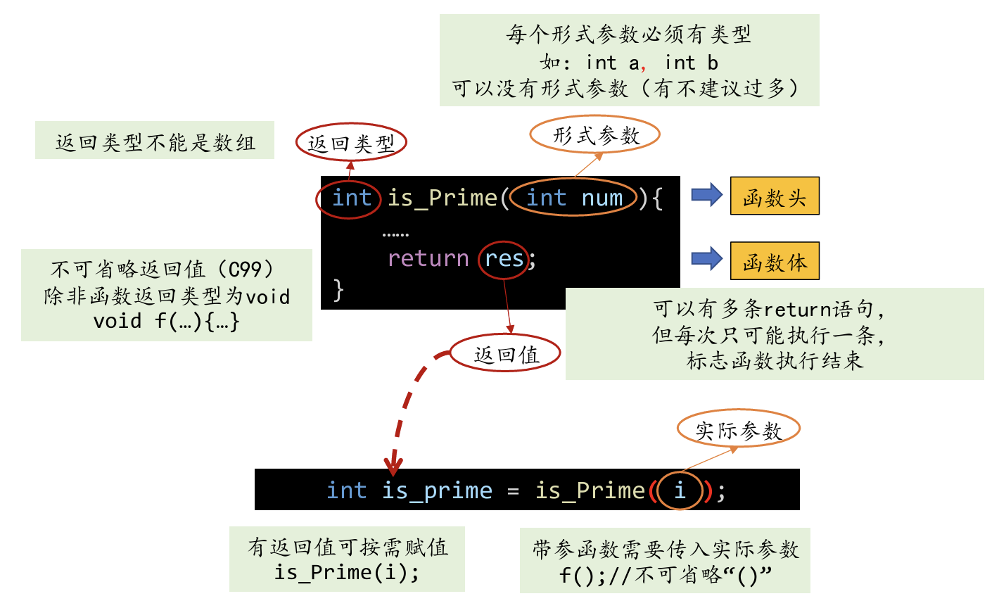
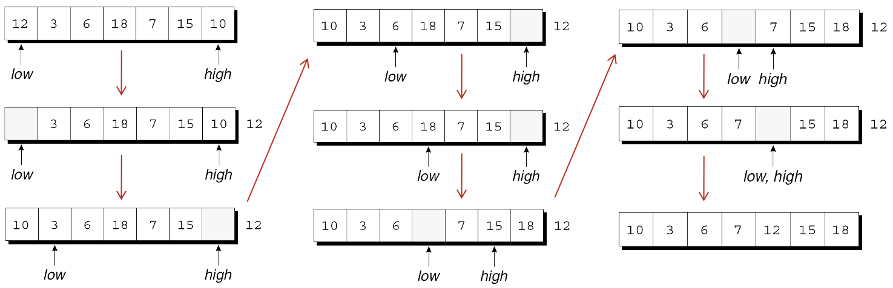

---
presentation:
  margin: 0
  center: false
  transition: "convex"
  enableSpeakerNotes: true
  slideNumber: "c/t"
  navigationMode: "linear"
---

@import "../../css/font-awesome-4.7.0/css/font-awesome.css"
@import "../../css/theme/solarized.css"
@import "../../css/logo.css"
@import "../../css/font.css"
@import "../../css/color.css"
@import "../../css/margin.css"
@import "../../css/table.css"
@import "../../css/main.css"
@import "../../plugin/zoom/zoom.js"
@import "../../plugin/customcontrols/plugin.js"
@import "../../plugin/customcontrols/style.css"
@import "../../plugin/chalkboard/plugin.js"
@import "../../plugin/chalkboard/style.css"
@import "../../plugin/menu/menu.js"
@import "../../js/anychart/anychart-core.min.js"
@import "../../js/anychart/anychart-venn.min.js"
@import "../../js/anychart/pastel.min.js"
@import "../../js/anychart/venn-ml.js"

<!-- slide data-notes="" -->

<div class="bottom20"></div>

# C语言程序设计基础

<hr class="width50 center">

## Functions (函数)


<div class="bottom8"></div>

### 计算机学院 &nbsp;&nbsp; 杨已彪

#### yangyibiao@nju.edu.cn


<!-- slide data-notes="" -->

##### 提纲

---

- 函数的定义和调用

- 函数声明

- 实际参数

- return语句

- 程序终止

- 递归

---


<!-- slide data-notes="" -->

##### 数组

---

```C
char msg1[] = {'H', 'e', 'l', 'l', 'o', '\0'}; 

char msg1[] = "Hello"; 
char msg1[10] = "Hello";
char msg1[10] = {'H', 'e', 'l', 'l', 'o', '\0'}; 
char msg1[10] = {'H', 'e', 'l', 'l', 'o'}; 
// msg1 H e l l o \0 \0 \0 \0 \0

```
---

<!-- slide data-notes="" -->

##### 软件设计原则

---

==复用==

模块化：便于调试、代码理解

封装：隐藏实现细节，仅暴漏有限、必要的接口

---


<!-- slide data-notes="" -->


##### 函数

---

函数是一连串组合在一起并命名的语句. 

每个函数本质上都是一个自带声明和语句的小程序. 

功能优势: 

- 一个程序可以分成更容易理解和修改的小块. 

- 可以避免重复编写要多次使用的代码. 

- 最初属于某个程序的功能可以在其他程序中重用. 

---


<!-- slide data-notes="" -->

##### 函数的声明和调用

---


函数的声明：
```C
int printf(const char* format, ... );
int scanf(const char* format, ... );
```

函数的调用：
```C
char str[1024];
scanf("%s", str);

int a, b;
scanf("%d%d", &a, &b);
printf("a + b is : %d", a + b);
```

---


<!-- slide data-notes="" -->

##### 函数的声明和调用

---

<div class="top-2">
  
</div>

---


<!-- slide data-notes="" -->

##### 函数定义

---

函数定义的<u>一般格式</u>: 

```C
返回类型 函数名(形式参数)
{
  声明
  语句
}
```
---


<!-- slide data-notes="" -->

##### 函数定义

---

函数的 ==返回类型== 是函数返回值的类型. 

函数返回类型的规则: 

- 函数不能返回数组. 

- 指定返回类型为void表示该函数没有返回值. 

- 在C89中, 如果省略返回类型, 则假定该函数的返回值是int类型. 

- 在C99中, 省略返回类型是不合法的. 

---

<!-- slide data-notes="" -->


##### 函数定义

---

函数名之后是参数列表. 

需在每个形式参数前面说明其类型 , 形式参数间用逗号分隔. 

如果函数没有形式参数, 则应在括号里加上单词void. 

---


<!-- slide data-notes="" -->

##### 函数声明

---

C不要求函数的定义在其调用之前. 

假设我们重新编排*average.c*程序, 将average函数的定义放在main函数的定义之后. 

---

<!-- slide data-notes="" -->


##### 函数声明

---

在main中遇到average函数调用时, 编译器没有该函数的信息. 

编译器不会产生错误消息, 而是假设average返回一个int值. 

我们说编译器为该函数创建了一个 ==隐式声明==. 

---


<!-- slide data-notes="" -->

##### leap.c

---

<a href="code/leap.c" target="_blank">leap.c</a>

<a href="code/leap-re.c" target="_blank">leap-re.c</a>

---

<!-- slide data-notes="" -->

##### primes.c

---

<a href="code/primes.c" target="_blank">primes.c</a>
<a href="code/primes-re.c" target="_blank">primes-re.c</a>


---

<!-- slide data-notes="" -->

##### stars.c

---

<a href="code/stars.c" target="_blank">stars.c</a>
<a href="code/stars-re.c" target="_blank">stars-re.c</a>


---

<!-- slide data-notes="" -->

##### binary-search.c

---

<a href="code/bsearch.c" target="_blank">bsearch.c</a>
<a href="code/bsearch-re.c" target="_blank">bsearch-re.c</a>

---

<!-- slide data-notes="" -->

##### palindrome.c

---

<a href="code/palindrome.c" target="_blank">palindrome.c</a>
<a href="code/palindrome-re.c" target="_blank">palindrome-re.c</a>


---


<!-- slide data-notes="" -->

##### selection-sort.c

---

<a href="code/selection-sort.c" target="_blank">selection-sort.c</a>
<a href="code/selection-sort-re.c" target="_blank">selection-sort-re.c</a>

---


<!-- slide data-notes="" -->

##### merge.c

---

<a href="code/merge.c" target="_blank">merge.c</a>
<a href="code/merge-re.c" target="_blank">merge-re.c</a>


---

<!-- slide data-notes="" -->

##### game-of-life.c

---

<a href="code/game-of-life.c" target="_blank">game-of-life.c</a>
<a href="code/game-of-life-re.c" target="_blank">game-of-life.c</a>

---


<!-- slide data-notes="" -->

##### 程序: 判定素数

---

*prime.c*程序测试一个数字是否为素数: 

Enter a number: <u>34</u>
Not prime

该程序定义一个名为is_prime的函数, 如果其参数是质数则返回true, 否则返回false. 

is_prime将其参数n除以从2到n的平方根之间的每个数字, 只要有一个余数为0, n就不是素数. 

<!-- slide data-notes="" -->

##### 程序: 判定素数

---

*prime.c*

```C{.line-numbers}
/* 判断一个数是否为素数 */
 
#include <stdbool.h>   /* C99 only */
#include <stdio.h>
 
bool is_prime(int n)
{
  int divisor;
 
  if (n <= 1)
    return false;
  for (divisor = 2; divisor * divisor <= n; divisor++)
    if (n % divisor == 0)
      return false;
  return true;
}

int main(void)
{
  int n;
 
  printf("Enter a number: ");
  scanf("%d", &n);
  if (is_prime(n))
    printf("Prime\n");
  else
    printf("Not prime\n");
  return 0;
}
```
---


<!-- slide data-notes="" -->


##### 函数声明

---

```C{.line-numbers}
#include <stdio.h>
 
int main(void)
{
  double x, y, z;
 
  printf("Enter three numbers: ");
  scanf("%lf%lf%lf", &x, &y, &z);
  printf("Average of %g and %g: %g\n", x, y, average(x, y));
  printf("Average of %g and %g: %g\n", y, z, average(y, z));
  printf("Average of %g and %g: %g\n", x, z, average(x, z));

  return 0;
}
 
double average(double a, double b)
{
  return (a + b) / 2;
}
```
---


<!-- slide data-notes="" -->


##### 函数声明

---

编译器无法检查传递给average的实参个数和实参类型. 

它只能进行默认的实际参数提升并希望获得最好的结果. 

当编译器在程序后面遇到average的定义时, 它会发现函数的返回类型实际上是double而不是int, 因此我们会得到一条出错消息. 

<!-- slide data-notes="" -->


##### 函数声明

---

避免定义前调用的一种方法是每个函数的定义都出现在调用前. 

可惜, 有时候无法进行这样的安排. 

即使可以, 程序也会因为函数定义的顺序不自然而难以阅读. 

<!-- slide data-notes="" -->


##### 函数声明

---

幸运的是, C提供了更好的解决方案: 在调用函数之前声明它. 

函数声明为编译器提供函数的简要介绍, 完整定义将在以后给出. 

函数声明的<u>一般形式</u>: 

```C
返回类型 函数名(参数);
```

函数的声明必须与函数的定义一致. 

这是为average函数添加了声明的*average.c*程序. 

<!-- slide data-notes="" -->


##### 函数声明

---

```C{.line-numbers}
#include <stdio.h>
 
double average(double a, double b);   /* DECLARATION */

int main(void)
{
  double x, y, z;

  printf("Enter three numbers: ");
  scanf("%lf%lf%lf", &x, &y, &z);
  printf("Average of %g and %g: %g\n", x, y, average(x, y));
  printf("Average of %g and %g: %g\n", y, z, average(y, z));
  printf("Average of %g and %g: %g\n", x, z, average(x, z));

  return 0;
}
 
double average(double a, double b)    /* DEFINITION */
{
  return (a + b) / 2;
}
```
---


<!-- slide data-notes="" -->

##### 函数声明

---

函数声明也被称为函数原型. 

函数原型不必指定函数形参的名字, 只要显示它们的类型即可: 

```C
double average(double, double);
```

但最好不要省略形参的名字. 

---


<!-- slide data-notes="" -->

##### 函数声明

---

在调用函数之前, 须先对其进行声明或定义. 

调用函数时, 如果此前编译器未见其声明或定义, 会导致出错. 

---


<!-- slide data-notes="" -->

##### 实际参数

---

在C中, 参数是通过值传递的: 

- 调用函数时, 计算出每个实际参数的值, 并将其赋值给相应的形式参数. 

- 函数执行时, 对形式参数的改变不会影响实际参数的值, 形式参数包含的是实际参数值的副本. 

<!-- slide data-notes="" -->


##### 实际参数

---

参数按值传递既有优点也有缺点. 

因为形式参数的修改不会影响到对应的实际参数, 可以把形式参数作为函数内的变量来使用, 从而减少需要的变量的数量. 

<!-- slide data-notes="" -->


##### 实际参数

---

以下函数, 计算数字x的n次幂: $x^n$

```C{.line-numbers}
int power(int x, int n)
{
  int i, result = 1;

  for (i = 1; i <= n; i++)
    result = result * x;

  return result;
}
```
---


<!-- slide data-notes="" -->

##### 实际参数

---

n是原始指数的副本, 函数可以安全修改它, 从而不再需要变量i: 

```C{.line-numbers}
int power(int x, int n)
{
  int result = 1;

  while (n-- > 0)
    result = result * x;

  return result;
}
```

---


<!-- slide data-notes="" -->

##### 实际参数

---

C对参数按值传递的要求使得编写某些类型的函数变得困难. 

假设需要一个将double型的值分解为整数和小数部分的函数. 

函数不能返回两个数, 尝试将两个变量传递给函数并修改它们: 

```C
void decompose(double x, long int_part, double frac_part)
{
  int_part = (long) x;
  frac_part = x - int_part;
}
```

---


<!-- slide data-notes="" -->

##### 实际参数

---

函数调用: 

```C
decompose(3.14159, i, d);
```

可惜的是, i和d不会因为赋值给int_part和frac_part而受到影响. 

第 11 章展示了如何使decompose函数奏效. 


<!-- slide data-notes="" -->

##### 实际参数的转换

---

C允许实际参数的类型与形式参数的类型不匹配的函数调用. 

实际参数如何转换取决于编译器在调用函数之前是否已经遇到函数的原型(或函数的完整定义). 


<!-- slide data-notes="" -->

##### 实际参数的转换

---

编译器在调用之前遇到了原型. 

每个参数的值都隐式转换为相应形式参数的类型, 类似赋值一样. 

示例: 如果将int型的实际参数传递给期望得到double型参数的函数, 则该实际参数将自动转换为double类型. 

---

<!-- slide data-notes="" -->

##### 实际参数的转换

---

编译器在调用之前没有遇到原型. 

编译器执行默认的实际参数提升: 

float类型的实际参数转换为double类型. 

执行整值提升, 把char和short类型的实际参数转换为int类型. (C99为整数提升)


<!-- slide data-notes="" -->

##### 实际参数的转换

---

依赖默认的实际参数提升是危险的, 例如: 

```C{.line-numbers}
#include <stdio.h>
 
int main(void)
{
  double x = 3.0;
  printf("Square: %d\n", square(x));
 
  return 0;
}
 
int square(int n)
{
  return n * n;
}
```

在调用square时, 编译器不知道它需要一个int类型的参数. 

<!-- slide data-notes="" -->


##### 实际参数的转换

---

编译器在$x$上执行默认的实际参数提升, 但没有任何效果. 

函数期望int类型的实际参数, 却获得了double类型值, 所以调用square将产生无效的结果. 

将square的实际参数强制转换为正确的类型可以解决该问题: 

```C
printf("Square: %d\n", square((int) x));
```

更好的解决方案是在调用square之前提供该函数的原型. 

C99中, 没有提供函数声明或定义时调用square函数是错误的. 


<!-- slide data-notes="" -->

##### 数组型实际参数

---

当函数参数是一维数组时, 可以不指定数组的长度: 

```C
int f(int a[]) /* 没有指定长度 */
{
  …
}
```

C没有为函数提供任何简单的方法来确定传递给它的数组的长度. 

我们必须提供长度(如果函数需要它)作为额外的参数. 


<!-- slide data-notes="" -->

##### 数组型实际参数

---

例子: 

```C{.line-numbers}
int sum_array(int a[], int n)
{
  int i, sum = 0;

  for (i = 0; i < n; i++)
    sum += a[i];

  return sum;
}
```

由于需要知道数组a的长度, 必须将它作为第二个参数提供. 


<!-- slide data-notes="" -->

##### 数组型实际参数

---

sum_array的原型具有以下形式: 

```C
int sum_array(int a[], int n);
```

通常情况下, 如果愿意, 可以省略参数名称: 

```C
int sum_array(int [], int);
```
---


<!-- slide data-notes="" -->

##### 数组型实际参数

---

调用sum_array时, 第一个参数是数组的名字, 第二个是它的长度: 

```C{.line-numbers}
#define LEN 100
 
int main(void)
{
  int b[LEN], total;
  …
  total = sum_array(b, LEN);
  …
}
```

注: 在将数组名称传递给函数时, 不要在数组名称后放置方括号: 

```C
total = sum_array(b[], LEN);   /*** WRONG ***/
```
---


<!-- slide data-notes="" -->

##### 数组型实际参数

---

函数无法检查传入的数组长度的正确性. 

我们可以利用这一点来告诉函数, 数组的长度比实际情况小. 

假设b数组有100个元素, 但是实际仅存储了50个数. 

对前50个元素进行求和: 

```C
total = sum_array(b, 50);
```
---


<!-- slide data-notes="" -->

##### 数组型实际参数

---

注意不要告诉函数, 数组型实际参数比实际情况大: 

```C
total = sum_array(b, 150);    /*** WRONG ***/
```

sum_array函数将超出数组的末尾, 导致未定义的行为. 


<!-- slide data-notes="" -->

##### 数组型实际参数

---

函数可以更改数组形式参数的元素, 更改会反映在实际参数中. 

通过在每个数组元素中存储0来修改数组的函数: 

```C
void store_zeros(int a[], int n)
{
  int i;
 
  for (i = 0; i < n; i++) 
    a[i] = 0;
}
```

调用store_zeros: 

```C
store_zeros(b, 100);
```

修改数组型实际参数元素的能力似乎与C按值传递参数相矛盾?

---


<!-- slide data-notes="" -->

##### 数组型实际参数

---

如果形式参数是多维数组, 声明参数时只能省略第一维的长度. 

修改sum_array使得a是一个二维数组, 必须指定a中的列数: 

```C{.line-numbers}
#define LEN 10
 
int sum_two_dimensional_array(int a[][LEN], int n)
{
  int i, j, sum = 0;
 
  for (i = 0; i < n; i++)
    for (j = 0; j < LEN; j++)
      sum += a[i][j];

  return sum;
}
```
---


<!-- slide data-notes="" -->

##### 数组型实际参数

---

无法传递具有任意列数的多维数组是很讨厌的. 

通常可以通过使用指针数组来解决这个问题. 

C99的变长数组形式参数提供了一个更好的解决方案. 


<!-- slide data-notes="" -->

##### 变长数组形式参数 (C99)

---

C99 允许使用可变长度数组作为参数. 

考虑sum_array函数: 

```C
int sum_array(int a[], int n)
{
  …
}
```

这样的定义使得n和数组a的长度之间没有直接联系.

尽管函数体将n视为a的长度, 但数组实际长度可能大于或小于n. 


<!-- slide data-notes="" -->

##### 变长数组形式参数 (C99)

---

如果使用变长数组形式参数, 我们可以明确声明数组a的长度为n: 

```C
int sum_array(int n, int a[n])
{
  …
}
```

第一个参数(n)的值指定第二个参数(a)的长度. 

<span class="blue">:fa-lightbulb-o:</span> 这里交换了参数顺序, 使用变长数组形式参数时, 顺序很重要. 


<!-- slide data-notes="" -->

##### 变长数组形式参数 (C99)

---

新版本的sum_array函数的原型有好几种写法. 

一种写法是让它看起来与函数定义一样: 

```C
int sum_array(int n, int a[n]);  /* Version 1 */
```

另一种写法是用是`*`取代数组长度: 

```C
int sum_array(int n, int a[*]);  /* Version 2a */
```
---


<!-- slide data-notes="" -->

##### 变长数组形式参数 (C99)

---

使用`*`符号的原因是参数名称在函数声明中是可选的. 

如果省略第一个参数的名称, 就无法指定数组的长度为n, 但`*`提供了一个线索, 数组的长度与形参列表中较早出现的参数有关: 

```C
int sum_array(int, int [*]);     /* Version 2b */
```
---


<!-- slide data-notes="" -->

##### 变长数组形式参数 (C99)

---

将方括号留空也合法, 就像我们通常在声明数组参数时那样: 

```C
int sum_array(int n, int a[]);  /* Version 3a */
int sum_array(int, int []);     /* Version 3b */
```

但是将括号留空不是一个好的选择, 因为它没有说明n和a之间的关系. 


<!-- slide data-notes="" -->

##### 变长数组形式参数 (C99)

---

一般来说, 变长数组形式参数的长度可以是任意表达式. 

连接两个数组a和b, 将结果存储到数组c中的函数: 

```C
int concatenate(int m, int n, int a[m], int b[n], int c[m+n])
{
  …
}
```

指定c长度的表达式涉及另两个参数, 但通常它可以使用函数外部的变量, 甚至可以调用其他函数. 

<!-- slide data-notes="" -->


##### 变长数组形式参数 (C99)

---

一维变长数组形式参数的用处有限. 

它们通过说明数组参数的长度来使函数声明或定义更具描述性. 

不会执行额外的错误检查, 数组参数仍然可能太长或太短. 

---`


<!-- slide data-notes="" -->

##### return语句

---

非void的函数必须使用return语句来指定它将返回的值. 

return语句的 <u>格式</u>: 

```C
return 表达式;
```

表达式通常只是常量或变量, 但也可以是更复杂的表达式: 

```C
return 0;
return status;
return n >= 0 ? n : 0;
```
----


<!-- slide data-notes="" -->

##### return语句

---

如果return语句中表达式的类型与函数的返回类型不匹配, 则表达式将被隐式转换为返回类型. 

*如果声明函数返回int型值, 但return语句包含double类型表达式, 则表达式的值将被转换为int类型.*


---


<!-- slide data-notes="" -->

##### 程序终止

---

通常, main的返回类型是int: 

```C
int main(void)
{
  …
}
```

以往的C常省略main的返回类型, 利用的是返回类型默认int的传统: 

```C
main()
{
  …
}
```
---


<!-- slide data-notes="" -->

##### 程序终止

---

省略函数的返回类型在C99中是不合法的, 因此最好不要这么做. 

在main的参数列表中省略void是合法的, 但最好包含它. 


<!-- slide data-notes="" -->

##### 程序终止

---

main返回的值是一个状态码, 在程序终止时可以检测 ==状态码==. 

如果程序正常终止, main应该返回0. 

为了指示异常终止, main应该返回一个非0的值. 

确保每个C程序都返回一个状态码是一种很好的做法. 


<!-- slide data-notes="" -->

##### exit函数

---

main中执行return语句是终止程序的一种方法. 

另一个是调用exit函数, 它属于`<stdlib.h>`头. 

传递给exit的实际参数与main的返回值具有相同的含义: 两者都表示程序在终止时的状态. 

为了表示正常终止, 传递0: 

```C
exit(0);   /* normal termination */
```
---


<!-- slide data-notes="" -->

##### exit函数

---

由于0有点模糊, 所以C允许用EXIT_SUCCESS来代替(效果一样): 

```C
exit(EXIT_SUCCESS);
```

传递EXIT_FAILURE表示异常终止: 

```C
exit(EXIT_FAILURE);
```

- `EXIT_SUCCESS`和`EXIT_FAILURE`是定义在`<stdlib.h>`中的宏. 

- `EXIT_SUCCESS`和`EXIT_FAILURE`的值是由实现定义的, 通常为0和1. 


<!-- slide data-notes="" -->

##### exit函数

---

main中的语句

```C
return 表达式;
```

等价于

```C
exit(表达式);
```

return和exit的区别在于: 

- 无论哪个函数调用exit都会导致程序终止. 

- return语句仅当由main函数调用时才会导致程序终止. 


<!-- slide data-notes="" -->

##### 递归

---

如果函数调用自身, 则它是递归的. 

以下函数利用公式$n! = n × (n – 1)!$递归地计算$n!$:

```C{.line-numbers}
int fact(int n)
{
  if (n <= 1)
    return 1;
  else
    return n * fact(n - 1);
}
```
---


<!-- slide data-notes="" -->

##### 递归

---

要了解递归是如何工作的, 让我们来跟踪语句的执行

```C
i = fact(3);
```

1. fact(3) 发现 $3 \le 1$ 不成立, 所以调用
2. &emsp; fact(2), 发现 $2 \le 1$ 不成立, 所以调用
3. &emsp; &emsp; fact(1), 发现 $1 \le 1$ 成立, 所以返回1, 导致
4. &emsp; fact(2) 返回 $2 × 1 = 2$, 导致
2. fact(3) 返回 $3 × 2 = 6$.


<!-- slide data-notes="" -->

##### 递归

---

以下递归函数使用公式$x^n = x × x ^{n –1}$计算$x^n$. 

```C{.line-numbers}
int power(int x, int n)
{
  if (n == 0)
    return 1;
  else
    return x * power(x, n - 1);
}
```
---


<!-- slide data-notes="" -->

##### 递归

---

把条件表达式放入return语句中可以精简power函数: 

```C
int power(int x, int n)
{
    return n == 0 ? 1 : x * power(x, n - 1);
}
```

fact和power都会在调用时小心地测试==终止条件==. 

所有递归函数都需有终止条件以防止无限递归. 


<!-- slide data-notes="" -->

##### 快速排序算法

---

递归用于函数调用自身两次或多次的复杂算法. 

递归经常作为==分治法==的结果自然地出现. 

分治法把大问题分成多个小问题, 采用相同算法分别解决小问题. 


<!-- slide data-notes="" -->

##### 快速排序算法

---

快速排序算法是分治法的经典例子. 

假设要排序的数组下标从1到n. 

快速排序算法

1. 选择一个数组元素e ("分割元素"), 然后重新排列数组, 使元素$1, \dots, i – 1$都小于或等于e, 元素i包含e, 而元素$i + 1, \dots,  n$都大于或等于e . 
2. 通过递归地采用快速排序方法对元素$1, \dots, i – 1$进行排序. 
3. 通过递归地采用快速排序方法对元素$i + 1, \dots, n$进行排序.  


<!-- slide data-notes="" -->

##### 快速排序算法

---

快速排序算法的第1步很关键. 

有多种方法可以分割数组. 

下面使用一种易于理解但不是特别高效的方法. 

该算法依赖于两个名为low和high的"标记", 跟踪数组中的位置. 


<!-- slide data-notes="" -->

##### 快速排序算法

---

- 最初, low指向第一个元素, high指向末尾元素. 
- 首先将第一个元素(分割元素)复制到一个临时位置, 在数组中留下一个"空位". 
- 接下来, 从右到左移动high, 直到它指向一个小于分割元素的元素. 
- 然后把这个元素复制给low指向的空位, 这会产生一个新空位(由high指向). 
- 现在从左到右移动low, 寻找比分割元素大的元素. 当找到时, 将它复制到high指向的空位. 
- 重复该过程, 直到low和high在一个空位处相遇. 
- 最后, 将分割元素复制给空位. 


<!-- slide data-notes="" -->

##### 快速排序算法

---

对数组进行快速排序的示例: 

<div class="top-2">
  
</div>


<!-- slide data-notes="" -->

##### 快速排序算法

---

由最终图可知, 分割元素左边的所有元素都小于等于12, 右边的所有元素都大于等于12. 

既然数组已经被分割, 那么可以使用快速排序法递归地对数组的前4个元素(10、3、6和7)和后2个元素(15和18)进行排序. 


<!-- slide data-notes="" -->

##### 程序: 快速排序

---

quicksort递归函数使用快速排序算法对整数数组进行排序. 

*qsort.c*程序将10个数字读入一个数组, 调用quicksort对数组进行排序, 然后打印数组中的元素: 

Enter 10 numbers to be sorted: <u>9 16 47 82 4 66 12 3 25 51</u>
In sorted order: 3 4 9 12 16 25 47 51 66 82

对数组进行分割的代码位于一个名为split的独立函数中. 


<!-- slide data-notes="" -->

##### 程序: 快速排序

---

[`qsort`.c](./code/qsort.c)

```C{.line-numbers}
/* 使用快速排序算法对整数数组进行排序 */
 
#include <stdio.h>
 
#define N 10
 
void quicksort(int a[], int low, int high);
int split(int a[], int low, int high);
 
int main(void)
{
  int a[N], i;

  printf("Enter %d numbers to be sorted: ", N);
  for (i = 0; i < N; i++)
    scanf("%d", &a[i]);

  quicksort(a, 0, N - 1);

  printf("In sorted order: ");
  for (i = 0; i < N; i++)
    printf("%d ", a[i]);
  printf("\n");

  return 0;
}

void quicksort(int a[], int low, int high)
{
  int middle;

  if (low >= high) return;
  middle = split(a, low, high);
  quicksort(a, low, middle - 1);
  quicksort(a, middle + 1, high);
}

int split(int a[], int low, int high)
{
  int part_element = a[low];

  for (;;) {
    while (low < high && part_element <= a[high])
      high--;
    if (low >= high) break;
    a[low++] = a[high];
 
    while (low < high && a[low] <= part_element)
      low++;
    if (low >= high) break;
    a[high--] = a[low];
  }

  a[high] = part_element;
  return high;
}
```
---


<!-- slide data-notes="" -->

##### 程序: 快速排序

---

提高程序性能的方法: 

- 改进分割算法. 

- 采用不同的方法对小数组进行排序. 

- 使用非递归的快速排序. 

