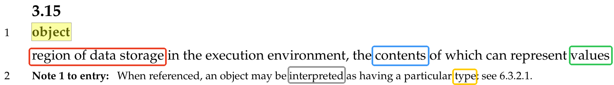
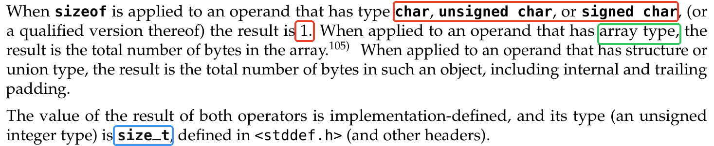
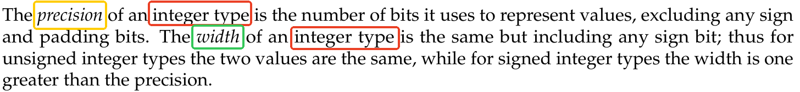
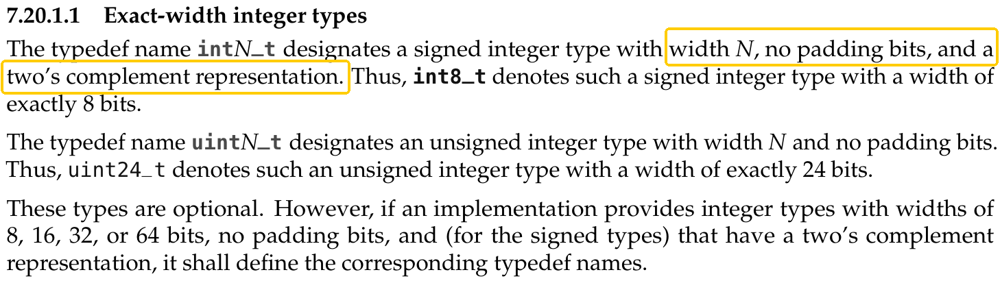
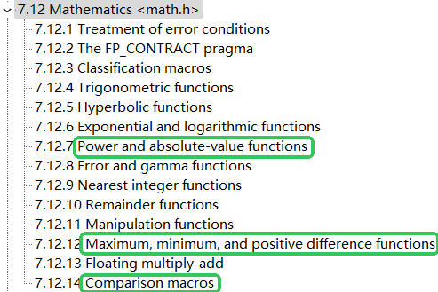
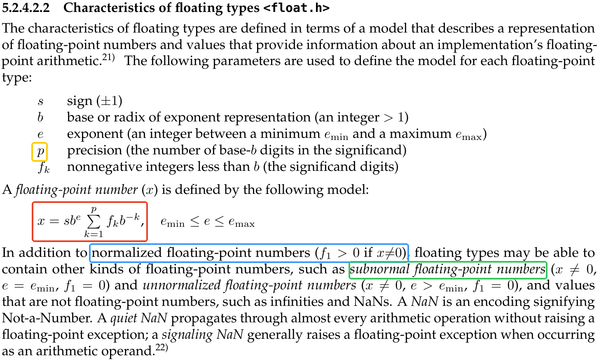
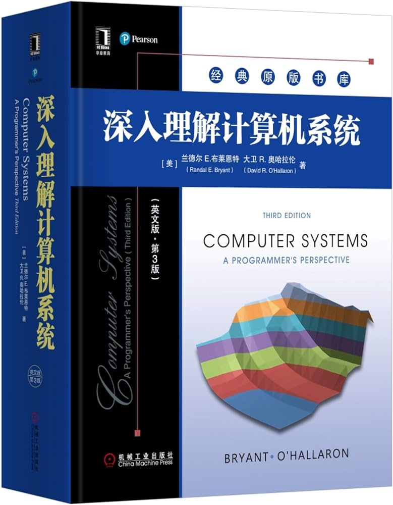
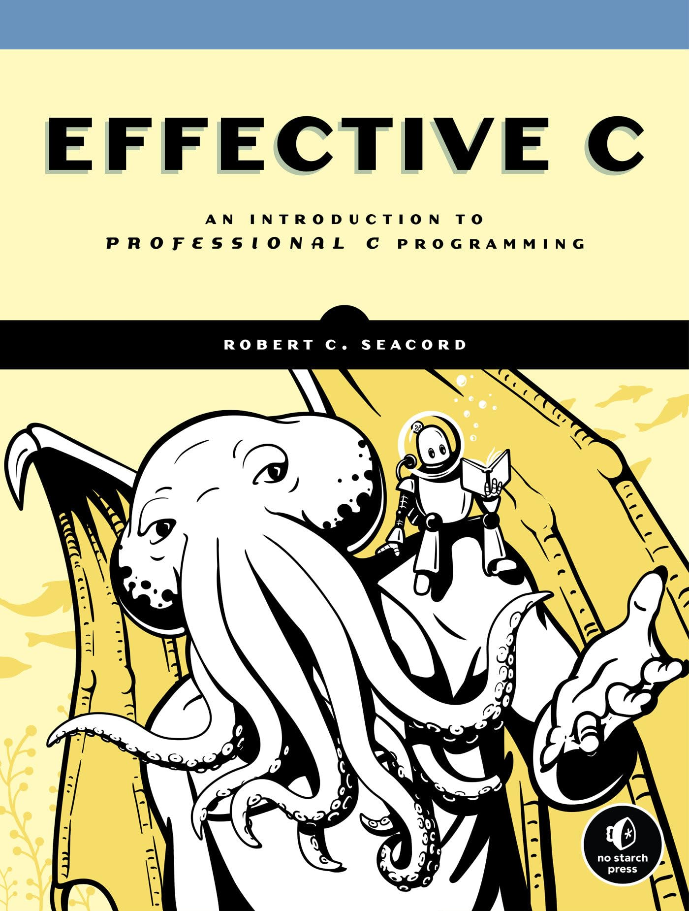

---
presentation:
  margin: 0
  center: false
  transition: "convex"
  enableSpeakerNotes: true
  slideNumber: "c/t"
  navigationMode: "linear"
---

@import "../../css/font-awesome-4.7.0/css/font-awesome.css"
@import "../../css/theme/solarized.css"
@import "../../css/logo.css"
@import "../../css/font.css"
@import "../../css/color.css"
@import "../../css/margin.css"
@import "../../css/table.css"
@import "../../css/main.css"
@import "../../plugin/zoom/zoom.js"
@import "../../plugin/customcontrols/plugin.js"
@import "../../plugin/customcontrols/style.css"
@import "../../plugin/chalkboard/plugin.js"
@import "../../plugin/chalkboard/style.css"
@import "../../plugin/menu/menu.js"
@import "../../js/anychart/anychart-core.min.js"
@import "../../js/anychart/anychart-venn.min.js"
@import "../../js/anychart/pastel.min.js"
@import "../../js/anychart/venn-ml.js"

<!-- slide data-notes="" -->

# C语言程序设计基础

## 数据类型

### 计算机学院 &nbsp;&nbsp; 杨已彪

#### yangyibiao@nju.edu.cn

---

<!-- slide vertical=true data-notes="" -->

---

# Review

# Functions

### Function Definition
### Function Declaration
### Arrays as Parameters
### <mark>Pass by Value</mark>

---

<!-- slide vertical=true data-notes="" -->

---

# Overview
 
 
 

#  (Basic) Data Types

---

<!-- slide vertical=true data-notes="" -->

---

# Two Major Reasons

 
 
 

## <mark>Architectures May Vary</mark>

 
 

## <mark>Finite vs. Infinite</mark>

---

<!-- slide vertical=true data-notes="" -->

---

# Object

 
 

 
 

## <mark>Object Types&ensp;&ensp;Function Types</mark>

---

<!-- slide vertical=true data-notes="" -->

---

# Data Types
 

The <mark>**type**</mark> of a variable determines

 

- the set of **values** it may take on and

- what **operations** can be performed on them.

---

<!-- slide vertical=true data-notes="" -->

---

 
 
 

## <mark>int &ensp;&ensp; char &ensp;&ensp; bool&ensp; (_Bool)</mark>&ensp;&ensp;double
 

## [ ]

---

<!-- slide vertical=true data-notes="" -->

---

# Integral Types (<mark>size.c</mark>)

 

- <mark>(unsigned)</mark> short (int)

- <mark>unsigned</mark> int

- <mark>unsigned</mark> long (int)

- <mark>unsigned</mark> long long (int)

---

<!-- slide vertical=true data-notes="" -->

---

# Integral Types

 

- <mark>(unsigned)</mark> short (int)

- <mark>unsigned</mark> int

- <mark>unsigned</mark> long (int)

- <mark>unsigned</mark> long long (int)

---

<!-- slide vertical=true data-notes="" -->

---

# Integral Types (<mark>int-limits.c</mark>)

 

- <mark>(unsigned)</mark> short (int)

- <mark>unsigned</mark> int

- <mark>unsigned</mark> long (int)

- <mark>unsigned</mark> long long (int)

---

<!-- slide vertical=true data-notes="" -->

---

# Integral Types (<mark>exact-width.c</mark>)

 

## int8_t &ensp; int16_t &ensp; int32_t  &ensp; int64_t &ensp;

## <mark>stdint.h</mark>

---

<!-- slide vertical=true data-notes="" -->

---

# Signed and Unsigned (<mark>unsigned.c</mark>)
 
 
 

### <mark>Be careful when MIXING signed and unsigned types.</mark>
 

---

<!-- slide vertical=true data-notes="" -->

---

# Signed and Unsigned (<mark>sizet.c</mark>)
 
 
 

---

<!-- slide vertical=true data-notes="" -->

---

# typedef
 
 

### <mark>typedef unsigned __int64 size_t</mark>

 

### <mark>#define _ _int64 long long</mark>

 

### <mark>typedef long long time_t</mark>

<!-- slide vertical=true data-notes="" -->

---

# char (<mark>char.c</mark>)
 
 

### Use `char` only for representing characters.
 

### Do NOT assume `signed char` or `unsigned char`.

<!-- slide vertical=true data-notes="" -->

---

# Overflow

## (<mark>unsigned-wrap.c &ensp; for-unsigned.c &ensp; unsigned-wrap-fix.c</mark>)
 
 

<mark>无符号整数</mark>运算中没有溢出, 取而代之的是**回绕 (wrap)**现象

<!-- slide vertical=true data-notes="" -->

---

# Overflow
## (<mark>signed-overflow-fix.c</mark>)
 
 

<mark>有符号整数</mark>运算中发生溢出, 程序的行为是**未定义的**

<!-- slide vertical=true data-notes="" -->

---

# Implicit Conversion
### (<mark>implicit-conversion.c</mark>)
 

- 算术表达式、逻辑表达式 (<mark>先做整值提升 </mark>)

- 定义初始化、赋值 (类型转换)

- 函数调用时 (类型转换)

- 函数返回时 (类型转换)

### Be careful about narrowing conversions!!!

<!-- slide vertical=true data-notes="" -->

---

# Implicit Conversion
 

## [Integer promotions (integer-promotion.c)](https://en.cppreference.com/w/c/language/conversion)

 

## [Integer conversion rank (Section 7.4.3)](https://en.cppreference.com/w/c/language/conversion)

 

## [Usual arithmetic conversions (Section 7.4.1)](https://en.cppreference.com/w/c/language/conversion)

<!-- slide vertical=true data-notes="" -->

---

# Explicit Conversion
### (<mark>explicit-conversion.c</mark>)
 
 

#### <mark>(type) expression</mark>

<!-- slide vertical=true data-notes="" -->

---

# Floating-point Numbers
### (<mark>float-limits.c</mark>)
 

- float (F)

- double

- long double (L)

<!-- slide vertical=true data-notes="" -->

---

### <mark>"Floating-point Arithmetic is Hard."</mark>
#### (Section 23.1 `float.h`)

<!-- slide vertical=true data-notes="" -->

---

### <mark>"Many applications don't need floating-point arithmetic at all."</mark>

### Use `math.h` (Section 23.3) whenever possible.

<!-- slide vertical=true data-notes="" -->

---

<!-- slide vertical=true data-notes="" -->

---

# IEEE 754

$24 \; (\approx 6) \qquad\qquad 53 \; (\approx 16)$

<!-- slide vertical=true data-notes="" -->

---

<!-- slide vertical=true data-notes="" -->

---

---
 
 
 

# [What is a subnormal floating point number? @ stackoverflow](https://stackoverflow.com/questions/8341395/what-is-a-subnormal-floating-point-number)

---
 
 
 

## <mark>implicit-conversion.c</mark>
 

## <mark>sum-product.c &ensp; loop.c &ensp; compare.c</mark>

<!-- slide vertical=true data-notes="" -->

---

<!-- slide vertical=true data-notes="" -->

---

 &ensp;&ensp; 

<!-- slide vertical=true data-notes="" -->

---

