---
presentation:
  margin: 0
  center: false
  transition: "convex"
  enableSpeakerNotes: true
  slideNumber: "c/t"
  navigationMode: "linear"
---

@import "../css/font-awesome-4.7.0/css/font-awesome.css"
@import "../css/theme/solarized.css"
@import "../css/logo.css"
@import "../css/font.css"
@import "../css/color.css"
@import "../css/margin.css"
@import "../css/table.css"
@import "../css/main.css"
@import "../plugin/zoom/zoom.js"
@import "../plugin/customcontrols/plugin.js"
@import "../plugin/customcontrols/style.css"
@import "../plugin/chalkboard/plugin.js"
@import "../plugin/chalkboard/style.css"
@import "../plugin/menu/menu.js"
@import "../js/anychart/anychart-core.min.js"
@import "../js/anychart/anychart-venn.min.js"
@import "../js/anychart/pastel.min.js"
@import "../js/anychart/venn-ml.js"
@import "https://cdn.bootcdn.net/ajax/libs/jquery/3.5.0/jquery.js"

<!-- slide data-notes="" -->

<div class="bottom20"></div>

# 智能程序设计（C语言）

<hr class="width50 center">

## 指针基础

<div class="bottom8"></div>

### 计算机学院 &nbsp;&nbsp; 杨已彪

#### [yangyibiao@nju.edu.cn](mailto:yangyibiao@nju.edu.cn)


<!-- slide data-notes="" -->

##### 提纲

---

- 指针变量: 什么是地址

- & 和 * 两个运算符

- 指针赋值与传址调用

- 案例: 查找最大最小; const 保护参数

---


<!-- slide data-notes="" -->


##### 指针变量

---

理解指针的第一步是在机器级别观察它们表示的内容. 
在大多数现代计算机中, 内存被划分为字节, 每个字节能够存储8位信息: 

<div class="top-2">
    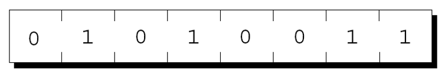
</div>

每个字节都有一个唯一的地址.


如果内存中有n个字节, 我们可以将地址视为$0 \sim n – 1$的数字: 

<div class="top-2">
    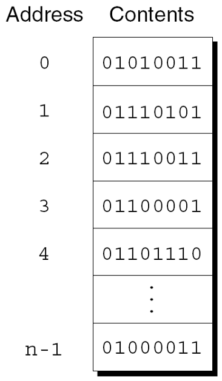
</div>

---


<!-- slide data-notes="" -->


##### 指针变量: 为什么需要地址

---

程序中的每个变量都占用一个或多个字节的内存. 
第一个字节的地址被称为变量的地址. 
下图中, 变量i的地址为 2000: 

<div class="top-2">
    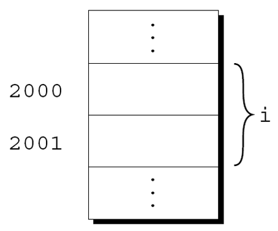
</div>


地址可以存储在特殊的指针变量中. 
当我们将变量i的地址存储在指针变量p中时, 我们说p==指向==i. 
图形表示: 

<div class="top-2">
    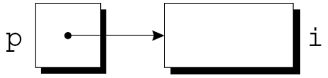
</div>

---


<!-- slide data-notes="" -->


##### 声明指针变量

---

<div style="display:flex;align-items:flex-start;gap:24px;">

<div style="flex:1.2;font-size:0.62em;">

```C
int* p;
```

```C
int i, j, a[10], b[20], *p, *q;
```

```C
int* p; /* 只指向整数 */
double *q; /* 只指向双精度 */
char *r; /* 只指向字符 */
```

</div>

<div style="flex:1;">

当一个指针变量被声明时, 它的名字前面必须有一个星号:

p是一个指针变量, 能够指向int类型的对象. 

使用术语==对象==而不是变量, 因p可能指向不属于变量的内存区域.


指针变量可以与其他变量一起出现在声明中:

C 要求每个指针变量只能指向特定类型(引用类型)的对象:

对引用类型没有限制.

</div>

</div>

<!-- slide data-notes="" -->


##### 取地址运算符 &

---

<div style="display:flex;align-items:flex-start;gap:24px;">

<div style="flex:1.2;font-size:0.62em;">

```C
int *p;  /* 没有指向特定对象 */
```

```C
int i, * p;
…
p = &i;
```

```C
int i;
int *p = &i;
```

```C
int i, *p = &i;
```

</div>

<div style="flex:1;">

声明指针变量会为指针留出空间, 但不会使其指向对象:

在使用p之前需要初始化它.


初始化指针变量的一种方法是为其分配变量的地址:

把i的地址赋值给变量p, 使p指向i: 

<div class="top-2">
    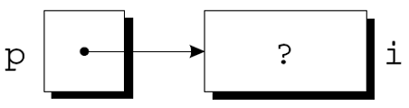
</div>


可在声明指针变量时进行初始化:

i的声明甚至可以与p的声明合并:


</div>

</div>

<!-- slide data-notes="" -->


##### 间接寻址运算符 *

---

<div style="display:flex;align-items:flex-start;gap:24px;">

<div style="flex:1.2;font-size:0.62em;">

```C
printf("%d\n", *p);
```

```C
j = *&i; /* 等同于 j = i; */
```

</div>

<div style="flex:1;">

一旦指针变量指向一个对象, 就可以使用`*`(间接寻址)运算符来访问对象中存储的内容. 

如果p指向i, 我们可以打印i的值如下:

对变量使用`&`运算符生成指向变量的指针

- 对指针使用`*`运算符则可以返回原始变量

只要p指向i, `*p`就是i的别名. 
`*p`与i具有相同的值. 
更改`*p`的值会更改i的值. 
下一张幻灯片上的示例说明了`*p`和i的等价性.

</div>

</div>

<!-- slide data-notes="" -->##### 间接寻址运算符 * (上)

---

<div style="display:flex;align-items:flex-start;gap:24px;">

<div style="flex:1.2;font-size:0.62em;">

```C
printf("%d\n", i); /* 打印 1 */
printf("%d\n", *p); /* 打印 1 */
*p = 2;
```

```C
printf("%d\n", i); /* 打印 2 */
printf("%d\n", *p); /* 打印 2 */
```

</div>

<div style="flex:1;">

`p = &i;`


`i = 1;`


<div class="top-2">
  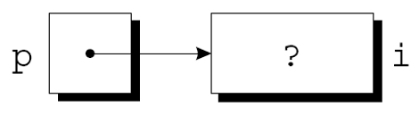
</div><div class="top-2">
  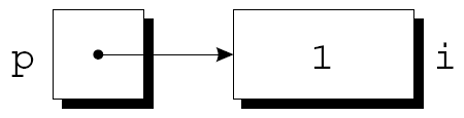
</div><div class="top-2">
  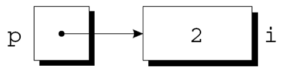
</div>

将间接寻址运算符应用于未初始化的指针变量会导致未定义的行为:

</div>

</div>
<!-- slide data-notes="" -->##### 间接寻址运算符 * (下)

---

<div style="display:flex;align-items:flex-start;gap:24px;">

<div style="flex:1.2;font-size:0.62em;">

```C
int* p;
printf("%d", *p); /*** 错误的 ***/
```

```C
int* p;
*p = 1; /*** 错误的 ***/
```

</div>

<div style="flex:1;">

给*p赋值是特别危险的:


</div>

</div>
<!-- slide data-notes="" -->


##### 指针赋值

---

<div style="display:flex;align-items:flex-start;gap:24px;">

<div style="flex:1.2;font-size:0.62em;">

```C
int i, j, *p, *q;
```

```C
p = &i;
```

```C
q = p;
```

```C
*p = 1;
```

```C
*q = 2;
```

</div>

<div style="flex:1;">

C 允许使用赋值运算符来复制相同类型的指针. 
假设有以下声明:

指针赋值示例:

指针赋值的另一个例子:

q现在指向与p相同的位置: 
<div class="top-2">
    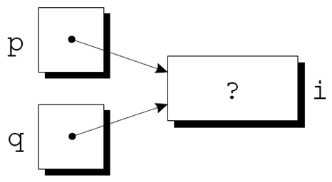
</div>


如果p和q都指向i, 就可以通过为`*p`或`*q`赋一个新值来更改i:

<div class="top-2">
    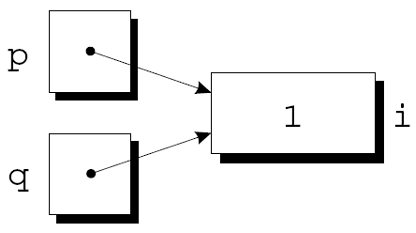
</div>

<div class="top-2">
    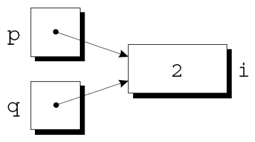
</div>

任意数量的指针变量都可以指向同一个对象.

</div>

</div>

<!-- slide data-notes="" -->


##### 指针赋值

---

注意不要混淆

```C
q = p;
```
和
```C
*q = *p;
```
第一条语句是指针赋值, 但第二条不是. 
下一张幻灯片上的示例显示了第二个语句的效果.


```C
p = &i;
q = &j;
i = 1;
```
<div class="top-2">
    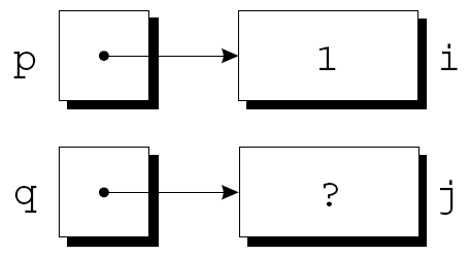
</div>

```C
*q = *p;
```
<div class="top-2">
    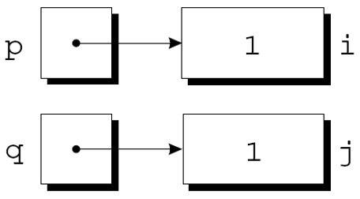
</div>

---


<!-- slide data-notes="" -->


##### 指针作为参数: 传址调用

---

<div style="display:flex;align-items:flex-start;gap:24px;">

<div style="flex:1.2;font-size:0.62em;">

```C
void decompose(double x, long * int_part, double *frac_part)
{
    *int_part = (long) x;
    *frac_part = x - *int_part;
}
```

```C
void decompose(double x, long * int_part, double *frac_part);
```

```C
void decompose(double, long *, double *);
```

```C
decompose(3.14159, &i, &d);
```

</div>

<div style="flex:1;">

<div style="display:flex;align-items:flex-start;gap:24px;">

<div style="flex:1.3;font-size:0.6em;">

</div>

<div style="flex:1;">

在第9章中, 我们尝试编写了一个可以修改其参数的decompose函数, 但失败了. 
传递指向变量的指针而不是变量的值, 可以实现decompose.


decompose的新定义:

decompose的原型可以是:

也可以是:

调用decompose:

作为调用的结果, 指向i的指针存储在int_part中, 指向d的指针存储在frac_part中: 

<div class="top-2">
    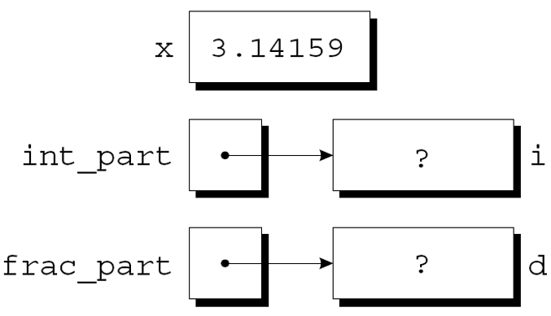
</div>

</div>

</div>

</div>

</div>

<!-- slide data-notes="" -->


##### 指针作为参数: swap 例

---

decompose函数体中的第一个赋值将x的值转换为long类型, 并将其存储在int_part指向的对象中: 
<div class="top-2">
    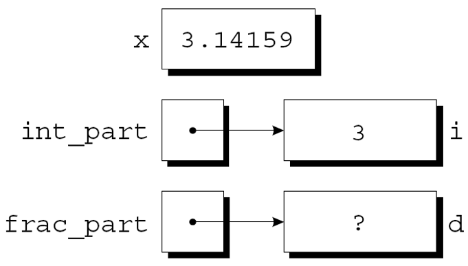
</div>


第二个赋值把`x - *int_part`的值存储到frac_part指向的对象中: 
<div class="top-2">
    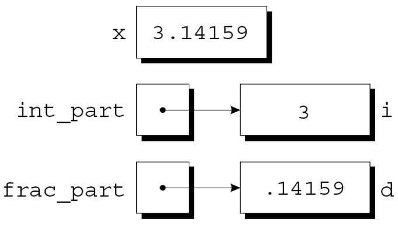
</div>


scanf调用中的参数是指针: 
```C
int i;
…
scanf("%d", &i);
```
如果没有&, 传递给scanf函数的将是i的值.

---


<!-- slide data-notes="" -->


##### 指针作为参数

---

<div style="display:flex;align-items:flex-start;gap:24px;">

<div style="flex:1.2;font-size:0.85em;">

```C
int i, *p;
…
p = &i;
scanf("%d", p);
```

```C
scanf("%d", &p); /*** 错误的 ***/
```

```C
decompose(3.14159, i, d)；
```

</div>

<div style="flex:1;">

尽管scanf的参数必须是指针, 但并不总是需要`&`运算符:

使用&运算符是错误的:

传递指针失败可能导致灾难性后果; 缺少 & 的 decompose 调用:

当decompose在 `*int_part` 和 `*frac_part` 中存储值时, 它将修改未知的内存地址, 而不是修改 i 和 d . 
若为 decompose 提供了原型, 编译器会检测到错误; 而 scanf 的例子通常不会被检查出来

</div>

</div>

<!-- slide data-notes="" -->


##### 程序: 查找数组中最大和最小的元素

---

<div style="display:flex;align-items:flex-start;gap:24px;">

<div style="flex:1.4;font-size:0.5em;">

```C
void max_min(int a[], int n, int *max, int *min);
```

```C
max_min(b, N, &big, &small);
```

```C{.line-numbers}
/* Finds the largest and smallest elements in an array */
#include <stdio.h>
#define N 10
void max_min(int a[], int n, int *max, int *min);
int main(void)
{
  int b[N], i, big, small;
  printf("Enter %d numbers: ", N);
  for (i = 0; i < N; i++) {
    scanf("%d", &b[i]);
  }
  max_min(b, N, &big, &small);
  printf("Largest: %d\n", big);
  printf("Smallest: %d\n", small);
  return 0;
}
void max_min(int a[], int n, int *max, int *min)
{
  int i;
  *max = *min = a[0];
  for (i = 1; i < n; i++) {
    if (a[i] > *max) {
      *max = a[i];
    } else if (a[i] < *min) {
      *min = a[i];
    }
  }
}
```

</div>

<div style="flex:1;">

max_min.c 用 max_min 函数找数组的最大/最小元素 (原型与调用见左): 最大元素经 `*max` 存进 big, 最小经 `*min` 存进 small; max_min.c 读 10 个数传给 max_min 并打印结果:

输入10个数字: <u>34 82 49 102 7 94 23 11 50 31</u>

最大: 102 &emsp; 最小: 7

</div>
</div>

<!-- slide data-notes="" -->


##### 使用const保护参数

---

<div style="display:flex;align-items:flex-start;gap:24px;">

<div style="flex:1.3;font-size:0.6em;">

```C
f(&x);
```

```C
void f(const int *p)
{
  int j;
  *p = 0; /*** 错误 ***/
  p = &j; /*** 合法 ***/
}
```

```C
void f(int * const p)
{
  int j;
  *p = 0; /*** 合法 ***/
  p = &j; /*** 错误 ***/
}
```

```C
void f(const int * const p)
{
  int j;
  *p = 0; /*** 错误 ***/
  p = &j; /*** 错误 ***/
}
```

</div>

<div style="flex:1;">

当参数是指向变量x的指针时, 我们通常假设x将被修改:

但是, 有可能 f 只需要检查 x 的值, 而不是更改它. 

使用指针的原因可能主要是因为效率: 如果变量需要大量的存储空间, 则传递变量的值会浪费时间和空间.


可以使用const来表明函数不会更改指针参数所指向的对象. 

const放置在形式参数的声明中, 后面紧跟着其类型说明:

尝试修改\*p, 编译器会报错.


</div>

</div>

<!-- slide data-notes="" -->


##### 指针作为返回值

---

<div style="display:flex;align-items:flex-start;gap:24px;">

<div style="flex:1.3;font-size:0.6em;">

```C{.line-numbers}
int *max(int *a, int *b)
{
  if (*a > *b)
    return a;
  else
    return b;
}
```

```C
int *p, i, j;
…
p = max(&i, &j);
```

```C
int *f(void)
{
    int i;
    …
    return &i;
}
```

```C
int *find_middle(int a[], int n) {
    return &a[n/2];
}
```

</div>

<div style="flex:1;">

允许函数返回指针:

调用max函数:

调用后,  p指向i或j .


尽管这个例子中max返回作为参数传递给它的指针之一, 但这不是唯一的可能性. 
函数还可以返回指向外部变量或静态局部变量的指针. 
永远不要返回指向自动局部变量的指针:

f返回后变量i将不存在.


指针可以指向数组元素. 
如果a是一个数组, 则`&a[i]`是指向a中元素i的指针. 
函数返回指向数组中某个元素的指针有时很有用. 
下面的函数假设a有n个元素, 返回一个指向数组中间元素的指针:


</div>

</div>

<!-- slide data-notes="" -->

##### 课堂小测

---

1. 指针变量里存的是什么？`int *p;` 中 p 的类型是什么？
2. `&x` 和 `*p` 分别做什么？它们互为逆运算吗？
3. `*p = 10;` 与 `p = &x;` 的区别是什么？
4. 写一个交换两个整数的函数 `void swap(int *a, int *b)`，为什么参数要用指针？

---


<!-- slide data-notes="" -->

#####

---

<div class="bottom20"></div>

# 周三见!

<hr class="width50 center">

## 未完待续

---


