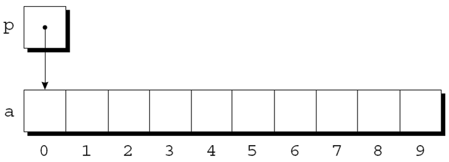
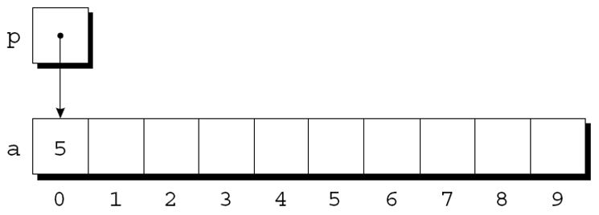
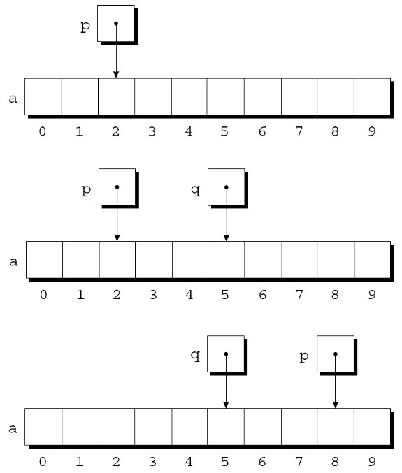
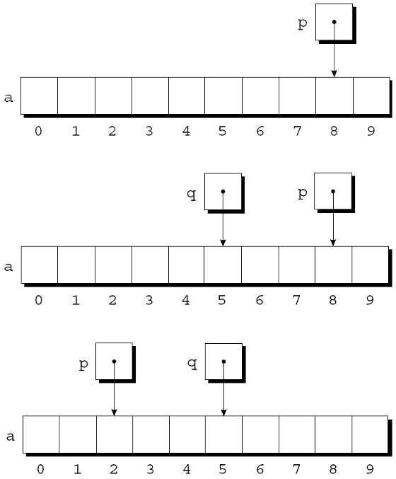
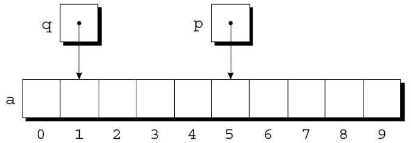
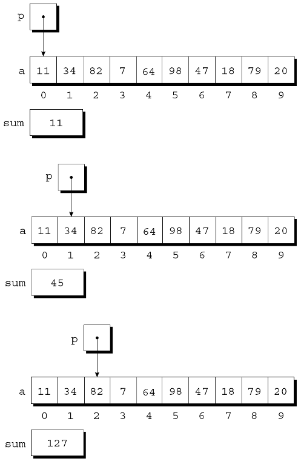
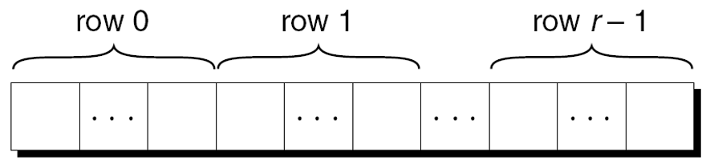

---
presentation:
  margin: 0
  center: false
  transition: "convex"
  enableSpeakerNotes: true
  slideNumber: "c/t"
  navigationMode: "linear"
---

@import "../css/font-awesome-4.7.0/css/font-awesome.css"
@import "../css/theme/solarized.css"
@import "../css/logo.css"
@import "../css/font.css"
@import "../css/color.css"
@import "../css/margin.css"
@import "../css/table.css"
@import "../css/main.css"
@import "../plugin/zoom/zoom.js"
@import "../plugin/customcontrols/plugin.js"
@import "../plugin/customcontrols/style.css"
@import "../plugin/chalkboard/plugin.js"
@import "../plugin/chalkboard/style.css"
@import "../plugin/menu/menu.js"
@import "../js/anychart/anychart-core.min.js"
@import "../js/anychart/anychart-venn.min.js"
@import "../js/anychart/pastel.min.js"
@import "../js/anychart/venn-ml.js"
@import "https://cdn.bootcdn.net/ajax/libs/jquery/3.5.0/jquery.js"

<!-- slide data-notes="" -->

<div class="bottom20"></div>

# 智能程序设计（C语言）

<hr class="width50 center">

## 指针与数组

<div class="bottom8"></div>

### 计算机学院 &nbsp;&nbsp; 杨已彪

#### [yangyibiao@nju.edu.cn](mailto:yangyibiao@nju.edu.cn)


<!-- slide data-notes="" -->

##### 提纲

---

- 指针的算术运算

- 用指针处理数组

- 数组名与指针的关系

- 多维数组与指针

---


<!-- slide data-notes="" -->


##### 指针的算术运算

---

<div style="display:flex;align-items:flex-start;gap:24px;">

<div style="flex:1.2;font-size:0.62em;">

```C
int a[10], *p;
p = &a[0];
```

</div>

<div style="flex:1;">

第 11 章展示了指针可以指向数组元素:

图形表示: 

<div class="top-2">
    
</div>


---

可以通过p访问a[0]. 例如, 可以通过下面写法将值5存储在a[0]中: 

`*p = 5;`

图示如下: 

<div class="top-2">
    
</div>


如果p指向数组a的一个元素, 则可以通过对p执行指针算术运算(或地址运算)来访问a的其他元素

C支持三种(且只有三种)==指针运算==形式:

- 指针加上整数

- 指针减去整数

- 两个指针相减

</div>

</div>

<!-- slide data-notes="" -->


##### 指针加减整数

---

<div style="display:flex;align-items:flex-start;gap:24px;">

<div style="flex:1.2;font-size:0.62em;">

```C
int a[10], *p, *q, i;
```

```C
p = &a[2];
q = p + 3;
p += 6;
```

```C
p = &a[8]; 
q = p - 3;
p -= 6;
```

</div>

<div style="flex:1;">

将整数j添加到指针p会产生一个指向第j个元素的指针, 该元素位于p指向的元素之后. 

更准确地说, 如果p指向数组元素a[i], 那么p + j指向a[i+j]. 

假设有以下声明:

指针加法示例:

<div class="top-2"></div>


如果p指向a[i], 那么p-j指向a[i-j]. 指针减法示例:

<div class="top-2">
    
</div>

</div>

</div>

<!-- slide data-notes="" -->


##### 两个指针相减

---

当一个指针从另一个指针中减去时, 结果是==指针之间的距离==(数组元素的个数). 

如果p指向a[i]并且q指向a[j], 那么$p - q$等于$i - j$. 示例: 

```C
p = &a[5];
q = &a[1];
```

<div class="top-2">
    
</div>

```C
i = p - q; /* i is  4 */
i = q - p; /* i is -4 */
```


我的启示 对不指向数组元素的指针执行算术运算导致未定义的行为

我的启示 只有两个指针指向同一个数组时, 把它们相减才有意义

---


<!-- slide data-notes="" -->


##### 比较指针

---

关系运算符(<, <=, >, >=)和判等运算符(==, !=)进行指针比较. 

使用关系运算符仅对指向同一数组元素的指针有意义. 比较的结果取决于数组中两个元素的相对位置. 

```C
p = &a[5];
q = &a[1];
p <= q; // expression value: 0
p >= q; // expression value: 1
```

任务完成后: 
- p<=q的值为0
- p>=q的值为1.

---


<!-- slide data-notes="" -->


##### 使用指针进行数组处理

---

- 在第一次迭代结束时: 
- 在第二次迭代结束时: 
- 在第三次迭代结束时: 

<div class="top-2">
    
</div>


`for`语句中的条件`p < &a[N]`值得特别提及. 
将地址运算符应用于`a[N]`是合法的, 即使此元素不存在.

---


<!-- slide data-notes="" -->


##### 结合 * 和 ++ 运算符

---

<div style="display:flex;align-items:flex-start;gap:24px;">

<div style="flex:1.2;font-size:0.6em;">

```C
for (p = &a[0]; p < &a[N]; p++)
    sum += *p;
```

```C
p = &a[0];
while (p < &a[N])
    sum += *p++;
```

</div>

<div style="flex:1;">

C程序员经常结合使用`*`(间接寻址)和`++`运算符. 

修改数组元素后前进到下一个元素的语句:
`a[i++] = j;`

对应的指针版本: 
`*p++ = j;`

因为后缀++的优先级高于*, 编译器将其视为
`*(p++) = j;`


`*`和`++`的可能组合: 

<div class="fullborder">

| 表达  | 意义 |
| :--: | :--: |  
| `*p++或*(p++)` | 表达式的值是`*p`在递增之前, 之后自增p |
| `(*p)++`      | 表达式的值为`*p`在递增之前, 稍后增加`*p` |
| `*++p或*(++p)` | 先递增`p`, 表达式的值为`*p` |
| `++*p或++(*p)` | 先递增`*p`, 表达式的值为`*p` |

</div>

- *(p++) 指针自增(指向下一个对象)
- (*p)++ 指向的对象自增(p本身不变)


\*和++最常见的组合是`*p++`, 在循环中很常用. 

对数组a的元素求和时, 可以把

改写成


</div>

</div>

<!-- slide data-notes="" -->


##### 结合 * 和 ++ 运算符 (续)

---

<div style="display:flex;align-items:flex-start;gap:24px;">

<div style="flex:1.2;font-size:0.6em;">

```C
int *top_ptr = &contents[0]; 
```

```C {.line-numbers}
void push(int i)
{
    if (is_full())
        stack_overflow();
    else
        *top_ptr++ = i;
}

int pop(void)
{
    if (is_empty())
        stack_underflow();
    else
        return *--top_ptr;
}
```

</div>

<div style="flex:1;">

\*和`--`运算符的组合方式与\*和`++`相同. 

对于应用*和`--`的组合, 让我们回到第10章的栈的示例. 

原始版本的栈依赖于名为top的整型变量来记录contents数组中的==栈顶==的位置. 

现在将top替换为初始指向contents数组的第0个元素的指针变量:

新的push和pop函数:

指针的算术运算是数组和指针相互关联的一种方法. 

此外, 数组的名称可以用作指向数组中第一个元素的指针. 

这种关系简化了指针的算术运算, 并使数组和指针更加通用.

</div>

</div>

<!-- slide data-notes="" -->


##### 使用数组名称作为指针

---

<div style="display:flex;align-items:flex-start;gap:24px;">

<div style="flex:1.3;font-size:0.6em;">

```C
int a[10];
```

```C
*a = 7;      /* 将 7存储在a[0]中 */
*(a+1) = 12; /* 将12存储在a[1]中 */
```

```C{.line-numbers}
/* 原始版本 */
for (p = &a[0]; p < &a[N]; p++)
    sum += *p;

/* 简化版本 */
for (p = a; p < a + N; p++)
    sum += *p;
```

```C
while (*a != 0)
    a++; /*** 错误的 ***/
```

```C
p = a;
while (*p != 0)
    p++;
```

</div>

<div style="flex:1;">

假设a声明如下:

使用a作为指针的示例:

一般情况, `a+i`与`&a[i]`相同, 都表示指向数组a中的元素i的指针. 

此外, `*(a+i)`等价于`a[i]`, 两者都代表元素i本身.


数组名称可以用作指针这一事实使得编写遍历数组的循环变得更加容易.

尽管数组名可以用作指针, 但==不能为数组名赋新值==. 

试图让数组名指向其他地方是错误的:

可以将a复制到指针变量中, 然后更改指针变量:


</div>

</div>

<!-- slide data-notes="" -->


##### 程序: 数列反向(改进版)

---

<div style="display:flex;align-items:flex-start;gap:24px;">

<div style="flex:1.3;font-size:0.55em;">

```C{.line-numbers}

/* 数列反向（指针版本） */

#include <stdio.h>

#define N 10

int main(void)
{
  int a[N], *p;

  printf("Enter %d numbers: ", N);
  for (p = a; p < a + N; p++)
    scanf("%d", p);

  printf("In reverse order:");
  for (p = a + N - 1; p >= a; p--)
    printf(" %d", *p);
  printf("\n");

  return 0;
}
```

</div>

<div style="flex:1;">

之前的`reverse.c`程序读取 10 个数字, 然后逆序输出这些数字. 

原始程序将数字存储在一个数组中, 利用下标访问数组的元素. 

`reverse3.c`是一个改进后的程序, 用指针的算术运算取代数组的取下标操作.


`reverse3.c`


</div>

</div>

<!-- slide data-notes="" -->


##### 数组型实际参数(改进版)

---

<div style="display:flex;align-items:flex-start;gap:24px;">

<div style="flex:1.3;font-size:0.55em;">

```C{.line-numbers}
#define N 10
int find_largest(int a[], int n)
{
    int i, max;

    max = a[0];
    for (i = 1; i < n; i++)
        if (a[i] > max)
            max = a[i];
    return max;
}

int main(){
    int b[N] = {0};
    ...
    /* 此调用导致将指向b的第一个元素的指针赋值给a, 数组本身不会被复制. */
    largest = find_largest(b, N); /* 调用find_largest */
    ...
}
```

```C
void store_zeros(int a[], int n)
{
    int i;

    for (i = 0; i < n; i++)
        a[i] = 0;
}
```

```C
int find_largest(const int a[], int n)
{
    …
}
```

</div>

<div style="flex:1;">

数组名传递给函数时, 总是被视为指针. 例子:

把数组型形式参数视为指针会产生许多重要的结果: 

- 结果1: 普通变量传给函数时, 其值被复制, 对相应参数的任何更改都不会影响变量. 相反, 用作参数的数组是可能被改变的. 

例如, 以下函数将数组中的每个元素都重置为零:

为了表明数组参数不会被修改, 我们可以在它的声明中包含单词const:

编译器会检查find_largest函数体没有对a中元素进行赋值.

</div>

</div>

<!-- slide data-notes="" -->


##### 数组型实际参数(改进版)

---

<div style="display:flex;align-items:flex-start;gap:24px;">

<div style="flex:1.3;font-size:0.55em;">

```C
int find_largest(int *a, int n)
{
    …
}
```

```C
/* 等价 */
int find_largest(int *a, int n);
int find_largest(int a[], int n);
```

```C
/* 不等价 */
int a[10]; /* 编译器为数组a留出10个整数的空间 */
int *a; /* 编译器仅为指针变量分配空间 */
```

</div>

<div style="flex:1;">

- 数组名传给函数时总被视为指针; ==数组可能被修改== (普通变量传值, 改参数不影响原变量)

- 用 `const` 声明表明不修改: 编译器会检查函数体没有对 a 中元素赋值

</div>
</div>

<!-- slide data-notes="" -->


##### 数组型实际参数(改进版)

---

后一种情况下, a不是数组; 试图将其用作数组可能会导致灾难性的后果. 

```C
int *a;
*a = 0; /*** 错误的 ***/
```

将0存到a指向的地方. 不清楚a指向哪, 所以对程序的影响不确定.


- 结果4: 可以给形式参数为数组的函数传递==数组的片段==——连续的数组元素组成的序列. 

将find_largest应用于数组元素b[5] ~ b[14]的示例: 

```C
int b[20] = {0};
...
largest = find_largest(&b[5], 10);
```

---


<!-- slide data-notes="" -->


##### 使用指针作为数组名

---


---
C允许把指针看作数组名进行取下标操作:

```C{.line-numbers}
#define N 10
…
int a[N], i, sum = 0, *p = a;
…
for (i = 0; i < N; i++)
    sum += p[i];
```

编译器将p[i]视为*(p+i). 


---

指针可以指向一维数组的元素, 也可以指向多维数组的元素. 

本节探讨使用指针处理多维数组元素的常用方法.

---


<!-- slide data-notes="" -->


##### 处理多维数组的元素

---

<div style="display:flex;align-items:flex-start;gap:24px;">

<div style="flex:1.3;font-size:0.55em;">

```C{.line-numbers}
int a[NUM_ROWS][NUM_COLS];

/* 方法1: 使用嵌套的for循环来进行二维数组的初始化 */
int row, col;
…
for (row = 0; row < NUM_ROWS; row++)
    for (col = 0; col < NUM_COLS; col++)
        a[row][col] = 0;

/* 方法2: 将a视为一维的整型数组, 单个循环进行初始化 */
int * p;
…
for (p = &a[0][0]; p <= &a[NUM_ROWS-1][NUM_COLS-1]; p++)
    *p = 0;
```

</div>

<div style="flex:1;">

第 8 章展示了 C 以行优先顺序存储二维数组. 

r行的数组的布局: 
  
<div class="top-2">
    
</div>

如果p最初指向二维数组的第0行第0列的元素, 即$a[0][0]$, 就可以通过重复自增p来访问数组中的每个元素.


考虑将以下数组的所有元素初始化为0的问题:

将二维数组视为一维适用于大多数 C 编译器. 

该方法会损害程序的可读性, 对老的编译器可能产生效率提升. 

对于许多现代编译器, 速度优势通常不存在.

</div>

</div>

<!-- slide data-notes="" -->


##### 处理多维数组的行

---

<div style="display:flex;align-items:flex-start;gap:24px;">

<div style="flex:1.4;font-size:0.5em;">

```C 
/* 将p初始化为指向数组a中第i行的元素0 */
p = &a[i][0];

/* 可简化为 */
p = a[i];
```

```C
int a[NUM_ROWS][NUM_COLS], *p, i;
…
for (p = a[i]; p < a[i] + NUM_COLS; p++)
    *p = 0;
```

```C{.line-numbers}
int a[NUM_ROWS][NUM_COLS] = {0};
...
largest = find_largest(a[i], NUM_COLS);
```

</div>

<div style="flex:1;">

指针变量p也可用于处理二维数组的一行中的元素. 

为访问第i行的元素:

对于任何二维数组a, 表达式a[i]是指向第i行第一个元素的指针. 

为了解原理, 回顾一下: 

- 表达式$a[i]$等价于$*(a + i)$. 

- `&a[i][0]`等同于`&(*(a[i] + 0))`, 而后者等价于`&*a[i]`. 

- &和*运算符可抵消, `&*a[i]`也就等同于$a[i]$ 

- `a[i][0]`为第i行第0个元素, &a[i][0]即为元素的地址. 

- `&a[i][0]`等价于`&(*(a[i]+0))`, 等价于`&*a[i]`


对数组a的第i行清零的循环:

由于a[i]是指向数组a的第i行的指针, 可将a[i]传递给一维数组作为参数的函数. 

换句话说, 处理一维数组的函数也可以处理二维数组的行.


考虑find_largest, 它最初设计用于查找一维数组的最大元素. 

这里使用find_largest来确定二维数组a的第i行中的最大元素:


</div>

</div>

<!-- slide data-notes="" -->


##### 处理多维数组的列

---

<div style="display:flex;align-items:flex-start;gap:24px;">

<div style="flex:1.3;font-size:0.55em;">

```C{.line-numbers}
/* 对数组a的第i列清零的循环 */
int a[NUM_ROWS][NUM_COLS],  (*p)[NUM_COLS], i;
…
for (p = &a[0]; p < &a[NUM_ROWS]; p++)
    (*p)[i] = 0;
```

```C
int a[NUM_ROWS][NUM_COLS];
```

</div>

<div style="flex:1;">

处理二维数组一列的元素:

`int (*p)[NUM_COLS];`把p声明为指向长度为NUM_COLS的整形数组的指针

- `(*p)`括号是必需的, 若无括号则编译器将p看作指针数组, 而不是指向数组的指针

- p++把p移到下一行的开始位置

- 在`(*p)[i]`中, *p代表a的一整行, `(*p)[i]`选中该行的第i列的元素

- `(*p)[i]`中的括号是必要的, 无括号编译器会将`*p[i]`解释为`*(p[i])`


任何数组的名称都可以用作指针, 不管它有多少维, 但需要注意.

a不是指向a[0][0]的指针, 它是指向a[0]的指针. 

C将a视为一维数组, 其元素是一维数组. 

当用作指针时, a 的类型为int (*)[NUM_COLS] （指向长度为NUM_COLS的整数数组的指针）.

</div>

</div>

<!-- slide data-notes="" -->

##### 课堂小测

---

1. `int a[5]; int *p = a;` 中 `p + 1` 表示什么？`p + 1` 的地址比 p 大多少字节？
2. `p2 - p1` 得到的是地址差还是元素个数差？
3. `*p++` 等价于什么？先取指针的值还是先移动指针？
4. 数组名 `a` 在表达式中等价于什么？`a == &a[0]` 成立吗？

---


<!-- slide data-notes="" -->

#####

---

<div class="top-2">
  
</div>

---


