---
presentation:
  margin: 0
  center: false
  transition: "convex"
  enableSpeakerNotes: true
  slideNumber: "c/t"
  navigationMode: "linear"
---

@import "../../css/font-awesome-4.7.0/css/font-awesome.css"
@import "../../css/theme/solarized.css"
@import "../../css/logo.css"
@import "../../css/font.css"
@import "../../css/color.css"
@import "../../css/margin.css"
@import "../../css/table.css"
@import "../../css/main.css"
@import "../../plugin/zoom/zoom.js"
@import "../../plugin/customcontrols/plugin.js"
@import "../../plugin/customcontrols/style.css"
@import "../../plugin/chalkboard/plugin.js"
@import "../../plugin/chalkboard/style.css"
@import "../../plugin/menu/menu.js"
@import "../../js/anychart/anychart-core.min.js"
@import "../../js/anychart/anychart-venn.min.js"
@import "../../js/anychart/pastel.min.js"
@import "../../js/anychart/venn-ml.js"

<!-- slide data-notes="" -->

<div class="bottom20"></div>

# C语言程序设计基础

<hr class="width50 center">

## 指针


<div class="bottom8"></div>

### 计算机学院 &nbsp;&nbsp; 杨已彪

#### yangyibiao@nju.edu.cn


<!-- slide vertical=true data-notes="" -->

##### 提纲

---

- 引入指针

- 指针变量

- 取地址运算符

- 间接寻址运算符

- 指针赋值

- 指针作为参数

- 指针作为返回值

- 动态内存分配

---


<!-- slide vertical=true data-notes="" -->

##### 引入指针

---

函数间参数全部都是按值传递(==PASS BY VALUE==)

[swapbyvalue.c](./code/swapbyvalue.c)

```C
// 值传递示例
void swap_by_value(int a, int b) {
    int temp = a;
    a = b;
    b = temp; // 这里 a 和 b 的值交换了，但只是副本的交换
}

int main() {
    int x = 10, y = 20;
    swap_by_value(x, y);
    printf("x=%d, y=%d", x, y); // 输出：x=10, y=20，没有改变！
}
```

如何在函数间高效、灵活地传递数据？

---


<!-- slide vertical=true data-notes="" -->

##### 引入指针

---

访问/修改内存中存放的数据的方法：

- ==直接访问==：直接通过变量名（variable name）访问/修改存储某个变量的内存中的值（函数内使用变量）
- ==间接访问==：间接通过内存地址（memory address）访问/修改编号为address的内存中的值（函数间==传递地址==）

1. `&` 取地址运算符
2. `*` 间接寻址运算符

---


<!-- slide vertical=true data-notes="" -->

##### 引入指针

---

如何理解？

- 亲自把礼物送到手里（同一学校 -> 函数内）
- 通过快递公司送礼物（不同学校 -> 函数间）

---


<!-- slide vertical=true data-notes="" -->

##### 指针变量

---

地址：C语言中的地址，就是内存中某个位置的==门牌号==

- 间接访问与修改数据（无需知道变量名，只要知道其地址，就能操作它）

- 在函数内部修改外部变量的值

- 数组名本质上就是数组首元素的地址

- 动态内存管理（Dynamic Memory Allocation）

---


<!-- slide vertical=true data-notes="" -->

##### 指针变量

---

多数现代计算机中的内存被划分为字节

每个字节存储8位信息(Contents): 

<div class="top-2">
    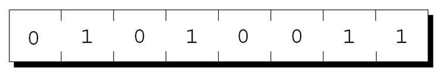
</div>

内存中每个字节都有一个==唯一的地址== (Address). 

[intaddress.c](./code/intaddress.c)
```C
int n = 0;
scanf("%d", &n); // & 取地址运算符
printf("%p", &n);
```

---


<!-- slide vertical=true data-notes="" -->

##### 指针变量

---

内存中每个字节有一个==唯一的地址== (Address). 
如果内存中有n个字节, 其字节的地址可编号为: $0 \sim n – 1$

<div class="top-2">
    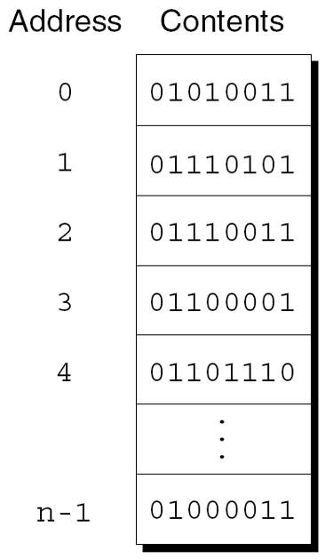
</div>

<!--  -->

若内存为8GB, $1GB = 2^{30}$ 字节, 则 $8GB = 2^{33}$字节
其内存地址编号为：$0 \sim 2^{33} - 1$

---


<!-- slide vertical=true data-notes="" -->

##### 指针变量

---

程序中的每个变量都占用一个或多个字节的内存, 例如:
```C
char c;  // 一个字节
short i; // 两个字节
```

第一个字节的地址被称为变量的地址. 如图, 变量i的地址为 2000: 

<div class="top-2">
    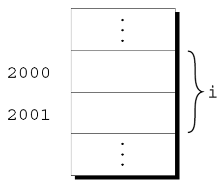
</div>

<!--  -->

---


<!-- slide vertical=true data-notes="" -->

##### 指针变量

---

指针==变量==：用于存储 ==Address(内存地址)== 的==变量==，一个存储内存地址的变量，代表指向某个具体的内存地址

指针变量 ==存储的内容== 为 ==Address(内存地址)==

当将变量i的地址存储在指针变量p中时, 则p==指向==i:

[pointerassign.c](code/pointerassign.c)
```C
int i = 0, j = 1;
int *p; // 声明一个指向整数类型的指针变量p
p = &i; // &i指取变量i的地址, 赋值给指针变量p
p = &j; // 修改为j的地址

*p = 8; // 等同于 i = 8, 对*p的操作等同于对i的操作
```

<div class="top-2">
    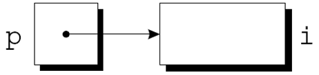
</div>

<!--  -->

---


<!-- slide vertical=true data-notes="" -->

##### 声明指针变量

---

当一个指针变量被声明时, 它的名字前面必须有一个星号: 

```C{.line-numbers}
int *p;
int* p; // 语句1与2有区别吗？
int* p, q; // q是指针变量吗？
int *p, *q;
```

p是一个指针变量, 能够指向int类型的==对象==. 

p可以指向不属于某个变量的内存区域. 

---


<!-- slide vertical=true data-notes="" -->

##### 声明指针变量

---

指针变量可以与其他变量一起出现在声明中: 
```C
int i, j, a[10], b[20], *p, *q;
```
C中每个指针变量只能指向特定类型的对象: 
```C
int *p; /* 只指向int */
double *q; /* 只指向double */
char *r; /* 只指向char */
```

---


<!-- slide vertical=true data-notes="" -->

##### 取地址和间接寻址运算符

---

C提供了一对专门与指针一起使用而设计的运算符. 

要获取变量的地址, 使用 ==&== 取地址运算符. 

访问指针所指向的对象, 使用 ==*== 间接寻址运算符. 

---


<!-- slide vertical=true data-notes="" -->

##### 取地址运算符

---

声明指针变量会为指针留出空间, 但不会使其指向对象: 

```C
int *p;  /* 没有指向特定对象 */
```

在使用p之前需要初始化它. 

---


<!-- slide vertical=true data-notes="" -->

##### 取地址运算符

---

初始化指针变量的一种方式可以将变量的地址赋值给指针变量: 

```C
int i, *p;
…
p = &i;
```

把i的地址赋值给变量p, 使p指向i: 

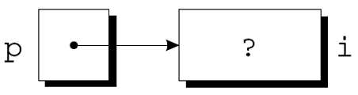

---


<!-- slide vertical=true data-notes="" -->

##### 取地址运算符

---

可在声明指针变量时进行初始化: 

```C
int i;
int *p = &i; // 等价于 int *p; p = &i;
```

i的声明也可以与指针p的声明合并: 

```C
int i, *p = &i;
```

---


<!-- slide vertical=true data-notes="" -->

##### 间接寻址运算符

---

一旦指针变量指向一个对象, 就可以使用 ==*== 间接寻址运算符来访问对象中存储的内容. 

- 对变量使用`&`运算符获取变量的内存地址

- 对指针使用`*`运算符则可以返回原始变量

如果p指向i, 则可以打印i的值: 

```C
int i = 2;
int *p = &i;
printf("%d\n", *p);
j = *&i; /* 等同于 j = i; */
```

---


<!-- slide vertical=true data-notes="" -->

##### 间接寻址运算符

---

p指向i, 则`*p`是i的别名. 

`*p`与i具有相同的值. 

更改`*p`的值会更改i的值. 

---


<!-- slide vertical=true data-notes="" -->

##### 间接寻址运算符

---

```C
int i;
int *p;
p = &i;
```

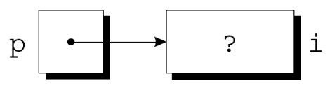

---


<!-- slide vertical=true data-notes="" -->

##### 间接寻址运算符

---

```C
int i = 1;
int *p = &i;

printf("%d\n",  i); /* 打印 1 */
printf("%d\n", *p); /* 打印 1 */
```

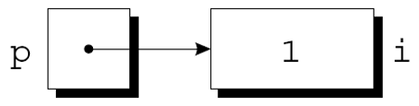


---


<!-- slide vertical=true data-notes="" -->

##### 间接寻址运算符

---

[pointerassing2.c](code/pointerassign2.c)
```C
int i = 1;
int *p = &i;

printf("%d\n", i); /* 打印 1 */
printf("%d\n", *p); /* 打印 1 */

*p = 2;
printf("%d\n",  i); /* 打印 2 */
printf("%d\n", *p); /* 打印 2 */
```

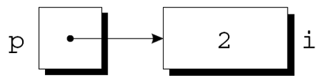


---


<!-- slide vertical=true data-notes="" -->

##### 间接寻址运算符

---

将间接寻址运算符用于未初始化的指针变量会导致未定义行为: 

```C
int *p;
printf("%d", *p); /*** 错误的 ***/
```

给*p赋值特别危险: 

```C
int *p;
*p = 1; /*** 错误 ***/
```

---


<!-- slide vertical=true data-notes="" -->

##### 指针赋值

---

C允许使用赋值运算符来复制相同类型的指针. 

```C
int i, j, *p, *q;
```

指针赋值: 

```C
p = &i;
```

---


<!-- slide vertical=true data-notes="" -->

##### 指针赋值

---

```C
int i, j, *p, *q;
p = &i;

q = p;
```

q现在指向与p相同的位置: 

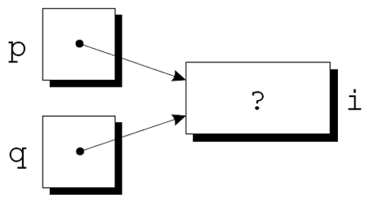

---


<!-- slide vertical=true data-notes="" -->

##### 指针赋值

---

p和q都指向i, 可通过`*p`或`*q`赋值来更改i: 

```C
int i, j, *p, *q;
p = &i;

q = p;
*p = 1;
```

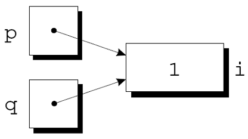

---


<!-- slide vertical=true data-notes="" -->

##### 指针赋值

---

```C
int i, j, *p, *q;
p = &i;

q = p;
*p = 1;
printf("i = %d, *p = %d, *q = %d\n", i, *p, *q);
*q = 2;
printf("i = %d, *p = %d, *q = %d\n", i, *p, *q);
```

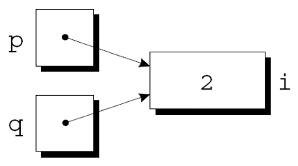

任意数量的指针变量都可以指向同一个对象. 

---


<!-- slide vertical=true data-notes="" -->

##### 指针赋值

---

指针赋值: 
```C
int i, j, *p, *q;
i = 1;
p = &i;
q = p;

*q = *p; // 指向的对象赋值: 
```

---


<!-- slide vertical=true data-notes="" -->

##### 指针赋值

---

```C
int i, j, *p, *q;
p = &i;
q = &j;
i = 1;
```

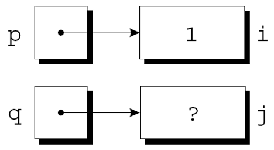

---


<!-- slide vertical=true data-notes="" -->

##### 指针赋值

---

```C
int i, j, *p, *q;
p = &i;
q = &j;
i = 1;
*q = *p;
```

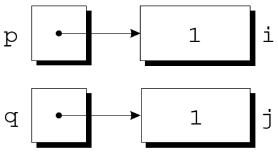

---


<!-- slide vertical=true data-notes="" -->

##### 指针作为参数

---

[swap.c](code/swap.c)

swap函数的定义: 

```C
void swap(int *a, int *b)
{
  int temp = *a;
  *a = *b;
  *b = temp
}
```
---


<!-- slide vertical=true data-notes="" -->

##### 指针作为参数

---

swap函数的声明: 

```C
void swap(int *a, int *b);
```
或
```C
void swap(int *, int *);
```

调用swap函数:

```C
swap(&x, &y);
```
---


<!-- slide vertical=true data-notes="" -->

##### 指针作为参数

---

回顾scanf

scanf调用中的参数是指针: 
```C
int i;
…
scanf("%d", &i);
```
如果没有&, 传递给scanf函数的将是i的值. 

---


<!-- slide vertical=true data-notes="" -->

##### 指针作为参数

---

scanf的参数必须是指针, 但并非总需要`&`运算符: 

```C
int i, *p;
p = &i;
scanf("%d", p);
```

使用&运算符是错误的: 
```C
scanf("%d", &p); /*** 错误 ***/
```

---


<!-- slide vertical=true data-notes="" -->

##### 指针作为参数

---

不正确地向函数传递所需要的指针可能导致灾难性的后果. 
缺少&运算符的swap调用: 
```C
swap(x, y);
```
将导致修改未知的内存地址, 而不是修改 x 和 y. 

在scanf的例子中, 通常不会检查出传递指针失败. 

---


<!-- slide vertical=true data-notes="" -->

##### 函数调用使用指针

---

函数间使用指针主要是为了效率: 

- 传递大的数组变量需要大量的存储空间, 浪费存储空间, 也浪费时间(数组拷贝). 

---


<!-- slide vertical=true data-notes="" -->

##### 程序: 查找数组中最大和最小的元素

---

[minmax.c](code/minmax.c)
max_min.c程序使用名为 max_min 的函数来查找数组中的最大和最小元素. max_min的原型: 

```C
void max_min(int a[], int n, int *max, int *min);
```

max_min的调用示例: 

```C
max_min(b, N, &big, &small);
```

当max_min找到数组b中的最大元素时, 它通过将其赋值给`*max`来将值存储在big中, 通过将b的最小元素赋值给`*min`将其存储在small中. 

---


<!-- slide vertical=true data-notes="" -->

##### 程序: 查找数组中最大和最小的元素

---

max_min.c会将 10 个数字读入一个数组, 将其传递给max_min函数, 并打印结果: 
输入10个数字: <u>34 82 49 102 7 94 23 11 50 31</u>
最大: 102
最小: 7

---


<!-- slide vertical=true data-notes="" -->

##### 程序: 查找数组中最大和最小的元素

---

maxmin.c

```C{.line-numbers}
/* Finds the largest and smallest elements in an array */
#include <stdio.h>

#define N 10

void max_min(int a[], int n, int *max, int *min);

int main(void)
{
  int b[N], i, big, small;

  printf("Enter %d numbers: ", N);
  for (i = 0; i < N; i++) {
    scanf("%d", &b[i]);
  }
  max_min(b, N, &big, &small);

  printf("Largest: %d\n", big);
  printf("Smallest: %d\n", small);

  return 0;
}

void max_min(int a[], int n, int *max, int *min)
{
  int i;

  *max = *min = a[0];
  for (i = 1; i < n; i++) {
    if (a[i] > *max) {
      *max = a[i];
    } else if (a[i] < *min) {
      *min = a[i];
    }
  }
}
```

---

<!-- slide vertical=true data-notes="" -->

##### 指针作为返回值

---

允许函数返回指针: 

```C{.line-numbers}
int *max(int *a, int *b)
{
  if (*a > *b)
    return a;
  else
    return b;
}
```

max函数返回作为参数传递给它的指针. 

---


<!-- slide vertical=true data-notes="" -->

##### 指针作为返回值

---

调用max函数: 

```C
int *p, i, j;
…
p = max(&i, &j);
```

调用后, p指向i或j. 

[pointerasreturn.c](code/pointerasreturn.c)

---


<!-- slide vertical=true data-notes="" -->

##### 指针作为返回值

---

[pointerasreturn.c](code/pointerasreturn.c)

函数还可以返回指向外部变量或静态局部变量的指针, 但永远不要返回指向自动局部变量的指针: 
```C
int *f(void)
{
  int i;
  …
  return &i; // i是局部变量, 错误代码
}
```

函数f返回后变量i对象不存在. 

---


<!-- slide vertical=true data-notes="" -->

##### 指针与数组

---

函数参数中的数组参数, 其实就是指针, 可看作等价的函数原型
```C{.line-number}
int sum(int a[], int len);
int sum(int [], int);

int sum(int *a, int len);
int sum(int *, int);
```

数组变量是一种特殊的指针（const指针）
```C{.line-number}
int a[10];
int *p = a;
a == &a[0];
int b[] = a;//wrong!
```

---


<!-- slide vertical=true data-notes="" -->

##### 指针的运算

---

指针可以和数组同等取下标运算
```C
int a[10];
int *p = a;
p[0] == a[0]
```

---


<!-- slide vertical=true data-notes="" -->

##### 指针的运算

---

指针的算术运算
- 利用指针的算术运算来代替数组下标进行处理

```C
int a[10], *p;
p = a;
p++;
```

- p+1 ? 加其指向类型的sizeof大小
  - 如果指针指向的不是连续内存，没有意义
  - 一般和数组关系密切

[pointerarray.c](code/pointerarrary.c)

---


<!-- slide vertical=true data-notes="" -->

##### ```*``` 与 ```++```

---

```C{.line-number}
*p++;
*(p++); 
(*p)++;
++*p;
++(*p); 
*++p;
*(++p);
```

---


<!-- slide vertical=true data-notes="" -->

##### ```*``` 与 ```++```

---

`*p++`
- 等同于*(p++) 
  - 虽然优先级高，但是没有++高
  - 取出p所指的数据来，然后顺便把p移到下一个位置
  - 常用于数组遍历这样的连续空间操作
  - 在某些CPU中，可以被翻译成一个单独的指令

---


<!-- slide vertical=true data-notes="" -->

##### 指针比较

---

<, <=, ==, >, >=, != 

比较表示的内存地址

数组中单元的地址是线性递增的

---

<!-- slide vertical=true data-notes="" -->

##### 指针的赋值

---

不同类型不可以相互赋值
```C
int *p; char *q; 
q = p;
```

- `void *`:表示不知道指向什么类型空间的指针
  - 与char*解读类似
  
- 指针也可以做类型转换
  - `int *p = &i; void *q = (void *)p;`
  - 通过q解读内存的视角变了

---


<!-- slide vertical=true data-notes="" -->

##### 指针作为返回值

---

指针可以指向数组元素. 
如果a是一个数组, 则`&a[i]`是指向a中元素i的指针. 
函数返回指向数组中某个元素的指针有时很有用. 
下面的函数假设a有n个元素, 返回一个指向数组中间元素的指针: 
```C
int *find_middle(int a[], int n) {
    return &a[n/2];
}
```

---


<!-- slide vertical=true data-notes="" -->

##### 使用const保护参数

---

当参数是指向变量x的指针时, x的内容在函数中有可能被(有意无意)修改: 

```C
f(&x);
```

然而, 常常函数f只通过指针去读值指向的值, 而不是修改它所指向的内容. 

---


<!-- slide vertical=true data-notes="" -->

##### 指针与const

---

指针是const, p指针指向关系一旦确定不可再变
  - `int * const p = &a;`
  - `*p = 100;` // ok
  - `p = &b;` // ERROR
  - `p++;` // ERROR 

指针所指是const, 表示不能通过该指针修改此变量（并不能使变量变成const）
  - `const int *p = &a;`
  - `*p = 100;` // ERROR
  - `a = 100;` // ok 
  - `p = &b;` // ok 

  - 数组名称天然是const，不可改变其值，常量地址

---


<!-- slide vertical=true data-notes="" -->

##### const与数组

---

const数组
  - const int a[] = {1,2,3,4,5}; 
  - 数组变量已经是const指针，再加const代表每个数组单元是const 
  - 因此，必须通过初始化赋值
  
参数中用const修饰数组参数
  - int sum(const int a[], int len);

  - 可以要求函数内部不应该修改原始数组

---


<!-- slide vertical=true data-notes="" -->

##### 使用const保护参数

---

可以使用const来表明函数不会更改指针参数所指向的对象. 

const放置在形式参数的声明中, 后面紧跟着其类型说明: 
```C
void f(const int *p)
{
  int j;
  *p = 0; /*** 错误 ***/
  p = &j; /*** 合法 ***/
}
```

尝试修改\*p, 编译器会报错. 

---


<!-- slide vertical=true data-notes="" -->

##### 使用const保护参数

---


```C
void f(int * const p)
{
  int j;
  *p = 0; /*** 合法 ***/
  p = &j; /*** 错误 ***/
}
```

```C
void f(const int * const p)
{
  int j;
  *p = 0; /*** 错误 ***/
  p = &j; /*** 错误 ***/
}
```

---


<!-- slide vertical=true data-notes="" -->

##### 多维数组与指针

---

int matrix[3][10];
  - matrix               // int (*)[10]
  - matrix+1             // &(matrix[1])
  - `*(matrix+1) + 5`    // &(matrix[1][5])
  - `&matrix + 1`        // out of bound
  - `*(*(*(matrix+1)+5)` // SEGSEV

[pointermultiarray.c](code/pointermultiarray.c)

---


<!-- slide vertical=true data-notes="" -->

##### 多维数组作为参数

---

```C
void func(int (*mat)[10])
void func(int mat[][10])
void func(int **mat) //Different
```

---


<!-- slide vertical=true data-notes="" -->


##### 动态内存分配

---

`malloc`和`free`

C函数库提供`malloc`和`free`，分别用于执行动态内存的==分配==与==释放==

```C{.line-numbers}
int *arr = NULL;
int n = 10;
// 动态分配可以存放10个整数的内存空间
arr = (int*)malloc(n * sizeof(int));
...
free(arr);
```

---


<!-- slide vertical=true data-notes="" -->

##### 函数malloc

---

```C{.line-numbers}
#include<stdlib.h>
void *malloc(size_t _Size);
```

向`malloc`申请的空间的大小是以字节为单位的
返回类型默认是`void *`

```C
int *array = (int *) malloc(len * sizeof(int))
int *array = malloc(len * sizeof(int))
int *array = malloc(len * sizeof(*array))
```

示例: `malloc.c`

<!-- slide vertical=true data-notes="" -->


##### free

---

```C
#include<stdlib.h>
void free(void *pointer);
```

free(ptr):释放指针指向内存，指针变量依然存在(野指针)

为防止释放后写, 建议 ptr = NULL

- 需要释放之前动态申请的内存, 一对一配对使用
- 内存泄漏memory leak

示例: `malloc_space.c`


<!-- slide vertical=true data-notes="" -->


##### 动态内存分配的常见错误

---

- 申请了没有free

- 对NULL指针进行解引用

- 对分配的内存越界操作

- 释放并非动态分配的内存（段错误）

- 试图释放动态分配的内存的部分

- 释放后依旧试图继续使用


<!-- slide vertical=true data-notes="" -->


##### 一些其他memory allocation函数

---

```C
void *malloc(size_t size);
void *calloc(size_t nitems, size_t size);
void *realloc(void *ptr, size_t new_size);
void free(void *ptr);
```

- malloc: allocates memory

- calloc: allocates and zeros memory

- realloc: expands previously allocated memory block

- free deallocates previoulsy allocated memory
---