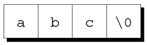
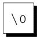
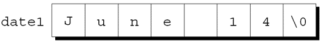
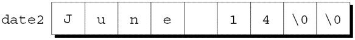
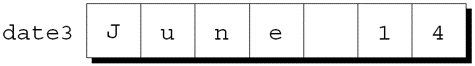
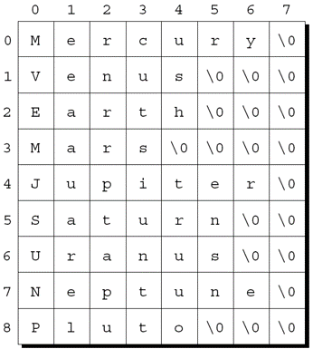

---
presentation:
  margin: 0
  center: false
  transition: "convex"
  enableSpeakerNotes: true
  slideNumber: "c/t"
  navigationMode: "linear"
---

@import "../css/font-awesome-4.7.0/css/font-awesome.css"
@import "../css/theme/solarized.css"
@import "../css/logo.css"
@import "../css/font.css"
@import "../css/color.css"
@import "../css/margin.css"
@import "../css/table.css"
@import "../css/main.css"
@import "../plugin/zoom/zoom.js"
@import "../plugin/customcontrols/plugin.js"
@import "../plugin/customcontrols/style.css"
@import "../plugin/chalkboard/plugin.js"
@import "../plugin/chalkboard/style.css"
@import "../plugin/menu/menu.js"
@import "../js/anychart/anychart-core.min.js"
@import "../js/anychart/anychart-venn.min.js"
@import "../js/anychart/pastel.min.js"
@import "../js/anychart/venn-ml.js"
@import "https://cdn.bootcdn.net/ajax/libs/jquery/3.5.0/jquery.js"


<!-- slide data-notes="" -->

<div class="bottom20"></div>

# 智能程序设计（C语言）

<hr class="width50 center">

## 指针与字符串

<div class="bottom8"></div>

### 计算机学院 &nbsp;&nbsp; 杨已彪

#### [yangyibiao@nju.edu.cn](mailto:yangyibiao@nju.edu.cn)


<!-- slide data-notes="" -->

##### 提纲

---

- 字符串字面量与存储

- 字符串变量: 字符数组 vs 字符指针

- 字符串的读写

- 字符串库函数与综合案例

---


<!-- slide data-notes="" -->


##### 字符串字面量

---

<div style="display:flex;align-items:flex-start;gap:24px;">

<div style="flex:1.2;font-size:0.62em;">

```C
Candy
Is dandy
But liquor
Is quicker.
  --Ogden Nash
```

</div>

<div style="flex:1;">

本章涵盖==字符串常量==(C标准中称为字符串字面量)和==字符串变量==. 

字符串是字符数组, 用特殊字符(空字符)标记结束. 

C库提供了一组用于处理字符串的函数. 


---

字符串字面量是用双引号括起来的字符序列: 

`"When you come to a fork in the road, take it."`

字符串字面量可能包含转义序列. 

转义字符经常出现在printf和scanf格式字符串中.


例如, 字符串

`"Candy\nIs dandy\nBut liquor\nIs quicker.\n  --Ogden Nash\n"`

每个\n字符使光标移到下一行:


</div>

</div>

<!-- slide data-notes="" -->


##### 字符串字面量的存储

---

当C编译器在程序中遇到长度为 ==$n$== 的字符串字面量时, 它会为该字符串分配 ==$n + 1$== 个字节的内存. 

这块内存空间将用来存储字符串中的字符, 以及一个额外的字符: 
==空字符== 标记字符串的结尾. 

空字符是所有位都为0的字节, 因此它用转义序列 =='\0'== 表示.


字符串字面量"abc"存储为4个字符的数组: 

<div class="top-2">
  
</div>

字符串""(空串)存储为一个空字符: 
<div class="top-2">
  
</div>

---


<!-- slide data-notes="" -->


##### 对字符串字面量的操作

---

可以在任何允许使用`char *`指针的地方使用字符串字面量: 

```C
char *p;
p = "abc"; /* 正确 */
```

该赋值使p指向字符串的第一个字符.


可以对字符串字面量取下标: 

```C
char ch;
ch = "abc"[1];  // ch is now 'b'
```

将 0 ~ 15 的数字转换为等价的十六进制的字符形式的函数: 

```C
char digit_to_hex_char(int digit)
{
  return "0123456789ABCDEF"[digit];
}
```

---


<!-- slide data-notes="" -->


##### 字符串字面量与字符常量

---

包含单个字符的字符串字面量与字符常量不同. 

- `"a"`由==指针==表示. 

- `'a'`由==整数==表示. 

合法调用: 
```C
printf("\n");
```

非法调用: 
```C
printf('\n'); /*** 错误的 ***/
```

---


<!-- slide data-notes="" -->


##### 字符串变量: 字符数组

---

<div style="display:flex;align-items:flex-start;gap:24px;">

<div style="flex:1.4;font-size:0.55em;">

```C
#define STR_LEN 80
…
char str[STR_LEN+1];
```

```C
char date1[8] = "June 14"; 
```

</div>

<div style="flex:1;">

任何一维字符数组都可以用来存储字符串. 

字符串必须以空字符结尾. 

数组存储字符串的难点: 

- 很难判断一个字符数组是否被用作字符串. 

- 字符串处理函数必须小心处理空字符. 

- 确定字符串的长度需要搜索空字符. 


---

如果字符串变量需要存储 80 个字符, 则必须将其声明为 81:

长度加1可以为字符串末尾的空字符留出空间. 

定义一个代表 80 的宏, 然后加 1 是一种<u>惯用法</u>.


声明字符串变量时, 请务必为空字符留出空间. 

不这样做可能会在程序执行时导致不可预知的结果. 

字符串的实际长度取决于终止空字符的位置. 

STR_LEN + 1 长度的字符数组可以保存长度为 0 ~ STR_LEN之间的字符串.


字符串变量可以在声明时初始化:

编译器将自动添加一个空字符, 使date1可以用作字符串: 

<div class="top-2">
  
</div>

"June  14"在此上下文中不是字符串字面量. 

C编译器将其视为字符数组初始化式的缩写.

</div>

</div>

<!-- slide data-notes="" -->


##### 初始化字符串变量

---

若初始化式太短无法填满字符串变量, 编译器会添加额外空字符: 

```C
char date2[9] = "June  14" ; 
```

之后, date2将如下所示: 

<div class="top-2">
  
</div>


字符串变量的初始化式不能长于变量, 但长度可以相同: 

```C
char date3[7] = "June 14";
```

因为没有给空字符留空间, 编译器不会尝试存储空字符: 
<div class="top-2">
  
</div>

---


<!-- slide data-notes="" -->


##### 字符数组与字符指针

---

<div style="display:flex;align-items:flex-start;gap:24px;">

<div style="flex:1.3;font-size:0.6em;">

```C
char date[] = "June 14";
```

```C
char *date = "June 14";
```

```C
char *p;
```

```C
char str[STR_LEN+1], *p;
p = str;
```

</div>

<div style="flex:1;">

以下声明将date声明为一个数组:

而以下声明则将date声明为一个指针:

由于数组和指针之间的密切关系, 这两种都可以用作字符串.


两种date之间存在的差异: 

- 声明为数组时, 可以修改存储在date中的字符. 声明为指针时, date指向不应修改的字符串字面量. 

- 声明为数组时, date是一个数组名. 声明为指针时, date是一个可以指向其他字符串的指针变量.


声明

不会为字符串分配空间. 

在使用p作为字符串之前, 必须把p指向字符数组. 

一种可能是把p指向一个字符串变量:

另一种可能是使p指向一个动态分配的字符串.

</div>

</div>

<!-- slide data-notes="" -->


##### 写字符串: printf 与 puts

---

<div style="display:flex;align-items:flex-start;gap:24px;">

<div style="flex:1.2;font-size:0.62em;">

```C
printf("%.6s\n", str);
```

</div>

<div style="flex:1;">

要打印字符串的一部分, 可以使用转换说明 ==%.ps==

==p== 是要打印的字符数量. 

语句

将打印
`Are we`


转换说明 ==%ms== 将在大小为 ==m== 的字段内打印字符串. 

如果字符串少于 ==m== 个字符, 则会在字段内右对齐输出. 

如果要强制左对齐, 在m前面加一个减号. 

m和p可以组合使用: 

转换说明 ==%m.ps== 会使字符串的前 ==p== 个字符打印在大小为 ==m== 的字段中.

</div>

</div>

<!-- slide data-notes="" -->


##### 读字符串: scanf

---

<div style="display:flex;align-items:flex-start;gap:24px;">

<div style="flex:1.3;font-size:0.6em;">


</div>

<div style="flex:1;">

转换说明 ==%s== 允许scanf将字符串读入字符数组: 

`scanf("%s", str);`

str被视为指针, 因此无需在str前添加`&`运算符. 

scanf会跳过空白字符, 然后读入字符并存储到str中, 直到遇到空白字符. 

scanf会在字符串的末尾存储一个空字符.


scanf通常不会读取整行输入. 

换行符会导致scanf停止读取, 空格和制表符也会. 

要读取整行输入, 可以使用gets. 

gets的特点: 

- 不会在开始读字符串之前跳过空白字符. 

- 持续读入直到找到<u>换行符</u>才停止. 

- 忽略换行符而不存储它, 用空字符代替换行符.

</div>

</div>

<!-- slide data-notes="" -->

##### 读字符串: 为什么不用 gets

---

不要使用 ==gets== 读取字符串:

- gets ==不检查缓冲区大小==, 输入过长会溢出 (缓冲区溢出漏洞的经典来源)

- ==C11 标准已把 gets 从语言中移除==; OJ 平台上的老题也要改用 fgets

```C
char line[100];

/* Wrong: gets(line);  —— 危险且已移除 */
fgets(line, sizeof(line), stdin);   /* 正确: 带上限长度 */
```

- ==fgets== 会连换行符一起读入 (和 gets 不同), 需要时手工去掉末尾的 `\n`

---


<!-- slide data-notes="" -->


##### 逐个字符读字符串

---

<div style="display:flex;align-items:flex-start;gap:24px;">

<div style="flex:1.2;font-size:0.6em;">


</div>

<div style="flex:1;">

程序员经常自己编写输入函数. 需要考虑的问题: 

- 在开始存储字符串之前, 函数是否应该跳过空白字符？

- 什么字符会导致函数停止读取: 换行符、任何空白字符或其他字符？这个字符是存储在字符串中还是被丢弃？

- 如果输入字符串太长而无法存储, 函数应该做什么: 丢弃多余的字符或将它们留给下一次输入操作？


假设我们需要一个函数: 
(1)不跳过空白字符；
(2)在第一个换行符处停止读取(不存储到字符串中)；
(3)丢弃多余的字符. 

函数原型: `int read_line(char str[], int n);`

如果输入行包含多于n个的字符, read_line将丢弃额外的字符. 

read_line将返回实际存储在str中的字符数量.

</div>

</div>

<!-- slide data-notes="" -->


##### 访问字符串中的字符

---

<div style="display:flex;align-items:flex-start;gap:24px;">

<div style="flex:1.3;font-size:0.6em;">

```C{.line-numbers}
int count_spaces(const char s[])
{
  int count = 0;

  for (int i = 0; s[i] != '\0'; i++) {
    if (s[i] == ' ')
      count++;
  }

  return count;
}
```

```C{.line-numbers}
int count_spaces(const char *s)
{
  int count = 0;

  for (; *s != '\0'; s++) {
    if (*s == ' ')
      count++;
  }

  return count;
} 
```

</div>

<div style="flex:1;">

由于字符串是以数组的方式存储的, 可以使用下标来访问字符串中的字符. 

要处理字符串s中的每个字符, 可以设置一个循环来对计数器i进行自增并通过表达式s[i]选择字符. 


---

计算字符串中空格数的函数:

使用指针运算代替数组取下标:


</div>

</div>

<!-- slide data-notes="" -->


##### strcpy(字符串复制)

---

<div style="display:flex;align-items:flex-start;gap:24px;">

<div style="flex:1.2;font-size:0.62em;">

```C
strcpy(str2, "abcd");
/* str2 现在包含 "abcd" */
```

```C
strcpy(str1, str2);
/* str1 现在包含 "abcd" */
```

</div>

<div style="flex:1;">

strcpy函数的原型: 

`char *strcpy(char *s1, const char *s2);`

strcpy将字符串s2复制到字符串s1中. 

准确地说, strcpy将 ==s2指向的字符串== 复制到 ==s1指向的数组中==. 

strcpy返回s1(指向目标字符串的指针).


调用strcpy, 把字符串"abcd"存储到str2中:

把str2的内容复制到str1:


</div>

</div>

<!-- slide data-notes="" -->


##### strlen(字符串长度)

---

strlen函数的原型: 

`size_t strlen(const char *s);`

size_t是一个typedef名称, 表示C的一种无符号整型.


strlen返回字符串s的长度, 不包括空字符. 例子: 

```C{.line-numbers}
int len;

len = strlen("abc");  /* len is now 3 */
len = strlen("");     /* len is now 0 */
strcpy(str1, "abc");
len = strlen(str1);   /* len is now 3 */
```

---


<!-- slide data-notes="" -->


##### strcat(字符串拼接)

---

<div style="display:flex;align-items:flex-start;gap:24px;">

<div style="flex:1.3;font-size:0.6em;">

```C{.line-numbers}
char str1[20], str2[20];
strcpy(str1, "abc");
strcat(str1, "def");
 /* str1 now contains "abcdef" */
strcpy(str1, "abc");
strcpy(str2, "def");
strcat(str1, str2);
 /* str1 now contains "abcdef" */ 
```

```C{.line-numbers}
char str1[20], str2[20];
strcpy(str1, "abc");
strcpy(str2, "def");
strcat(str1, strcat(str2, "ghi"));
/* str1 now contains "abcdefghi";
   str2 contains "defghi" */
```

</div>

<div style="flex:1;">

strcat函数的原型: 

`char *strcat(char *s1, const char *s2);`

strcat将字符串s2的内容附加到字符串s1的末尾. 

它返回s1(指向结果字符串的指针). strcat示例:

与strcpy一样, strcat返回的值通常会被丢弃. 

以下使用返回值的方法:


</div>

</div>

<!-- slide data-notes="" -->


##### strcmp(字符串比较)

---

<div style="display:flex;align-items:flex-start;gap:24px;">

<div style="flex:1.2;font-size:0.62em;">

```C
int strcmp(const char *s1, const char *s2);
```

```C
if (strcmp(str1, str2) < 0)    /* is str1 < str2? */
  …
```

```C
if (strcmp(str1, str2) <= 0) /* is str1 <= str2? */
  …
```

</div>

<div style="flex:1;">

strcmp函数的原型:

strcmp比较字符串s1和s2, 根据s1是小于、等于还是大于s2, 返回一个小于、等于或大于0的值.


检查str1是否小于str2:

检查str1是否小于或等于str2 :

通过选择适当的运算符(<、 <=、 >、 >=、 ==、 !=), 可以测试str1和str2之间的任何可能的关系.

</div>

</div>

<!-- slide data-notes="" -->


##### 程序: 打印一个月的提醒列表

---

<div style="display:flex;align-items:flex-start;gap:24px;">

<div style="flex:1.4;font-size:0.5em;">

```
Enter day and reminder: 24 Susan's birthday
Enter day and reminder: 5 6:00 - Dinner with Marge and Russ
Enter day and reminder: 26 Movie - "Chinatown"
Enter day and reminder: 7 10:30 - Dental appointment
Enter day and reminder: 12 Movie - "Dazed and Confused"
Enter day and reminder: 5 Saturday class
Enter day and reminder: 12 Saturday class
Enter day and reminder: 0
 
Day Reminder
  5 Saturday class
  5 6:00 - Dinner with Marge and Russ
  7 10:30 - Dental appointment
 12 Saturday class
 12 Movie - "Dazed and Confused"
 24 Susan's birthday
 26 Movie - "Chinatown"
```

</div>

<div style="flex:1;">

*remind.c*程序打印一个月的每日提醒列表. 

用户将输入一系列提醒, 每个提醒有一个前缀说明是一个月中的哪一天. 

当用户输入 0 而不是有效日期时, 程序将打印输入的所有提醒的列表, 按日期排序. 

下一张幻灯片显示了该程序的会话.

总体策略: 

- 读入一系列日期和提醒的组合

- 按顺序存储(按日期排序)

- 显示

scanf将用于读取日期. 

read_line将用于读入提醒.

</div>

</div>

<!-- slide data-notes="" -->


##### 字符串惯用法: 搜索结尾与复制

---

<div style="display:flex;align-items:flex-start;gap:24px;">

<div style="flex:1.3;font-size:0.55em;">

```C{.line-numbers}
size_t strlen(const char *s)
{
  size_t n = 0;

  for (; *s != '\0'; s++) {
    n++;
  }

  return n;
}
```

```C{.line-numbers}
size_t strlen(const char *s)
{
  size_t n = 0;

  for (; *s; s++) {
    n++;
  }

  return n;
}
```

</div>

<div style="flex:1;">

n的初始化移到它的声明中:

条件`*s != '\0'`与`*s != 0`相同, 这又与`*s`相同. 

使用这些观察的strlen版本:


</div>

</div>

<!-- slide data-notes="" -->


##### 字符串数组

---

<div style="display:flex;align-items:flex-start;gap:24px;">

<div style="flex:1.3;font-size:0.6em;">

```C
char planets[][8] = {"Mercury", "Venus", "Earth",
                     "Mars", "Jupiter", "Saturn",
                     "Uranus", "Neptune", "Pluto"};
```

```C
char *planets[] = {"Mercury", "Venus", "Earth",
                   "Mars", "Jupiter", "Saturn",
                   "Uranus", "Neptune", "Pluto"};
```

</div>

<div style="flex:1;">

存储字符串数组的方法不止一种. 

一种选择是使用二维字符数组, 每行一个字符串:

数组中的行数可以省略, 但必须指定列数. 


---

不幸的是, planets数组浪费了相当多的空间(额外的空字符): 

<div class="top-2">
  
</div>


大多数字符串集合都是长字符串和短字符串的混合. 

我们需要的是一个参差不齐的数组, 它的行可以有不同的长度. 

用指向 ==字符串的指针的数组== 来模拟 C 中的不规则数组:


</div>

</div>

<!-- slide data-notes="" -->

##### 课堂小测

---

1. `"abc"` 和 `'a'` 的区别是什么？`"abc"` 在内存里占几个字节？

2. `char s[] = "hello";` 与 `char *p = "hello";` 有什么区别？

3. 为什么不能用 `if (s1 == s2)` 比较两个字符串？应该用什么？

4. `strcpy`、`strcat`、`strlen`、`strcmp` 各做什么？`strcmp` 返回 0 表示什么？

---


<!-- slide data-notes="" -->

#####

---

<div class="bottom20"></div>

# 周三见!

<hr class="width50 center">

## 未完待续

---


