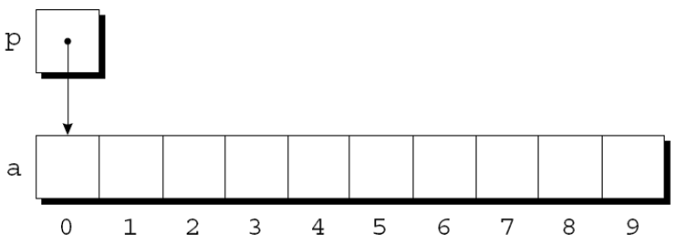
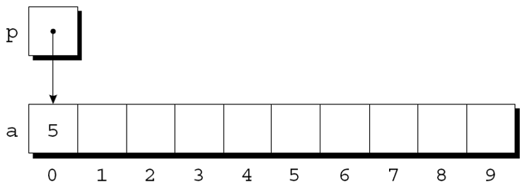
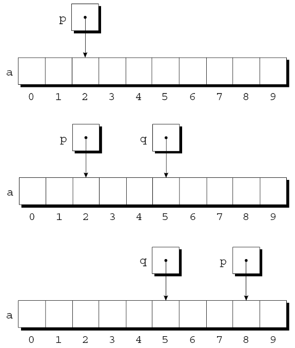
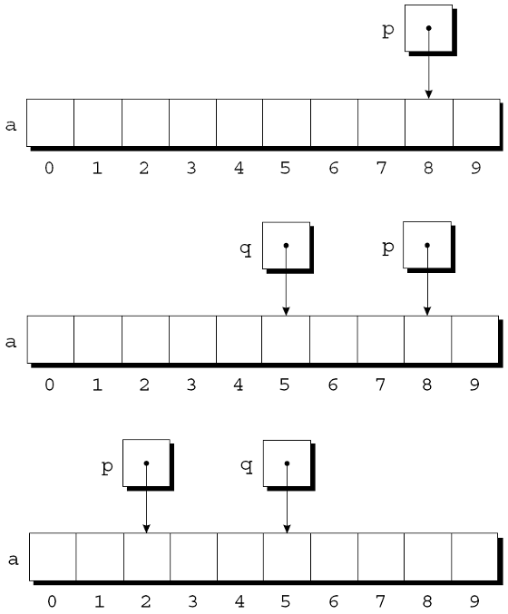
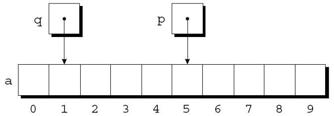
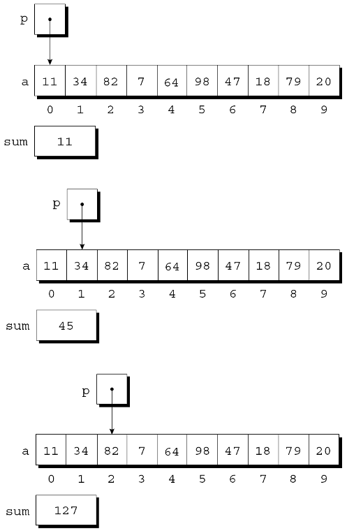
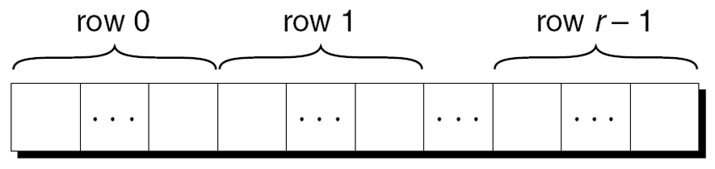

---
presentation:
  margin: 0
  center: false
  transition: "convex"
  enableSpeakerNotes: true
  slideNumber: "c/t"
  navigationMode: "linear"
---

@import "../../css/font-awesome-4.7.0/css/font-awesome.css"
@import "../../css/theme/solarized.css"
@import "../../css/logo.css"
@import "../../css/font.css"
@import "../../css/color.css"
@import "../../css/margin.css"
@import "../../css/table.css"
@import "../../css/main.css"
@import "../../plugin/zoom/zoom.js"
@import "../../plugin/customcontrols/plugin.js"
@import "../../plugin/customcontrols/style.css"
@import "../../plugin/chalkboard/plugin.js"
@import "../../plugin/chalkboard/style.css"
@import "../../plugin/menu/menu.js"
@import "../../js/anychart/anychart-core.min.js"
@import "../../js/anychart/anychart-venn.min.js"
@import "../../js/anychart/pastel.min.js"
@import "../../js/anychart/venn-ml.js"

<!-- slide data-notes="" -->

<div class="bottom20"></div>

# C语言程序设计基础

<hr class="width50 center">

## 指针和数组


<div class="bottom8"></div>

### 计算机学院 &nbsp;&nbsp; 杨已彪

#### yangyibiao@nju.edu.cn


<!-- slide vertical=true data-notes="" -->

##### 提纲

---

- 指针示例

- <a href="#/arioper">指针的算术运算</a>

- <a href="#/arr">指针用于数组处理</a>

- <a href="#/arrname">数组名作为指针</a>

- <a href="#/multiarr">指针和多维数组</a>

---


<!-- slide vertical=true data-notes="" -->

##### 一级指针示例

---

```C
#include <stdio.h>

// 示例 1：一级指针访问数组元素
int main() {
  int arr[5] = {10, 20, 30, 40, 50};
  int *p = arr;        // 等价于 &arr[0]

  printf("arr[2] = %d\n", arr[2]);
  printf("*(p + 2) = %d\n", *(p + 2));   // 指针解引用访问数组

  p++; // 指针移动到第二个元素
  printf("After p++, *(p) = %d\n", *p);

  return 0;
}
```

[pointer_basic.c](./code/pointer_basic.c)

---


<!-- slide vertical=true data-notes="" -->

##### 二级指针

---

```C
#include <stdio.h>

// 示例 2：二级指针指向一级指针
int main() {
  int value = 100;
  int *p = &value;
  int **pp = &p;

  printf("&value: %p\n", &value);
  printf("p: %p\n", p);
  printf("&p: %p\n", &p);
  printf("pp: %p\n", pp);

  printf("value = %d\n", value);
  printf("*p = %d\n", *p);
  printf("**pp = %d\n", **pp);

  return 0;
}
```

[double_pointer.c](./code/double_pointer.c)

---


<!-- slide vertical=true data-notes="" -->

##### 二维数组的指针运算

---

```C
#include <stdio.h>

// 示例 3：二维数组的指针运算
int main() {
  int matrix[2][3] = { {1, 2, 3}, {4, 5, 6} };

  printf("matrix[1][2] = %d\n", matrix[1][2]);
  printf("*(*(matrix + 1) + 2) = %d\n", *(*(matrix + 1) + 2));

  return 0;
}
```

[2d_array_pointer.c](./code/2d_array_pointer.c)

---


<!-- slide vertical=true data-notes="" -->

##### 指向数组的指针

---

```C
#include <stdio.h>

// 示例 4：指向数组的指针（Array Pointer）
int main() {
  int arr[4] = {10, 20, 30, 40};

  int (*p)[4] = &arr;   // p 是指向含 4 个 int 的数组的指针

  printf("arr: %p\n", arr);
  printf("p: %p\n", p);
  // p的类型是int *[4], 决定+1后指向的位置为下一个指向4个数组的首地址
  printf("p + 1: %p\n", p + 1);
  // *p的类型是int*，决定+1后是指向下一个整数
  printf("*p + 1: %p\n", *p + 1);
  printf("(*p)[2] = %d\n", (*p)[2]); // 访问 arr[2]
  printf("*((*p) + 2) = %d\n", *((*p) + 3));

  return 0;
}
```

[pointer_to_array.c](./code/pointer_to_array.c)

---


<!-- slide vertical=true data-notes="" -->

##### 二维数组的指针运算

---

```C
#include <stdio.h>

// 示例 5：指向指针的指针 vs. 指向数组的指针
int main() {
  int matrix[2][3] = { {1,2,3}, {4,5,6} };

  int *p1 = matrix[0];     // OK：matrix[0] 是 int*
  int **p2 = (int **) &matrix; // ⚠️ 类型并不等价，仅示例对比用
  int (*p3)[3] = matrix;   // 正确：指向数组的指针

  printf("Using p1: p1[2] = %d\n", p1[2]);
  printf("Using p3: p3[1][2] = %d\n", p3[1][2]);

  return 0;
}
```

[pointer_vs_array_pointer.c](./code/pointer_vs_array_pointer.c)

---


<!-- slide vertical=true data-notes="" -->

##### 数组的指针作为参数

---

```C
#include <stdio.h>

void printByPointer(int (*p)[4], int rows) {
  for (int i = 0; i < rows; i++) {
    for (int j = 0; j < 4; j++) {
      // 错误写法：*((*p + i) + j)
      printf("%d ", *(*(p + i) + j));  // p[i] == *(p+i)
    }
    printf("\n");
  }
}

int main() {
  int matrix[2][4] = {
      {7, 8, 9, 10},
      {11, 12, 13, 14}
  };

  printByPointer(matrix, 2); // matrix 自动转换为 int (*)[4]
  return 0;
}
```

[2d_array_pointer_function.c](./code/2d_array_pointer_function.c)

---


<!-- slide vertical=true data-notes="" -->

##### 数组的指针作为参数

---

`*(*(p + i) + j)` 与 `*((*p + i) + j)` 区别

| 写法                | 实际含义                                                 | 是否等价于 `p[i][j]` |
| ----------------- | ---------------------------------------------------- | --------------- |
| `*(*(p + i) + j)` | `p` 是指向一维数组（行）的指针，取第 `i` 行再取第 `j` 列 → **正确表达二维数组访问** | ✔️正确            |
| `*((*p + i) + j)` | `*p` 先取第一行，然后 `+ i` 变成取第 `i` 个元素，但这个 `i` 属于第一行而不是行偏移 | ❌错误（仅 i=0 时等价）  |

---


<!-- slide vertical=true data-notes="" -->

##### strcmp函数

---

```C
#include <stdio.h>

int my_strcmp(const char *s1, const char *s2) {
  while (*s1 && (*s1 == *s2)) {
    s1++;
    s2++;
  }
  return *(unsigned char*)s1 - *(unsigned char*)s2;
}

int main() {
  printf("Compare(\"apple\", \"apple\") = %d\n", my_strcmp("apple", "apple"));
  printf("Compare(\"apple\", \"apples\") = %d\n", my_strcmp("apple", "apples"));
  printf("Compare(\"banana\", \"apple\") = %d\n", my_strcmp("banana", "apple"));

  char str1[20] = {'a', 'p', 'p', 'l', 'e', '\0', 'n', 'j', 'u', '\0'};
  char str2[20] = {'a', 'p', 'p', 'l', 'e', '\0'};

  printf("Compare(str1, str2) = %d\n", my_strcmp(str1, str2));
  return 0;
}
```

[strcmp.c](./code/strcmp.c)

---


<!-- slide vertical=true data-notes="" -->

##### 指向数组的指针与malloc

---

```C
#include <stdio.h>
#include <stdlib.h>
#include <string.h>

void func1(void *p, int len) {
  // 传递过来的是一个void*时，需要转成正确的类型，ptr++才能正确指向下一个字符串
  char **ptr = (char**)p;
  for (int i = 0; i < len; i++) {
    printf("%s\n", *ptr);
    ptr++;
  }
}

void func2(char **p, int len) {
  for (int i = 0; i < len; i++) {
    printf("%s\n", *p);
    // 或者传递过来的直接是一个char**
    p++;
  }
}

int main(){
  char *mstr[4];

  // strcpy之前先malloc分配存储空间
  mstr[0] = malloc(sizeof(10));
  mstr[1] = malloc(sizeof(10));
  mstr[2] = malloc(sizeof(10));
  mstr[3] = malloc(sizeof(10));

  strcpy(mstr[0], "hello");
  strcpy(mstr[1], "world");
  strcpy(mstr[2], "nju");
  strcpy(mstr[3], "nihao");

  func1(mstr, 4);
  func2(mstr, 4);
  return 0;
}
```

[pptr_malloc.c](./code/pptr_malloc.c)

---


<!-- slide vertical=true data-notes="" -->

##### strcmp函数

---

```C
#include <stdio.h>
#include <stdlib.h>

int cmp_int_asc(const void *a, const void *b) {
  return (*(int *)a - *(int *)b);
}

int main() {
  int arr[] = {42, 13, 77, 9, 56};
  int n = sizeof(arr) / sizeof(arr[0]);

  qsort(arr, n, sizeof(int), cmp_int_asc);

  for (int i = 0; i < n; i++) {
    printf("%d ", arr[i]);
  }
  return 0;
}
```

[qsort_int.c](./code/qsort_int.c)

---


<!-- slide vertical=true data-notes="" -->

##### strcmp函数

---

```C
#include <stdio.h>
#include <stdlib.h>
#include <string.h>

int cmp_str(const void *a, const void *b) {
  // a 和 b 是 char* 的地址 → type: char**
  return strcmp(*(const char **)a, *(const char **)b);
}

int main() {
  const char *words[] = {"banana", "apple", "orange", "kiwi"};
  int n = sizeof(words)/sizeof(words[0]);

  qsort(words, n, sizeof(char*), cmp_str);

  for (int i = 0; i < n; i++) {
    printf("%s\n", words[i]);
  }
}
```

[qsort_string.c](./code/qsort_string.c)

---


<!-- slide vertical=true data-notes="" -->

##### 引言

---

C语言允许对指针进行算术运算

指针==可代替数组下标==对数组进行处理

C语言中指针和数组之间的关系非常紧密

理解指针与数组之间的关系对于熟练掌握C语言非常重要

---


<!-- slide vertical=true data-notes="" -->

##### 指针的算术运算

---

第 11 章展示了指针可以指向数组元素: 
```C
int a[10], *p;
p = &a[0];
```
图形表示: 

<div class="top-2">
    
</div>

---


<!-- slide id="arioper" vertical=true data-notes="" -->

##### 指针的算术运算

---

可以通过p访问a[0]. 例如, 可以通过下面写法将值5存储在a[0]中: 

`*p = 5;`

图示如下: 

<div class="top-2">
    
</div>

---


<!-- slide data-notes="" -->

##### 指针的算术运算

---

如果p指向数组a的一个元素, 则可以通过对p执行指针算术运算(或地址运算)来访问a的其他元素

C支持三种(且只有三种)==指针运算==形式:

- 指针加上整数

- 指针减去整数

- 两个指针相减

---


<!-- slide vertical=true data-notes="" -->

##### 指针加上整数

---

将整数j添加到指针p会产生一个指向第j个元素的指针, 该元素位于p指向的元素之后. 

更准确地说, 如果p指向数组元素a[i], 那么p + j指向a[i+j]. 

假设有以下声明: 

```C
int a[10], *p, *q, i;
```

---


<!-- slide vertical=true data-notes="" -->

##### 指针加上整数

---

指针加法示例: 

```C
p = &a[2];
q = p + 3;
p += 6;
```

<div class="top-2"></div>

---


<!-- slide vertical=true data-notes="" -->

##### 指针减去整数

---

如果p指向a[i], 那么p-j指向a[i-j]. 指针减法示例: 

```C
p = &a[8]; 
q = p - 3;
p -= 6;
```

<div class="top-2">
    
</div>

---


<!-- slide vertical=true data-notes="" -->

##### 两个指针相减

---

当一个指针从另一个指针中减去时, 结果是==指针之间的距离==(数组元素的个数). 

如果p指向a[i]并且q指向a[j], 那么$p - q$等于$i - j$. 示例: 

```C
p = &a[5];
q = &a[1];
```

<div class="top-2">
    
</div>

```C
i = p - q; /* i is  4 */
i = q - p; /* i is -4 */
```

---


<!-- slide data-notes="" -->

##### 两个指针相减

---

<span class="blue">:fa-weixin:</span> 对不指向数组元素的指针执行算术运算导致未定义的行为

<span class="blue">:fa-weixin:</span> 只有两个指针指向同一个数组时, 把它们相减才有意义

---


<!-- slide vertical=true data-notes="" -->

##### 比较指针

---

关系运算符(<, <=, >, >=)和判等运算符(==, !=)进行指针比较. 

使用关系运算符仅对指向同一数组元素的指针有意义. 比较的结果取决于数组中两个元素的相对位置. 

```C
p = &a[5];
q = &a[1];
p <= q; // expression value: 0
p >= q; // expression value: 1
```

任务完成后: 
- p<=q的值为0
- p>=q的值为1. 

---


<!-- slide vertical=true data-notes="" -->

##### 指向复合字面量的指针(C99)

---

指针指向由复合字面量创建的数组中的元素是合法的: 

int *p = (int []){3, 0, 3, 4, 1};

使用复合字面量可以省去我们先声明一个数组变量然后让p指向该数组的第一个元素的麻烦: 

```C
int a[] = {3, 0, 3, 4, 1};
int *p = &a[0];
```

---


<!-- slide id="arr" vertical=true data-notes="" -->

##### 使用指针进行数组处理

---

指针的算术运算允许我们通过重复自增指针变量来访问数组的元素. 

对数组a的元素求和的循环:

```C
#define N 10
…
int a[N], sum, *p;
…
sum = 0;
for (p = &a[0]; p < &a[N]; p++)
    sum += *p;
```

---


<!-- slide data-notes="" -->


##### 使用指针进行数组处理

---

- 在第一次迭代结束时: 
- 在第二次迭代结束时: 
- 在第三次迭代结束时: 

<div class="top-2">
    
</div>

---


<!-- slide vertical=true data-notes="" -->

##### 使用指针进行数组处理

---

`for`语句中的条件`p < &a[N]`值得特别提及. 
将地址运算符应用于`a[N]`是合法的, 即使此元素不存在. 

---


<!-- slide vertical=true data-notes="" -->

##### 结合*和++运算符

---

C程序员经常结合使用`*`(间接寻址)和`++`运算符. 

修改数组元素后前进到下一个元素的语句:
`a[i++] = j;`

对应的指针版本: 
`*p++ = j;`

因为后缀++的优先级高于*, 编译器将其视为
`*(p++) = j;`

---


<!-- slide vertical=true data-notes="" -->

##### 结合*和++运算符

---

`*`和`++`的可能组合: 

<div class="fullborder">

| 表达  | 意义 |
| :--: | :--: |  
| `*p++或*(p++)` | 表达式的值是`*p`在递增之前, 之后自增p |
| `(*p)++`      | 表达式的值为`*p`在递增之前, 稍后增加`*p` |
| `*++p或*(++p)` | 先递增`p`, 表达式的值为`*p` |
| `++*p或++(*p)` | 先递增`*p`, 表达式的值为`*p` |

</div>

- *(p++) 指针自增(指向下一个对象)
- (*p)++ 指向的对象自增(p本身不变)

---


<!-- slide vertical=true data-notes="" -->

##### 结合*和++运算符

---

\*和++最常见的组合是`*p++`, 在循环中很常用. 

对数组a的元素求和时, 可以把

```C
for (p = &a[0]; p < &a[N]; p++)
    sum += *p;
```

改写成

```C
p = &a[0];
while (p < &a[N])
    sum += *p++;
```

---


<!-- slide data-notes="" -->

##### 结合*和++运算符

---

\*和`--`运算符的组合方式与\*和`++`相同. 

对于应用*和`--`的组合, 让我们回到第10章的栈的示例. 

原始版本的栈依赖于名为top的整型变量来记录contents数组中的==栈顶==的位置. 

现在将top替换为初始指向contents数组的第0个元素的指针变量: 

```C
int *top_ptr = &contents[0]; 
```

---


<!-- slide vertical=true data-notes="" -->

##### 结合*和++运算符

---

新的push和pop函数: 

```C {.line-numbers}
void push(int i)
{
    if (is_full())
        stack_overflow();
    else
        *top_ptr++ = i;
}

int pop(void)
{
    if (is_empty())
        stack_underflow();
    else
        return *--top_ptr;
}
```

---


<!-- slide id="arrname" vertical=true data-notes="" -->

##### 使用数组名称作为指针

---

指针的算术运算是数组和指针相互关联的一种方法. 

此外, 数组的名称可以用作指向数组中第一个元素的指针. 

这种关系简化了指针的算术运算, 并使数组和指针更加通用. 

---


<!-- slide vertical=true data-notes="" -->

##### 使用数组名称作为指针

---

假设a声明如下: 

```C
int a[10];
```

使用a作为指针的示例: 
```C
*a = 7;      /* 将 7存储在a[0]中 */
*(a+1) = 12; /* 将12存储在a[1]中 */
```

一般情况, `a+i`与`&a[i]`相同, 都表示指向数组a中的元素i的指针. 

此外, `*(a+i)`等价于`a[i]`, 两者都代表元素i本身. 

---


<!-- slide vertical=true data-notes="" -->

##### 使用数组名称作为指针

---

数组名称可以用作指针这一事实使得编写遍历数组的循环变得更加容易. 

```C{.line-numbers}
/* 原始版本 */
for (p = &a[0]; p < &a[N]; p++)
    sum += *p;

/* 简化版本 */
for (p = a; p < a + N; p++)
    sum += *p;
```

---


<!-- slide vertical=true data-notes="" -->

##### 使用数组名称作为指针

---

尽管数组名可以用作指针, 但==不能为数组名赋新值==. 

试图让数组名指向其他地方是错误的: 
```C
while (*a != 0)
    a++; /*** 错误的 ***/
```

可以将a复制到指针变量中, 然后更改指针变量: 
```C
p = a;
while (*p != 0)
    p++;
```

---


<!-- slide data-notes="" -->

##### 程序: 数列反向(改进版)

---

之前的*reverse.c*程序读取 10 个数字, 然后逆序输出这些数字. 

原始程序将数字存储在一个数组中, 利用下标访问数组的元素. 

*reverse3.c*是一个改进后的程序, 用指针的算术运算取代数组的取下标操作. 

---


<!-- slide vertical=true data-notes="" -->

##### 程序: 数列反向(改进版)

---

*reverse3.c*

```C{.line-numbers}

/* 数列反向（指针版本） */

#include <stdio.h>

#define N 10

int main(void)
{
  int a[N], *p;

  printf("Enter %d numbers: ", N);
  for (p = a; p < a + N; p++)
    scanf("%d", p);

  printf("In reverse order:");
  for (p = a + N - 1; p >= a; p--)
    printf(" %d", *p);
  printf("\n");

  return 0;
}
```

---


<!-- slide vertical=true data-notes="" -->

##### 数组型实际参数（改进版）

---

数组名传递给函数时, 总是被视为指针. 例子: 

```C{.line-numbers}
#define N 10
int find_largest(int a[], int n)
{
    int i, max;

    max = a[0];
    for (i = 1; i < n; i++)
        if (a[i] > max)
            max = a[i];
    return max;
}

int main(){
    int b[N] = {0};
    ...
    /* 此调用导致将指向b的第一个元素的指针赋值给a, 数组本身不会被复制. */
    largest = find_largest(b, N); /* 调用find_largest */
    ...
}
```

---


<!-- slide vertical=true data-notes="" -->

##### 数组型实际参数（改进版）

---

把数组型形式参数视为指针会产生许多重要的结果: 

- 结果1: 普通变量传给函数时, 其值被复制, 对相应参数的任何更改都不会影响变量. 相反, 用作参数的数组是可能被改变的. 

例如, 以下函数将数组中的每个元素都重置为零: 

```C
void store_zeros(int a[], int n)
{
    int i;

    for (i = 0; i < n; i++)
        a[i] = 0;
}
```

---


<!-- slide vertical=true data-notes="" -->

##### 数组型实际参数（改进版）

---

为了表明数组参数不会被修改, 我们可以在它的声明中包含单词const: 
```C
int find_largest(const int a[], int n)
{
    …
}
```

编译器会检查find_largest函数体没有对a中元素进行赋值. 

---


<!-- slide vertical=true data-notes="" -->

##### 数组型实际参数（改进版）

---

- 结果2: 将数组传递给函数所需的时间与数组的大小无关. 传递大数组不会产生不利的结果, 因为没有对数组进行复制. 

---


<!-- slide data-notes="" -->

##### 数组型实际参数（改进版）

---

- 结果3: 如果需要, 可以将数组参数声明为指针. 

find_largest可以定义如下: 

```C
int find_largest(int *a, int n)
{
    …
}
```
声明a为指针, 相当于将其声明为数组; 编译器将这两类声明视为相同. 

---


<!-- slide vertical=true data-notes="" -->

##### 数组型实际参数（改进版）

---

函数参数声明为数组与声明为指针相同, 但对变量而言并非如此. 

```C
/* 等价 */
int find_largest(int *a, int n);
int find_largest(int a[], int n);
```

```C
/* 不等价 */
int a[10]; /* 编译器为数组a留出10个整数的空间 */
int *a; /* 编译器仅为指针变量分配空间 */
```

---


<!-- slide vertical=true data-notes="" -->

##### 数组型实际参数（改进版）

---

后一种情况下, a不是数组; 试图将其用作数组可能会导致灾难性的后果. 

```C
int *a;
*a = 0; /*** 错误的 ***/
```

将0存到a指向的地方. 不清楚a指向哪, 所以对程序的影响不确定. 

---


<!-- slide vertical=true data-notes="" -->

##### 数组型实际参数（改进版）

---

- 结果4: 可以给形式参数为数组的函数传递==数组的片段==——连续的数组元素组成的序列. 

将find_largest应用于数组元素b[5] ~ b[14]的示例: 

```C
int b[20] = {0};
...
largest = find_largest(&b[5], 10);
```

---


<!-- slide vertical=true data-notes="" -->

##### 使用指针作为数组名

---
C允许把指针看作数组名进行取下标操作:

```C{.line-numbers}
#define N 10
…
int a[N], i, sum = 0, *p = a;
…
for (i = 0; i < N; i++)
    sum += p[i];
```

编译器将p[i]视为*(p+i). 

---


<!-- slide id="multiarr" vertical=true data-notes="" -->

##### 指针和多维数组

---

指针可以指向一维数组的元素, 也可以指向多维数组的元素. 

本节探讨使用指针处理多维数组元素的常用方法. 

---


<!-- slide vertical=true data-notes="" -->

##### 处理多维数组的元素

---

第 8 章展示了 C 以行优先顺序存储二维数组. 

r行的数组的布局: 
  
<div class="top-2">
    
</div>

如果p最初指向二维数组的第0行第0列的元素, 即$a[0][0]$, 就可以通过重复自增p来访问数组中的每个元素. 

---


<!-- slide vertical=true data-notes="" -->

##### 处理多维数组的元素

---

考虑将以下数组的所有元素初始化为0的问题:

```C{.line-numbers}
int a[NUM_ROWS][NUM_COLS];

/* 方法1: 使用嵌套的for循环来进行二维数组的初始化 */
int row, col;
…
for (row = 0; row < NUM_ROWS; row++)
    for (col = 0; col < NUM_COLS; col++)
        a[row][col] = 0;

/* 方法2: 将a视为一维的整型数组, 单个循环进行初始化 */
int * p;
…
for (p = &a[0][0]; p <= &a[NUM_ROWS-1][NUM_COLS-1]; p++)
    *p = 0;
```

---


<!-- slide vertical=true data-notes="" -->

##### 处理多维数组的元素

---

该方法会损害程序的可读性, 对老的编译器可能产生效率提升. 

对于许多现代编译器, 速度优势通常不存在. 

---


<!-- slide vertical=true data-notes="" -->

##### 处理多维数组的行

---

指针变量p也可用于处理二维数组的一行中的元素. 

为访问第i行的元素: 

```C 
/* 将p初始化为指向数组a中第i行的元素0 */
p = &a[i][0];

/* 可简化为 */
p = a[i];
```

---


<!-- slide vertical=true data-notes="" -->

##### 处理多维数组的行

---

对于任何二维数组a, 表达式a[i]是指向第i行第一个元素的指针. 

为了解原理, 回顾一下: 

- 表达式$a[i]$等价于$*(a + i)$. 

- `&a[i][0]`等同于`&(*(a[i] + 0))`, 而后者等价于`&*a[i]`. 

- &和*运算符可抵消, `&*a[i]`也就等同于$a[i]$ 

- `a[i][0]`为第i行第0个元素, &a[i][0]即为元素的地址. 

- `&a[i][0]`等价于`&(*(a[i]+0))`, 等价于`&*a[i]`

---


<!-- slide vertical=true data-notes="" -->

##### 处理多维数组的行

---

对数组a的第i行清零的循环:

```C
int a[NUM_ROWS][NUM_COLS], *p, i;
…
for (p = a[i]; p < a[i] + NUM_COLS; p++)
    *p = 0;
```

由于a[i]是指向数组a的第i行的指针, 可将a[i]传递给一维数组作为参数的函数. 

换句话说, 处理一维数组的函数也可以处理二维数组的行.

---


<!-- slide vertical=true data-notes="" -->

##### 处理多维数组的行

---

考虑find_largest, 它最初设计用于查找一维数组的最大元素. 

这里使用find_largest来确定二维数组a的第i行中的最大元素: 

```C{.line-numbers}
int a[NUM_ROWS][NUM_COLS] = {0};
...
largest = find_largest(a[i], NUM_COLS);
```

---


<!-- slide vertical=true data-notes="" -->

##### 处理多维数组的列

---

处理二维数组一列的元素: 

```C{.line-numbers}
/* 对数组a的第i列清零的循环 */
int a[NUM_ROWS][NUM_COLS],  (*p)[NUM_COLS], i;
…
for (p = &a[0]; p < &a[NUM_ROWS]; p++)
    (*p)[i] = 0;
```

- `int (*p)[NUM_COLS];`把p声明为指向长度为NUM_COLS的整形数组的指针

- `(*p)`括号是必需的, 若无括号则编译器将p看作指针数组, 而不是指向数组的指针

- p++把p移到下一行的开始位置

- 在`(*p)[i]`中, *p代表a的一整行, `(*p)[i]`选中该行的第i列的元素

- `(*p)[i]`中的括号是必要的, 无括号编译器会将`*p[i]`解释为`*(p[i])`

---


<!-- slide vertical=true data-notes="" -->

##### 用多维数组名作为指针

---

任何数组的名称都可以用作指针, 不管它有多少维, 但需要注意. 

```C
int a[NUM_ROWS][NUM_COLS];
```

a不是指向a[0][0]的指针, 它是指向a[0]的指针. 

C将a视为一维数组, 其元素是一维数组. 

当用作指针时, a 的类型为int (*)[NUM_COLS] （指向长度为NUM_COLS的整数数组的指针）. 

---


<!-- slide vertical=true data-notes="" -->

##### 用多维数组名作为指针

---

知道a指向a[0]对于简化处理二维数组元素的循环很有用. 

要把数组a的第i列清零,可以把

```C{.line-numbers}
for (p = &a[0]; p < &a[NUM_ROWS]; p++)
  (*p)[i] = 0;

/* 改写成 */
for (p = a; p < a + NUM_ROWS; p++)
  (*p)[i] = 0;
```

---


<!-- slide vertical=true data-notes="" -->

##### 用多维数组名作为指针

---

我们可以*欺骗*一个函数, 使其认为多维数组实际上是一维的. 

尝试使用find_largest来查找a中的最大元素:
```C
largest = find_largest(a, NUM_ROWS * NUM_COLS); /* 错误的 */
```

这是错误的, 因为 a 的类型是`int (*)[NUM_COLS]`

但find_largest需要一个`int *`类型的参数, 正确的调用: 

```C
largest = find_largest(a[0], NUM_ROWS * NUM_COLS);
```

$a[0]$指向第0行中的元素0, 它的类型为`int *`(编译器转换后). 

---


<!-- slide vertical=true data-notes="" -->

##### 指针和变长数组(C99)

---

指针可以指向变长数组中的元素. 

普通的指针变量可以用于指向一维变长数组的元素:

```C
void f(int n)
{
  int a[n], *p;
  p = a;
  …
}
```

---


<!-- slide vertical=true data-notes="" -->

##### 指针和变长数组 (C99)

---

如果变长数组是多维的, 指针的类型取决于除第一维外每一维的长度. 二维示例:

```C{.line-numbers}
void f(int m, int n)
{
  int a[m][n], (*p)[n];
  p = a;
  …
}
```

由于p的类型取决于n, n不是常数, 因此p具有可改变类型. 

---


<!-- slide vertical=true data-notes="" -->

##### 指针和变长数组(C99)

---

编译器并非总能确定p = a这样的赋值语句的合法性.

仅当m = n时才正确:
```C
int a[m][n], (*p)[m];
p = a;
```
如果$m ≠ n$, 后续对p的使用将导致未定义的行为.

---


<!-- slide vertical=true data-notes="" -->

##### 指针和变长数组 (C99)

---

可改变类型受到某些限制. 

最重要的限制: 可变类型声明必须出现在函数体内或函数原型中. 

---


<!-- slide vertical=true data-notes="" -->

##### 指针和变长数组 (C99)

---

指针算术运算适用于变长数组. 

二维变长数组a: 

```C
int a[m][n]; 
```

指向数组a中某行的指针可以声明为: 

```C
int (*p)[n];
```

把a的第i列清零的循环: 
```C
for (p = a; p < a + m; p++)
  (*p)[i] = 0;
```

---

