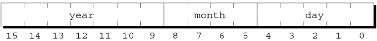
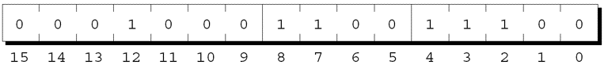

---
presentation:
  margin: 0
  center: false
  transition: "convex"
  enableSpeakerNotes: true
  slideNumber: "c/t"
  navigationMode: "linear"
---

@import "../css/font-awesome-4.7.0/css/font-awesome.css"
@import "../css/theme/solarized.css"
@import "../css/logo.css"
@import "../css/font.css"
@import "../css/color.css"
@import "../css/margin.css"
@import "../css/table.css"
@import "../css/main.css"
@import "../plugin/zoom/zoom.js"
@import "../plugin/customcontrols/plugin.js"
@import "../plugin/customcontrols/style.css"
@import "../plugin/chalkboard/plugin.js"
@import "../plugin/chalkboard/style.css"
@import "../plugin/menu/menu.js"
@import "../js/anychart/anychart-core.min.js"
@import "../js/anychart/anychart-venn.min.js"
@import "../js/anychart/pastel.min.js"
@import "../js/anychart/venn-ml.js"
@import "https://cdn.bootcdn.net/ajax/libs/jquery/3.5.0/jquery.js"

<!-- slide data-notes="" -->

<div class="bottom20"></div>

# C语言程序设计基础

<hr class="width50 center">

## 底层程序设计


<div class="bottom8"></div>

### 计算机系 &nbsp;&nbsp; 杨已彪

#### _yangyibiao@nju.edu.cn_

<!-- slide vertical=true data-notes="" -->


##### 提纲

---

- <a href="#/BitOp">位运算符</a>

- <a href="#/BitFinStruct">结构中的位域</a>

- <a href="#/OtherLowLTech">其他底层技术</a>

<!-- slide vertical=true data-notes="" -->


##### 介绍

---

前几章描述了 C 语言中高级的, 与机器无关的特性. 

但是, 某些类型的程序需要在位级别执行操作: 
- 系统程序(包括编译器和操作系统)
- 加密程序
- 图形程序
- 需要高执行速度或高效利用空间的程序

<!-- slide vertical=true data-notes="" -->


##### 位运算符

---

C 提供了六个位运算符, 它们在位级别对整数数据进行操作. 

其中两个运算符执行移位操作. 

其他四个执行按位求反, 按位与, 按位异或和按位或运算. 

<!-- slide id="BitOp" vertical=true data-notes="" -->


##### 移位运算符

---

移位运算符将整数中的位向左或向右移动: 

- `<<` 左移

- `>>` 右移

`<<`和`>>`的操作数可以是任何整数类型(包括char). 

对两个操作数都会进行整数提升; 结果为提升后左操作数的类型. 


<!-- slide vertical=true data-notes="" -->


##### 移位运算符

---

`i << j`的值是将i中的位左移j位后的结果. 

- 每次从i的最左端"溢出"一位, 在最右端补一个0位. 

`i >> j`的值是将i中的位右移j位后的结果. 

- 如果i是无符号类型或非负数, 则需要在左端补0. 

- 如果i为负数, 则结果是由实现定义的. 


<!-- slide vertical=true data-notes="" -->

##### 移位运算符

---

将移位运算符应用于数字 13 的效果的示例: 

```C{.line-numbers}
unsigned short i, j;

i = 13;  /* i is now 13(binary 0000000000001101) */

j = i << 2;  /* j is now 52(binary 0000000000110100) */

j = i >> 2;  /* j is now  3(binary 0000000000000011) */
```

--


<!-- slide vertical=true data-notes="" -->

##### 移位运算符

---

要通过移位来修改变量, 需要使用复合赋值运算符`<<=`和`>>=`: 

```C{.line-numbers}
i = 13;  /* i is now 13(binary 0000000000001101) */

i <<= 2;  /* i is now 52(binary 0000000000110100) */

i >>= 2;  /* i is now 13(binary 0000000000001101) */
```

--


<!-- slide vertical=true data-notes="" -->

##### 移位运算符

---

移位运算符的优先级低于算术运算符, 这可能会引起意外: 

i << 2 + 1 等同于 i <<(2 + 1), 而不是(i << 2) + 1


<!-- slide vertical=true data-notes="" -->

##### 按位(求反/与/异或/或)运算符

---

余下的4个位运算符: 

- `~` 按位求反

- `&` 按位和

- `^` 按位异或

- `|` 按位或

`~`运算符是一元的; 对其操作数进行整数提升. 

其他运算符是二元的; 对其操作数进行常用的算术转换. 

<!-- slide vertical=true data-notes="" -->


##### 按位求反, 按位与, 按位异或和按位或运算符

---

`~`, `&`, `^`和`|`运算符对其操作数中的所有位执行布尔运算. 

当两个操作数的位都是 1 时, `^`运算符产生 0 而`|`产生 1 . 


<!-- slide vertical=true data-notes="" -->

##### 按位求反, 按位与, 按位异或和按位或运算符

---

运算符`~`, `&`, `^`和`|`作用的示例: 

```C{.line-numbers}
unsigned short i, j, k;

i = 21;
  /* i is now    21(binary 0000000000010101) */

j = 56;
  /* j is now    56(binary 0000000000111000) */

k = ~i;
  /* k is now 65514(binary 1111111111101010) */

k = i & j;
  /* k is now    16(binary 0000000000010000) */

k = i ^ j;
  /* k is now    45(binary 0000000000101101) */

k = i | j;
  /* k is now    61(binary 0000000000111101) */
```

--


<!-- slide vertical=true data-notes="" -->

##### 按位求反, 按位与, 按位异或和按位或运算符

---

`~`运算符可以帮助使底层程序可移植性更好. 

- 位全为 1 的整数: `~0`

- 一个整数, 除最后五位外其他位全为 1: `~0x1f`


<!-- slide vertical=true data-notes="" -->

##### 按位求反, 按位与, 按位异或和按位或运算符

---

`~`, `&`, `^`和`|`有不同的优先级: 

```
最高  ~
     &
     ^
最低  |
```

例子: 

```C
i & ~j | k;  /* 等价于 */ (i &(~j)) | k;
i ^ j & ~k;  /* 等价于 */ i ^(j &(~k));
```

使用括号有助于避免混淆. 


<!-- slide vertical=true data-notes="" -->

##### 按位求反, 按位与, 按位异或和按位或运算符

---

复合赋值运算符`&=`, `^=`和`|=`对应于按位运算符`&`, `^`和`|`: 

```C{.line-numbers}
i = 21;
  /* i is now 21(binary 0000000000010101) */

j = 56;
  /* j is now 56(binary 0000000000111000) */

i &= j;
  /* i is now 16(binary 0000000000010000) */

i ^= j;
  /* i is now 40(binary 0000000000101000) */

i |= j;
  /* i is now 56(binary 0000000000111000) */
```

--


<!-- slide vertical=true data-notes="" -->

##### 用位运算符访问位

---

位运算符可用于提取或修改存储在少数几个位中的数据. 

常见的单位操作: 

- 位的设置

- 位的清除

- 位的测试

假设: 

- i 是 16 位 unsigned short 变量. 

- 最左边(或最高有效)位编号为 15 , 最低有效位编号为 0 . 


<!-- slide vertical=true data-notes="" -->

##### 用位运算符访问位

---

**位的设置.** 设置 i 的第 4 位的最简单方法是将i的值与常量0x0010进行或运算: 

```C{.line-numbers}
i = 0x0000;
  /* i is now 0000000000000000 */

i |= 0x0010;
  /* i is now 0000000000010000 */
```

如果需要设置的位的位置存储在变量 j 中, 则可以使用移位运算符来创建掩码: 
```C
i |= 1 << j;        /* sets bit j */
```

示例: 如果 j 的值为 3, 则 1 << j 是0x0008 


<!-- slide vertical=true data-notes="" -->

##### 用位运算符访问位

---

**位的清除.** 清除i的第 4 位可以使用第4位为0, 其他位为1的掩码: 

```C{.line-numbers}
i = 0x00ff;
	/* i is now 0000000011111111 */

i &= ~0x0010;
  /* i is now 0000000011101111 */
```

清除位置存储在变量中的位的语句: 

```C
i &= ~(1 << j);     /* clears bit j */
```

--


<!-- slide vertical=true data-notes="" -->

##### 用位运算符访问位

---

**位的测试.** 测试i的第 4 位是否已设置的if语句: 

```C
if(i & 0x0010) …   /* tests bit 4 */
```

测试第j位的语句: 

```C
if(i & 1 << j) …   /* tests bit j */ 
```

--


<!-- slide vertical=true data-notes="" -->

##### 用位运算符访问位

---

如果给位命名, 使用会更容易. 

假设一个数字的第0, 1和2位分别对应于蓝色, 绿色和红色. 

代表三个位位置的名称: 

```C{.line-numbers}
#define BLUE  1
#define GREEN 2
#define RED   4
```

--


<!-- slide vertical=true data-notes="" -->

##### 用位运算符访问位

---

设置, 清除和测试BLUE位的示例: 

```C{.line-numbers}
i |= BLUE;        /* sets BLUE bit   */
i &= ~BLUE;       /* clears BLUE bit */
if(i & BLUE) …   /* tests BLUE bit  */
```

--


<!-- slide vertical=true data-notes="" -->

##### 用位运算符访问位

---

同时设置, 清除或测试几个位也很容易: 

```C{.line-numbers}
i |= BLUE | GREEN;
  /* sets BLUE and GREEN bits   */

i &= ~(BLUE | GREEN);
  /* clears BLUE and GREEN bits */

if(i &(BLUE | GREEN)) …
  /* tests BLUE and GREEN bits  */
```

if语句测试是否设置了BLUE位或GREEN位. 


<!-- slide vertical=true data-notes="" -->

##### 用位运算符访问位域

---

处理一组连续的位(位域)比处理单个位稍微复杂一些. 

常见的位域操作: 

- 修改位域

- 获取位域


<!-- slide vertical=true data-notes="" -->

##### 用位运算符访问位域

---

**修改位域.** 修改位域需要两个操作: 

- 按位与(清除位域)

- 按位或(将新的位存入位域)

例子: 

```C
i = i & ~0x0070 | 0x0050;
  /* stores 101 in bits 4-6 */
```

`&`运算符清除i的第4-6位; 然后`|`运算符设置第4-6位. 


<!-- slide vertical=true data-notes="" -->

##### 用位运算符访问位域

---

为了使该示例更通用, 假设j包含要存储到i的第4-6位的值. 

需要在执行按位或之前将j移位至相应的位置: 

```C
i =(i & ~0x0070) |(j << 4);
  /* stores j in bits 4-6 */
```

`|`运算符的优先级低于`&`和`<<`, 因此可以删除括号: 

```C
i = i & ~0x0070 | j << 4;
```

--


<!-- slide vertical=true data-notes="" -->

##### 用位运算符访问位域

---

**获取位域.** 获取数字右端的位域(最低有效位)很容易: 

```C
j = i & 0x0007;
  /* retrieves bits 0-2 */
```

如果位域不在i的右端, 可以先将位域移到右端, 然后再使用`&`运算符提取位域: 

```C
j =(i >> 4) & 0x0007;
  /* retrieves bits 4-6 */
```

--


<!-- slide vertical=true data-notes="" -->

##### 程序: 异或加密

---

加密数据的最简单方法之一是使用密钥对每个字符进行异或(XOR). 

假设密钥是一个&字符. 

将它与字符z进行异或运算会得到\字符: 

```
    00100110 (&的ASCII码)
XOR 01111010 (z的ASCII码)
    01011100 (\的ASCII码)
```

--


<!-- slide vertical=true data-notes="" -->

##### 程序: 异或加密

---

通过应用相同的算法来解密消息: 

```
    00100110 (&的ASCII码)
XOR 01011100 (\的ASCII码)
    01111010 (z的ASCII码)
```

--


<!-- slide vertical=true data-notes="" -->

##### 程序: 异或加密

---

xor.c程序通过将每个字符与&字符进行异或来加密消息. 

原始消息可以由用户输入或使用输入重定向从文件中读取. 

加密的消息可以在屏幕上查看或使用输出重定向保存在文件中. 


<!-- slide vertical=true data-notes="" -->

##### 程序: 异或加密

---

一个名为msg的示例文件: 

```
Trust not him with your secrets, who, when left
alone in your room, turns over your papers.
            --Johann Kaspar Lavater(1741-1801)
```

加密msg, 并将加密后的消息保存在newmsg中的命令: 

`xor <msg >newmsg`

newmsg的内容: 

```
rTSUR HIR NOK QORN _IST UCETCRU, QNI, QNCH JC@R
GJIHC OH _IST TIIK, RSTHU IPCT _IST VGVCTU.  
            --lINGHH mGUVGT jGPGRCT(1741-1801)
```

--


<!-- slide vertical=true data-notes="" -->

##### 程序: 异或加密

---

恢复原始消息并将其显示在屏幕上的命令: 

`xor <newmsg`


<!-- slide vertical=true data-notes="" -->

##### 程序: 异或加密

---

xor.c程序不会更改某些字符, 包括数字. 

将这些字符与&进行异或会产生不可见的控制字符, 这在某些操作系统中会出现问题. 

程序检查原始字符和新(加密)字符是否都是可打印字符. 

如果不是, 程序将写原始字符而不是新字符. 


<!-- slide vertical=true data-notes="" -->

##### xor.c

---

```C{.line-numbers}
/* Performs XOR encryption */
 
#include <ctype.h>
#include <stdio.h>
 
#define KEY '&'
 
int main(void)
{
  int orig_char, new_char;
 
  while((orig_char = getchar()) != EOF) {
    new_char = orig_char ^ KEY;
    if(isprint(orig_char) && isprint(new_char))
      putchar(new_char);
    else
      putchar(orig_char);
  }
 
  return 0;
}
```

--


<!-- slide vertical=true data-notes="" -->

##### 结构中的位域

---

前面讨论的方法可以操作位域, 但不易使用, 并且可能会造成混淆. 

幸运的是, C 提供了另一种选择: 声明其成员表示位域的结构. 


<!-- slide id="BitFinStruct" vertical=true data-notes="" -->

##### 结构中的位域

---

示例: DOS 如何存储文件的创建和最后修改日期. 

由于日期, 月和年都是很小的数, 将它们按整数存储会很浪费空间. 

DOS 只为日期分配了16位, 其中5位用于日, 4位用于月, 7位用于年: 

<div class="top-2">
  
</div>


<!-- slide vertical=true data-notes="" -->

##### 结构中的位域

---

利用位域, 可以定义相同形式的C结构: 

```C
struct file_date {
  unsigned int day: 5;
  unsigned int month: 4;
  unsigned int year: 7; 
};
```

精简版: 

```C
struct file_date {
  unsigned int day: 5, month: 4, year: 7; 
};
```

--


<!-- slide vertical=true data-notes="" -->

##### 结构中的位域

---

位域的类型必须是int, unsigned int或signed int. 

使用int会引起二义性; 一些编译器将位域的最高位作为符号位, 而其他编译器则不然. 

在 C99 中, 位域也可能有_Bool类型. 

C99 编译器可能允许额外的位域类型. 


<!-- slide vertical=true data-notes="" -->

##### 结构中的位域

---

位域的使用方式与结构的其他成员相同: 

```C{.line-numbers}
struct file_date fd;

fd.day = 28;
fd.month = 12;
fd.year = 8;     /* represents 1988 */
```

fd变量的形式: 

<div class="top-2">
  
</div>


<!-- slide vertical=true data-notes="" -->

##### 结构中的位域

---

地址运算符(&)不能应用于位域. 

由于这条规则, 像scanf这类的函数不能直接将数据存储在位域中: 

```C
scanf("%d", &fd.day); /*** 错误的 ***/
```

我们仍然可以使用scanf将输入读入普通变量, 然后将其赋值给fd.day. 


<!-- slide vertical=true data-notes="" -->

##### 位域的存储方式

---

C 标准允许编译器在选择如何存储位域方面有相当大的自由度. 

处理位域的规则取决于"存储单元"的概念. 

存储单元的大小是由实现定义的. 

- 通常为 8 位, 16 位和 32 位. 


<!-- slide vertical=true data-notes="" -->

##### 位域的存储方式

---

编译器将位域逐个放入存储单元, 位域之间没有间隙, 直到没有足够的空间容纳下一个位域. 

此时, 一些编译器会跳到下一个存储单元的开头, 而另一些编译器会将位域拆开跨存储单元存放. 

位域存放的顺序(从左到右或从右到左)也是由实现定义的. 


<!-- slide vertical=true data-notes="" -->

##### 位域的存储方式

---

file_date示例中的假设: 

- 存储单元的长度为 16 位. 

- 位域从右到左存储(第一个位域占据低序号的位). 

如果编译器将month字段拆开跨两个存储单元存放, 那么 8 位存储单元也是可以接受的. 


<!-- slide vertical=true data-notes="" -->

##### 位域的存储方式

---

位域的名称可以省略. 

未命名的位域可用作字段间的"填充", 以确保其他位域存储在适当的位置. 

考虑与DOS文件关联的时间，存储方式如下: 

```C{.line-numbers}
struct file_time {
  unsigned int seconds: 5;
  unsigned int minutes: 6;
  unsigned int hours: 5; 
};
```

--


<!-- slide vertical=true data-notes="" -->

##### 位域的存储方式

---

省略了seconds字段名称的相同结构: 

```C{.line-numbers}
struct file_time {
  unsigned int : 5;      /* not used */
  unsigned int minutes: 6;
  unsigned int hours: 5;
};
```

剩余的位字段将被对齐, 就好像second字段仍然存在一样. 


<!-- slide vertical=true data-notes="" -->


##### 位域的存储方式

---

未命名位域的长度可以为 0: 

```C{.line-numbers}
struct s {
  unsigned int a: 4;
  unsigned int : 0;    /* 0-length bit-field */
  unsigned int b: 8;
};
```

长度为 0 的位域告诉编译器将下一个位域在一个存储单元的起始位置对齐. 

- 如果存储单元是 8 位长, 编译器将为a分配 4 位, 跳过 4 位到下一个存储单元, 然后为b分配 8 位. 

- 如果存储单元是 16 位长, 编译器将为a分配 4 位, 跳过 12 位, 然后为b分配 8 位. 


<!-- slide vertical=true data-notes="" -->


##### 其他底层技术

---

前几章中介绍的一些特性经常在底层编程中使用. 

例子: 

- 定义表示存储单元的类型

- 使用联合回避通常的类型检查

- 将指针作为地址使用

第18章提到了volatile类型限定符, 但由于它的底层性质而没有讨论. 


<!-- slide id="OtherLowLTech" vertical=true data-notes="" -->

##### 定义机器相关类型

---

char类型占用一个字节, 因此字符可以被视为字节. 

定义一个BYTE类型是个好主意: 

```C
typedef unsigned char BYTE;
```

根据机器的不同, 可能需要其他类型. 

x86平台的一个有用类型: 

```C
typedef unsigned short WORD;
```

--


<!-- slide vertical=true data-notes="" -->

##### 使用联合提供数据的多个视角

---

第 16 章介绍了有关联合的便捷的使用方式使用. 

但是在 C 中联合经常被用于完全不同的目的: 从两种或更多角度看待内存块. 

考虑前面描述的file_date结构. 

一个file_date结构正好放入两个字节, 因此任何两个字节的数据都可以被认为是一个file_date结构.


<!-- slide vertical=true data-notes="" -->

##### 使用联合提供数据的多个视角

---

特别是可以将一个unsigned short值看作是一个file_date结构. 

可用于将短整数与文件日期相互转换的联合: 

```C
union int_date {
  unsigned short i;
  struct file_date fd;
};
```

--


<!-- slide vertical=true data-notes="" -->

##### 使用联合提供数据的多个视角

---

将unsigned short参数以文件日期的形式显示出来的函数: 

```C{.line-numbers}
void print_date(unsigned short n)
{
  union int_date u;

  u.i = n;
  printf("%d/%d/%d\n", u.fd.month,
         u.fd.day, u.fd.year + 1980);
}
```

--


<!-- slide vertical=true data-notes="" -->

##### 使用联合提供数据的多个视角

---

用联合提供数据的多个视角在使用寄存器时特别有用, 因为寄存器通常被分成较小的单元. 

x86处理器具有名为AX, BX, CX和DX的16位寄存器. 

每个寄存器可以被视为两个8位寄存器. 

- AX可以被划分为AH和AL两个寄存器. 


<!-- slide vertical=true data-notes="" -->

##### 使用联合提供数据的多个视角

---

为基于x86的计算机编写底层应用程序时, 可能需要表示AX, BX, CX和DX的变量. 

需要对16位和8位寄存器进行访问, 同时要考虑它们之间的关系. 

- 对 AX 的更改会影响 AH 和 AL; 更改 AH 或 AL 会修改 AX. 

解决方案是设置两个结构: 

- 一个包含对应于16位寄存器的成员. 

- 另一个包含对应于8位寄存器的成员. 


<!-- slide vertical=true data-notes="" -->

##### 使用联合提供数据的多个视角

---

包含两个结构的联合:

```C{.line-numbers}
union {
  struct {
    WORD ax, bx, cx, dx;
  } word;
  struct {
    BYTE al, ah, bl, bh, cl, ch, dl, dh;
  } byte;
} regs;
```

--


<!-- slide vertical=true data-notes="" -->

##### 使用联合提供数据的多个视角

---

word结构的成员将与byte结构的成员重叠. 

- ax将占用与al和ah相同的内存空间. 

regs联合的示例: 

```C{.line-numbers}
regs.byte.ah = 0x12;
regs.byte.al = 0x34;
printf("AX: %hx\n", regs.word.ax);
```

输出: 

`AX: 1234`


<!-- slide vertical=true data-notes="" -->

##### 使用联合提供数据的多个视角

---

注意, byte结构中al在ah之前. 

当数据项多于一个字节时, 有两种逻辑方式将其存储在内存中: 

- **大端**: 字节以"自然"顺序存储(先存储最左边的字节). 

- **小端**: 字节以相反的顺序存储(最左边的字节最后存储). 

x86处理器按小端方式存储. 


<!-- slide vertical=true data-notes="" -->


##### 使用联合提供数据的多个视角

---

我们通常不需要担心字节存储顺序. 

但是, 在底层对内存进行操作的程序必须注意字节的存储顺序. 

在处理包含非字符数据的文件时, 它也很重要. 


<!-- slide vertical=true data-notes="" -->

##### 使用指针作为地址

---

地址通常具有与整数(或长整数)相同的位数. 

通过将整数强制转换为指针来创建表示特定地址的指针: 

```C{.line-numbers}
BYTE *p;

p =(BYTE *) 0x1000;
  /* p contains address 0x1000 */
```

--


<!-- slide vertical=true data-notes="" -->

##### 程序: 查看内存单元

---

viewmemory.c程序允许用户查看计算机内存段. 

该程序首先显示它自己的主函数的地址以及主函数的一个变量的地址. 

程序接下来提示用户输入地址(以16进制整数格式)和要查看的字节数. 

然后程序从指定的地址开始显示指定字节数的内存块. 


<!-- slide vertical=true data-notes="" -->

##### 程序: 查看内存单元

---

字节以 10 个为一组显示(最后一组除外). 

字节显示为十六进制数字和字符. 

只显示打印字符; 其他字符显示为点号. 

该程序假定int值和地址使用 32 位存储. 

地址以十六进制显示. 


<!-- slide vertical=true data-notes="" -->

##### viewmemory.c

---

```C{.line-numbers}
/* Allows the user to view regions of computer memory */
 
#include <ctype.h>
#include <stdio.h>
 
typedef unsigned char BYTE;
 
int main(void)
{
  unsigned int addr;
  int i, n;
  BYTE *ptr;
 
  printf("Address of main function: %x\n",(unsigned int) main);
  printf("Address of addr variable: %x\n",(unsigned int) &addr);
  
  printf("\nEnter a(hex) address: ");
  scanf("%x", &addr);
  printf("Enter number of bytes to view: ");
  scanf("%d", &n);
 
  printf("\n");
  printf(" Address              Bytes              Characters\n");
  printf(" -------  -----------------------------  ----------\n");

  ptr =(BYTE *) addr;
  for(; n > 0; n -= 10) {
    printf("%8X  ",(unsigned int) ptr);
    for(i = 0; i < 10 && i < n; i++)
      printf("%.2X ", *(ptr + i));
    for(; i < 10; i++)
      printf("   ");
    printf(" ");
    for(i = 0;  i < 10 && i < n; i++) {
      BYTE ch = *(ptr + i);
      if(!isprint(ch))
        ch = '.';
      printf("%c", ch);
    }
    printf("\n");
    ptr += 10;
  }
 
  return 0;
}
```

--


<!-- slide vertical=true data-notes="" -->

##### 程序: 查看内存单元

---

在运行 Linux 的 x86 系统上使用 GCC 编译程序的输出示例: 

```{.line-numbers}
Address of main function: 804847c
Address of addr variable: bff41154

Enter a(hex) address: 8048000
Enter number of bytes to view: 40

 Address              Bytes              Characters
 -------  -----------------------------  ----------
 8048000  7F 45 4C 46 01 01 01 00 00 00  .ELF......
 804800A  00 00 00 00 00 00 02 00 03 00  ..........
 8048014  01 00 00 00 C0 83 04 08 34 00  ........4.
 804801E  00 00 C0 0A 00 00 00 00 00 00  ..........
```

7F字节以及后跟的表示字母E, L和F的字节标识了可执行文件存储的格式(ELF). 


<!-- slide vertical=true data-notes="" -->

##### 程序: 查看内存单元

---

显示从addr变量的地址开始的字节的示例: 

```{.line-numbers}
Address of main function: 804847c
Address of addr variable: bfec5484

Enter a(hex) address: bfec5484
Enter number of bytes to view: 64

 Address              Bytes              Characters
 -------  -----------------------------  ----------
BFEC5484  84 54 EC BF B0 54 EC BF F4 6F  .T...T...o
BFEC548E  68 00 34 55 EC BF C0 54 EC BF  h.4U...T..
BFEC5498  08 55 EC BF E3 3D 57 00 00 00  .U...=W...
BFEC54A2  00 00 A0 BC 55 00 08 55 EC BF  ....U..U..
BFEC54AC  E3 3D 57 00 01 00 00 00 34 55  .=W.....4U
BFEC54B6  EC BF 3C 55 EC BF 56 11 55 00  ..<U..V.U.
BFEC54C0  F4 6F 68 00                    .oh.
```

对前四个字节进行反转得到BFEC5484, 即用户输入的地址. 


<!-- slide vertical=true data-notes="" -->


##### volatile类型限定符

---

在某些计算机上, 某些内存空间是"易变的". 

存储在这样一个位置的值可能会随着程序的运行而改变, 即使程序本身没有在那里存储新值. 

例如, 某些内存空间可能被用于保存直接来自输入设备的数据. 


<!-- slide vertical=true data-notes="" -->


##### volatile类型限定符

---

volatile类型限定符允许我们通知编译器, 程序中的某些数据是"易变"的. 

volatile通常使用在用于指向易变内存空间的指针的声明中: 

```C
volatile BYTE *p;
  /* p will point to a volatile byte */
```

--


<!-- slide vertical=true data-notes="" -->


##### volatile类型限定符

---

假设p指向的内存空间用于存放用户通过键盘输入的最近一个字符. 

获取键盘输入的字符并将它们存储在缓冲区数组中的循环: 

```C{.line-numbers}
while(缓冲区未满) {
  等待输入;
  buffer[i] = *p;
  if(buffer[i++] == '\n') 
    break;
}
```

--


<!-- slide vertical=true data-notes="" -->


##### volatile类型限定符

---

比较好的编译器可能会注意到这个循环既不改变p也不改变*p . 

因此编译器可能会优化程序, 使*p只被取一次: 

```C{.line-numbers}
在寄存器中存储*p;
while(缓冲区未满) {
  等待输入;
  buffer[i] = 存储在寄存器中的值;
  if(buffer[i++] == '\n') 
    break;
}
```

--


<!-- slide vertical=true data-notes="" -->


##### volatile类型限定符

---

优化后的程序会不断复制同一个字符来填满缓冲区. 

将p声明成指向易变的数据的指针可以避免这个问题, 因为volatile限定符会告诉编译器*p每一次都必须从内存中重新取. 
